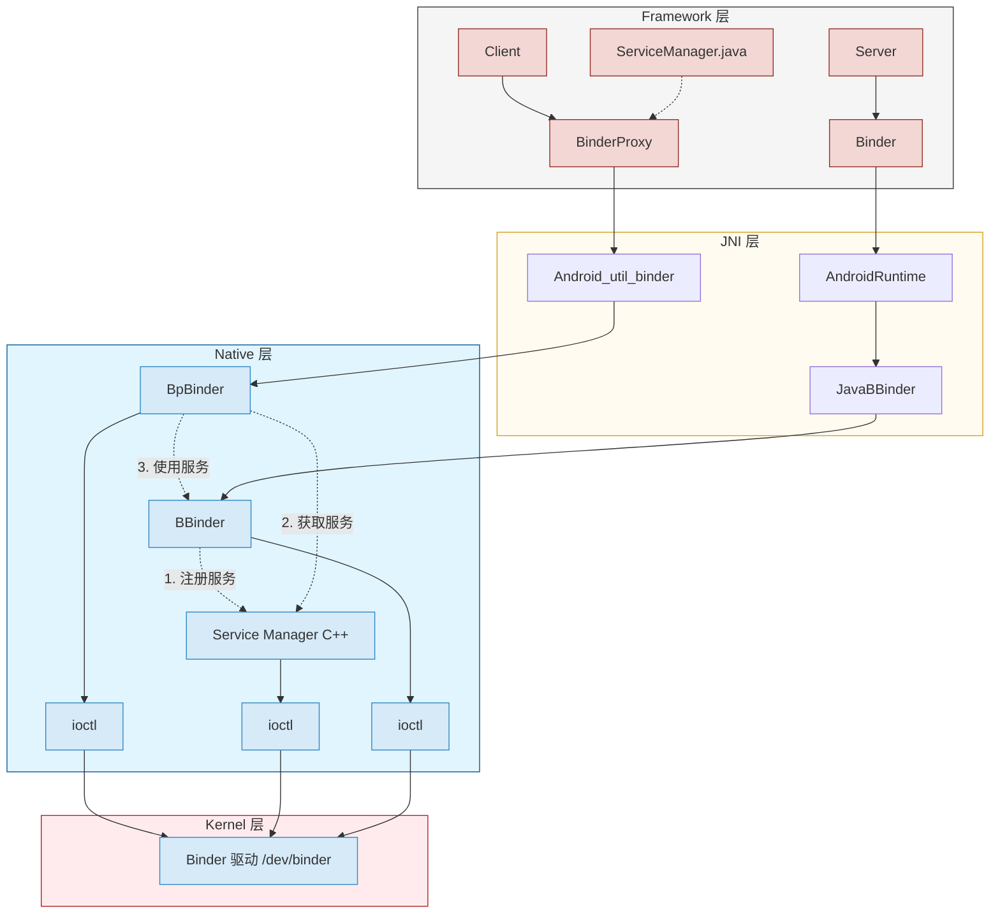
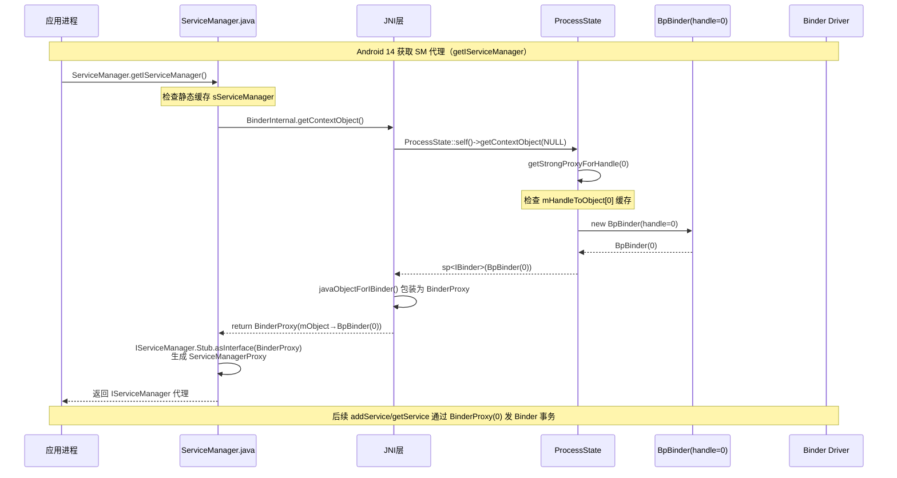
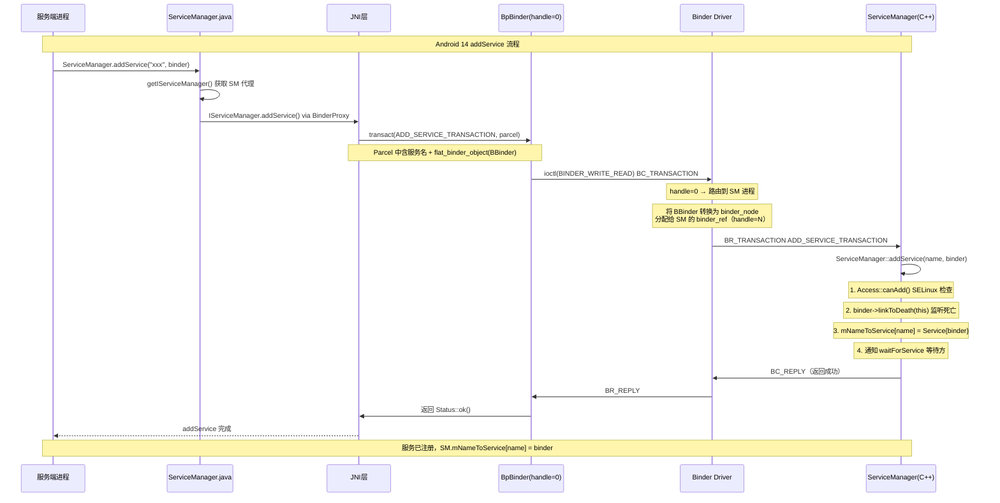
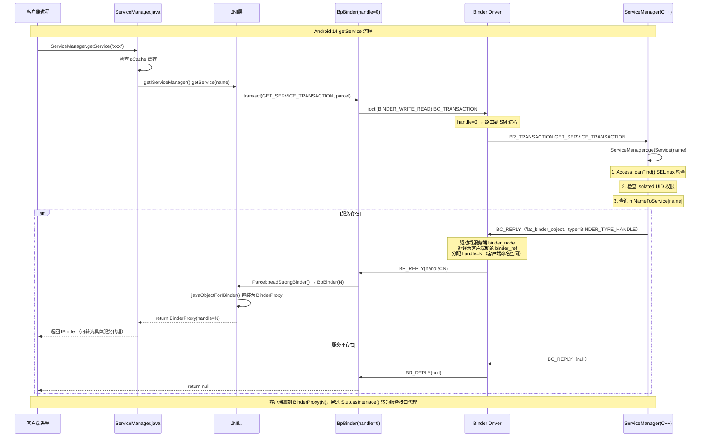
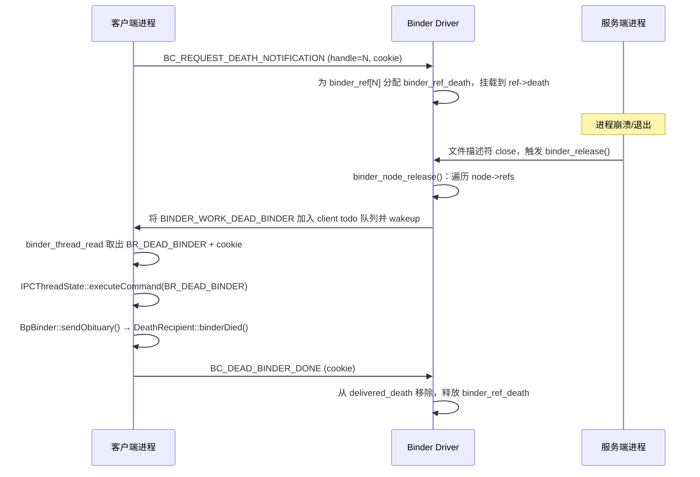

# Binder 机制和源码分析

## 概述

### 概念
- Binder 是 Android 系统中的一种 IPC 机制。例如当进程 A 中的 Activity 要向进程 B 中的 Service 通信或者使用它提供的方法/数据，需要依赖 Binder IPC。它的设计哲学是让远程调用看起来像本地调用。当客户端调用一个运行在另一个进程中的服务方法时，客户端代码感知不到跨进程的边界，仿佛在调用本地函数一样。这种透明性是Binder设计的核心目标。
- 与传统的Linux IPC机制（如管道、共享内存、Socket）相比，Binder具有以下优势：
    - 性能高效：Binder采用mmap机制，通常可以将进程间调用数据的内存拷贝次数减少到一次；传统的 Socket 在用户态与内核态之间一般需要两次拷贝。
    - 安全性高：Binder通过UID/PID进行身份验证，并且支持SELinux策略控制
    - 面向对象：Binder将远程对象建模为"引用"，客户端持有引用而非原始对象指针
    - 语言无关：通过 AIDL（Android Interface Definition Language）定义接口，工具链自动生成 Java/C++ 两侧的 Stub 和 Proxy 代码，使同一套接口规范可跨语言使用；底层传输采用私有的二进制协议（Parcel 序列化格式），与 Protocol Buffers 是完全不同的机制
- Android系统中，几乎所有系统服务（ActivityManagerService、WindowManagerService、PackageManagerService等）都通过Binder进行通信，应用与系统服务之间的交互、应用与应用之间的交互，都依赖Binder机制。
    - 当然也存在部分其他的 IPC 方式，例如 Zygote 通信使用 socket。

### 分层
- Binder架构分为四个层次，从上到下依次是Framework层、JNI层、Native层和Kernel/Drive层。这种分层设计使得Java应用可以通过Framework层的API访问Native层的Binder实现，而Native层的代码则直接与Kernel层的Binder驱动交互。
    - Framework层（Java）：提供应用开发接口，ServiceManager.java和Binder.java是应用开发者直接打交道的类
    - JNI层：作为Bridge层，将Java层的调用转换为Native层的实现，android_util_binder负责BinderProxy相关转换，AndroidRuntime配合JavaBBinder负责Binder相关转换
    - Native层（C++）：实现Binder的核心逻辑，BBinder代表服务端，BpBinder代表客户端代理，Service Manager是服务注册中心
    - Kernel/Drive层：Binder驱动，运行在内核态，负责实际的数据传输和进程调度
- 可以从各层来理解这个机制的定位：
    - 从 IPC 角度来说，Binder 是 Android 中的一种跨进程通信方式，是Android独有；
    - 从 Android 驱动层，Binder 是一种虚拟字符设备，它的设备节点通常是 `/dev/binder`；
    - 从 Android Native 层，Binder 是创建 Service Manager 以及 BpBinder/BBinder 模型，搭建与 binder 驱动的桥梁；
    - 从 Android Framework 层，Binder 是各种 Manager（ActivityManager、WindowManager等）和相应 ManagerService 的桥梁；
    - 从 Android APP 层，Binder 是客户端和服务端进行通信的媒介，当 bindService 的时候，服务端会返回一个包含了服务端业务调用的 Binder 对象，通过这个Binder对象，客户端就可以获取服务端提供的服务或者数据，这里的服务包括普通服务和基于 AIDL 的服务。

### 核心机制

#### Handle机制
- Handle 是 Binder 系统中用于标识远程对象的核心概念。在同一个 Binder 进程上下文中，每个 Binder 对象都会获得一个对该进程唯一的标识符，客户端通过这个标识符来找到目标对象。
	- handle = 0：特指 Service Manager（Context Manager），在单个 Binder 上下文中只有 Service Manager 使用这个值
	- handle > 0：其他所有服务的标识，在单个 Binder 上下文中从 1 开始递增分配
- 这种设计使得客户端访问Service Manager时无需通过复杂的查找过程，直接使用handle=0即可。当客户端需要访问其他服务时，首先向Service Manager查询服务的handle值，然后使用该handle进行后续调用。

#### BBinder与BpBinder
- BBinder（B Binder / Binder Native）代表本地Binder对象，是服务端的基类。当你需要实现一个可以供其他进程访问的服务时，你的类需要继承BBinder并重写onTransact方法来处理来自客户端的请求。BBinder对象在Binder驱动中对应一个binder_node结构。
- BpBinder（Bp Binder / Binder Proxy）代表远程Binder的代理，是客户端使用的对象。当客户端获取到一个服务的引用时，实际上获得的是一个BpBinder对象。这个对象并不包含服务的实际实现，它只是一个"代理人"，负责将客户端的调用请求转发给驱动，由驱动将请求发送到服务进程。
- 两者的关键区别：BBinder是真实的服务端实现，而BpBinder只是一个代理。这种设计遵循了代理模式（Proxy Pattern），使得客户端代码可以像调用本地方法一样调用远程服务。

#### Parcel数据封装
- Parcel是Binder系统中用于序列化和反序列化数据的容器。当需要在进程间传递数据时，数据首先被封装到Parcel对象中，然后通过Binder驱动传输到目标进程。在目标进程中，接收方从Parcel中解析出原始数据。
- Parcel支持多种数据类型的封装，包括基本类型（int、long、String等）、Binder对象、以及文件描述符。其中Binder对象的传输尤为关键：当传输一个BBinder对象时，Parcel会将其转换为handle；当接收方收到handle后，会创建一个对应的BpBinder对象。

## 架构

### 总览

- Binder 采用 C/S 架构，主要包含 Client、Server、ServiceManager 以及 binder 驱动 ，其中 ServiceManager 用于管理系统中的各种服务
- Binder 的通信过程可以概括为：
    - 注册服务(addService)：Server 要先注册 Service 到 ServiceManager 。
    - 获取服务(getService)：Client 使用某个 Service 前，从 ServiceManager 根据 Handle 获取相应的 Service 。
    - 使用服务：Client 根据得到的 Service 信息建立与 Service 所在的 Server 进程通信的通路，然后就可以直接与 Service 交互。
    - Client/Server/Service Manager之间是通过与 Binder驱动 间接进行交互的，从而实现IPC通信。其中 Binder 驱动位于内核空间，Client,Server,Service Manager位于用户空间。

> 可以和 WebRTC 进行类比，Client 通过 Handle 句柄 (SDP/ICE Candidates 元数据) 向 ServiceManager (Signaling Server) 获取到 Server 提前注册好的服务（Address），通过 ioctl （STUN/TURN）经由 Binder driver (HTTP/WebSocket) 的数据拷贝间接与 Server 进行通信



## Drive 层

- Binder driver 是 Android 专用的，但底层的驱动架构与 Linux 驱动一样。binder 驱动以 misc 设备注册，作为虚拟字符设备（一般在 `/dev/binder`），没有直接操作硬件，只是对设备内存的处理。主要是驱动设备的初始化 (`binder_init`)、打开 (`binder_open`)、映射(`binder_mmap`)和数据操作(`binder_ioctl`)。进行以上系统调用时都需要从用户态进入内核态。

### 结构体

#### binder_proc

- 含义：`binder_proc` 表示一个打开 Binder 设备并参与 IPC 的用户态进程，在内核中的总控对象。用于管理IPC所需的各种信息，拥有其他结构体的结构体。
- 用途：
    - 管理该进程所有 Binder 线程（`threads` 红黑树）；
    - 管理该进程内可见的远端对象引用（`refs_by_desc/refs_by_node`）；
    - 管理该进程的 Binder 映射地址空间（`alloc`，对应 `mmap`）；
    - 管理待处理工作队列（`todo`）和死亡通知、异步事务等调度状态。

```c
// drivers/android/binder_internal.h
struct binder_proc {
	struct hlist_node proc_node;         // 挂到全局 binder_procs 链表
	struct rb_root threads;              // 该进程下所有 binder_thread（按 tid 组织）
	struct rb_root nodes;                // 该进程拥有的本地 Binder 实体
	struct rb_root refs_by_desc;         // handle(desc) -> binder_ref 查找树
	struct rb_root refs_by_node;         // node -> binder_ref 查找树
	struct list_head waiting_threads;    // 正在等待工作分配的线程队列
	int pid;                             // 进程 pid（group leader pid）
	struct task_struct *tsk;             // group leader task，做生命周期/调度关联
	const struct cred *cred;             // 打开设备时的凭证快照（安全校验使用）
	struct hlist_node deferred_work_node;// 挂入延迟处理队列
	int deferred_work;                   // 延迟工作位图（释放/清理等异步任务）
	int outstanding_txns;                // 正在处理中的事务计数（用于冻结/退出协同）
	bool is_dead;                        // 进程是否已进入死亡清理状态
	bool is_frozen;                      // 进程是否被冻结（冻结机制）
	bool sync_recv;                      // 冻结期间是否收到同步事务
	bool async_recv;                     // 冻结期间是否收到异步事务
	wait_queue_head_t freeze_wait;       // 冻结状态切换等待队列

	struct list_head todo;               // 进程级待处理工作队列
	struct binder_stats stats;           // 该进程维度的 Binder 统计信息
	struct list_head delivered_death;    // 已投递死亡通知，等待用户态 ACK 的列表
	int max_threads;                     // 线程池最大线程数
	int requested_threads;               // 驱动请求但尚未完全启动的线程数
	int requested_threads_started;       // 已启动并登记的请求线程数
	int tmp_ref;                         // 临时引用计数，防止并发路径提前释放
	struct binder_priority default_priority; // 该进程默认事务优先级模板
	struct dentry *debugfs_entry;        // debugfs 下该进程日志入口
	struct binder_alloc alloc;           // 该进程 Binder 映射区分配器
	struct binder_context *context;      // 所属 Binder 上下文（binder/hwbinder/vndbinder）
	spinlock_t inner_lock;               // 保护 todo/waiting_threads 等内部状态
	spinlock_t outer_lock;               // 保护 refs/nodes 外层结构
	struct dentry *binderfs_entry;       // binderfs 下该进程日志入口
	bool oneway_spam_detection_enabled;  // 是否启用 oneway spam 检测
};
```

#### binder_thread

- 含义：`binder_thread` 代表当前binder操作所在的线程，表示进程内一个实际参与 Binder 收发的内核线程上下文。
- 用途：
    - 记录该线程当前事务栈（同步调用链的回栈依赖它）；
    - 保存线程私有待办队列（优先于进程队列）；
    - 跟踪 looper 状态（是否已进入线程池、是否注册、是否需要扩容线程池）。

```c
// drivers/android/binder_internal.h
struct binder_thread {
	struct binder_proc *proc;          // 反向指针：该线程属于哪个 binder_proc
	struct rb_node rb_node;            // 挂入 proc->threads 的红黑树节点
	struct list_head waiting_thread_node; // 挂入 proc->waiting_threads 的链表节点
	int pid;                           // 线程 tid
	int looper;              /* 线程 looper 状态位（仅本线程修改） */
	bool looper_need_return; /* 被其他线程置位，要求本线程尽快返回用户态 */
	struct binder_transaction *transaction_stack; // 同步事务栈（支持嵌套调用）
	struct list_head todo;                       // 线程私有待处理工作队列
	bool process_todo;                  // 是否优先处理线程 todo（调度提示）
	struct binder_error return_error;   // 返回给用户态的错误命令（如 BR_ERROR）
	struct binder_error reply_error;    // reply 场景下的错误命令缓存
	wait_queue_head_t wait;                      // 线程阻塞等待队列
	struct binder_stats stats;          // 线程维度统计信息（命令计数等）
	atomic_t tmp_ref;                   // 线程临时引用，防并发释放
	bool is_dead;                       // 线程是否已退出/待回收
	struct task_struct *task;           // 对应 Linux task_struct
	spinlock_t prio_lock;               // 保护优先级状态
	struct binder_priority prio_next;   // 下次要恢复/设置的优先级
	enum binder_prio_state prio_state;  // 当前优先级继承状态机
};
```

#### binder_node

- 含义：`binder_node` 是服务端本地 Binder 实体对象在内核的表示。
- 用途：
    - 把用户态实体（如 `BBinder`）映射为内核可路由对象；
    - 维护强弱引用计数，决定对象生命周期；
    - 保存是否允许异步事务等行为属性；
    - 作为事务路由目标，被 `binder_ref` 在其他进程中引用。

```c
// drivers/android/binder_internal.h
struct binder_node {
	int debug_id;                  // 调试 ID，便于日志定位
	spinlock_t lock;               // 保护 node 引用计数和局部状态
	struct binder_work work;       // 与该 node 关联的内核工作项
	union {
		struct rb_node rb_node;
		struct hlist_node dead_node;
	};
	struct binder_proc *proc;      // 该实体所属进程（服务端）；为 NULL 表示已死亡
	struct hlist_head refs;        // 指向该 node 的所有 binder_ref
	int internal_strong_refs;      // 内核内部强引用计数（驱动持有）
	int local_weak_refs;           // 本进程用户态弱引用计数
	int local_strong_refs;         // 本进程用户态强引用计数
	int tmp_refs;                  // 临时引用，防止并发路径释放
	binder_uintptr_t ptr;          // 用户态 Binder 实体地址
	binder_uintptr_t cookie;       // 用户态 cookie（常用于对象校验）
	struct {
		/*
		 * bitfield elements protected by
		 * proc inner_lock
		 */
		u8 has_strong_ref:1;       // 当前是否存在强引用
		u8 pending_strong_ref:1;   // 是否有待用户态确认的强引用变化
		u8 has_weak_ref:1;         // 当前是否存在弱引用
		u8 pending_weak_ref:1;     // 是否有待用户态确认的弱引用变化
	};
	struct {
		/*
		 * invariant after initialization
		 */
		u8 sched_policy:2;         // 事务执行建议调度策略
		u8 inherit_rt:1;           // 是否继承实时优先级
		u8 accept_fds:1;           // 是否允许事务携带 FD
		u8 txn_security_ctx:1;     // 是否传递 SELinux 安全文本
		u8 min_priority;           // 可被提升到的最低优先级阈值
	};
	bool has_async_transaction;    // 是否存在排队中的 one-way 事务
	struct list_head async_todo;   // node 级异步事务队列
};
```

#### binder_ref

- 含义：`binder_ref` 是进程对远端 `binder_node` 的代理引用。
- 用途：
    - 给客户端提供 handle（`desc`）；
    - 在本进程维度维护强弱引用计数；
    - 连接本地句柄和远端实体 node，用于事务路由与权限控制。

```c
// drivers/android/binder_internal.h
struct binder_ref {
	/* Lookups needed: */
	/*   node + proc => ref (transaction) */
	/*   desc + proc => ref (transaction, inc/dec ref) */
	/*   node => refs + procs (proc exit) */
	struct binder_ref_data data;     // handle/strong/weak/debug_id 等核心元数据
	struct rb_node rb_node_desc;      // 挂入 proc->refs_by_desc（按 desc 查询）
	struct rb_node rb_node_node;      // 挂入 proc->refs_by_node（按 node 查询）
	struct hlist_node node_entry;     // 挂入 node->refs，便于反向遍历
	struct binder_proc *proc;        // 引用持有方（通常为客户端）
	struct binder_node *node;        // 被引用的远端实体
	struct binder_ref_death *death;   // 该引用注册的死亡通知对象
	struct binder_ref_freeze *freeze; // 该引用注册的冻结通知对象
};
```

#### binder_write_read

- 含义：`binder_write_read` 是用户态与内核态在 `BINDER_WRITE_READ` ioctl 的描述头。用户空间程序和 Binder 驱动程序交互基本都是通过 BINDER_WRITE_READ 命令，来进行数据的读写操作。
- 用途：
    - 一次 ioctl 同时提交待发送命令流（write）并拉取待接收命令流（read）；
    - 避免频繁陷入内核，提升 IPC 吞吐；
    - 通过 `*_consumed` 告知用户态实际处理字节数。

```c
// include/uapi/linux/android/binder.h
struct binder_write_read {
	binder_size_t		write_size;	/* 用户态本次要写入驱动的字节数 */
	binder_size_t		write_consumed;	/* 驱动已消费写入字节数 */
	binder_uintptr_t	write_buffer;	/* BC_* 命令流用户态地址 */
	binder_size_t		read_size;	/* 用户态可接收缓冲区大小 */
	binder_size_t		read_consumed;	/* 驱动已写回 BR_* 字节数 */
	binder_uintptr_t	read_buffer;	/* BR_* 输出缓冲区用户态地址 */
};
```

#### binder_transaction_data

- 含义：`binder_transaction_data` 是一次事务在用户态/内核态之间传递的核心元数据。
- 用途：
    - 指明目标（`handle` 或 `ptr`）、命令码、flags；
    - 描述数据区和 offsets 区（用于扁平对象、FD、binder 对象重定位）；
    - 作为 `BC_TRANSACTION/BC_REPLY` 的有效载荷头。

```c
// include/uapi/linux/android/binder.h
struct binder_transaction_data {
	/* The first two are only used for bcTRANSACTION and brTRANSACTION,
	 * identifying the target and contents of the transaction.
	 */
	union {
		/* target descriptor of command transaction */
		__u32	handle;             // 目标句柄（客户端发起请求时使用）
		/* target descriptor of return transaction */
		binder_uintptr_t ptr;      // 目标实体指针（内核回传场景）
	} target;
	binder_uintptr_t	cookie;	/* 目标对象 cookie（与 node->cookie 对应） */
	__u32		code;		/* 事务码：AIDL 方法编号/协议命令 */

	/* General information about the transaction. */
	__u32	        flags;      /* 事务标志，如 TF_ONE_WAY */
	pid_t		sender_pid; /* 发送方 pid（内核填充） */
	uid_t		sender_euid;/* 发送方 euid（权限判定） */
	binder_size_t	data_size;	/* 数据区字节数（Parcel 原始数据） */
	binder_size_t	offsets_size;	/* 偏移区字节数（binder_object 偏移表） */

	/* If this transaction is inline, the data immediately
	 * follows here; otherwise, it ends with a pointer to
	 * the data buffer.
	 */
	union {
		struct {
			/* transaction data */
			binder_uintptr_t	buffer;  // 数据区用户态地址
			/* offsets from buffer to flat_binder_object structs */
			binder_uintptr_t	offsets; // offsets 区用户态地址
		} ptr;
		__u8	buf[8];
	} data;
};
```

#### binder_transaction

- 含义：`binder_transaction` 是内核内部表示的一次在途事务对象，在执行`binder_transaction()`时创建。
- 用途：
    - 连接 from 线程与 to 线程/进程；
    - 持有该事务对应的 `binder_buffer`；
    - 维护同步调用链（`from_parent`/`to_parent`）以支持 reply 回溯；
    - 跟踪优先级继承、耗时统计、错误状态等。

```c
// drivers/android/binder_internal.h
struct binder_transaction {
	int debug_id;                         // 事务调试 ID（全局递增，便于串联日志）
	struct binder_work work;              // 可入队到 todo 的工作项封装
	struct binder_thread *from;           // 发起事务的线程（可能在 teardown 时置空）
	pid_t from_pid;                       // 发起方进程 pid 快照
	pid_t from_tid;                       // 发起方线程 tid 快照
	struct binder_transaction *from_parent; // 调用链上游事务（用于嵌套回溯）
	struct binder_proc *to_proc;          // 目标进程
	struct binder_thread *to_thread;      // 目标线程（若为空则由驱动后续选择）
	struct binder_transaction *to_parent; // 目标侧父事务（reply 路由依赖）
	unsigned need_reply:1;                // 1=同步事务需要 BR_REPLY；0=oneway
	/* unsigned is_dead:1; */       /* not used at the moment */

	struct binder_buffer *buffer;         // 该事务对应的内核缓冲区
	unsigned int    code;                 // 事务码（AIDL 方法号/协议命令）
	unsigned int    flags;                // 事务标记（如 TF_ONE_WAY）
	struct binder_priority priority;      // 本次事务期望/继承后的优先级
	struct binder_priority saved_priority;// 处理完成后用于恢复线程优先级
	bool set_priority_called;             // 是否已经执行过优先级设置逻辑
	bool is_nested;                       // 是否命中嵌套调用优化路径
	kuid_t  sender_euid;                  // 发送方 euid（权限与审计）
	ktime_t start_time;                   // 事务开始时间（耗时统计）
	struct list_head fd_fixups;           // FD 修正链（跨进程安装 fd 时使用）
	binder_uintptr_t security_ctx;        // SELinux security context 指针
	/**
	 * @lock:  protects @from, @to_proc, and @to_thread
	 *
	 * @from, @to_proc, and @to_thread can be set to NULL
	 * during thread teardown
	 */
	spinlock_t lock;                      // 保护 from/to_proc/to_thread 并发变更
	ANDROID_VENDOR_DATA(1);               // 厂商扩展预留
};
```

#### binder_buffer

- 含义：`binder_buffer` 是进程 Binder 映射区中的单笔事务内核缓冲块描述符。每一次 Binder 传输数据时，都会先从 Binder 内存缓存区中分配一个 binder_buffer 来存储传输数据。每一个 binder_buffer 分为空闲和已分配的，通过 free 标记来区分。空闲和已分配的 binder_buffer 通过各自的成员变量 rb_node 分别连入 binder_proc 的 free_buffers 和 allocated_buffers 。
- 用途：
    - 记录这块内存归属哪个进程、大小和位置；
    - 标记是否异步事务占用、是否允许释放；
    - 跟踪数据区与对象偏移区，便于复制/回收。

```c
// drivers/android/binder_alloc.h
struct binder_buffer {
	struct list_head entry; /* 按地址链接到空闲/已分配链表 */
	struct rb_node rb_node; /* 空闲时按大小索引，已分配时按地址索引 */
				/* by address */
	unsigned free:1;                     // 1=空闲块，0=已分配
	unsigned clear_on_free:1;            // 释放时是否清零（安全清理）
	unsigned allow_user_free:1;          // 是否允许用户态 BC_FREE_BUFFER 回收
	unsigned async_transaction:1;        // 是否用于 one-way 异步事务
	unsigned oneway_spam_suspect:1;      // 是否被标记为 oneway spam 可疑
	unsigned debug_id:27;                // 缓冲区调试 ID
	struct binder_transaction *transaction; // 当前占用该缓冲区的事务
	struct binder_node *target_node;     // 目标 node（统计/清理关联）
	size_t data_size;                    // 数据区大小（payload）
	size_t offsets_size;                 // offsets 表大小（binder_object 偏移）
	size_t extra_buffers_size;           // sg/额外缓冲大小
	void __user *user_data;              // 用户态映射地址（Parcel 对应地址）
	int pid;                             // 拥有该缓冲区的进程 pid
};
```

### 方法

#### binder_init

- 用途：
    - 在驱动模块加载时完成全局初始化；
    - 注册字符设备（misc/binderfs 设备节点）；
    - 初始化全局链表、锁、调试项、shrinker 等基础设施。
- 执行流程：
    1. 初始化全局状态（进程表、统计、锁）；
    2. 注册 `binder_fops`，暴露 `open/mmap/ioctl/poll/release`；
    3. 初始化调试接口（debugfs 或 binderfs 控制节点）；
    4. 返回可供用户态 `open("/dev/binder")` 使用的驱动入口。

```c
// drivers/android/binder.c
const struct file_operations binder_fops = {
	.owner = THIS_MODULE,               // 模块引用计数归属
	.poll = binder_poll,                // 支持 poll/epoll 等待可读事件
	.unlocked_ioctl = binder_ioctl,     // Binder 主控制入口（BINDER_WRITE_READ 等）
	.compat_ioctl = compat_ptr_ioctl,   // 32/64 位兼容 ioctl 入口
	.mmap = binder_mmap,                // 建立进程 Binder 共享缓冲映射
	.open = binder_open,                // 打开设备时创建 binder_proc
	.flush = binder_flush,              // 清理当前 fd 挂起事务/命令
	.release = binder_release,          // 关闭 fd 时释放进程侧资源
};

static int __init binder_init(void)
{
	int ret;
	char *device_name, *device_tmp;
	struct binder_device *device;
	struct hlist_node *tmp;
	char *device_names = NULL;

	ret = binder_alloc_shrinker_init(); // 初始化内存回收器（内存紧张时回收 Binder 缓冲）
	if (ret)
		return ret; // shrinker 初始化失败时，驱动初始化必须终止

	atomic_set(&binder_transaction_log.cur, ~0U);
	atomic_set(&binder_transaction_log_failed.cur, ~0U);
	// 重置事务日志游标（正常日志与失败日志）

	binder_debugfs_dir_entry_root = debugfs_create_dir("binder", NULL); // 初始化 debugfs 观测入口
	if (binder_debugfs_dir_entry_root) {
		const struct binder_debugfs_entry *db_entry;

		binder_for_each_debugfs_entry(db_entry)
			debugfs_create_file(db_entry->name,
					    db_entry->mode,
					    binder_debugfs_dir_entry_root,
					    db_entry->data,
					    db_entry->fops);

		binder_debugfs_dir_entry_proc = debugfs_create_dir("proc",
						 binder_debugfs_dir_entry_root);
	}

	if (!IS_ENABLED(CONFIG_ANDROID_BINDERFS) &&
	    strcmp(binder_devices_param, "") != 0) {
		/*
		* Copy the module_parameter string, because we don't want to
		* tokenize it in-place.
		 */
		device_names = kstrdup(binder_devices_param, GFP_KERNEL);
		if (!device_names) {
			ret = -ENOMEM;
			goto err_alloc_device_names_failed; // 进入统一清理路径
		}

		device_tmp = device_names;
		while ((device_name = strsep(&device_tmp, ","))) { // 逐个注册 binder 设备节点
			ret = init_binder_device(device_name);
			if (ret)
				goto err_init_binder_device_failed; // 某个设备失败则回滚已注册设备
		}
	}

	ret = init_binderfs(); // 初始化 binderfs（多实例隔离常依赖此能力）
	if (ret)
		goto err_init_binder_device_failed; // binderfs 失败同样回滚设备注册

	return ret;

err_init_binder_device_failed:
	// 逆序清理已注册设备，确保失败退出时状态干净
	hlist_for_each_entry_safe(device, tmp, &binder_devices, hlist) {
		misc_deregister(&device->miscdev);
		hlist_del(&device->hlist);
		kfree(device);
	}

	kfree(device_names);

err_alloc_device_names_failed:
	// 清理调试节点与 shrinker，避免初始化失败后的资源泄漏
	debugfs_remove_recursive(binder_debugfs_dir_entry_root);
	binder_alloc_shrinker_exit();

	return ret;
}
```

#### binder_open

- 用途：
    - 打开 binder 驱动设备, 用户态 `open("/dev/binder")` 时创建并初始化 `binder_proc`；
    - 把当前进程接入 Binder 驱动管理体系。
- 执行流程：
    1. 分配 `binder_proc`, 保存到文件指针 `filp` ，以及把 `binder_proc` 加入到全局链表 `binder_procs` ；Binder 驱动中通过`static HLIST_HEAD(binder_procs)`，创建了全局的哈希链表`binder_procs`，用于保存所有的`binder_proc`队列，每次新创建的`binder_proc`对象都会加入`binder_procs`链表中。
    2. 初始化锁、红黑树、待办队列、等待队列；
    3. 初始化 `binder_alloc`（但尚未映射，映射在 `mmap`）；
    4. 绑定到 `file->private_data`，后续 ioctl/mmap 都能拿到该进程上下文。

```c
// drivers/android/binder.c
static int binder_open(struct inode *nodp, struct file *filp)
{
	struct binder_proc_wrap *proc_wrap;
	struct binder_proc *proc, *itr;
	struct binder_device *binder_dev;
	struct binderfs_info *info;
	struct dentry *binder_binderfs_dir_entry_proc = NULL;
	bool existing_pid = false;

	binder_debug(BINDER_DEBUG_OPEN_CLOSE, "%s: %d:%d\n", __func__,
		     current->group_leader->pid, current->pid);

	proc_wrap = kzalloc(sizeof(*proc_wrap), GFP_KERNEL); // 分配 binder_proc 容器
	if (proc_wrap == NULL)
		return -ENOMEM;
	proc = &proc_wrap->proc; // 取得核心 proc 对象并开始初始化

	spin_lock_init(&proc->inner_lock);
	spin_lock_init(&proc->outer_lock);
	get_task_struct(current->group_leader);
	proc->tsk = current->group_leader;
	proc->cred = get_cred(filp->f_cred);
	// 绑定进程与凭证快照：后续事务权限判定依赖 cred
	INIT_LIST_HEAD(&proc->todo);
	init_waitqueue_head(&proc->freeze_wait);
	if (binder_supported_policy(current->policy)) {
		proc->default_priority.sched_policy = current->policy;
		proc->default_priority.prio = current->normal_prio;
	} else {
		proc->default_priority.sched_policy = SCHED_NORMAL;
		proc->default_priority.prio = NICE_TO_PRIO(0);
	}

	set_binder_prio_uclamp(&proc->default_priority, NULL);

	/* binderfs stashes devices in i_private */
	if (is_binderfs_device(nodp)) {
		// binderfs 设备路径：直接从 inode 私有数据取 binder_device
		binder_dev = nodp->i_private;
		info = nodp->i_sb->s_fs_info;
		binder_binderfs_dir_entry_proc = info->proc_log_dir;
	} else {
		// 传统 misc 设备路径：从 filp->private_data 反查 binder_device
		binder_dev = container_of(filp->private_data,
					  struct binder_device, miscdev);
	}
	refcount_inc(&binder_dev->ref);
	proc->context = &binder_dev->context;
	binder_alloc_init(&proc->alloc); // 初始化该进程专属 Binder 缓冲分配器

	binder_stats_created(BINDER_STAT_PROC);
	proc->pid = current->group_leader->pid;
	INIT_LIST_HEAD(&proc->delivered_death);
	INIT_LIST_HEAD(&proc_wrapper(proc)->delivered_freeze);
	INIT_LIST_HEAD(&proc->waiting_threads);
	filp->private_data = proc; // 把 proc 绑定到当前 fd，供 ioctl/mmap 复用

	mutex_lock(&binder_procs_lock);
	hlist_for_each_entry(itr, &binder_procs, proc_node) {
		if (itr->pid == proc->pid) {
			existing_pid = true;
			break;
		}
	}
	hlist_add_head(&proc->proc_node, &binder_procs); // 挂入全局 binder_procs 管理
	mutex_unlock(&binder_procs_lock);
	// 同一个 pid 可能在不同 context 打开设备，existing_pid 用于避免重复建日志文件
	trace_android_vh_binder_preset(&binder_procs, &binder_procs_lock);
	if (binder_debugfs_dir_entry_proc && !existing_pid) {
		char strbuf[11];

		snprintf(strbuf, sizeof(strbuf), "%u", proc->pid);
		/*
		 * proc debug entries are shared between contexts.
		 * Only create for the first PID to avoid debugfs log spamming
		 * The printing code will anyway print all contexts for a given
		 * PID so this is not a problem.
		 */
		proc->debugfs_entry = debugfs_create_file(strbuf, 0444,
			binder_debugfs_dir_entry_proc,
			(void *)(unsigned long)proc->pid,
			&proc_fops);
	}

	if (binder_binderfs_dir_entry_proc && !existing_pid) {
		char strbuf[11];
		struct dentry *binderfs_entry;

		snprintf(strbuf, sizeof(strbuf), "%u", proc->pid);
		/*
		 * Similar to debugfs, the process specific log file is shared
		 * between contexts. Only create for the first PID.
		 * This is ok since same as debugfs, the log file will contain
		 * information on all contexts of a given PID.
		 */
		binderfs_entry = binderfs_create_file(binder_binderfs_dir_entry_proc,
			strbuf, &proc_fops, (void *)(unsigned long)proc->pid);
		if (!IS_ERR(binderfs_entry)) {
			proc->binderfs_entry = binderfs_entry;
		} else {
			int error;

			error = PTR_ERR(binderfs_entry);
			pr_warn("Unable to create file %s in binderfs (error %d)\n",
				strbuf, error);
		}
	}

	return 0;
}
```

#### binder_mmap
- 用途：
    - 把进程用户态虚拟地址区映射为 Binder 事务缓冲池：
        - 首先在内核虚拟地址空间，申请一块与用户虚拟内存相同大小的内存；然后再申请 1 页物理内存，再将同一块物理内存分别映射到内核虚拟地址空间和用户虚拟内存空间，从而实现了用户空间的 Buffer 和内核空间的 Buffer 同步操作的功能。
    - 建立用户态可见地址和内核页的管理关系。
- 执行流程：
    1. 校验映射参数（大小、权限、flags）；
    2. 在 `binder_alloc` 中建立地址区元数据；
    3. 分配/预留管理页并设置 VM 操作回调；
    4. 返回后，进程可在该映射区与内核共享事务数据。

```c
// drivers/android/binder.c
static int binder_mmap(struct file *filp, struct vm_area_struct *vma)
{
	struct binder_proc *proc = filp->private_data;

	if (proc->tsk != current->group_leader)
		return -EINVAL; // 仅允许该 binder_proc 对应进程的 group leader 做 mmap

	binder_debug(BINDER_DEBUG_OPEN_CLOSE,
		     "%s: %d %lx-%lx (%ld K) vma %lx pagep %lx\n",
		     __func__, proc->pid, vma->vm_start, vma->vm_end,
		     (vma->vm_end - vma->vm_start) / SZ_1K, vma->vm_flags,
		     (unsigned long)pgprot_val(vma->vm_page_prot));

	if (vma->vm_flags & FORBIDDEN_MMAP_FLAGS) {
		pr_err("%s: %d %lx-%lx %s failed %d\n", __func__,
		       proc->pid, vma->vm_start, vma->vm_end, "bad vm_flags", -EPERM);
		return -EPERM;
	}
	// VM_DONTCOPY: fork 不继承该映射；VM_MIXEDMAP: 允许混合页映射
	vma->vm_flags |= VM_DONTCOPY | VM_MIXEDMAP;
	// 关闭 VM_MAYWRITE，避免用户态绕过驱动直接修改映射属性
	vma->vm_flags &= ~VM_MAYWRITE;

	vma->vm_ops = &binder_vm_ops;      // 绑定 VMA 回调（缺页/关闭等）
	vma->vm_private_data = proc;       // 关联到当前 proc，回调时可反查

	return binder_alloc_mmap_handler(&proc->alloc, vma); // 真正建立映射并初始化分配区
}
```

#### binder_ioctl

- 用途：
    - Binder 驱动统一控制入口；绝大多数 IPC 控制命令都通过它进入内核；负责在两个进程间收发IPC数据和IPC reply数据。
    - 核心命令是 `BINDER_WRITE_READ`，其内部会触发 `binder_thread_write` 与 `binder_thread_read`。
- 执行流程：
    1. 依据 `cmd` 分发：设置上下文管理者、线程数限制、版本查询、收发命令等；
    2. 对 `BINDER_WRITE_READ`：先处理用户写入的 BC_* 命令，再组织 BR_* 返回；
    3. 将结果拷回用户态，驱动一次往返完成发请求 + 收事件/回包。
- 主要的命令：
    - `BINDER_WRITE_READ`：收发 Binder IPC 数据。
    - `BINDER_SET_MAX_THREADS`：设置 Binder 线程池最大线程数。
    - `BINDER_SET_CONTEXT_MGR`：设置 `ServiceManager` 对应的 Context Manager 节点。
    - `BINDER_THREAD_EXIT`：释放并退出当前 Binder 线程。
    - `BINDER_VERSION`：获取 Binder 协议版本信息。

- 对于传递进来的命令是 BINDER_WRITE_READ 时执行 binder_ioctl_write_read：
    - 首先，把用户空间数据 ubuf 拷贝到内核空间 bwr ；
    - 如果 bwr 写缓存有数据，则执行 binder_thread_write ；当写失败则将 bwr 数据写回用户空间并退出；
    - 如果 bwr 读缓存有数据，则执行 binder_thread_read ；当读失败则再将 bwr 数据写回用户空间并退出；
    - 最后，把内核数据 bwr 拷贝到用户空间 ubuf 。

- binder_get_thread 从 binder_proc 中查找 binder_thread ,如果当前线程已经加入到 proc 的线程队列则直接返回，如果不存在则创建 binder_thread ，并将当前线程添加到当前的 proc。

```c
// drivers/android/binder.c
static long binder_ioctl(struct file *filp, unsigned int cmd, unsigned long arg)
{
	int ret;
	struct binder_proc *proc = filp->private_data;
	struct binder_thread *thread;
	unsigned int size = _IOC_SIZE(cmd);
	void __user *ubuf = (void __user *)arg;

	/*pr_info("binder_ioctl: %d:%d %x %lx\n",
			proc->pid, current->pid, cmd, arg);*/

	binder_selftest_alloc(&proc->alloc);

	trace_binder_ioctl(cmd, arg);

	ret = wait_event_interruptible(binder_user_error_wait, binder_stop_on_user_error < 2);
	if (ret)
		goto err_unlocked; // 中断/信号导致等待失败，尚未获取 thread 资源

	thread = binder_get_thread(proc); // 获取或创建当前调用线程对应的 binder_thread
	if (thread == NULL) {
		ret = -ENOMEM;
		goto err;
	}

	switch (cmd) {
	case BINDER_WRITE_READ:
		// 核心收发：处理 BC_* 写入并回传 BR_* 结果
		ret = binder_ioctl_write_read(filp, cmd, arg, thread);
		if (ret)
			goto err;
		break;
	case BINDER_SET_MAX_THREADS: {
		int max_threads;

		if (copy_from_user(&max_threads, ubuf,
				   sizeof(max_threads))) {
			ret = -EINVAL;
			goto err;
		}
		binder_inner_proc_lock(proc);
		proc->max_threads = max_threads;
		binder_inner_proc_unlock(proc);
		// 仅调整上限，不会立即创建线程；线程增长依赖运行时负载
		break;
	}
	case BINDER_SET_CONTEXT_MGR_EXT: {
		struct flat_binder_object fbo;

		if (copy_from_user(&fbo, ubuf, sizeof(fbo))) {
			ret = -EINVAL;
			goto err;
		}
		ret = binder_ioctl_set_ctx_mgr(filp, &fbo);
		if (ret)
			goto err;
		break;
	}
	case BINDER_SET_CONTEXT_MGR:
		ret = binder_ioctl_set_ctx_mgr(filp, NULL);
		if (ret)
			goto err;
		break;
	case BINDER_THREAD_EXIT:
		binder_debug(BINDER_DEBUG_THREADS, "%d:%d exit\n",
			     proc->pid, thread->pid);
		binder_thread_release(proc, thread);
		thread = NULL;
		// 置空避免进入 err: 时再次访问已释放 thread
		break;
	case BINDER_VERSION: {
		struct binder_version __user *ver = ubuf;

		if (size != sizeof(struct binder_version)) {
			ret = -EINVAL;
			goto err;
		}
		if (put_user(BINDER_CURRENT_PROTOCOL_VERSION,
			     &ver->protocol_version)) {
			ret = -EINVAL;
			goto err;
		}
		break;
	}
	case BINDER_GET_NODE_INFO_FOR_REF: {
		struct binder_node_info_for_ref info;

		if (copy_from_user(&info, ubuf, sizeof(info))) {
			ret = -EFAULT;
			goto err;
		}

		ret = binder_ioctl_get_node_info_for_ref(proc, &info);
		if (ret < 0)
			goto err;

		if (copy_to_user(ubuf, &info, sizeof(info))) {
			ret = -EFAULT;
			goto err;
		}

		break;
	}
	case BINDER_GET_NODE_DEBUG_INFO: {
		struct binder_node_debug_info info;

		if (copy_from_user(&info, ubuf, sizeof(info))) {
			ret = -EFAULT;
			goto err;
		}

		ret = binder_ioctl_get_node_debug_info(proc, &info);
		if (ret < 0)
			goto err;

		if (copy_to_user(ubuf, &info, sizeof(info))) {
			ret = -EFAULT;
			goto err;
		}
		break;
	}
	case BINDER_FREEZE: {
		struct binder_freeze_info info;
		struct binder_proc **target_procs = NULL, *target_proc;
		int target_procs_count = 0, i = 0;

		ret = 0;

		if (copy_from_user(&info, ubuf, sizeof(info))) {
			ret = -EFAULT;
			goto err;
		}

		mutex_lock(&binder_procs_lock);
		hlist_for_each_entry(target_proc, &binder_procs, proc_node) {
			if (target_proc->pid == info.pid)
				target_procs_count++;
		}

		if (target_procs_count == 0) {
			mutex_unlock(&binder_procs_lock);
			ret = -EINVAL;
			goto err;
		}

		target_procs = kcalloc(target_procs_count,
				       sizeof(struct binder_proc *),
				       GFP_KERNEL);

		if (!target_procs) {
			mutex_unlock(&binder_procs_lock);
			ret = -ENOMEM;
			goto err;
		}

		hlist_for_each_entry(target_proc, &binder_procs, proc_node) {
			if (target_proc->pid != info.pid)
				continue;

			binder_inner_proc_lock(target_proc);
			target_proc->tmp_ref++;
			binder_inner_proc_unlock(target_proc);

			target_procs[i++] = target_proc;
		}
		mutex_unlock(&binder_procs_lock);

		for (i = 0; i < target_procs_count; i++) {
			if (ret >= 0)
				ret = binder_ioctl_freeze(&info,
							  target_procs[i]);

			binder_proc_dec_tmpref(target_procs[i]);
		}

		kfree(target_procs);

		if (ret < 0)
			goto err;
		break;
	}
	case BINDER_GET_FROZEN_INFO: {
		struct binder_frozen_status_info info;

		if (copy_from_user(&info, ubuf, sizeof(info))) {
			ret = -EFAULT;
			goto err;
		}

		ret = binder_ioctl_get_freezer_info(&info);
		if (ret < 0)
			goto err;

		if (copy_to_user(ubuf, &info, sizeof(info))) {
			ret = -EFAULT;
			goto err;
		}
		break;
	}
	case BINDER_ENABLE_ONEWAY_SPAM_DETECTION: {
		uint32_t enable;

		if (copy_from_user(&enable, ubuf, sizeof(enable))) {
			ret = -EFAULT;
			goto err;
		}
		binder_inner_proc_lock(proc);
		proc->oneway_spam_detection_enabled = (bool)enable;
		binder_inner_proc_unlock(proc);
		break;
	}
	default:
		ret = -EINVAL;
		goto err;
	}
	ret = 0;
err:
	if (thread)
		thread->looper_need_return = false;
	// 统一错误出口，清理 looper_return 状态，防止错误状态遗留
	wait_event_interruptible(binder_user_error_wait, binder_stop_on_user_error < 2);
	if (ret && ret != -EINTR)
		pr_info("%d:%d ioctl %x %lx returned %d\n", proc->pid, current->pid, cmd, arg, ret);
err_unlocked:
	trace_binder_ioctl_done(ret);
	return ret;
}

static struct binder_thread *binder_get_thread(struct binder_proc *proc)
{
	struct binder_thread *thread;
	struct binder_thread *new_thread;

	binder_inner_proc_lock(proc);
	thread = binder_get_thread_ilocked(proc, NULL);
	binder_inner_proc_unlock(proc);
	if (!thread) {
		new_thread = kzalloc(sizeof(*thread), GFP_KERNEL);
		if (new_thread == NULL)
			return NULL;
		binder_inner_proc_lock(proc);
		thread = binder_get_thread_ilocked(proc, new_thread);
		binder_inner_proc_unlock(proc);
		if (thread != new_thread)
			kfree(new_thread);
	}
	return thread;
}

static int binder_ioctl_write_read(struct file *filp,
				unsigned int cmd, unsigned long arg,
				struct binder_thread *thread)
{
	int ret = 0;
	struct binder_proc *proc = filp->private_data;
	unsigned int size = _IOC_SIZE(cmd);
	void __user *ubuf = (void __user *)arg;
	struct binder_write_read bwr;

	if (size != sizeof(struct binder_write_read)) {
		ret = -EINVAL;
		goto out; // ioctl 参数大小与协议结构不匹配
	}
	if (copy_from_user(&bwr, ubuf, sizeof(bwr))) {
		ret = -EFAULT;
		goto out; // 用户态地址不可访问或拷贝失败
	}
	binder_debug(BINDER_DEBUG_READ_WRITE,
		     "%d:%d write %lld at %016llx, read %lld at %016llx\n",
		     proc->pid, thread->pid,
		     (u64)bwr.write_size, (u64)bwr.write_buffer,
		     (u64)bwr.read_size, (u64)bwr.read_buffer);

	if (bwr.write_size > 0) {
		// 先处理写通道：消费用户态提交的 BC_* 命令流
		ret = binder_thread_write(proc, thread,
					  bwr.write_buffer,
					  bwr.write_size,
					  &bwr.write_consumed);
		trace_binder_write_done(ret);
		if (ret < 0) {
			bwr.read_consumed = 0;
			// 写阶段失败时仍回写 consumed，便于用户态知道已处理进度
			if (copy_to_user(ubuf, &bwr, sizeof(bwr)))
				ret = -EFAULT;
			goto out;
		}
	}
	if (bwr.read_size > 0) {
		// 再处理读通道：从驱动队列提取 BR_* 事件到用户缓冲
		ret = binder_thread_read(proc, thread, bwr.read_buffer,
					 bwr.read_size,
					 &bwr.read_consumed,
					 filp->f_flags & O_NONBLOCK);
		trace_binder_read_done(ret);
		binder_inner_proc_lock(proc);
		if (!binder_worklist_empty_ilocked(&proc->todo))
			binder_wakeup_proc_ilocked(proc);
		// 读完后若进程队列仍有积压，主动唤醒以继续推进处理
		binder_inner_proc_unlock(proc);
		trace_android_vh_binder_read_done(proc, thread);
		if (ret < 0) {
			if (copy_to_user(ubuf, &bwr, sizeof(bwr)))
				ret = -EFAULT;
			goto out;
		}
	}
	binder_debug(BINDER_DEBUG_READ_WRITE,
		     "%d:%d wrote %lld of %lld, read return %lld of %lld\n",
		     proc->pid, thread->pid,
		     (u64)bwr.write_consumed, (u64)bwr.write_size,
		     (u64)bwr.read_consumed, (u64)bwr.read_size);
	if (copy_to_user(ubuf, &bwr, sizeof(bwr))) {
		ret = -EFAULT;
		goto out;
	}
out:
	// ioctl 返回值反映本轮收发结果，consumed 由 bwr 回传给用户态
	return ret;
}

```

#### binder_transaction

- 用途：
    - 把发送方事务请求路由到目标进程/线程；
    - 完成对象翻译（binder object / fd）、数据拷贝、工作入队与唤醒。
- 执行流程（核心）：
    1. 根据 `handle` 找到目标 `binder_ref -> binder_node -> target_proc`；
    2. 为目标进程分配 `binder_buffer`；
    3. 将发送方 Parcel 数据复制到目标缓冲区，并修正对象偏移；
    4. 构建 `binder_transaction`，决定投递到目标线程或进程队列；
    5. 唤醒目标线程；若同步调用则挂接事务栈等待 reply。

```c
// drivers/android/binder.c
static void binder_transaction(struct binder_proc *proc,
			       struct binder_thread *thread,
			       struct binder_transaction_data *tr, int reply,
			       binder_size_t extra_buffers_size)
{
	int ret;
	struct binder_transaction *t;
	struct binder_work *w;
	struct binder_work *tcomplete;
	binder_size_t buffer_offset = 0; // 当前写入目标 buffer 的游标
	binder_size_t off_start_offset, off_end_offset; // offsets 表的遍历边界
	binder_size_t off_min; // offsets 的最小合法偏移
	binder_size_t sg_buf_offset, sg_buf_end_offset; // SG 额外缓冲区边界
	binder_size_t user_offset = 0; // 用户态 payload 的当前解析偏移
	struct binder_proc *target_proc = NULL;
	struct binder_thread *target_thread = NULL;
	struct binder_node *target_node = NULL;
	struct binder_transaction *in_reply_to = NULL;
	struct binder_transaction_log_entry *e;
	uint32_t return_error = 0; // 失败时回给发送方的 BR_* 错误码
	uint32_t return_error_param = 0; // 附加 errno 参数
	uint32_t return_error_line = 0; // 记录失败发生的源码行号（便于 debug）
	binder_size_t last_fixup_obj_off = 0;
	binder_size_t last_fixup_min_off = 0;
	struct binder_context *context = proc->context;
	int t_debug_id = atomic_inc_return(&binder_last_id); // 分配事务全局调试 ID
	ktime_t t_start_time = ktime_get(); // 记录事务开始时间用于时延统计
	char *secctx = NULL;
	u32 secctx_sz = 0;
	bool is_nested = false;
	struct list_head sgc_head;
	struct list_head pf_head;
	const void __user *user_buffer = (const void __user *)
				(uintptr_t)tr->data.ptr.buffer;
	INIT_LIST_HEAD(&sgc_head);
	INIT_LIST_HEAD(&pf_head);

	e = binder_transaction_log_add(&binder_transaction_log); // 记录事务日志（后续定位超时/失败）
	e->debug_id = t_debug_id;
	e->call_type = reply ? 2 : !!(tr->flags & TF_ONE_WAY); // 2=reply,1=async,0=sync call
	e->from_proc = proc->pid;
	e->from_thread = thread->pid;
	e->target_handle = tr->target.handle;
	e->data_size = tr->data_size;
	e->offsets_size = tr->offsets_size;
	strscpy(e->context_name, proc->context->name, BINDERFS_MAX_NAME);

	if (reply) { // reply 路径：按 transaction_stack 回溯到原调用方
		binder_inner_proc_lock(proc);
		in_reply_to = thread->transaction_stack;
		if (in_reply_to == NULL) {
			binder_inner_proc_unlock(proc);
			binder_user_error("%d:%d got reply transaction with no transaction stack\n",
					  proc->pid, thread->pid);
			return_error = BR_FAILED_REPLY;
			return_error_param = -EPROTO;
			return_error_line = __LINE__;
			goto err_empty_call_stack; // 回包没有匹配调用栈，协议状态异常
		}
		if (in_reply_to->to_thread != thread) {
			spin_lock(&in_reply_to->lock);
			binder_user_error("%d:%d got reply transaction with bad transaction stack, transaction %d has target %d:%d\n",
				proc->pid, thread->pid, in_reply_to->debug_id,
				in_reply_to->to_proc ?
				in_reply_to->to_proc->pid : 0,
				in_reply_to->to_thread ?
				in_reply_to->to_thread->pid : 0);
			spin_unlock(&in_reply_to->lock);
			binder_inner_proc_unlock(proc);
			return_error = BR_FAILED_REPLY;
			return_error_param = -EPROTO;
			return_error_line = __LINE__;
			in_reply_to = NULL;
			goto err_bad_call_stack; // reply 所在线程与调用栈记录不一致
		}
		thread->transaction_stack = in_reply_to->to_parent;
		// reply 完成后弹栈，恢复到上一层同步事务上下文
		binder_inner_proc_unlock(proc);
		target_thread = binder_get_txn_from_and_acq_inner(in_reply_to);
		if (target_thread == NULL) {
			/* annotation for sparse */
			__release(&target_thread->proc->inner_lock);
			return_error = BR_DEAD_REPLY;
			return_error_line = __LINE__;
			goto err_dead_binder; // 原调用线程已消失，无法回包
		}
		if (target_thread->transaction_stack != in_reply_to) {
			binder_user_error("%d:%d got reply transaction with bad target transaction stack %d, expected %d\n",
				proc->pid, thread->pid,
				target_thread->transaction_stack ?
				target_thread->transaction_stack->debug_id : 0,
				in_reply_to->debug_id);
			binder_inner_proc_unlock(target_thread->proc);
			return_error = BR_FAILED_REPLY;
			return_error_param = -EPROTO;
			return_error_line = __LINE__;
			in_reply_to = NULL;
			target_thread = NULL;
			goto err_dead_binder;
		}
		target_proc = target_thread->proc;
		target_proc->tmp_ref++;
		binder_inner_proc_unlock(target_thread->proc);
		trace_android_vh_binder_reply(target_proc, proc, thread, tr);
	} else { // 请求路径：按 handle/context manager 定位目标 node/proc
		if (tr->target.handle) {
			struct binder_ref *ref;

			/*
			 * There must already be a strong ref
			 * on this node. If so, do a strong
			 * increment on the node to ensure it
			 * stays alive until the transaction is
			 * done.
			 */
			binder_proc_lock(proc);
			ref = binder_get_ref_olocked(proc, tr->target.handle,
						     true);
			// true 表示需要强引用语义检查，防止发往无效/弱引用目标
			if (ref) {
				target_node = binder_get_node_refs_for_txn(
						ref->node, &target_proc,
						&return_error);
			} else {
				binder_user_error("%d:%d got transaction to invalid handle, %u\n",
						  proc->pid, thread->pid, tr->target.handle);
				return_error = BR_FAILED_REPLY;
			}
			binder_proc_unlock(proc);
		} else {
			// handle=0 时走 context manager（通常是 ServiceManager）路径
			mutex_lock(&context->context_mgr_node_lock);
			target_node = context->binder_context_mgr_node;
			if (target_node)
				target_node = binder_get_node_refs_for_txn(
						target_node, &target_proc,
						&return_error);
			else
				return_error = BR_DEAD_REPLY;
			mutex_unlock(&context->context_mgr_node_lock);
			if (target_node && target_proc->pid == proc->pid) {
				binder_user_error("%d:%d got transaction to context manager from process owning it\n",
						  proc->pid, thread->pid);
				return_error = BR_FAILED_REPLY;
				return_error_param = -EINVAL;
				return_error_line = __LINE__;
				goto err_invalid_target_handle;
			}
		}
		if (!target_node) { // 目标无效或已死亡
			/*
			 * return_error is set above
			 */
			return_error_param = -EINVAL;
			return_error_line = __LINE__;
			goto err_dead_binder;
		}
		e->to_node = target_node->debug_id;
		if (WARN_ON(proc == target_proc)) {
			// 同进程直连在此路径属于异常，Binder 事务应是跨进程语义
			return_error = BR_FAILED_REPLY;
			return_error_param = -EINVAL;
			return_error_line = __LINE__;
			goto err_invalid_target_handle;
		}
		trace_android_vh_binder_trans(target_proc, proc, thread, tr);
		if (security_binder_transaction(proc->cred,
						target_proc->cred) < 0) {
			// LSM/SELinux 拒绝本次跨进程事务
			return_error = BR_FAILED_REPLY;
			return_error_param = -EPERM;
			return_error_line = __LINE__;
			goto err_invalid_target_handle;
		}
		binder_inner_proc_lock(proc);

		w = list_first_entry_or_null(&thread->todo,
					     struct binder_work, entry);
		if (!(tr->flags & TF_ONE_WAY) && w &&
		    w->type == BINDER_WORK_TRANSACTION) {
			/*
			 * Do not allow new outgoing transaction from a
			 * thread that has a transaction at the head of
			 * its todo list. Only need to check the head
			 * because binder_select_thread_ilocked picks a
			 * thread from proc->waiting_threads to enqueue
			 * the transaction, and nothing is queued to the
			 * todo list while the thread is on waiting_threads.
			 */
			binder_user_error("%d:%d new transaction not allowed when there is a transaction on thread todo\n",
					  proc->pid, thread->pid);
			binder_inner_proc_unlock(proc);
			return_error = BR_FAILED_REPLY;
			return_error_param = -EPROTO;
			return_error_line = __LINE__;
			goto err_bad_todo_list; // 防止同步事务重入导致调用链紊乱
		}

		if (!(tr->flags & TF_ONE_WAY) && thread->transaction_stack) {
			struct binder_transaction *tmp;

			tmp = thread->transaction_stack;
			if (tmp->to_thread != thread) {
				spin_lock(&tmp->lock);
				binder_user_error("%d:%d got new transaction with bad transaction stack, transaction %d has target %d:%d\n",
					proc->pid, thread->pid, tmp->debug_id,
					tmp->to_proc ? tmp->to_proc->pid : 0,
					tmp->to_thread ?
					tmp->to_thread->pid : 0);
				spin_unlock(&tmp->lock);
				binder_inner_proc_unlock(proc);
				return_error = BR_FAILED_REPLY;
				return_error_param = -EPROTO;
				return_error_line = __LINE__;
				goto err_bad_call_stack;
			}
			while (tmp) {
				struct binder_thread *from;

				spin_lock(&tmp->lock);
				from = tmp->from;
				if (from && from->proc == target_proc) {
					atomic_inc(&from->tmp_ref);
					target_thread = from;
					spin_unlock(&tmp->lock);
					is_nested = true;
					break;
				}
				spin_unlock(&tmp->lock);
				tmp = tmp->from_parent;
			}
		}
		binder_inner_proc_unlock(proc);
	}
	if (target_thread)
		e->to_thread = target_thread->pid;
	e->to_proc = target_proc->pid;
	trace_android_rvh_binder_transaction(target_proc, proc, thread, tr);

	/* TODO: reuse incoming transaction for reply */
	t = kzalloc(sizeof(*t), GFP_KERNEL);
	if (t == NULL) {
		return_error = BR_FAILED_REPLY;
		return_error_param = -ENOMEM;
		return_error_line = __LINE__;
		goto err_alloc_t_failed;
	}
	INIT_LIST_HEAD(&t->fd_fixups);
	binder_stats_created(BINDER_STAT_TRANSACTION);
	spin_lock_init(&t->lock);
	trace_android_vh_binder_transaction_init(t);

	tcomplete = kzalloc(sizeof(*tcomplete), GFP_KERNEL);
	if (tcomplete == NULL) {
		return_error = BR_FAILED_REPLY;
		return_error_param = -ENOMEM;
		return_error_line = __LINE__;
		goto err_alloc_tcomplete_failed;
	}
	binder_stats_created(BINDER_STAT_TRANSACTION_COMPLETE);

	t->debug_id = t_debug_id;
	t->start_time = t_start_time;

	if (reply)
		binder_debug(BINDER_DEBUG_TRANSACTION,
			     "%d:%d BC_REPLY %d -> %d:%d, data %016llx-%016llx size %lld-%lld-%lld\n",
			     proc->pid, thread->pid, t->debug_id,
			     target_proc->pid, target_thread->pid,
			     (u64)tr->data.ptr.buffer,
			     (u64)tr->data.ptr.offsets,
			     (u64)tr->data_size, (u64)tr->offsets_size,
			     (u64)extra_buffers_size);
	else
		binder_debug(BINDER_DEBUG_TRANSACTION,
			     "%d:%d BC_TRANSACTION %d -> %d - node %d, data %016llx-%016llx size %lld-%lld-%lld\n",
			     proc->pid, thread->pid, t->debug_id,
			     target_proc->pid, target_node->debug_id,
			     (u64)tr->data.ptr.buffer,
			     (u64)tr->data.ptr.offsets,
			     (u64)tr->data_size, (u64)tr->offsets_size,
			     (u64)extra_buffers_size);

	if (!reply && !(tr->flags & TF_ONE_WAY))
		t->from = thread;
	else
		t->from = NULL;
	t->from_pid = proc->pid;
	t->from_tid = thread->pid;
	t->sender_euid = task_euid(proc->tsk);
	t->to_proc = target_proc;
	t->to_thread = target_thread;
	t->code = tr->code;
	t->flags = tr->flags;
	t->is_nested = is_nested;
	if (!(t->flags & TF_ONE_WAY) &&
	    binder_supported_policy(current->policy)) {
		/* Inherit supported policies for synchronous transactions */
		t->priority.sched_policy = current->policy;
		t->priority.prio = current->normal_prio;
	} else {
		/* Otherwise, fall back to the default priority */
		t->priority = target_proc->default_priority;
	}

	if (!(t->flags & TF_ONE_WAY))
		set_inherited_uclamp(t);

	if (target_node && target_node->txn_security_ctx) {
		u32 secid;
		size_t added_size;

		security_cred_getsecid(proc->cred, &secid);
		ret = security_secid_to_secctx(secid, &secctx, &secctx_sz);
		if (ret) {
			return_error = BR_FAILED_REPLY;
			return_error_param = ret;
			return_error_line = __LINE__;
			goto err_get_secctx_failed;
		}
		added_size = ALIGN(secctx_sz, sizeof(u64));
		extra_buffers_size += added_size;
		if (extra_buffers_size < added_size) {
			/* integer overflow of extra_buffers_size */
			return_error = BR_FAILED_REPLY;
			return_error_param = -EINVAL;
			return_error_line = __LINE__;
			goto err_bad_extra_size;
		}
	}

	trace_binder_transaction(reply, t, target_node);

	t->buffer = binder_alloc_new_buf(&target_proc->alloc, tr->data_size,
		tr->offsets_size, extra_buffers_size,
		!reply && (t->flags & TF_ONE_WAY));
	if (IS_ERR(t->buffer)) {
		/*
		 * -ESRCH indicates VMA cleared. The target is dying.
		 */
		return_error_param = PTR_ERR(t->buffer);
		return_error = return_error_param == -ESRCH ?
			BR_DEAD_REPLY : BR_FAILED_REPLY;
		return_error_line = __LINE__;
		t->buffer = NULL;
		goto err_binder_alloc_buf_failed;
	}
	if (secctx) {
		int err;
		size_t buf_offset = ALIGN(tr->data_size, sizeof(void *)) +
				    ALIGN(tr->offsets_size, sizeof(void *)) +
				    ALIGN(extra_buffers_size, sizeof(void *)) -
				    ALIGN(secctx_sz, sizeof(u64));

		t->security_ctx = (uintptr_t)t->buffer->user_data + buf_offset;
		err = binder_alloc_copy_to_buffer(&target_proc->alloc,
						  t->buffer, buf_offset,
						  secctx, secctx_sz);
		if (err) {
			t->security_ctx = 0;
			WARN_ON(1);
		}
		security_release_secctx(secctx, secctx_sz);
		secctx = NULL;
	}
	t->buffer->debug_id = t->debug_id;
	t->buffer->transaction = t;
	t->buffer->target_node = target_node;
	t->buffer->clear_on_free = !!(t->flags & TF_CLEAR_BUF);
	trace_binder_transaction_alloc_buf(t->buffer);
	trace_android_vh_alloc_oem_binder_struct(tr, t, target_proc);

	if (binder_alloc_copy_user_to_buffer(
				&target_proc->alloc,
				t->buffer,
				ALIGN(tr->data_size, sizeof(void *)),
				(const void __user *)
					(uintptr_t)tr->data.ptr.offsets,
				tr->offsets_size)) {
		binder_user_error("%d:%d got transaction with invalid offsets ptr\n",
				proc->pid, thread->pid);
		return_error = BR_FAILED_REPLY;
		return_error_param = -EFAULT;
		return_error_line = __LINE__;
		goto err_copy_data_failed;
	}
	if (!IS_ALIGNED(tr->offsets_size, sizeof(binder_size_t))) {
		binder_user_error("%d:%d got transaction with invalid offsets size, %lld\n",
				proc->pid, thread->pid, (u64)tr->offsets_size);
		return_error = BR_FAILED_REPLY;
		return_error_param = -EINVAL;
		return_error_line = __LINE__;
		goto err_bad_offset;
	}
	if (!IS_ALIGNED(extra_buffers_size, sizeof(u64))) {
		binder_user_error("%d:%d got transaction with unaligned buffers size, %lld\n",
				  proc->pid, thread->pid,
				  (u64)extra_buffers_size);
		return_error = BR_FAILED_REPLY;
		return_error_param = -EINVAL;
		return_error_line = __LINE__;
		goto err_bad_offset;
	}
	off_start_offset = ALIGN(tr->data_size, sizeof(void *));
	buffer_offset = off_start_offset;
	off_end_offset = off_start_offset + tr->offsets_size;
	sg_buf_offset = ALIGN(off_end_offset, sizeof(void *));
	sg_buf_end_offset = sg_buf_offset + extra_buffers_size -
		ALIGN(secctx_sz, sizeof(u64));
	off_min = 0;
	for (buffer_offset = off_start_offset; buffer_offset < off_end_offset;
	     buffer_offset += sizeof(binder_size_t)) {
		struct binder_object_header *hdr;
		size_t object_size;
		struct binder_object object;
		binder_size_t object_offset;
		binder_size_t copy_size;

		if (binder_alloc_copy_from_buffer(&target_proc->alloc,
						  &object_offset,
						  t->buffer,
						  buffer_offset,
						  sizeof(object_offset))) {
			return_error = BR_FAILED_REPLY;
			return_error_param = -EINVAL;
			return_error_line = __LINE__;
			goto err_bad_offset;
		}

		/*
		 * Copy the source user buffer up to the next object
		 * that will be processed.
		 */
		copy_size = object_offset - user_offset;
		if (copy_size && (user_offset > object_offset ||
				object_offset > tr->data_size ||
				binder_alloc_copy_user_to_buffer(
					&target_proc->alloc,
					t->buffer, user_offset,
					user_buffer + user_offset,
					copy_size))) {
			binder_user_error("%d:%d got transaction with invalid data ptr\n",
					proc->pid, thread->pid);
			return_error = BR_FAILED_REPLY;
			return_error_param = -EFAULT;
			return_error_line = __LINE__;
			goto err_copy_data_failed;
		}
		object_size = binder_get_object(target_proc, user_buffer,
				t->buffer, object_offset, &object);
		if (object_size == 0 || object_offset < off_min) {
			binder_user_error("%d:%d got transaction with invalid offset (%lld, min %lld max %lld) or object.\n",
					  proc->pid, thread->pid,
					  (u64)object_offset,
					  (u64)off_min,
					  (u64)t->buffer->data_size);
			return_error = BR_FAILED_REPLY;
			return_error_param = -EINVAL;
			return_error_line = __LINE__;
			goto err_bad_offset;
		}
		/*
		 * Set offset to the next buffer fragment to be
		 * copied
		 */
		user_offset = object_offset + object_size;

		hdr = &object.hdr;
		off_min = object_offset + object_size;
		switch (hdr->type) {
		case BINDER_TYPE_BINDER:
		case BINDER_TYPE_WEAK_BINDER: {
			struct flat_binder_object *fp;

			fp = to_flat_binder_object(hdr);
			ret = binder_translate_binder(fp, t, thread);

			if (ret < 0 ||
			    binder_alloc_copy_to_buffer(&target_proc->alloc,
							t->buffer,
							object_offset,
							fp, sizeof(*fp))) {
				return_error = BR_FAILED_REPLY;
				return_error_param = ret;
				return_error_line = __LINE__;
				goto err_translate_failed;
			}
		} break;
		case BINDER_TYPE_HANDLE:
		case BINDER_TYPE_WEAK_HANDLE: {
			struct flat_binder_object *fp;

			fp = to_flat_binder_object(hdr);
			ret = binder_translate_handle(fp, t, thread);
			if (ret < 0 ||
			    binder_alloc_copy_to_buffer(&target_proc->alloc,
							t->buffer,
							object_offset,
							fp, sizeof(*fp))) {
				return_error = BR_FAILED_REPLY;
				return_error_param = ret;
				return_error_line = __LINE__;
				goto err_translate_failed;
			}
		} break;

		case BINDER_TYPE_FD: {
			struct binder_fd_object *fp = to_binder_fd_object(hdr);
			binder_size_t fd_offset = object_offset +
				(uintptr_t)&fp->fd - (uintptr_t)fp;
			int ret = binder_translate_fd(fp->fd, fd_offset, t,
						      thread, in_reply_to);

			fp->pad_binder = 0;
			if (ret < 0 ||
			    binder_alloc_copy_to_buffer(&target_proc->alloc,
							t->buffer,
							object_offset,
							fp, sizeof(*fp))) {
				return_error = BR_FAILED_REPLY;
				return_error_param = ret;
				return_error_line = __LINE__;
				goto err_translate_failed;
			}
		} break;
		case BINDER_TYPE_FDA: {
			struct binder_object ptr_object;
			binder_size_t parent_offset;
			struct binder_object user_object;
			size_t user_parent_size;
			struct binder_fd_array_object *fda =
				to_binder_fd_array_object(hdr);
			size_t num_valid = (buffer_offset - off_start_offset) /
						sizeof(binder_size_t);
			struct binder_buffer_object *parent =
				binder_validate_ptr(target_proc, t->buffer,
						    &ptr_object, fda->parent,
						    off_start_offset,
						    &parent_offset,
						    num_valid);
			if (!parent) {
				binder_user_error("%d:%d got transaction with invalid parent offset or type\n",
						  proc->pid, thread->pid);
				return_error = BR_FAILED_REPLY;
				return_error_param = -EINVAL;
				return_error_line = __LINE__;
				goto err_bad_parent;
			}
			if (!binder_validate_fixup(target_proc, t->buffer,
						   off_start_offset,
						   parent_offset,
						   fda->parent_offset,
						   last_fixup_obj_off,
						   last_fixup_min_off)) {
				binder_user_error("%d:%d got transaction with out-of-order buffer fixup\n",
						  proc->pid, thread->pid);
				return_error = BR_FAILED_REPLY;
				return_error_param = -EINVAL;
				return_error_line = __LINE__;
				goto err_bad_parent;
			}
			/*
			 * We need to read the user version of the parent
			 * object to get the original user offset
			 */
			user_parent_size =
				binder_get_object(proc, user_buffer, t->buffer,
						  parent_offset, &user_object);
			if (user_parent_size != sizeof(user_object.bbo)) {
				binder_user_error("%d:%d invalid ptr object size: %zd vs %zd\n",
						  proc->pid, thread->pid,
						  user_parent_size,
						  sizeof(user_object.bbo));
				return_error = BR_FAILED_REPLY;
				return_error_param = -EINVAL;
				return_error_line = __LINE__;
				goto err_bad_parent;
			}
			ret = binder_translate_fd_array(&pf_head, fda,
							user_buffer, parent,
							&user_object.bbo, t,
							thread, in_reply_to);
			if (!ret)
				ret = binder_alloc_copy_to_buffer(&target_proc->alloc,
								  t->buffer,
								  object_offset,
								  fda, sizeof(*fda));
			if (ret) {
				return_error = BR_FAILED_REPLY;
				return_error_param = ret > 0 ? -EINVAL : ret;
				return_error_line = __LINE__;
				goto err_translate_failed;
			}
			last_fixup_obj_off = parent_offset;
			last_fixup_min_off =
				fda->parent_offset + sizeof(u32) * fda->num_fds;
		} break;
		case BINDER_TYPE_PTR: {
			struct binder_buffer_object *bp =
				to_binder_buffer_object(hdr);
			size_t buf_left = sg_buf_end_offset - sg_buf_offset;
			size_t num_valid;

			if (bp->length > buf_left) {
				binder_user_error("%d:%d got transaction with too large buffer\n",
						  proc->pid, thread->pid);
				return_error = BR_FAILED_REPLY;
				return_error_param = -EINVAL;
				return_error_line = __LINE__;
				goto err_bad_offset;
			}
			ret = binder_defer_copy(&sgc_head, sg_buf_offset,
				(const void __user *)(uintptr_t)bp->buffer,
				bp->length);
			if (ret) {
				return_error = BR_FAILED_REPLY;
				return_error_param = ret;
				return_error_line = __LINE__;
				goto err_translate_failed;
			}
			/* Fixup buffer pointer to target proc address space */
			bp->buffer = (uintptr_t)
				t->buffer->user_data + sg_buf_offset;
			sg_buf_offset += ALIGN(bp->length, sizeof(u64));

			num_valid = (buffer_offset - off_start_offset) /
					sizeof(binder_size_t);
			ret = binder_fixup_parent(&pf_head, t,
						  thread, bp,
						  off_start_offset,
						  num_valid,
						  last_fixup_obj_off,
						  last_fixup_min_off);
			if (ret < 0 ||
			    binder_alloc_copy_to_buffer(&target_proc->alloc,
							t->buffer,
							object_offset,
							bp, sizeof(*bp))) {
				return_error = BR_FAILED_REPLY;
				return_error_param = ret;
				return_error_line = __LINE__;
				goto err_translate_failed;
			}
			last_fixup_obj_off = object_offset;
			last_fixup_min_off = 0;
		} break;
		default:
			binder_user_error("%d:%d got transaction with invalid object type, %x\n",
				proc->pid, thread->pid, hdr->type);
			return_error = BR_FAILED_REPLY;
			return_error_param = -EINVAL;
			return_error_line = __LINE__;
			goto err_bad_object_type;
		}
	}
	/* Done processing objects, copy the rest of the buffer */
	if (binder_alloc_copy_user_to_buffer(
				&target_proc->alloc,
				t->buffer, user_offset,
				user_buffer + user_offset,
				tr->data_size - user_offset)) {
		binder_user_error("%d:%d got transaction with invalid data ptr\n",
				proc->pid, thread->pid);
		return_error = BR_FAILED_REPLY;
		return_error_param = -EFAULT;
		return_error_line = __LINE__;
		goto err_copy_data_failed;
	}

	ret = binder_do_deferred_txn_copies(&target_proc->alloc, t->buffer,
					    &sgc_head, &pf_head);
	if (ret) {
		binder_user_error("%d:%d got transaction with invalid offsets ptr\n",
				  proc->pid, thread->pid);
		return_error = BR_FAILED_REPLY;
		return_error_param = ret;
		return_error_line = __LINE__;
		goto err_copy_data_failed;
	}
	if (t->buffer->oneway_spam_suspect)
		tcomplete->type = BINDER_WORK_TRANSACTION_ONEWAY_SPAM_SUSPECT;
	else
		tcomplete->type = BINDER_WORK_TRANSACTION_COMPLETE;
	t->work.type = BINDER_WORK_TRANSACTION;

	if (reply) {
		binder_enqueue_thread_work(thread, tcomplete);
		binder_inner_proc_lock(target_proc);
		if (target_thread->is_dead) {
			return_error = BR_DEAD_REPLY;
			binder_inner_proc_unlock(target_proc);
			goto err_dead_proc_or_thread;
		}
		BUG_ON(t->buffer->async_transaction != 0);
		binder_pop_transaction_ilocked(target_thread, in_reply_to);
		binder_enqueue_thread_work_ilocked(target_thread, &t->work);
		target_proc->outstanding_txns++;
		binder_inner_proc_unlock(target_proc);
		if (in_reply_to->is_nested) {
			spin_lock(&thread->prio_lock);
			thread->prio_state = BINDER_PRIO_PENDING;
			thread->prio_next = in_reply_to->saved_priority;
			spin_unlock(&thread->prio_lock);
		}
		wake_up_interruptible_sync(&target_thread->wait);
		trace_android_vh_binder_restore_priority(in_reply_to, current);
		binder_restore_priority(thread, &in_reply_to->saved_priority);
		binder_free_transaction(in_reply_to);
	} else if (!(t->flags & TF_ONE_WAY)) {
		BUG_ON(t->buffer->async_transaction != 0);
		binder_inner_proc_lock(proc);
		/*
		 * Defer the TRANSACTION_COMPLETE, so we don't return to
		 * userspace immediately; this allows the target process to
		 * immediately start processing this transaction, reducing
		 * latency. We will then return the TRANSACTION_COMPLETE when
		 * the target replies (or there is an error).
		 */
		binder_enqueue_deferred_thread_work_ilocked(thread, tcomplete);
		t->need_reply = 1;
		t->from_parent = thread->transaction_stack;
		thread->transaction_stack = t;
		binder_inner_proc_unlock(proc);
		return_error = binder_proc_transaction(t,
				target_proc, target_thread);
		if (return_error) {
			binder_inner_proc_lock(proc);
			binder_pop_transaction_ilocked(thread, t);
			binder_inner_proc_unlock(proc);
			goto err_dead_proc_or_thread;
		}
	} else {
		BUG_ON(target_node == NULL);
		BUG_ON(t->buffer->async_transaction != 1);
		return_error = binder_proc_transaction(t, target_proc, NULL);
		/*
		 * Let the caller know when async transaction reaches a frozen
		 * process and is put in a pending queue, waiting for the target
		 * process to be unfrozen.
		 */
		if (return_error == BR_TRANSACTION_PENDING_FROZEN)
			tcomplete->type = BINDER_WORK_TRANSACTION_PENDING;
		binder_enqueue_thread_work(thread, tcomplete);
		if (return_error &&
		    return_error != BR_TRANSACTION_PENDING_FROZEN)
			goto err_dead_proc_or_thread;
	}
	if (target_thread)
		binder_thread_dec_tmpref(target_thread);
	binder_proc_dec_tmpref(target_proc);
	if (target_node)
		binder_dec_node_tmpref(target_node);
	/*
	 * write barrier to synchronize with initialization
	 * of log entry
	 */
	smp_wmb();
	WRITE_ONCE(e->debug_id_done, t_debug_id);
	return;

err_dead_proc_or_thread:
	return_error_line = __LINE__;
	binder_dequeue_work(proc, tcomplete);
err_translate_failed:
err_bad_object_type:
err_bad_offset:
err_bad_parent:
err_copy_data_failed:
	binder_cleanup_deferred_txn_lists(&sgc_head, &pf_head);
	binder_free_txn_fixups(t);
	trace_binder_transaction_failed_buffer_release(t->buffer);
	binder_transaction_buffer_release(target_proc, NULL, t->buffer,
					  buffer_offset, true);
	if (target_node)
		binder_dec_node_tmpref(target_node);
	target_node = NULL;
	t->buffer->transaction = NULL;
	binder_alloc_free_buf(&target_proc->alloc, t->buffer);
err_binder_alloc_buf_failed:
err_bad_extra_size:
	if (secctx)
		security_release_secctx(secctx, secctx_sz);
err_get_secctx_failed:
	kfree(tcomplete);
	binder_stats_deleted(BINDER_STAT_TRANSACTION_COMPLETE);
err_alloc_tcomplete_failed:
	if (trace_binder_txn_latency_free_enabled())
		binder_txn_latency_free(t);
	kfree(t);
	binder_stats_deleted(BINDER_STAT_TRANSACTION);
err_alloc_t_failed:
err_bad_todo_list:
err_bad_call_stack:
err_empty_call_stack:
err_dead_binder:
err_invalid_target_handle:
	if (target_node) {
		binder_dec_node(target_node, 1, 0);
		binder_dec_node_tmpref(target_node);
	}

	binder_debug(BINDER_DEBUG_FAILED_TRANSACTION,
		     "%d:%d transaction %s to %d:%d failed %d/%d/%d, code %u size %lld-%lld line %d\n",
		     proc->pid, thread->pid, reply ? "reply" :
		     (tr->flags & TF_ONE_WAY ? "async" : "call"),
		     target_proc ? target_proc->pid : 0,
		     target_thread ? target_thread->pid : 0,
		     t_debug_id, return_error, return_error_param,
		     tr->code, (u64)tr->data_size, (u64)tr->offsets_size,
		     return_error_line);

	if (target_thread)
		binder_thread_dec_tmpref(target_thread);
	if (target_proc)
		binder_proc_dec_tmpref(target_proc);

	{
		struct binder_transaction_log_entry *fe;

		e->return_error = return_error;
		e->return_error_param = return_error_param;
		e->return_error_line = return_error_line;
		fe = binder_transaction_log_add(&binder_transaction_log_failed);
		*fe = *e;
		/*
		 * write barrier to synchronize with initialization
		 * of log entry
		 */
		smp_wmb();
		WRITE_ONCE(e->debug_id_done, t_debug_id);
		WRITE_ONCE(fe->debug_id_done, t_debug_id);
	}

	BUG_ON(thread->return_error.cmd != BR_OK);
	if (in_reply_to) {
		trace_android_vh_binder_restore_priority(in_reply_to, current);
		binder_restore_priority(thread, &in_reply_to->saved_priority);
		thread->return_error.cmd = BR_TRANSACTION_COMPLETE;
		binder_enqueue_thread_work(thread, &thread->return_error.work);
		binder_send_failed_reply(in_reply_to, return_error);
	} else {
		thread->return_error.cmd = return_error;
		binder_enqueue_thread_work(thread, &thread->return_error.work);
	}
}
```

#### binder_thread_write

- 用途：
    - 处理用户态写入驱动的 BC_* 命令流；
    - 包括发起事务、回复事务、释放缓冲、引用计数变化、线程 looper 状态更新等。
- 执行流程：
    1. 循环解析写缓冲中的 BC 命令；
    2. 对 `BC_TRANSACTION/BC_REPLY` 调用 `binder_transaction`；
    3. 对 `BC_FREE_BUFFER` 释放已完成事务缓冲；
    4. 更新 `write_consumed` 并返回，供用户态继续推进。

- BC 请求: binder_thread_write() 根据不同的 BC 协议而执行不同的流程。 其中 BC_TRANSACTION 和 BC_REPLY 协议，会进入 binder_transaction() 。
- 请求列表：
    - `BC_TRANSACTION`：Client 向 Binder 驱动发送事务请求数据。
    - `BC_REPLY`：Server 向 Binder 驱动发送事务回复数据。
    - `BC_FREE_BUFFER`：释放已使用完成的事务缓冲区。  
      Binder 缓冲区由 `mmap()` 建立的映射区域提供，驱动在 `free_buffers` 与 `allocated_buffers` 之间按需分配和回收。Android 14 中普通应用进程（通过 `ProcessState`）的映射大小约为 `1MB-8KB`；ServiceManager 同样通过 `ProcessState::initWithDriver()` 初始化，映射大小也是 `1MB-8KB`（旧版 C 实现的 ServiceManager 才使用 128KB）。应用处理完成后应尽快发送该命令回收缓冲，避免缓冲区长期占用。
    - `BC_INCREFS`：`binder_ref` 弱引用 `+1`。
    - `BC_DECREFS`：`binder_ref` 弱引用 `-1`。
    - `BC_ACQUIRE`：`binder_ref` 强引用 `+1`。
    - `BC_RELEASE`：`binder_ref` 强引用 `-1`。
    - 以上强/弱引用命令用于维护 Binder 对象生命周期（对应强/弱指针语义）。
    - `BC_ACQUIRE_DONE`：`binder_node` 强引用处理完成（对应驱动侧收尾，常见为计数回落）。
    - `BC_INCREFS_DONE`：`binder_node` 弱引用处理完成（对应驱动侧收尾，常见为计数回落）。
    - `BC_REGISTER_LOOPER`：注册新的 looper 线程（通常对应 `joinThreadPool()` 创建的非主 Binder 线程）。
    - `BC_ENTER_LOOPER`：线程进入 looper（通常对应 `joinThreadPool()` 主 Binder 线程进入循环）。
    - `BC_EXIT_LOOPER`：线程退出 looper（通常是非主 Binder 线程在超时等条件下退出）。
    - `BC_REQUEST_DEATH_NOTIFICATION`：注册死亡通知。
    - `BC_CLEAR_DEATH_NOTIFICATION`：取消已注册的死亡通知。
    - `BC_DEAD_BINDER_DONE`：确认已完成死亡通知处理。

```c
// drivers/android/binder.c
static int binder_thread_write(struct binder_proc *proc,
			struct binder_thread *thread,
			binder_uintptr_t binder_buffer, size_t size,
			binder_size_t *consumed)
{
	uint32_t cmd;
	struct binder_context *context = proc->context;
	void __user *buffer = (void __user *)(uintptr_t)binder_buffer;
	void __user *ptr = buffer + *consumed;
	void __user *end = buffer + size;

	while (ptr < end && thread->return_error.cmd == BR_OK) { // 循环解析 BC_* 命令流
		int ret;

		if (get_user(cmd, (uint32_t __user *)ptr))
			return -EFAULT;
		ptr += sizeof(uint32_t);
		trace_binder_command(cmd);
		if (_IOC_NR(cmd) < ARRAY_SIZE(binder_stats.bc)) {
			// 维护全局/进程/线程三级命令统计，便于性能与异常分析
			atomic_inc(&binder_stats.bc[_IOC_NR(cmd)]);
			atomic_inc(&proc->stats.bc[_IOC_NR(cmd)]);
			atomic_inc(&thread->stats.bc[_IOC_NR(cmd)]);
		}
		switch (cmd) {
		case BC_INCREFS:
		case BC_ACQUIRE:
		case BC_RELEASE:
		case BC_DECREFS: {
			uint32_t target;
			const char *debug_string;
			bool strong = cmd == BC_ACQUIRE || cmd == BC_RELEASE;
			bool increment = cmd == BC_INCREFS || cmd == BC_ACQUIRE;
			struct binder_ref_data rdata;

			if (get_user(target, (uint32_t __user *)ptr))
				return -EFAULT;

			ptr += sizeof(uint32_t);
			ret = -1;
			if (increment && !target) {
				// target=0 代表 context manager 特殊句柄
				struct binder_node *ctx_mgr_node;

				mutex_lock(&context->context_mgr_node_lock);
				ctx_mgr_node = context->binder_context_mgr_node;
				if (ctx_mgr_node) {
					if (ctx_mgr_node->proc == proc) {
						binder_user_error("%d:%d context manager tried to acquire desc 0\n",
								  proc->pid, thread->pid);
						mutex_unlock(&context->context_mgr_node_lock);
						return -EINVAL;
					}
					ret = binder_inc_ref_for_node(
							proc, ctx_mgr_node,
							strong, NULL, &rdata);
				}
				mutex_unlock(&context->context_mgr_node_lock);
			}
			if (ret)
				ret = binder_update_ref_for_handle(
						proc, target, increment, strong,
						&rdata);
			// 常规句柄路径：按 desc 更新 ref 计数
			if (!ret && rdata.desc != target) {
				binder_user_error("%d:%d tried to acquire reference to desc %d, got %d instead\n",
					proc->pid, thread->pid,
					target, rdata.desc);
			}
			switch (cmd) {
			case BC_INCREFS:
				debug_string = "IncRefs";
				break;
			case BC_ACQUIRE:
				debug_string = "Acquire";
				break;
			case BC_RELEASE:
				debug_string = "Release";
				break;
			case BC_DECREFS:
			default:
				debug_string = "DecRefs";
				break;
			}
			if (ret) {
				binder_user_error("%d:%d %s %d refcount change on invalid ref %d ret %d\n",
					proc->pid, thread->pid, debug_string,
					strong, target, ret);
				break;
			}
			binder_debug(BINDER_DEBUG_USER_REFS,
				     "%d:%d %s ref %d desc %d s %d w %d\n",
				     proc->pid, thread->pid, debug_string,
				     rdata.debug_id, rdata.desc, rdata.strong,
				     rdata.weak);
			break;
		}
		case BC_INCREFS_DONE:
		case BC_ACQUIRE_DONE: {
			binder_uintptr_t node_ptr;
			binder_uintptr_t cookie;
			struct binder_node *node;
			bool free_node;

			if (get_user(node_ptr, (binder_uintptr_t __user *)ptr))
				return -EFAULT;
			ptr += sizeof(binder_uintptr_t);
			if (get_user(cookie, (binder_uintptr_t __user *)ptr))
				return -EFAULT;
			ptr += sizeof(binder_uintptr_t);
			node = binder_get_node(proc, node_ptr);
			if (node == NULL) {
				binder_user_error("%d:%d %s u%016llx no match\n",
					proc->pid, thread->pid,
					cmd == BC_INCREFS_DONE ?
					"BC_INCREFS_DONE" :
					"BC_ACQUIRE_DONE",
					(u64)node_ptr);
				break;
			}
			if (cookie != node->cookie) {
				binder_user_error("%d:%d %s u%016llx node %d cookie mismatch %016llx != %016llx\n",
					proc->pid, thread->pid,
					cmd == BC_INCREFS_DONE ?
					"BC_INCREFS_DONE" : "BC_ACQUIRE_DONE",
					(u64)node_ptr, node->debug_id,
					(u64)cookie, (u64)node->cookie);
				binder_put_node(node);
				break;
			}
			binder_node_inner_lock(node);
			if (cmd == BC_ACQUIRE_DONE) {
				if (node->pending_strong_ref == 0) {
					binder_user_error("%d:%d BC_ACQUIRE_DONE node %d has no pending acquire request\n",
						proc->pid, thread->pid,
						node->debug_id);
					binder_node_inner_unlock(node);
					binder_put_node(node);
					break;
				}
				node->pending_strong_ref = 0;
			} else {
				if (node->pending_weak_ref == 0) {
					binder_user_error("%d:%d BC_INCREFS_DONE node %d has no pending increfs request\n",
						proc->pid, thread->pid,
						node->debug_id);
					binder_node_inner_unlock(node);
					binder_put_node(node);
					break;
				}
				node->pending_weak_ref = 0;
			}
			free_node = binder_dec_node_nilocked(node,
					cmd == BC_ACQUIRE_DONE, 0);
			// DONE 命令用于清理 pending 标志并回落驱动侧临时引用
			WARN_ON(free_node);
			binder_debug(BINDER_DEBUG_USER_REFS,
				     "%d:%d %s node %d ls %d lw %d tr %d\n",
				     proc->pid, thread->pid,
				     cmd == BC_INCREFS_DONE ? "BC_INCREFS_DONE" : "BC_ACQUIRE_DONE",
				     node->debug_id, node->local_strong_refs,
				     node->local_weak_refs, node->tmp_refs);
			binder_node_inner_unlock(node);
			binder_put_node(node);
			break;
		}
		case BC_ATTEMPT_ACQUIRE:
			pr_err("BC_ATTEMPT_ACQUIRE not supported\n");
			return -EINVAL;
		case BC_ACQUIRE_RESULT:
			pr_err("BC_ACQUIRE_RESULT not supported\n");
			return -EINVAL;

		case BC_FREE_BUFFER: { // 用户态声明事务已处理完成，回收缓冲
			binder_uintptr_t data_ptr;
			struct binder_buffer *buffer;

			if (get_user(data_ptr, (binder_uintptr_t __user *)ptr))
				return -EFAULT;
			ptr += sizeof(binder_uintptr_t);

			buffer = binder_alloc_prepare_to_free(&proc->alloc,
							      data_ptr);
			if (IS_ERR_OR_NULL(buffer)) {
				if (PTR_ERR(buffer) == -EPERM) {
					binder_user_error(
						"%d:%d BC_FREE_BUFFER u%016llx matched unreturned or currently freeing buffer\n",
						proc->pid, thread->pid,
						(u64)data_ptr);
				} else {
					binder_user_error(
						"%d:%d BC_FREE_BUFFER u%016llx no match\n",
						proc->pid, thread->pid,
						(u64)data_ptr);
				}
				break;
			}
			binder_debug(BINDER_DEBUG_FREE_BUFFER,
				     "%d:%d BC_FREE_BUFFER u%016llx found buffer %d for %s transaction\n",
				     proc->pid, thread->pid, (u64)data_ptr,
				     buffer->debug_id,
				     buffer->transaction ? "active" : "finished");
			binder_free_buf(proc, thread, buffer, false);
			// 释放动作会校验 buffer 状态，避免用户态误释放仍在使用中的事务缓冲
			break;
		}

		case BC_TRANSACTION_SG:
		case BC_REPLY_SG: {
			struct binder_transaction_data_sg tr;

			if (copy_from_user(&tr, ptr, sizeof(tr)))
				return -EFAULT;
			ptr += sizeof(tr);
			binder_transaction(proc, thread, &tr.transaction_data,
					   cmd == BC_REPLY_SG, tr.buffers_size);
			// SG 版本支持额外缓冲区（scatter-gather）
			break;
		}
		case BC_TRANSACTION:
		case BC_REPLY: {
			struct binder_transaction_data tr;

			if (copy_from_user(&tr, ptr, sizeof(tr)))
				return -EFAULT;
			ptr += sizeof(tr);
			binder_transaction(proc, thread, &tr, // 进入事务主流程（路由/拷贝/排队/唤醒）
					   cmd == BC_REPLY, 0);
			// reply=1 表示按 transaction_stack 回溯回包；否则是新请求
			break;
		}

		case BC_REGISTER_LOOPER: // 线程声明为线程池工作线程
			binder_debug(BINDER_DEBUG_THREADS,
				     "%d:%d BC_REGISTER_LOOPER\n",
				     proc->pid, thread->pid);
			binder_inner_proc_lock(proc);
			if (thread->looper & BINDER_LOOPER_STATE_ENTERED) {
				thread->looper |= BINDER_LOOPER_STATE_INVALID;
				binder_user_error("%d:%d ERROR: BC_REGISTER_LOOPER called after BC_ENTER_LOOPER\n",
					proc->pid, thread->pid);
			} else if (proc->requested_threads == 0) {
				thread->looper |= BINDER_LOOPER_STATE_INVALID;
				binder_user_error("%d:%d ERROR: BC_REGISTER_LOOPER called without request\n",
					proc->pid, thread->pid);
			} else {
				proc->requested_threads--;
				proc->requested_threads_started++;
				// 表示一个驱动请求创建的 looper 线程已完成注册
			}
			thread->looper |= BINDER_LOOPER_STATE_REGISTERED;
			binder_inner_proc_unlock(proc);
			trace_android_vh_binder_looper_state_registered(thread, proc);
			break;
		case BC_ENTER_LOOPER:
			binder_debug(BINDER_DEBUG_THREADS,
				     "%d:%d BC_ENTER_LOOPER\n",
				     proc->pid, thread->pid);
			if (thread->looper & BINDER_LOOPER_STATE_REGISTERED) {
				thread->looper |= BINDER_LOOPER_STATE_INVALID;
				binder_user_error("%d:%d ERROR: BC_ENTER_LOOPER called after BC_REGISTER_LOOPER\n",
					proc->pid, thread->pid);
			}
			thread->looper |= BINDER_LOOPER_STATE_ENTERED;
			break;
		case BC_EXIT_LOOPER:
			binder_debug(BINDER_DEBUG_THREADS,
				     "%d:%d BC_EXIT_LOOPER\n",
				     proc->pid, thread->pid);
			thread->looper |= BINDER_LOOPER_STATE_EXITED;
			break;

		case BC_REQUEST_DEATH_NOTIFICATION:
		case BC_CLEAR_DEATH_NOTIFICATION: {
			// 注册/清理死亡通知
			uint32_t target;
			binder_uintptr_t cookie;
			struct binder_ref *ref;
			struct binder_ref_death *death = NULL;

			if (get_user(target, (uint32_t __user *)ptr))
				return -EFAULT;
			ptr += sizeof(uint32_t);
			if (get_user(cookie, (binder_uintptr_t __user *)ptr))
				return -EFAULT;
			ptr += sizeof(binder_uintptr_t);
			if (cmd == BC_REQUEST_DEATH_NOTIFICATION) {
				/*
				 * Allocate memory for death notification
				 * before taking lock
				 */
				death = kzalloc(sizeof(*death), GFP_KERNEL);
				if (death == NULL) {
					WARN_ON(thread->return_error.cmd !=
						BR_OK);
					thread->return_error.cmd = BR_ERROR;
					binder_enqueue_thread_work(
						thread,
						&thread->return_error.work);
					binder_debug(
						BINDER_DEBUG_FAILED_TRANSACTION,
						"%d:%d BC_REQUEST_DEATH_NOTIFICATION failed\n",
						proc->pid, thread->pid);
					break;
				}
			}
			binder_proc_lock(proc);
			ref = binder_get_ref_olocked(proc, target, false);
			if (ref == NULL) {
				binder_user_error("%d:%d %s invalid ref %d\n",
					proc->pid, thread->pid,
					cmd == BC_REQUEST_DEATH_NOTIFICATION ?
					"BC_REQUEST_DEATH_NOTIFICATION" :
					"BC_CLEAR_DEATH_NOTIFICATION",
					target);
				binder_proc_unlock(proc);
				kfree(death);
				break;
			}

			binder_debug(BINDER_DEBUG_DEATH_NOTIFICATION,
				     "%d:%d %s %016llx ref %d desc %d s %d w %d for node %d\n",
				     proc->pid, thread->pid,
				     cmd == BC_REQUEST_DEATH_NOTIFICATION ?
				     "BC_REQUEST_DEATH_NOTIFICATION" :
				     "BC_CLEAR_DEATH_NOTIFICATION",
				     (u64)cookie, ref->data.debug_id,
				     ref->data.desc, ref->data.strong,
				     ref->data.weak, ref->node->debug_id);

			binder_node_lock(ref->node);
			if (cmd == BC_REQUEST_DEATH_NOTIFICATION) {
				if (ref->death) {
					binder_user_error("%d:%d BC_REQUEST_DEATH_NOTIFICATION death notification already set\n",
						proc->pid, thread->pid);
					binder_node_unlock(ref->node);
					binder_proc_unlock(proc);
					kfree(death);
					break;
				}
				binder_stats_created(BINDER_STAT_DEATH);
				INIT_LIST_HEAD(&death->work.entry);
				death->cookie = cookie;
				ref->death = death;
				if (ref->node->proc == NULL) {
					ref->death->work.type = BINDER_WORK_DEAD_BINDER;

					binder_inner_proc_lock(proc);
					binder_enqueue_work_ilocked(
						&ref->death->work, &proc->todo);
					binder_wakeup_proc_ilocked(proc);
					binder_inner_proc_unlock(proc);
				}
			} else {
				if (ref->death == NULL) {
					binder_user_error("%d:%d BC_CLEAR_DEATH_NOTIFICATION death notification not active\n",
						proc->pid, thread->pid);
					binder_node_unlock(ref->node);
					binder_proc_unlock(proc);
					break;
				}
				death = ref->death;
				if (death->cookie != cookie) {
					binder_user_error("%d:%d BC_CLEAR_DEATH_NOTIFICATION death notification cookie mismatch %016llx != %016llx\n",
						proc->pid, thread->pid,
						(u64)death->cookie,
						(u64)cookie);
					binder_node_unlock(ref->node);
					binder_proc_unlock(proc);
					break;
				}
				ref->death = NULL;
				binder_inner_proc_lock(proc);
				if (list_empty(&death->work.entry)) {
					death->work.type = BINDER_WORK_CLEAR_DEATH_NOTIFICATION;
					if (thread->looper &
					    (BINDER_LOOPER_STATE_REGISTERED |
					     BINDER_LOOPER_STATE_ENTERED))
						binder_enqueue_thread_work_ilocked(
								thread,
								&death->work);
					else {
						binder_enqueue_work_ilocked(
								&death->work,
								&proc->todo);
						binder_wakeup_proc_ilocked(
								proc);
					}
				} else {
					BUG_ON(death->work.type != BINDER_WORK_DEAD_BINDER);
					death->work.type = BINDER_WORK_DEAD_BINDER_AND_CLEAR;
				}
				binder_inner_proc_unlock(proc);
			}
			binder_node_unlock(ref->node);
			binder_proc_unlock(proc);
		} break;
		case BC_DEAD_BINDER_DONE: {
			struct binder_work *w;
			binder_uintptr_t cookie;
			struct binder_ref_death *death = NULL;

			if (get_user(cookie, (binder_uintptr_t __user *)ptr))
				return -EFAULT;

			ptr += sizeof(cookie);
			binder_inner_proc_lock(proc);
			list_for_each_entry(w, &proc->delivered_death,
					    entry) {
				struct binder_ref_death *tmp_death =
					container_of(w,
						     struct binder_ref_death,
						     work);

				if (tmp_death->cookie == cookie) {
					death = tmp_death;
					break;
				}
			}
			binder_debug(BINDER_DEBUG_DEAD_BINDER,
				     "%d:%d BC_DEAD_BINDER_DONE %016llx found %p\n",
				     proc->pid, thread->pid, (u64)cookie,
				     death);
			if (death == NULL) {
				binder_user_error("%d:%d BC_DEAD_BINDER_DONE %016llx not found\n",
					proc->pid, thread->pid, (u64)cookie);
				binder_inner_proc_unlock(proc);
				break;
			}
			binder_dequeue_work_ilocked(&death->work);
			if (death->work.type == BINDER_WORK_DEAD_BINDER_AND_CLEAR) {
				death->work.type = BINDER_WORK_CLEAR_DEATH_NOTIFICATION;
				if (thread->looper &
					(BINDER_LOOPER_STATE_REGISTERED |
					 BINDER_LOOPER_STATE_ENTERED))
					binder_enqueue_thread_work_ilocked(
						thread, &death->work);
				else {
					binder_enqueue_work_ilocked(
							&death->work,
							&proc->todo);
					binder_wakeup_proc_ilocked(proc);
				}
			}
			binder_inner_proc_unlock(proc);
		} break;

		case BC_REQUEST_FREEZE_NOTIFICATION: {
			struct binder_handle_cookie handle_cookie;
			int error;

			if (copy_from_user(&handle_cookie, ptr, sizeof(handle_cookie)))
				return -EFAULT;
			ptr += sizeof(handle_cookie);
			error = binder_request_freeze_notification(proc, thread,
								   &handle_cookie);
			if (error)
				return error;
		} break;

		case BC_CLEAR_FREEZE_NOTIFICATION: {
			struct binder_handle_cookie handle_cookie;
			int error;

			if (copy_from_user(&handle_cookie, ptr, sizeof(handle_cookie)))
				return -EFAULT;
			ptr += sizeof(handle_cookie);
			error = binder_clear_freeze_notification(proc, thread, &handle_cookie);
			if (error)
				return error;
		} break;

		case BC_FREEZE_NOTIFICATION_DONE: {
			binder_uintptr_t cookie;
			int error;

			if (get_user(cookie, (binder_uintptr_t __user *)ptr))
				return -EFAULT;

			ptr += sizeof(cookie);
			error = binder_freeze_notification_done(proc, thread, cookie);
			if (error)
				return error;
		} break;

		default:
			pr_err("%d:%d unknown command %d\n",
			       proc->pid, thread->pid, cmd);
			return -EINVAL;
		}
		*consumed = ptr - buffer;
		// 每处理完一条命令就更新 consumed，保证中断退出时进度可恢复
	}
	return 0;
}
```

#### binder_thread_read

- 用途：
    - 把驱动中的待处理事件转换为用户态可消费的 BR_* 命令；
    - 事件包括：收到事务、收到 reply、引用变化、死亡通知等。
- 执行流程：
    1. 优先从线程私有 `todo` 取工作，其次取进程 `todo`；
    2. 若无任务且允许阻塞，则睡眠等待唤醒；
    3. 取到事务后写入 `BR_TRANSACTION/BR_REPLY` 及其数据头到读缓冲；
    4. 返回给用户态，`IPCThreadState` 再分发到 Java/Native 业务层。

- BR 响应: binder_thread_read() 根据不同的 BR 协议而执行不同的流程。
- 响应列表:
    - `BR_ERROR`：操作发生错误。
    - `BR_OK`：操作完成。
    - `BR_NOOP`：空操作（占位响应，不携带业务语义）。
    - `BR_SPAWN_LOOPER`：要求进程创建并注册新的 looper 线程。  
      常见触发场景是驱动检测到当前没有可用等待线程来处理即将到来的事务。

    - `BR_TRANSACTION`：Binder 驱动向 Server 端投递事务请求数据。
    - `BR_REPLY`：Binder 驱动向 Client 端投递事务回复数据。
    - `BR_TRANSACTION_COMPLETE`：请求发送完成通知。  
      例如 Client 发送 `BC_TRANSACTION` 后，会收到该响应；Server 发送 `BC_REPLY` 后也会收到该响应，表示命令已被驱动接收并完成对应发送流程。
    - `BR_DEAD_REPLY`：回复失败，常见原因是目标线程或目标节点已不可达（对端可能已死亡）。
    - `BR_FAILED_REPLY`：回复失败，常见原因是事务处理过程出错（如事务校验/执行失败）。
    - `BR_INCREFS`：`binder_ref` 弱引用 `+1`（通常作用于 Server 侧本地对象管理）。
    - `BR_DECREFS`：`binder_ref` 弱引用 `-1`。
    - `BR_ACQUIRE`：`binder_ref` 强引用 `+1`。
    - `BR_RELEASE`：`binder_ref` 强引用 `-1`。
        - 以上用于实现强弱指针。
    - `BR_DEAD_BINDER`：Binder 驱动向 Client 端发送死亡通知。
    - `BR_CLEAR_DEATH_NOTIFICATION_DONE`：`BC_CLEAR_DEATH_NOTIFICATION` 对应的完成响应码。

```c
// drivers/android/binder.c
static int binder_thread_read(struct binder_proc *proc,
			      struct binder_thread *thread,
			      binder_uintptr_t binder_buffer, size_t size,
			      binder_size_t *consumed, int non_block)
{
	void __user *buffer = (void __user *)(uintptr_t)binder_buffer;
	void __user *ptr = buffer + *consumed;
	void __user *end = buffer + size;

	int ret = 0;
	int wait_for_proc_work;

	if (*consumed == 0) { // 首次读先放入 BR_NOOP
		if (put_user(BR_NOOP, (uint32_t __user *)ptr))
			return -EFAULT;
		ptr += sizeof(uint32_t);
	}

retry: // 无数据时重试等待
	binder_inner_proc_lock(proc);
	wait_for_proc_work = binder_available_for_proc_work_ilocked(thread);
	// wait_for_proc_work=1 表示当前线程可接收进程级 todo（而不仅线程私有 todo）
	binder_inner_proc_unlock(proc);

	thread->looper |= BINDER_LOOPER_STATE_WAITING;
	// 标记线程进入 WAITING，便于驱动在分发事务时选中该线程

	trace_binder_wait_for_work(wait_for_proc_work,
				   !!thread->transaction_stack,
				   !binder_worklist_empty(proc, &thread->todo));
	if (wait_for_proc_work) {
		if (!(thread->looper & (BINDER_LOOPER_STATE_REGISTERED |
					BINDER_LOOPER_STATE_ENTERED))) {
			binder_user_error("%d:%d ERROR: Thread waiting for process work before calling BC_REGISTER_LOOPER or BC_ENTER_LOOPER (state %x)\n",
				proc->pid, thread->pid, thread->looper);
			wait_event_interruptible(binder_user_error_wait,
						 binder_stop_on_user_error < 2);
		}
		trace_android_vh_binder_restore_priority(NULL, current);
		binder_restore_priority(thread, &proc->default_priority);
	}

	if (non_block) { // 非阻塞下无任务则返回 -EAGAIN
		if (!binder_has_work(thread, wait_for_proc_work))
			ret = -EAGAIN;
	} else {
		ret = binder_wait_for_work(thread, wait_for_proc_work);
	}

	thread->looper &= ~BINDER_LOOPER_STATE_WAITING;
	// 读阶段结束后清理 WAITING 状态，避免状态位污染下一轮循环

	if (ret)
		return ret;

	while (1) { // 从 thread/proc 的 todo 队列取工作并编码 BR_*
		uint32_t cmd;
		struct binder_transaction_data_secctx tr;
		struct binder_transaction_data *trd = &tr.transaction_data;
		struct binder_work *w = NULL;
		struct list_head *list = NULL;
		struct binder_transaction *t = NULL;
		struct binder_thread *t_from;
		size_t trsize = sizeof(*trd);

		binder_inner_proc_lock(proc);
		trace_android_vh_binder_select_worklist_ilocked(&list, thread,
						proc, wait_for_proc_work);
		if (list)
			goto skip;
		if (!binder_worklist_empty_ilocked(&thread->todo))
			list = &thread->todo;
		else if (!binder_worklist_empty_ilocked(&proc->todo) &&
			   wait_for_proc_work)
			list = &proc->todo;
		// 调度优先级：线程私有队列 > 进程公共队列
		else {
			binder_inner_proc_unlock(proc);

			/* no data added */
			if (ptr - buffer == 4 && !thread->looper_need_return)
				goto retry;
			// 仅有 BR_NOOP 且未被要求返回用户态时，继续等待可减少空转唤醒
			break;
		}
skip:
		if (end - ptr < sizeof(tr) + 4) {
			binder_inner_proc_unlock(proc);
			// 用户态读缓冲空间不足，留待下次 read 继续输出
			break;
		}
		trace_android_vh_binder_thread_read(&list, proc, thread);
		w = binder_dequeue_work_head_ilocked(list);
		if (binder_worklist_empty_ilocked(&thread->todo))
			thread->process_todo = false;

		switch (w->type) {
		case BINDER_WORK_TRANSACTION: {
			binder_inner_proc_unlock(proc);
			t = container_of(w, struct binder_transaction, work);
		} break;
		case BINDER_WORK_RETURN_ERROR: {
			struct binder_error *e = container_of(
					w, struct binder_error, work);

			WARN_ON(e->cmd == BR_OK);
			binder_inner_proc_unlock(proc);
			if (put_user(e->cmd, (uint32_t __user *)ptr))
				return -EFAULT;
			cmd = e->cmd;
			e->cmd = BR_OK;
			ptr += sizeof(uint32_t);
			// BR_* 错误命令写回后重置为 BR_OK，避免重复投递

			binder_stat_br(proc, thread, cmd);
		} break;
		case BINDER_WORK_TRANSACTION_COMPLETE:
		case BINDER_WORK_TRANSACTION_PENDING:
		case BINDER_WORK_TRANSACTION_ONEWAY_SPAM_SUSPECT: {
			if (proc->oneway_spam_detection_enabled &&
				   w->type == BINDER_WORK_TRANSACTION_ONEWAY_SPAM_SUSPECT)
				cmd = BR_ONEWAY_SPAM_SUSPECT;
			else if (w->type == BINDER_WORK_TRANSACTION_PENDING)
				cmd = BR_TRANSACTION_PENDING_FROZEN;
			else
				cmd = BR_TRANSACTION_COMPLETE;
			binder_inner_proc_unlock(proc);
			kfree(w);
			binder_stats_deleted(BINDER_STAT_TRANSACTION_COMPLETE);
			// COMPLETE 类工作是一次性信号，投递后立即释放 work 对象
			if (put_user(cmd, (uint32_t __user *)ptr))
				return -EFAULT;
			ptr += sizeof(uint32_t);

			binder_stat_br(proc, thread, cmd);
			binder_debug(BINDER_DEBUG_TRANSACTION_COMPLETE,
				     "%d:%d BR_TRANSACTION_COMPLETE\n",
				     proc->pid, thread->pid);
		} break;
		case BINDER_WORK_NODE: {
			struct binder_node *node = container_of(w, struct binder_node, work);
			int strong, weak;
			binder_uintptr_t node_ptr = node->ptr;
			binder_uintptr_t node_cookie = node->cookie;
			int node_debug_id = node->debug_id;
			int has_weak_ref;
			int has_strong_ref;
			void __user *orig_ptr = ptr;

			BUG_ON(proc != node->proc);
			strong = node->internal_strong_refs ||
					node->local_strong_refs;
			weak = !hlist_empty(&node->refs) ||
					node->local_weak_refs ||
					node->tmp_refs || strong;
			has_strong_ref = node->has_strong_ref;
			has_weak_ref = node->has_weak_ref;

			if (weak && !has_weak_ref) {
				node->has_weak_ref = 1;
				node->pending_weak_ref = 1;
				node->local_weak_refs++;
			}
			if (strong && !has_strong_ref) {
				node->has_strong_ref = 1;
				node->pending_strong_ref = 1;
				node->local_strong_refs++;
			}
			if (!strong && has_strong_ref)
				node->has_strong_ref = 0;
			if (!weak && has_weak_ref)
				node->has_weak_ref = 0;
			if (!weak && !strong) {
				binder_debug(BINDER_DEBUG_INTERNAL_REFS,
					     "%d:%d node %d u%016llx c%016llx deleted\n",
					     proc->pid, thread->pid,
					     node_debug_id,
					     (u64)node_ptr,
					     (u64)node_cookie);
				rb_erase(&node->rb_node, &proc->nodes);
				binder_inner_proc_unlock(proc);
				binder_node_lock(node);
				/*
				 * Acquire the node lock before freeing the
				 * node to serialize with other threads that
				 * may have been holding the node lock while
				 * decrementing this node (avoids race where
				 * this thread frees while the other thread
				 * is unlocking the node after the final
				 * decrement)
				 */
				binder_node_unlock(node);
				binder_free_node(node);
			} else
				binder_inner_proc_unlock(proc);

			if (weak && !has_weak_ref)
				ret = binder_put_node_cmd(
						proc, thread, &ptr, node_ptr,
						node_cookie, node_debug_id,
						BR_INCREFS, "BR_INCREFS");
			if (!ret && strong && !has_strong_ref)
				ret = binder_put_node_cmd(
						proc, thread, &ptr, node_ptr,
						node_cookie, node_debug_id,
						BR_ACQUIRE, "BR_ACQUIRE");
			if (!ret && !strong && has_strong_ref)
				ret = binder_put_node_cmd(
						proc, thread, &ptr, node_ptr,
						node_cookie, node_debug_id,
						BR_RELEASE, "BR_RELEASE");
			if (!ret && !weak && has_weak_ref)
				ret = binder_put_node_cmd(
						proc, thread, &ptr, node_ptr,
						node_cookie, node_debug_id,
						BR_DECREFS, "BR_DECREFS");
			if (orig_ptr == ptr)
				binder_debug(BINDER_DEBUG_INTERNAL_REFS,
					     "%d:%d node %d u%016llx c%016llx state unchanged\n",
					     proc->pid, thread->pid,
					     node_debug_id,
					     (u64)node_ptr,
					     (u64)node_cookie);
			if (ret)
				return ret;
		} break;
		case BINDER_WORK_DEAD_BINDER:
		case BINDER_WORK_DEAD_BINDER_AND_CLEAR:
		case BINDER_WORK_CLEAR_DEATH_NOTIFICATION: {
			struct binder_ref_death *death;
			uint32_t cmd;
			binder_uintptr_t cookie;

			death = container_of(w, struct binder_ref_death, work);
			if (w->type == BINDER_WORK_CLEAR_DEATH_NOTIFICATION)
				cmd = BR_CLEAR_DEATH_NOTIFICATION_DONE;
			else
				cmd = BR_DEAD_BINDER;
			cookie = death->cookie;

			binder_debug(BINDER_DEBUG_DEATH_NOTIFICATION,
				     "%d:%d %s %016llx\n",
				      proc->pid, thread->pid,
				      cmd == BR_DEAD_BINDER ?
				      "BR_DEAD_BINDER" :
				      "BR_CLEAR_DEATH_NOTIFICATION_DONE",
				      (u64)cookie);
			if (w->type == BINDER_WORK_CLEAR_DEATH_NOTIFICATION) {
				binder_inner_proc_unlock(proc);
				kfree(death);
				binder_stats_deleted(BINDER_STAT_DEATH);
			} else {
				binder_enqueue_work_ilocked(
						w, &proc->delivered_death);
				binder_inner_proc_unlock(proc);
			}
			if (put_user(cmd, (uint32_t __user *)ptr))
				return -EFAULT;
			ptr += sizeof(uint32_t);
			if (put_user(cookie,
				     (binder_uintptr_t __user *)ptr))
				return -EFAULT;
			ptr += sizeof(binder_uintptr_t);
			binder_stat_br(proc, thread, cmd);
			if (cmd == BR_DEAD_BINDER)
				goto done; /* DEAD_BINDER notifications can cause transactions */
		} break;

		case BINDER_WORK_FROZEN_BINDER: {
			struct binder_ref_freeze *freeze;
			struct binder_frozen_state_info info;

			memset(&info, 0, sizeof(info));
			freeze = container_of(w, struct binder_ref_freeze, work);
			info.is_frozen = freeze->is_frozen;
			info.cookie = freeze->cookie;
			freeze->sent = true;
			binder_enqueue_work_ilocked(w, &proc_wrapper(proc)->delivered_freeze);
			binder_inner_proc_unlock(proc);

			if (put_user(BR_FROZEN_BINDER, (uint32_t __user *)ptr))
				return -EFAULT;
			ptr += sizeof(uint32_t);
			if (copy_to_user(ptr, &info, sizeof(info)))
				return -EFAULT;
			ptr += sizeof(info);
			binder_stat_br(proc, thread, BR_FROZEN_BINDER);
			goto done; /* BR_FROZEN_BINDER notifications can cause transactions */
		} break;

		case BINDER_WORK_CLEAR_FREEZE_NOTIFICATION: {
			struct binder_ref_freeze *freeze =
			    container_of(w, struct binder_ref_freeze, work);
			binder_uintptr_t cookie = freeze->cookie;

			binder_inner_proc_unlock(proc);
			kfree(freeze);
			if (put_user(BR_CLEAR_FREEZE_NOTIFICATION_DONE, (uint32_t __user *)ptr))
				return -EFAULT;
			ptr += sizeof(uint32_t);
			if (put_user(cookie, (binder_uintptr_t __user *)ptr))
				return -EFAULT;
			ptr += sizeof(binder_uintptr_t);
			binder_stat_br(proc, thread, BR_CLEAR_FREEZE_NOTIFICATION_DONE);
		} break;

		default:
			binder_inner_proc_unlock(proc);
			pr_err("%d:%d: bad work type %d\n",
			       proc->pid, thread->pid, w->type);
			break;
		}

		if (!t)
			continue;

		BUG_ON(t->buffer == NULL);
		if (t->buffer->target_node) {
			struct binder_node *target_node = t->buffer->target_node;

			trd->target.ptr = target_node->ptr;
			trd->cookie =  target_node->cookie;
			binder_transaction_priority(thread, t, target_node);
			cmd = BR_TRANSACTION;
		} else {
			trd->target.ptr = 0;
			trd->cookie = 0;
			cmd = BR_REPLY;
		}
		trd->code = t->code;
		trd->flags = t->flags;
		trd->sender_euid = from_kuid(current_user_ns(), t->sender_euid);

		t_from = binder_get_txn_from(t);
		if (t_from) {
			struct task_struct *sender = t_from->proc->tsk;

			trd->sender_pid =
				task_tgid_nr_ns(sender,
						task_active_pid_ns(current));
			trace_android_vh_sync_txn_recvd(thread->task, t_from->task);
		} else {
			trd->sender_pid = 0;
		}

		ret = binder_apply_fd_fixups(proc, t);
		if (ret) {
			struct binder_buffer *buffer = t->buffer;
			bool oneway = !!(t->flags & TF_ONE_WAY);
			int tid = t->debug_id;

			if (t_from)
				binder_thread_dec_tmpref(t_from);
			buffer->transaction = NULL;
			binder_cleanup_transaction(t, "fd fixups failed",
						   BR_FAILED_REPLY);
			binder_free_buf(proc, thread, buffer, true);
			binder_debug(BINDER_DEBUG_FAILED_TRANSACTION,
				     "%d:%d %stransaction %d fd fixups failed %d/%d, line %d\n",
				     proc->pid, thread->pid,
				     oneway ? "async " :
					(cmd == BR_REPLY ? "reply " : ""),
				     tid, BR_FAILED_REPLY, ret, __LINE__);
			if (cmd == BR_REPLY) {
				cmd = BR_FAILED_REPLY;
				if (put_user(cmd, (uint32_t __user *)ptr))
					return -EFAULT;
				ptr += sizeof(uint32_t);
				binder_stat_br(proc, thread, cmd);
				break;
			}
			continue;
		}
		trd->data_size = t->buffer->data_size;
		trd->offsets_size = t->buffer->offsets_size;
		trd->data.ptr.buffer = (uintptr_t)t->buffer->user_data;
		trd->data.ptr.offsets = trd->data.ptr.buffer +
					ALIGN(t->buffer->data_size,
					    sizeof(void *));

		tr.secctx = t->security_ctx;
		if (t->security_ctx) {
			cmd = BR_TRANSACTION_SEC_CTX;
			trsize = sizeof(tr);
		}
		if (put_user(cmd, (uint32_t __user *)ptr)) {
			if (t_from)
				binder_thread_dec_tmpref(t_from);

			binder_cleanup_transaction(t, "put_user failed",
						   BR_FAILED_REPLY);

			return -EFAULT;
		}
		ptr += sizeof(uint32_t);
		if (copy_to_user(ptr, &tr, trsize)) {
			if (t_from)
				binder_thread_dec_tmpref(t_from);

			binder_cleanup_transaction(t, "copy_to_user failed",
						   BR_FAILED_REPLY);

			return -EFAULT;
		}
		ptr += trsize;

		trace_binder_transaction_received(t);
		trace_android_vh_binder_transaction_received(t, proc, thread, cmd);
		binder_stat_br(proc, thread, cmd);
		binder_debug(BINDER_DEBUG_TRANSACTION,
			     "%d:%d %s %d %d:%d, cmd %d size %zd-%zd ptr %016llx-%016llx\n",
			     proc->pid, thread->pid,
			     (cmd == BR_TRANSACTION) ? "BR_TRANSACTION" :
				(cmd == BR_TRANSACTION_SEC_CTX) ?
				     "BR_TRANSACTION_SEC_CTX" : "BR_REPLY",
			     t->debug_id, t_from ? t_from->proc->pid : 0,
			     t_from ? t_from->pid : 0, cmd,
			     t->buffer->data_size, t->buffer->offsets_size,
			     (u64)trd->data.ptr.buffer,
			     (u64)trd->data.ptr.offsets);

		if (t_from)
			binder_thread_dec_tmpref(t_from);
		t->buffer->allow_user_free = 1;
		if (cmd != BR_REPLY && !(t->flags & TF_ONE_WAY)) {
			binder_inner_proc_lock(thread->proc);
			t->to_parent = thread->transaction_stack;
			t->to_thread = thread;
			thread->transaction_stack = t;
			binder_inner_proc_unlock(thread->proc);
		} else {
			binder_free_transaction(t);
		}
		break;
	}

done:

	*consumed = ptr - buffer;
	binder_inner_proc_lock(proc);
	if (proc->requested_threads == 0 &&
	    list_empty(&thread->proc->waiting_threads) &&
	    proc->requested_threads_started < proc->max_threads &&
	    (thread->looper & (BINDER_LOOPER_STATE_REGISTERED |
	     BINDER_LOOPER_STATE_ENTERED)) /* the user-space code fails to */
	     /*spawn a new thread if we leave this out */) {
		proc->requested_threads++;
		binder_inner_proc_unlock(proc);
		binder_debug(BINDER_DEBUG_THREADS,
			     "%d:%d BR_SPAWN_LOOPER\n",
			     proc->pid, thread->pid);
		if (put_user(BR_SPAWN_LOOPER, (uint32_t __user *)buffer))
			return -EFAULT;
		binder_stat_br(proc, thread, BR_SPAWN_LOOPER);
	} else
		binder_inner_proc_unlock(proc);
	return 0;
}
```

### 通信分析

#### 通信模型

- Binder 通信模型本质：用户态代理/实体对象模型 + 内核事务路由模型。
    - 用户态（Java/Native）把方法调用封装为 Parcel；
    - 内核 Binder 驱动把 Parcel 作为事务在进程/线程 + 对象引用图里转发；
    - 服务端线程执行后再通过 reply 原路返回（同步）或仅投递不回包（oneway）。

- Client 侧：
    - `BinderProxy/BpBinder` 负责把方法调用编码为 `BC_TRANSACTION`。
    - `IPCThreadState` 将命令写入 `binder_write_read.write_buffer` 并发起 `ioctl(BINDER_WRITE_READ)`。
- Kernel 侧：
    - `binder_thread_write` 解析 BC 命令，遇到事务则进 `binder_transaction`；
    - `binder_transaction` 完成目标定位、缓冲分配、数据复制、入队、唤醒；
    - `binder_thread_read` 把目标侧待办转为 `BR_TRANSACTION` 给服务线程。
- Server 侧：
    - 服务线程从 `talkWithDriver()` 收到 `BR_TRANSACTION`；
    - `BBinder::transact/onTransact` 执行业务；
    - 同步调用通过 `BC_REPLY` 回写，最终在 Client 读路径收到 `BR_REPLY`。

- 具体流程如下：
    1. Client 调用代理方法，`BpBinder::transact` 组装 `binder_transaction_data`（code、flags、data、offsets）。
    2. Client 线程执行 `ioctl(BINDER_WRITE_READ)`：
        - 写阶段进入 `binder_thread_write`；
        - 识别 `BC_TRANSACTION` 后调用 `binder_transaction`。
    3. `binder_transaction` 在内核中执行关键动作：
        - 按 handle 查 `binder_ref`，定位到目标 `binder_node` 和 `target_proc`；
        - 在 `target_proc->alloc` 分配 `binder_buffer`；
        - 拷贝/翻译数据（尤其 binder 对象与 FD）；
        - 构造 `binder_transaction` 并入 `target_thread->todo` 或 `target_proc->todo`；
        - 唤醒目标进程 Binder 线程。
    4. Server 线程在 `binder_thread_read` 中被唤醒，读到 `BR_TRANSACTION`，用户态进入 `onTransact` 执行业务逻辑。
    5. 业务执行完毕后：
        - 同步调用：Server 再发 `BC_REPLY`；
        - oneway：不发 reply，直接完成并回收资源。
    6. 对同步调用，Client 后续 read 阶段进入 `binder_thread_read`，收到 `BR_REPLY`，`transact` 返回到调用方，整次 RPC 闭环结束。

#### 为什么是 `binder_thread_write + binder_thread_read` 双阶段

- write 阶段负责提交意图（发事务、回包、释放缓冲、状态更新）；
- read 阶段负责提取结果/事件（收到请求、收到回包、死亡通知等）；
- 一个 `BINDER_WRITE_READ` 可同时做两件事，减少系统调用次数，并让线程在无事可做时自然阻塞在 read 等待上，实现高效事件驱动。

### ServiceManager

- ServiceManager 是 Binder IPC 通信过程中的核心系统服务进程，本身也是一个 Binder 服务，主要用于查询和注册服务。
- 在Binder系统中，所有服务都需要注册到一个"服务注册中心"，客户端才能找到这些服务。Service Manager就是这个注册中心，它在整个Android系统中扮演着类似DNS的角色。

> 与DNS的工作方式类似，如果没有Service Manager，客户端将不知道服务在哪里。客户端需要预先知道每个服务的地址（这里是handle），这在实际系统中是不可行的。

- Service Manager允许服务在启动时注册自己，客户端在需要时向Service Manager查询。Service Manager的特殊性在于：它是Android系统中唯一一个使用固定handle（handle=0）的服务。这样设计是为了让所有进程都能轻易地找到它，而不需要额外的查找机制。

- 工作流程：
    - 打开 binder 驱动，调用 mmap() 方法映射 Binder 缓冲区（Android 14 中通过 `ProcessState::initWithDriver()` 实现，映射大小为 `BINDER_VM_SIZE = 1MB - 2×PAGE_SIZE ≈ 1MB-8KB`，并通过 `setThreadPoolMaxThreadCount(0)` 限制线程池规模，以减少 ServiceManager 的系统资源占用）；
    - 通过 `ps->becomeContextManager()` 向内核发送 `BINDER_SET_CONTEXT_MGR_EXT` ioctl，在驱动中注册为 Context Manager（即 handle=0 对应的管理节点）。Android 14 中会先尝试 `BINDER_SET_CONTEXT_MGR_EXT`，若内核不支持则回退到 `BINDER_SET_CONTEXT_MGR`；注意这是注册为 Context Manager，不是成为 daemon 进程；
    - SELinux 权限验证通过 `Access` 类封装，在注册/查询服务时对发起方的 UID/PID 和目标服务名做策略校验；
    - 进入 `Looper::pollAll(-1)` 主循环，通过 `BinderCallback`（监听 binder fd 上的可读事件）等待并处理来自其他进程的请求。
- 注册服务时同一个服务已注册，重新注册前会先移除之前的注册信息；
- 当binder所在进程死亡后,会调用binder_release方法,然后调用binder_node_release发出死亡通知


#### 启动 Service Manager

- ServiceManager 是由 init 进程通过解析 init.rc 文件而创建的，其所对应的可执行程序 /system/bin/servicemanager ，进程名为 /system/bin/servicemanager。init进程读取init.rc中关于servicemanager的配置, 指定servicemanager运行在system用户下，属于core类服务（这些服务失败会导致系统崩溃）。init进程首先fork创建一个新进程，然后在新进程中execve执行/system/bin/servicemanager程序。
- servicemanager进程打开Binder设备后，调用 `BINDER_SET_CONTEXT_MGR_EXT`（不支持时回退到 `BINDER_SET_CONTEXT_MGR`）将自己注册为 Context Manager。
- Binder 驱动在处理这个 ioctl 时，会创建一个特殊的 `binder_node` 结构。这个节点有以下特点：
	- 它在当前 binder context 中唯一，每个 Binder 设备/挂载点只能有一个 Context Manager
	- 它与当前 binder context 中的 handle=0 永久绑定，驱动会特殊处理所有 handle=0 的请求
	- 它的proc字段指向servicemanager进程的binder_proc结构
- 注册完成后，servicemanager进程进入主循环，通过ioctl BINDER_WRITE_READ等待处理来自其他进程的请求。此时，Android系统的Binder通信基础设施已经完全就绪。
```ini
// frameworks/native/cmds/servicemanager/servicemanager.rc (Android 14)
service servicemanager /system/bin/servicemanager
    class core animation
    user system
    group system
    critical
    onrestart restart surfaceflinger
    onrestart restart audioserver
    onrestart restart media
    onrestart restart inputflinger
    task_profiles ServiceManagerLatencyOOMScoreProfile
```

```cpp
// frameworks/native/cmds/servicemanager/main.cpp (Android 14)
int main(int argc, char** argv) {
    android::base::InitLogging(argv, android::base::KernelLogger);

    if (argc > 2) {
        LOG(FATAL) << "usage: " << argv[0] << " [binder driver]";
    }

    // 支持通过命令行参数指定 binder 设备路径（默认 /dev/binder）
    // 这使 servicemanager 可以与 hwservicemanager（/dev/hwbinder）共用同一套代码
    const char* driver = argc == 2 ? argv[1] : "/dev/binder";

    LOG(INFO) << "Starting sm instance on " << driver;

    // 打开 binder 驱动并初始化 ProcessState（单例），
    // 内部完成 open("/dev/binder") 和 mmap(BINDER_VM_SIZE) 两步
    sp<ProcessState> ps = ProcessState::initWithDriver(driver);

    // 限制线程池最大线程数为 0：ServiceManager 用 Looper 驱动，
    // 无需驱动侧主动 BR_SPAWN_LOOPER，所有请求在主线程处理
    ps->setThreadPoolMaxThreadCount(0);

    // 限制 ServiceManager 只能发出 oneway 调用（FATAL_IF_NOT_ONEWAY）：
    // SM 作为服务注册中心不应同步等待任何服务，避免被拖死
    ps->setCallRestriction(ProcessState::CallRestriction::FATAL_IF_NOT_ONEWAY);

    // 禁用后台调度：保证 SM 始终以前台优先级响应请求
    IPCThreadState::self()->disableBackgroundScheduling(true);

    // 创建 C++ ServiceManager 实现对象，Access 负责 SELinux 策略校验
    sp<ServiceManager> manager = sp<ServiceManager>::make(std::make_unique<Access>());

    // SM 将自身注册为名为 "manager" 的服务（自注册）：
    // 这样其他进程可以通过 getService("manager") 获得 SM 的 IServiceManager 接口
    if (!manager->addService("manager", manager, false /*allowIsolated*/,
                             IServiceManager::DUMP_FLAG_PRIORITY_DEFAULT).isOk()) {
        LOG(ERROR) << "Could not self register servicemanager";
    }

    // 告知 IPCThreadState：本线程就是 Context Manager（handle=0 对应的对象）
    // 这样驱动发来 handle=0 的事务时，会直接路由到此对象的 onTransact()
    IPCThreadState::self()->setTheContextObject(manager);

    // 向内核发送 BINDER_SET_CONTEXT_MGR_EXT（或 BINDER_SET_CONTEXT_MGR）ioctl，
    // 在驱动中创建 context->binder_context_mgr_node，绑定到当前进程
    ps->becomeContextManager();

    // 准备 Looper（不允许无回调的 fd 监听）
    sp<Looper> looper = Looper::prepare(false /*allowNonCallbacks*/);

    // BinderCallback: 监听 binder fd（mDriverFD）的 POLLIN 事件，
    // 有数据时调用 IPCThreadState::handlePolledCommands() 处理 BR_* 事件
    BinderCallback::setupTo(looper);

    // ClientCallbackCallback: 定期触发 ServiceManager 的 handleClientCallbacks()，
    // 用于处理服务客户端回调（如服务上线/下线通知，Android 11+ 新增）
    ClientCallbackCallback::setupTo(looper, manager);

#ifndef VENDORSERVICEMANAGER
    if (!SetProperty("servicemanager.ready", "true")) {
        LOG(ERROR) << "Failed to set servicemanager ready property";
    }
#endif

    // 主事件循环：pollAll(-1) 阻塞等待 binder fd 可读或超时，
    // 所有请求（addService/getService 等）都在这里被分发处理
    while(true) {
        looper->pollAll(-1);
    }

    // should not be reached
    return EXIT_FAILURE;
}

```



```mermaid
sequenceDiagram
    participant Init as init进程
    participant SM as servicemanager 进程
    participant Driver as Binder Driver /dev/binder
    participant Kernel as Linux Kernel
    
    Note over Init,Kernel: Android 14 启动流程
    Init->>Kernel: fork()创建进程
    Kernel->>Init: 返回PID
    
    Init->>SM: execve()启动servicemanager
    SM->>Driver: open("/dev/binder", O_RDWR)
    
    Driver->>SM: 返回fd
    SM->>Driver: ioctl(BINDER_SET_CONTEXT_MGR_EXT)
    
    Note over Driver: 注册Context Manager（Android 14 先尝试 EXT，若失败回退至 BINDER_SET_CONTEXT_MGR）
    Driver->>Driver: 创建binder_node作为Context Manager
    Driver->>SM: 返回0
    
    SM->>SM: 进入 Looper::pollAll(-1) 主循环
    SM->>Driver: ioctl(BINDER_WRITE_READ) 等待请求（由 BinderCallback 触发）
    
    Note over SM,Driver: SM准备就绪，handle=0可用

```

##### becomeContextManager 与内核注册

- `ps->becomeContextManager()` 是 Android 14 中注册 Context Manager 的统一入口，它封装了对内核的 ioctl 调用：

```cpp
// frameworks/native/libs/binder/ProcessState.cpp

bool ProcessState::becomeContextManager()
{
    AutoMutex _l(mLock);
    flat_binder_object obj {
        .flags = FLAT_BINDER_FLAG_TXN_SECURITY_CTX, // 传递调用方 SELinux context
    };

    // 优先尝试扩展版（支持携带 flat_binder_object 指定安全属性）
    int result = ioctl(mDriverFD, BINDER_SET_CONTEXT_MGR_EXT, &obj);

    // 旧内核不支持 _EXT 命令时，回退到原始版本
    if (result != 0) {
        android_errorWriteLog(0x534e4554, "121035042");
        int unused = 0;
        result = ioctl(mDriverFD, BINDER_SET_CONTEXT_MGR, &unused);
    }

    if (result == -1) {
        ALOGE("Binder ioctl to become context manager failed: %s\n", strerror(errno));
    }
    return result == 0;
}
```

- 内核侧对应 `binder_ioctl_set_ctx_mgr()`，其关键逻辑如下：
- `context->binder_context_mgr_node` 是 per-context（每个 `binder_device`，即每个 binderfs 挂载点）的，而不是全局唯一。

```c
// drivers/android/binder.c

/**
 * binder_ioctl_set_ctx_mgr() — 将当前进程注册为 Binder Context Manager（handle=0）。
 * 每个 Binder 上下文（context）只能有一个 Context Manager，重复注册会失败。
 * 注册成功后，所有目标 handle=0 的事务都会被路由到该 binder_node。
 *
 * @filp: 调用方的文件描述符（对应打开 /dev/binder 的 fd）
 * @fbo:  扩展版携带的 flat_binder_object（含安全属性），普通版传 NULL
 */
static int binder_ioctl_set_ctx_mgr(struct file *filp,
                                     struct flat_binder_object *fbo)
{
    int ret = 0;
    struct binder_proc *proc = filp->private_data;
    struct binder_context *context = proc->context;
    struct binder_node *new_node;
    kuid_t curr_euid = current_euid(); // 获取调用方 euid，用于唯一性校验

    mutex_lock(&context->context_mgr_node_lock);
    if (context->binder_context_mgr_node) {
        // 已有 Context Manager：拒绝重复注册
        // 这是多容器场景下 ServiceManager 启动失败的根本原因
        pr_err("BINDER_SET_CONTEXT_MGR already set\n");
        ret = -EBUSY;
        goto out;
    }

    // 权限校验：若之前记录过 context_mgr_uid，新注册方 euid 必须相同
    // 防止恶意进程抢占 Context Manager 位置
    ret = security_binder_set_context_mgr(proc->cred);
    if (ret < 0)
        goto out;
    if (uid_valid(context->binder_context_mgr_uid)) {
        if (!uid_eq(context->binder_context_mgr_uid, curr_euid)) {
            pr_err("BINDER_SET_CONTEXT_MGR bad uid %d != %d\n",
                   from_kuid(&init_user_ns, curr_euid),
                   from_kuid(&init_user_ns, context->binder_context_mgr_uid));
            ret = -EPERM;
            goto out;
        }
    } else {
        context->binder_context_mgr_uid = curr_euid; // 首次注册时记录 euid
    }

    // 创建专用 binder_node 作为 Context Manager 实体，挂入当前进程的 nodes 树
    new_node = binder_new_node(proc, fbo);
    if (!new_node) {
        ret = -ENOMEM;
        goto out;
    }
    binder_node_lock(new_node);
    new_node->local_weak_refs++;   // 防止在注册窗口内被回收
    new_node->local_strong_refs++;
    new_node->has_strong_ref = 1;
    new_node->has_weak_ref = 1;
    // 将新节点设为全局唯一的 Context Manager
    context->binder_context_mgr_node = new_node;
    binder_node_unlock(new_node);
    binder_put_node(new_node);
out:
    mutex_unlock(&context->context_mgr_node_lock);
    return ret;
}
```

#### 获取 Service Manager

- 客户端进程需要与 Service Manager 通信时，首先必须获取其代理对象。Android 系统通过 `ServiceManager.java` 提供了高层抽象，隐藏了 handle=0 的底层细节。获取 SM 代理的过程本质上是创建一个指向 SM 进程的 `BpBinder(0)` 对象，由于 SM 始终使用固定的 handle=0，这个过程不需要查找，直接构造即可。
- 在 Java 层，获取 SM 代理的入口是 `ServiceManager.getIServiceManager()`（Android 14），该方法维护一个静态 `IServiceManager` 单例，存在时直接返回，不存在时通过 `BinderInternal.getContextObject()` → JNI → `ProcessState::getContextObject()` → `getStrongProxyForHandle(0)` 完成创建，最终封装为 Java 层 `BinderProxy`。
- `ProcessState::init()` 负责打开 `/dev/binder` 驱动并通过 `mmap()` 映射大小为 `BINDER_VM_SIZE = 1MB - 2×PAGE_SIZE` 的地址空间；初始化时设定当前进程最大并发 Binder 线程数为 `DEFAULT_MAX_BINDER_THREADS = 15`（即最多 15 个额外线程，加上主线程共 16 个）。
- `getContextObject()` 内部调用 `getStrongProxyForHandle(0)`：先检查 `mHandleToObject` 缓存，不存在时调用 `makeBinderProxy(0)` 构造 `BpBinder(handle=0)` 并缓存。返回的 `BpBinder` 在 JNI 层经 `javaObjectForIBinder()` 包装为 Java 层 `BinderProxy`，再通过 `ServiceManagerNative.asInterface()` 或 AIDL 生成的 `Stub.asInterface()` 转成 `IServiceManager` 接口代理。

```cpp
// frameworks/native/libs/binder/ProcessState.cpp

// Binder 映射区大小：1MB 减去 2 个 PAGE（通常 4KB），即约 1MB-8KB
// 减去两页是为了给内核侧预留 guard page，防止越界访问
#define BINDER_VM_SIZE ((1 * 1024 * 1024) - sysconf(_SC_PAGE_SIZE) * 2)

// 单进程最多可向驱动注册的额外 Binder 线程数（不含主线程），最多 15+1=16 个线程
#define DEFAULT_MAX_BINDER_THREADS 15

// 默认开启 oneway 垃圾邮件检测（oneway 调用堆积过多时输出告警）
#define DEFAULT_ENABLE_ONEWAY_SPAM_DETECTION 1

// Vendor 进程（VNDK）默认使用 /dev/vndbinder 与 hwservicemanager 通信，
// 普通应用进程使用 /dev/binder 与 servicemanager 通信
#ifdef __ANDROID_VNDK__
const char* kDefaultDriver = "/dev/vndbinder";
#else
const char* kDefaultDriver = "/dev/binder";
#endif

// self() 是最常用的 ProcessState 获取入口，使用默认 binder 设备路径
sp<ProcessState> ProcessState::self()
{
    return init(kDefaultDriver, false /*requireDefault*/);
}

/**
 * init() — ProcessState 单例初始化函数。
 * 首次调用时通过 std::call_once 创建全局单例 gProcess，后续调用直接返回已有实例。
 * 进程内只能使用一种 binder 驱动，尝试用不同 driver 初始化第二次会 FATAL。
 */
sp<ProcessState> ProcessState::init(const char *driver, bool requireDefault)
{
    // Android P 以后不再支持 32 位 Binder IPC，若编译时开启则直接崩溃
#ifdef BINDER_IPC_32BIT
    LOG_ALWAYS_FATAL("32-bit binder IPC is not supported for new devices starting in Android P. If "
                     "you do need to use this mode, please see b/232423610 or file an issue with "
                     "AOSP upstream as otherwise this will be removed soon.");
#endif

    // driver == nullptr 时仅返回已创建的实例（不触发初始化），用于纯查询场景
    if (driver == nullptr) {
        std::lock_guard<std::mutex> l(gProcessMutex);
        if (gProcess) {
            verifyNotForked(gProcess->mForked); // fork 后子进程不应复用父进程的 ProcessState
        }
        return gProcess;
    }

    // std::call_once 保证以下 lambda 在整个进程生命周期内只执行一次（线程安全）
    [[clang::no_destroy]] static std::once_flag gProcessOnce;
    std::call_once(gProcessOnce, [&](){
        // 若指定驱动不可访问，降级到 /dev/binder（避免进程崩溃）
        if (access(driver, R_OK) == -1) {
            ALOGE("Binder driver %s is unavailable. Using /dev/binder instead.", driver);
            driver = "/dev/binder";
        }

        // 提醒：若 vndservicemanager 未启动而使用 vndbinder，会白白占用资源
        if (0 == strcmp(driver, "/dev/vndbinder") && !isVndservicemanagerEnabled()) {
            ALOGE("vndservicemanager is not started on this device, you can save resources/threads "
                  "by not initializing ProcessState with /dev/vndbinder.");
        }

        // 在构造 gProcess 之前安装 fork 钩子：
        // onFork：子进程 fork 前加锁；parentPostFork：父进程 fork 后解锁；
        // childPostFork：子进程 fork 后重置 ProcessState（避免子进程复用父进程 fd）
        int ret = pthread_atfork(ProcessState::onFork, ProcessState::parentPostFork,
                                 ProcessState::childPostFork);
        LOG_ALWAYS_FATAL_IF(ret != 0, "pthread_atfork error %s", strerror(ret));

        std::lock_guard<std::mutex> l(gProcessMutex);
        gProcess = sp<ProcessState>::make(driver); // 真正构造单例，内部 open + mmap
    });

    // requireDefault=true 时校验 driver 是否与单例一致，防止意外混用不同设备
    if (requireDefault) {
        LOG_ALWAYS_FATAL_IF(gProcess->getDriverName() != driver,
                            "ProcessState was already initialized with %s,"
                            " can't initialize with %s.",
                            gProcess->getDriverName().c_str(), driver);
    }

    verifyNotForked(gProcess->mForked); // fork 后子进程不能直接使用父进程的 ProcessState
    return gProcess;
}

/**
 * ProcessState 构造函数 — 打开 binder 驱动并 mmap 映射缓冲区。
 * 在进程整个生命周期中只执行一次（由 std::call_once 保证）。
 */
ProcessState::ProcessState(const char* driver)
      : mDriverName(String8(driver)),
        mDriverFD(-1),           // binder 驱动文件描述符，初始为无效值
        mVMStart(MAP_FAILED),    // mmap 映射起始地址，初始为失败标记
        mThreadCountLock(PTHREAD_MUTEX_INITIALIZER),
        mThreadCountDecrement(PTHREAD_COND_INITIALIZER),
        mExecutingThreadsCount(0),  // 当前正在处理事务的线程数
        mWaitingForThreads(0),
        mMaxThreads(DEFAULT_MAX_BINDER_THREADS), // 最大额外 Binder 线程数 = 15
        mCurrentThreads(0),
        mKernelStartedThreads(0),   // 由驱动主动 BR_SPAWN_LOOPER 派生的线程数
        mStarvationStartTimeMs(0),
        mForked(false),
        mThreadPoolStarted(false),
        mThreadPoolSeq(1),
        mCallRestriction(CallRestriction::NONE) {

    // open_driver() 内部调用 open("/dev/binder", O_RDWR | O_CLOEXEC)，
    // 并通过 ioctl(BINDER_VERSION) 校验内核 Binder 版本，
    // 再通过 ioctl(BINDER_SET_MAX_THREADS) 设置本进程最大线程数
    base::Result<int> opened = open_driver(driver);

    if (opened.ok()) {
        // mmap：为接收 Binder 事务数据预留虚拟地址空间（约 1MB）
        // PROT_READ | MAP_PRIVATE | MAP_NORESERVE：只读、私有、不预先分配物理页
        // 实际物理页由内核在收到事务时按需（lazy）映射，见 binder_alloc_mmap_handler
        mVMStart = mmap(nullptr, BINDER_VM_SIZE, PROT_READ, MAP_PRIVATE | MAP_NORESERVE,
                        opened.value(), 0);
        if (mVMStart == MAP_FAILED) {
            // mmap 失败：关闭 fd，清空驱动名，后续判断 opened.ok() 时会进入 FATAL
            close(opened.value());
            // *sigh*
            opened = base::Error()
                    << "Using " << driver << " failed: unable to mmap transaction memory.";
            mDriverName.clear();
        }
    }

    // Android 真机上 mmap 失败直接 FATAL，PC 单元测试环境下可容忍（条件编译）
#ifdef __ANDROID__
    LOG_ALWAYS_FATAL_IF(!opened.ok(), "Binder driver '%s' could not be opened. Terminating: %s",
                        driver, opened.error().message().c_str());
#endif

    if (opened.ok()) {
        mDriverFD = opened.value(); // 保存驱动 fd，后续所有 ioctl 都通过它发出
    }
}

// 析构时取消 mmap 映射并关闭 binder fd（进程退出时自动触发）
ProcessState::~ProcessState()
{
    if (mDriverFD >= 0) {
        if (mVMStart != MAP_FAILED) {
            munmap(mVMStart, BINDER_VM_SIZE); // 释放虚拟地址空间
        }
        close(mDriverFD); // 关闭驱动 fd，内核触发 binder_release 清理 binder_proc
    }
    mDriverFD = -1;
}

/**
 * getContextObject() — 获取 handle=0 的 IBinder（即 ServiceManager 代理）。
 * 是 Java 层 BinderInternal.getContextObject() 经 JNI 调用的 native 实现。
 */
sp<IBinder> ProcessState::getContextObject(const sp<IBinder>& /*caller*/)
{
    // getStrongProxyForHandle(0)：先查进程内 mHandleToObject 缓存，
    // 不存在时创建 BpBinder(handle=0) 并缓存，避免重复构造
    sp<IBinder> context = getStrongProxyForHandle(0);

    if (context) {
        // handle=0 是唯一一个不经过 Parcel::writeStrongBinder 传递的 Binder，
        // 必须手动标记编译单元稳定性（Stability），否则跨稳定性边界的调用会被拒绝
        internal::Stability::markCompilationUnit(context.get());
    } else {
        ALOGW("Not able to get context object on %s.", mDriverName.c_str());
    }

    return context; // 返回 BpBinder(0)，JNI 层再将其包装为 Java BinderProxy
}
```



#### addService 与 getService

- Android 14 的 C++ `ServiceManager` 类（`frameworks/native/cmds/servicemanager/ServiceManager.cpp`）维护一张 `std::map<std::string, Service>` 服务表，所有注册和查询都通过它进行。
- handle 的产生：`getService()` 返回的 `sp<IBinder>` 在 Parcel 序列化（`writeStrongBinder`）时，驱动侧会将服务端的 `binder_node` 翻译为客户端进程中的一个新 `binder_ref`，并分配对应的 `handle`（`desc`）。客户端收到 `BR_REPLY` 后，Parcel 反序列化将该 handle 包装为 `BpBinder(handle=N)`，再通过 JNI 转成 Java 层的 `BinderProxy`，整个过程对调用方透明。

```cpp
// frameworks/native/cmds/servicemanager/ServiceManager.cpp

/**
 * addService() — 服务端将自己注册到 ServiceManager。
 * 当其他进程通过 handle=0 发来 ADD_SERVICE_TRANSACTION 时，
 * Binder 框架将 Parcel 反序列化后调用此方法。
 */
binder::Status ServiceManager::addService(const std::string& name,
                                           const sp<IBinder>& binder,
                                           bool allowIsolated,
                                           int32_t dumpPriority) {
    // 1. SELinux 权限检查：调用 Access::canAdd() 验证发起方是否有权注册该名字的服务
    auto ctx = mAccess->getCallingContext();
    if (auto ret = mAccess->canAdd(ctx, name); !ret.ok()) {
        return ret;
    }

    if (binder == nullptr) {
        return Status::fromExceptionCode(Status::EX_ILLEGAL_ARGUMENT, "Null binder");
    }

    if (!isValidServiceName(name)) {
        LOG(ERROR) << "Invalid service name: " << name;
        return Status::fromExceptionCode(Status::EX_ILLEGAL_ARGUMENT, "Invalid service name");
    }

    // 2. 注册死亡通知：当服务进程死亡时，SM 自动清理该条目
    //    通过 linkToDeath(this) 将 SM 自身作为 DeathRecipient 监听
    if (OK != binder->linkToDeath(sp<ServiceManager>::fromExisting(this))) {
        LOG(ERROR) << "Could not linkToDeath when adding " << name;
        // 不致命：服务仍会注册，只是死亡时无法自动清理
    }

    // 3. 写入服务表：覆盖已有同名条目（旧版服务被替换）
    mNameToService[name] = Service {
        .binder = binder,
        .allowIsolated = allowIsolated,
        .dumpPriority = dumpPriority,
        .debugPid = mAccess->getCallingPid(),
    };

    // 4. 通知 waitForService 的等待方：有新服务上线
    auto it = mNameToRegistrationCallback.find(name);
    if (it != mNameToRegistrationCallback.end()) {
        for (const auto& cb : it->second) {
            cb->onRegistration(name, binder); // 唤醒等待该服务的客户端
        }
    }

    return Status::ok();
}

/**
 * getService() — 客户端查询已注册服务，立即返回（不等待）。
 * 若服务不存在则返回 nullptr，客户端需自行重试或改用 waitForService()。
 */
sp<IBinder> ServiceManager::getService(const std::string& name) const {
    // SELinux 权限检查：调用 Access::canFind() 验证发起方是否有权访问该服务
    auto ctx = mAccess->getCallingContext();
    auto it = mNameToService.find(name);

    if (it != mNameToService.end()) {
        const Service& service = it->second;
        // 隔离进程（isolated UID）只能访问 allowIsolated=true 的服务
        if (!service.allowIsolated) {
            uid_t appid = ctx.uid % AID_USER_OFFSET;
            bool isIsolated = appid >= AID_ISOLATED_START && appid <= AID_ISOLATED_END;
            if (isIsolated) {
                return nullptr; // 隔离进程无权访问此服务
            }
        }
        if (auto ret = mAccess->canFind(ctx, name); !ret.ok()) {
            return nullptr; // SELinux 策略拒绝
        }
        return service.binder; // 返回服务端 Binder 对象（跨进程时为 handle=N 的代理）
    }
    return nullptr; // 服务不存在
}
```

##### 注册 addService

- 服务注册是让 Service Manager 记录服务名称到服务 Binder 引用映射关系的过程，这张映射表是后续 `getService` 查询的基础。服务进程启动后创建自己的 Binder 实体（`BBinder` 子类），然后以 `name - IBinder` 的形式注册到 SM，SM 将其存入 `mNameToService` 并监听死亡通知，进程死亡后自动清理条目。
- 注册过程本质上是服务端作为客户端向 SM（handle=0）发起的一次 Binder 调用
- Java 层：`ServiceManager.addService(name, binder)` → `getIServiceManager().addService(...)`
- Native 层：`IServiceManager::addService()` → `BpBinder(0).transact(ADD_SERVICE_TRANSACTION)` → `IPCThreadState::talkWithDriver()` → `ioctl(BINDER_WRITE_READ)`
- 驱动层：handle=0 路由到 SM 进程，SM 的 `onTransact()` 被触发
- SM 侧：`ServiceManager::addService()` 写入 `mNameToService`，并通过 `linkToDeath` 监听服务存活

- Java 层入口（`frameworks/base/core/java/android/os/ServiceManager.java`）：

```java
// frameworks/base/core/java/android/os/ServiceManager.java

/**
 * addService() — Java 层注册服务到 ServiceManager 的公开 API。
 * 内部通过 AIDL 生成的 IServiceManager 代理发起 Binder 事务。
 *
 * @param name          服务名（如 "window"、"activity"）
 * @param service       服务端 Binder 对象（BBinder 子类，如 ActivityManagerService）
 * @param allowIsolated 是否允许隔离进程（isolated UID）访问此服务
 * @param dumpPriority  dumpsys 优先级（DUMP_FLAG_PRIORITY_DEFAULT 等）
 */
@UnsupportedAppUsage
public static void addService(String name, IBinder service, boolean allowIsolated,
        int dumpPriority) {
    try {
        // getIServiceManager() 获取 SM 代理（见上一节），
        // 代理的 addService() 将参数打包成 Parcel 并发送 ADD_SERVICE_TRANSACTION 事务
        getIServiceManager().addService(name, service, allowIsolated, dumpPriority);
    } catch (RemoteException e) {
        Log.e(TAG, "error in addService", e);
    }
}

// 重载版本（使用默认优先级）
public static void addService(String name, IBinder service, boolean allowIsolated) {
    addService(name, service, allowIsolated, DUMP_FLAG_PRIORITY_DEFAULT);
}

// 最简重载（不允许隔离进程访问）
public static void addService(String name, IBinder service) {
    addService(name, service, false, DUMP_FLAG_PRIORITY_DEFAULT);
}

/**
 * getIServiceManager() — 获取 SM 的 IServiceManager 代理（单例）。
 * 首次调用时通过 BinderInternal.getContextObject() 获取 handle=0 的 BinderProxy，
 * 再经 IServiceManager.Stub.asInterface() 封装为 AIDL 代理对象。
 */
@UnsupportedAppUsage
private static IServiceManager getIServiceManager() {
    if (sServiceManager != null) {
        return sServiceManager;
    }
    // 调用 JNI 获取 handle=0 的 BpBinder，封装为 BinderProxy，再转为 IServiceManager 代理
    sServiceManager = ServiceManagerNative
            .asInterface(Binder.allowBlocking(BinderInternal.getContextObject()));
    return sServiceManager;
}
```



##### 获得 getService

- 服务获取是服务注册的逆过程。客户端向 SM 查询服务名对应的 Binder 引用，SM 在 `mNameToService` 中查找，找到则将服务端的 `binder_node` 通过驱动翻译为客户端进程中的 `binder_ref`（`handle=N`），返回给客户端。

- 整个流程的核心路径：
	- Java 层：`ServiceManager.getService(name)` → `getIServiceManager().getService(name)` → 通过 `BinderProxy(0)` 发送 `GET_SERVICE_TRANSACTION` 事务
	- 驱动层：handle=0 路由到 SM，SM 的 `getService()` 在 `mNameToService` 中查找，将结果中的 `IBinder`（即服务端 `binder_node`）序列化为 `flat_binder_object`（type=`BINDER_TYPE_HANDLE`）写入 reply
	- 驱动翻译：驱动在 `BR_REPLY` 传回时，将 SM 进程视角的 `binder_node` 引用转换为客户端进程中新分配的 `binder_ref`（`handle=N`）
	- 客户端解包：`Parcel::readStrongBinder()` → `BpBinder(handle=N)` → JNI `javaObjectForIBinder()` → Java 层 `BinderProxy(handle=N)` → AIDL `Stub.asInterface()` 转为具体服务代理

-  handle 分配说明：`getService()` 返回的 handle 是驱动为客户端进程分配的，存储在客户端 `binder_proc` 的 `refs_by_desc` 红黑树中，与 SM 进程的命名空间完全隔离。不同客户端进程对同一服务可能拿到不同的 handle 值，但都指向同一个 `binder_node`。

- Java 层入口（`frameworks/base/core/java/android/os/ServiceManager.java`）：

```java
// frameworks/base/core/java/android/os/ServiceManager.java

/**
 * getService() — 按名称查询已注册服务，立即返回（不等待）。
 * 若服务尚未注册则返回 null，调用方需自行重试或使用 waitForService()。
 *
 * @param name  服务名（如 "window"、"activity"）
 * @return      服务端 IBinder 代理，若服务不存在则返回 null
 */
@UnsupportedAppUsage
public static IBinder getService(String name) {
    try {
        IBinder service = sCache.get(name); // 先查进程内缓存（系统进程预填充）
        if (service != null) {
            return service;
        } else {
            // 调用 IServiceManager 代理的 getService()，
            // 底层发送 GET_SERVICE_TRANSACTION 事务到 SM（handle=0）
            return Binder.allowBlocking(getIServiceManager().getService(name));
        }
    } catch (RemoteException e) {
        Log.e(TAG, "error in getService", e);
    }
    return null;
}

/**
 * waitForService() — 等待服务注册完成（Android 11+ 推荐）。
 * 若服务已存在立即返回；若不存在则向 SM 注册监听回调，
 * SM 在 addService() 时会触发 onRegistration() 唤醒等待方。
 * 避免了旧版 getService() 忙等轮询的 CPU 浪费。
 *
 * @param name  服务名
 * @return      服务端 IBinder 代理（不会返回 null，失败会抛 RemoteException）
 */
public static IBinder waitForService(@NonNull String name) throws RemoteException {
    return Binder.allowBlocking(getIServiceManager().waitForService(name));
}

/**
 * waitForDeclaredService() — 仅等待 VINTF manifest 中声明过的服务（HAL 服务场景）。
 * 若服务不在 manifest 中则立即返回 null，避免无限等待。
 */
@Nullable
public static IBinder waitForDeclaredService(@NonNull String name) {
    try {
        return Binder.allowBlocking(getIServiceManager().waitForService(name));
    } catch (RemoteException e) {
        return null;
    }
}
```



### 进程与线程

- Binder 驱动在内核中为每个参与通信的进程和线程分别维护对应的内核结构体，并通过线程池机制实现并发处理。

- binder_proc 与 ProcessState：驱动通过全局 `binder_procs` 链表记录所有已打开 `/dev/binder` 的进程，每个进程对应一个 `binder_proc` 结构体。用户空间侧，每个进程有且只有一个 `ProcessState` 单例（通过 `std::call_once` 保证），它持有 binder fd 和 mmap 映射区，是进程级 Binder 资源的统一入口。

- binder_thread 与 IPCThreadState：进程中每个 Binder 工作线程在驱动中都有对应的 `binder_thread` 结构体，挂在 `binder_proc::threads` 红黑树（`rb_root threads`）上，以线程 TID 为 key。用户空间侧，每个线程有自己的 `IPCThreadState` 实例（thread-local 单例），负责维护与驱动通信的 `mIn`/`mOut` 缓冲区并驱动 `talkWithDriver()` 调用。

- Binder 线程池：每个 Server 进程在调用 `startThreadPool()` 时注册第一个工作线程进入循环；当驱动发现所有线程均忙时，会通过 `BR_SPAWN_LOOPER` 命令通知用户空间派生新线程（最多不超过 `DEFAULT_MAX_BINDER_THREADS = 15` 个额外线程，加主线程共 16 个）。所有来自 Client 端的 Binder 请求均由 Server 端的线程池处理，Client 调用线程在等待 `BR_REPLY` 期间阻塞在 `ioctl(BINDER_WRITE_READ)` 上。

#### IPCThreadState.cpp 

- `IPCThreadState.cpp` 是 native 层与 binder 驱动之间的直接桥梁。它维护每个 Binder 线程的线程局部状态、命令缓存、事务发送/接收流程，以及线程池生命周期。

##### 每线程状态与生命周期

- `IPCThreadState::self()` 使用 pthread TLS 保证每个线程拥有自己的 `IPCThreadState`
- `selfOrNull()` 仅在线程已初始化 TLS 时返回当前线程状态，不会创建新对象。
- `shutdown()` 负责在进程退出时清理 TLS key，并删除当前线程的 `IPCThreadState`
- 线程销毁时，`threadDestructor()` 会先调用 `flushCommands()`，再通过 `BINDER_THREAD_EXIT` 告知驱动线程离开，确保挂起命令不会丢失。

```cpp
IPCThreadState* IPCThreadState::self()
{
    if (gHaveTLS.load(std::memory_order_acquire)) {
restart:
        const pthread_key_t k = gTLS;
        IPCThreadState* st = (IPCThreadState*)pthread_getspecific(k);
        if (st) return st;
        return new IPCThreadState;  // 为当前线程创建新的 IPCThreadState 实例
    }

    // Racey, heuristic test for simultaneous shutdown.
    if (gShutdown.load(std::memory_order_relaxed)) {
        ALOGW("Calling IPCThreadState::self() during shutdown is dangerous, expect a crash.\n");
        return nullptr;
    }

    pthread_mutex_lock(&gTLSMutex);
    if (!gHaveTLS.load(std::memory_order_relaxed)) {
        int key_create_value = pthread_key_create(&gTLS, threadDestructor);
        if (key_create_value != 0) {
            pthread_mutex_unlock(&gTLSMutex);
            ALOGW("IPCThreadState::self() unable to create TLS key, expect a crash: %s\n",
                    strerror(key_create_value));
            return nullptr;
        }
        gHaveTLS.store(true, std::memory_order_release);
    }
    pthread_mutex_unlock(&gTLSMutex);
    goto restart;
}

void IPCThreadState::shutdown()
{
    gShutdown.store(true, std::memory_order_relaxed);

    if (gHaveTLS.load(std::memory_order_acquire)) {
        // XXX Need to wait for all thread pool threads to exit!
        IPCThreadState* st = (IPCThreadState*)pthread_getspecific(gTLS);
        if (st) {
            delete st;  // 删除当前线程的 IPCThreadState 实例
            pthread_setspecific(gTLS, nullptr);
        }
        pthread_key_delete(gTLS);  // 删除 TLS key
        gHaveTLS.store(false, std::memory_order_release);
    }
}
```
##### Binder 线程池与命令循环

- `joinThreadPool()` 是服务线程进入 Binder 线程池的入口。它写入 `BC_ENTER_LOOPER`，然后循环调用 `getAndExecuteCommand()`
- `getAndExecuteCommand()` 调用 `talkWithDriver()` 拉取新命令，并将 `mExecutingThreadsCount` 增加入当前活跃线程统计。也就是 Binder 线程池饥饿检测
- 如果驱动返回 `BR_SPAWN_LOOPER`，`executeCommand()` 会调用 `mProcess->spawnPooledThread(false)`，这是内核通知用户态需要额外线程的标准路径。

```cpp
```cpp
void IPCThreadState::joinThreadPool(bool isMain)
{
    LOG_THREADPOOL("**** THREAD %p (PID %d) IS JOINING THE THREAD POOL\n", (void*)pthread_self(), getpid());
    pthread_mutex_lock(&mProcess->mThreadCountLock);
    mProcess->mCurrentThreads++;  // 增加当前线程计数
    pthread_mutex_unlock(&mProcess->mThreadCountLock);
    mOut.writeInt32(isMain ? BC_ENTER_LOOPER : BC_REGISTER_LOOPER);  // 注册为 looper 线程

    mIsLooper = true;
    status_t result;
    do {
        processPendingDerefs();  // 处理待释放的引用
        result = getAndExecuteCommand();  // 获取并执行命令

        if (result < NO_ERROR && result != TIMED_OUT && result != -ECONNREFUSED && result != -EBADF) {
            LOG_ALWAYS_FATAL("getAndExecuteCommand(fd=%d) returned unexpected error %d, aborting",
                  mProcess->mDriverFD, result);
        }

        // Let this thread exit the thread pool if it is no longer
        // needed and it is not the main process thread.
        if(result == TIMED_OUT && !isMain) {
            break;  // 非主线程超时则退出
        }
    } while (result != -ECONNREFUSED && result != -EBADF);  // 循环直到连接断开

    LOG_THREADPOOL("**** THREAD %p (PID %d) IS LEAVING THE THREAD POOL err=%d\n",
        (void*)pthread_self(), getpid(), result);

    mOut.writeInt32(BC_EXIT_LOOPER);  // 退出 looper
    mIsLooper = false;
    talkWithDriver(false);  // 最后一次与驱动通信
    pthread_mutex_lock(&mProcess->mThreadCountLock);
    LOG_ALWAYS_FATAL_IF(mProcess->mCurrentThreads == 0,
                        "Threadpool thread count = 0. Thread cannot exist and exit in empty "
                        "threadpool\n"
                        "Misconfiguration. Increase threadpool max threads configuration\n");
    mProcess->mCurrentThreads--;  // 减少线程计数
    pthread_mutex_unlock(&mProcess->mThreadCountLock);
}
```

```cpp
status_t IPCThreadState::getAndExecuteCommand()
{
    status_t result;
    int32_t cmd;

    result = talkWithDriver();  // 与驱动通信获取命令
    if (result >= NO_ERROR) {
        size_t IN = mIn.dataAvail();
        if (IN < sizeof(int32_t)) return result;
        cmd = mIn.readInt32();  // 读取命令码

        IF_LOG_COMMANDS() {
            std::ostringstream logStream;
            logStream << "Processing top-level Command: " << getReturnString(cmd) << "\n";
            std::string message = logStream.str();
            ALOGI("%s", message.c_str());
        }

        pthread_mutex_lock(&mProcess->mThreadCountLock);
        mProcess->mExecutingThreadsCount++;  // 增加执行线程计数
        if (mProcess->mExecutingThreadsCount >= mProcess->mMaxThreads &&
                mProcess->mStarvationStartTimeMs == 0) {
            mProcess->mStarvationStartTimeMs = uptimeMillis();  // 记录线程池饥饿开始时间
        }
        pthread_mutex_unlock(&mProcess->mThreadCountLock);

        result = executeCommand(cmd);  // 执行命令

        pthread_mutex_lock(&mProcess->mThreadCountLock);
        mProcess->mExecutingThreadsCount--;  // 减少执行线程计数
        if (mProcess->mExecutingThreadsCount < mProcess->mMaxThreads &&
                mProcess->mStarvationStartTimeMs != 0) {
            int64_t starvationTimeMs = uptimeMillis() - mProcess->mStarvationStartTimeMs;
            if (starvationTimeMs > 100) {
                ALOGE("binder thread pool (%zu threads) starved for %" PRId64 " ms",
                      mProcess->mMaxThreads, starvationTimeMs);  // 记录线程池饥饿时间
            }
            mProcess->mStarvationStartTimeMs = 0;
        }

        // Cond broadcast can be expensive, so don't send it every time a binder
        // call is processed. b/168806193
        if (mProcess->mWaitingForThreads > 0) {
            pthread_cond_broadcast(&mProcess->mThreadCountDecrement);  // 唤醒等待线程
        }
        pthread_mutex_unlock(&mProcess->mThreadCountLock);
    }

    return result;
}
```
```

##### 事务发送与同步等待

- `transact()` 是客户端发起 Binder 调用的核心：它把 `Parcel` 序列化成 `BC_TRANSACTION`，并在非 oneway 场景下等待 `BR_REPLY`。
- `writeTransactionData()` 将 `Parcel` 中的数据打包到 `binder_transaction_data` 中。
	- ：大 `Parcel`、大量 FD、或复杂对象引用都会占用 `mOut` 缓冲区，进而影响 Binder 缓冲区耗尽问题。
- `waitForResponse()` 在等候 `BR_REPLY` 时，仍会继续处理其他来自驱动的命令，例如 `BR_TRANSACTION`、`BR_DEAD_REPLY`、`BR_ONEWAY_SPAM_SUSPECT`，这意味着同步调用不会简单地阻塞一条线程，而是可能在等待阶段继续处理其他 Binder 事件。
- `executeCommand()` 的 `BR_TRANSACTION` 分支负责把驱动传来的事务重新构造成 `Parcel`，并恢复调用者身份后实际调用服务端 `BBinder`。内核到用户态的事务不仅携带数据，还隐式传递了发送方 UID/PID、事务标志和目标对象引用。

```cpp
```cpp
status_t IPCThreadState::transact(int32_t handle,
                                  uint32_t code, const Parcel& data,
                                  Parcel* reply, uint32_t flags)
{
    LOG_ALWAYS_FATAL_IF(data.isForRpc(), "Parcel constructed for RPC, but being used with binder.");

    status_t err;

    flags |= TF_ACCEPT_FDS;  // 总是接受文件描述符

    IF_LOG_TRANSACTIONS() {
        std::ostringstream logStream;
        logStream << "BC_TRANSACTION thr " << (void*)pthread_self() << " / hand " << handle
                  << " / code " << TypeCode(code) << ": \t" << data << "\n";
        std::string message = logStream.str();
        ALOGI("%s", message.c_str());
    }

    LOG_ONEWAY(">>>> SEND from pid %d uid %d %s", getpid(), getuid(),
        (flags & TF_ONE_WAY) == 0 ? "READ REPLY" : "ONE WAY");
    err = writeTransactionData(BC_TRANSACTION, flags, handle, code, data, nullptr);  // 写入事务数据

    if (err != NO_ERROR) {
        if (reply) reply->setError(err);
        return (mLastError = err);
    }

    if ((flags & TF_ONE_WAY) == 0) {  // 非 oneway 调用
        if (UNLIKELY(mCallRestriction != ProcessState::CallRestriction::NONE)) {
            if (mCallRestriction == ProcessState::CallRestriction::ERROR_IF_NOT_ONEWAY) {
                ALOGE("Process making non-oneway call (code: %u) but is restricted.", code);
                CallStack::logStack("non-oneway call", CallStack::getCurrent(10).get(),
                    ANDROID_LOG_ERROR);
            } else /* FATAL_IF_NOT_ONEWAY */ {
                LOG_ALWAYS_FATAL("Process may not make non-oneway calls (code: %u).", code);
            }
        }

        if (reply) {
            err = waitForResponse(reply);  // 等待回复
        } else {
            Parcel fakeReply;
            err = waitForResponse(&fakeReply);
        }

        IF_LOG_TRANSACTIONS() {
            std::ostringstream logStream;
            logStream << "BR_REPLY thr " << (void*)pthread_self() << " / hand " << handle << ": ";
            if (reply)
                logStream << "\t" << *reply << "\n";
            else
                logStream << "(none requested)"
                          << "\n";
            std::string message = logStream.str();
            ALOGI("%s", message.c_str());
        }
    } else {
        err = waitForResponse(nullptr, nullptr);  // oneway 调用
    }

    return err;
}
```

```cpp
status_t IPCThreadState::writeTransactionData(int32_t cmd, uint32_t binderFlags,
    int32_t handle, uint32_t code, const Parcel& data, status_t* statusBuffer)
{
    binder_transaction_data tr;

    tr.target.ptr = 0; /* Don't pass uninitialized stack data to a remote process */
    tr.target.handle = handle;  // 目标 handle
    tr.code = code;  // 事务代码
    tr.flags = binderFlags;  // Binder 标志
    tr.cookie = 0;
    tr.sender_pid = 0;
    tr.sender_euid = 0;

    const status_t err = data.errorCheck();
    if (err == NO_ERROR) {
        tr.data_size = data.ipcDataSize();  // 数据大小
        tr.data.ptr.buffer = data.ipcData();  // 数据缓冲区
        tr.offsets_size = data.ipcObjectsCount()*sizeof(binder_size_t);  // 对象偏移大小
        tr.data.ptr.offsets = data.ipcObjects();  // 对象偏移
    } else if (statusBuffer) {
        tr.flags |= TF_STATUS_CODE;
        *statusBuffer = err;
        tr.data_size = sizeof(status_t);
        tr.data.ptr.buffer = reinterpret_cast<uintptr_t>(statusBuffer);
        tr.offsets_size = 0;
        tr.data.ptr.offsets = 0;
    } else {
        return (mLastError = err);
    }

    mOut.writeInt32(cmd);  // 写入命令
    mOut.write(&tr, sizeof(tr));  // 写入事务数据

    return NO_ERROR;
}
```
    mOut.write(&tr, sizeof(tr));
    return NO_ERROR;
}

```cpp
status_t IPCThreadState::waitForResponse(Parcel *reply, status_t *acquireResult)
{
    uint32_t cmd;
    int32_t err;

    while (1) {
        if ((err=talkWithDriver()) < NO_ERROR) break;  // 与驱动通信
        err = mIn.errorCheck();
        if (err < NO_ERROR) break;
        if (mIn.dataAvail() == 0) continue;

        cmd = (uint32_t)mIn.readInt32();  // 读取命令

        IF_LOG_COMMANDS() {
            std::ostringstream logStream;
            logStream << "Processing waitForResponse Command: " << getReturnString(cmd) << "\n";
            std::string message = logStream.str();
            ALOGI("%s", message.c_str());
        }

        switch (cmd) {
        case BR_ONEWAY_SPAM_SUSPECT:
            ALOGE("Process seems to be sending too many oneway calls.");
            CallStack::logStack("oneway spamming", CallStack::getCurrent().get(),
                    ANDROID_LOG_ERROR);
            [[fallthrough]];
        case BR_TRANSACTION_COMPLETE:
            if (!reply && !acquireResult) goto finish;  // 事务完成
            break;

        case BR_TRANSACTION_PENDING_FROZEN:
            ALOGW("Sending oneway calls to frozen process.");
            goto finish;

        case BR_DEAD_REPLY:
            err = DEAD_OBJECT;  // 死对象回复
            goto finish;

        case BR_FAILED_REPLY:
            err = FAILED_TRANSACTION;  // 失败回复
            goto finish;

        case BR_FROZEN_REPLY:
            err = FAILED_TRANSACTION;  // 冻结回复
            goto finish;

        case BR_ACQUIRE_RESULT:
            {
                ALOG_ASSERT(acquireResult != NULL, "Unexpected brACQUIRE_RESULT");
                const int32_t result = mIn.readInt32();
                if (!acquireResult) continue;
                *acquireResult = result ? NO_ERROR : INVALID_OPERATION;  // 获取结果
            }
            goto finish;

        case BR_REPLY:
            {
                binder_transaction_data tr;
                err = mIn.read(&tr, sizeof(tr));  // 读取事务数据
                ALOG_ASSERT(err == NO_ERROR, "Not enough command data for brREPLY");
                if (err != NO_ERROR) goto finish;

                if (reply) {
                    if ((tr.flags & TF_STATUS_CODE) == 0) {
                        reply->ipcSetDataReference(  // 设置回复数据引用
                            reinterpret_cast<const uint8_t*>(tr.data.ptr.buffer),
                            tr.data_size,
                            reinterpret_cast<const binder_size_t*>(tr.data.ptr.offsets),
                            tr.offsets_size/sizeof(binder_size_t),
                            freeBuffer);
                    } else {
                        err = *reinterpret_cast<const status_t*>(tr.data.ptr.buffer);
                        freeBuffer(reinterpret_cast<const uint8_t*>(tr.data.ptr.buffer),
                                   tr.data_size,
                                   reinterpret_cast<const binder_size_t*>(tr.data.ptr.offsets),
                                   tr.offsets_size / sizeof(binder_size_t));
                    }
                } else {
                    freeBuffer(reinterpret_cast<const uint8_t*>(tr.data.ptr.buffer), tr.data_size,
                               reinterpret_cast<const binder_size_t*>(tr.data.ptr.offsets),
                               tr.offsets_size / sizeof(binder_size_t));
                    continue;
                }
            }
            goto finish;

        default:
            err = executeCommand(cmd);  // 执行其他命令
            if (err != NO_ERROR) goto finish;
            break;
        }
    }

finish:
    if (err != NO_ERROR) {
        if (acquireResult) *acquireResult = err;
        if (reply) reply->setError(err);
    }
    return err;
}
```

case BR_TRANSACTION:
    binder_transaction_data tr;
    mIn.read(&tr, sizeof(tr));
    Parcel buffer;
    buffer.ipcSetDataReference(...);
    mCallingPid = tr.sender_pid;
    mCallingUid = tr.sender_euid;
    error = reinterpret_cast<BBinder*>(tr.cookie)->transact(tr.code, buffer,
            &reply, tr.flags);
```


##### 与驱动的实际交互

- `talkWithDriver()` 封装了一次 `BINDER_WRITE_READ` ioctl：
- 当 `mOut` 有待发送命令且输入缓冲已消费完时，会一起提交写和读请求。
- 如果当前 `mIn` 还有未处理命令，则不会写新命令，避免混淆输入流。
- 这正是 Binder 高效写 + 读复合系统调用的实现方式。

```cpp
```cpp
status_t IPCThreadState::talkWithDriver(bool doReceive)
{
    if (mProcess->mDriverFD < 0) {
        return -EBADF;
    }

    binder_write_read bwr;

    // Is the read buffer empty?
    const bool needRead = mIn.dataPosition() >= mIn.dataSize();  // 检查是否需要读取

    // We don't want to write anything if we are still reading
    // from data left in the input buffer and the caller
    // has requested to read the next data.
    const size_t outAvail = (!doReceive || needRead) ? mOut.dataSize() : 0;  // 决定写大小

    bwr.write_size = outAvail;
    bwr.write_buffer = (uintptr_t)mOut.data();

    // This is what we'll read.
    if (doReceive && needRead) {
        bwr.read_size = mIn.dataCapacity();
        bwr.read_buffer = (uintptr_t)mIn.data();
    } else {
        bwr.read_size = 0;
        bwr.read_buffer = 0;
    }

    IF_LOG_COMMANDS() {
        std::ostringstream logStream;
        if (outAvail != 0) {
            logStream << "Sending commands to driver: ";
            const void* cmds = (const void*)bwr.write_buffer;
            const void* end = ((const uint8_t*)cmds) + bwr.write_size;
            logStream << "\t" << HexDump(cmds, bwr.write_size) << "\n";
            while (cmds < end) cmds = printCommand(logStream, cmds);
        }
        logStream << "Size of receive buffer: " << bwr.read_size << ", needRead: " << needRead
                  << ", doReceive: " << doReceive << "\n";

        std::string message = logStream.str();
        ALOGI("%s", message.c_str());
    }

    // Return immediately if there is nothing to do.
    if ((bwr.write_size == 0) && (bwr.read_size == 0)) return NO_ERROR;

    bwr.write_consumed = 0;
    bwr.read_consumed = 0;
    status_t err;
    do {
        IF_LOG_COMMANDS() {
            std::ostringstream logStream;
            logStream << "About to read/write, write size = " << mOut.dataSize() << "\n";
            std::string message = logStream.str();
            ALOGI("%s", message.c_str());
        }
#if defined(__ANDROID__)
        if (ioctl(mProcess->mDriverFD, BINDER_WRITE_READ, &bwr) >= 0)
            err = NO_ERROR;
        else
            err = -errno;
#else
        err = INVALID_OPERATION;
#endif
        if (mProcess->mDriverFD < 0) {
            err = -EBADF;
        }
        IF_LOG_COMMANDS() {
            std::ostringstream logStream;
            logStream << "Finished read/write, write size = " << mOut.dataSize() << "\n";
            std::string message = logStream.str();
            ALOGI("%s", message.c_str());
        }
    } while (err == -EINTR);  // 重试 EINTR

    IF_LOG_COMMANDS() {
        std::ostringstream logStream;
        logStream << "Our err: " << (void*)(intptr_t)err
                  << ", write consumed: " << bwr.write_consumed << " (of " << mOut.dataSize()
                  << "), read consumed: " << bwr.read_consumed << "\n";
        std::string message = logStream.str();
        ALOGI("%s", message.c_str());
    }

    if (err >= NO_ERROR) {
        if (bwr.write_consumed > 0) {
            if (bwr.write_consumed < mOut.dataSize())
                LOG_ALWAYS_FATAL("Driver did not consume write buffer. "
                                 "err: %s consumed: %zu of %zu",
                                 statusToString(err).c_str(),
                                 (size_t)bwr.write_consumed,
                                 mOut.dataSize());
            else {
                mOut.setDataSize(0);
                processPostWriteDerefs();  // 处理写后引用释放
            }
        }
        if (bwr.read_consumed > 0) {
            mIn.setDataSize(bwr.read_consumed);
            mIn.setDataPosition(0);
        }
        IF_LOG_COMMANDS() {
            std::ostringstream logStream;
            logStream << "Remaining data size: " << mOut.dataSize() << "\n";
            logStream << "Received commands from driver: ";
            const void* cmds = mIn.data();
            const void* end = mIn.data() + mIn.dataSize();
            logStream << "\t" << HexDump(cmds, mIn.dataSize()) << "\n";
            while (cmds < end) cmds = printReturnCommand(logStream, cmds);
            std::string message = logStream.str();
            ALOGI("%s", message.c_str());
        }
        return NO_ERROR;
    }

    ALOGE_IF(mProcess->mDriverFD >= 0,
             "Driver returned error (%s). This is a bug in either libbinder or the driver. This "
             "thread's connection to %s will no longer work.",
             statusToString(err).c_str(), mProcess->mDriverName.c_str());
    return err;
}
```
```

##### 延迟释放与缓冲回收

- 为了避免在驱动命令处理过程中发生引用计数重入，IPCThreadState 采用延迟释放
- `processPostWriteDerefs()` 则在内核实际消费 `mOut` 后执行，保证 `BC_RELEASE/BC_DECREFS` 等命令不会在未写入时销毁对象。
- `freeBuffer()` 通过写入 `BC_FREE_BUFFER` 将 `Parcel` 的底层缓冲区交还给驱动，如果这些释放操作未能及时 flush，就会出现缓冲区仍被占用但未回收的情况

```cpp
```cpp
void IPCThreadState::processPendingDerefs()
{
    if (mIn.dataPosition() >= mIn.dataSize()) {
        /*
         * The decWeak()/decStrong() calls may cause a destructor to run,
         * which in turn could have initiated an outgoing transaction,
         * which in turn could cause us to add to the pending refs
         * vectors; so instead of simply iterating, loop until they're empty.
         *
         * We do this in an outer loop, because calling decStrong()
         * may result in something being added to mPendingWeakDerefs,
         * which could be delayed until the next incoming command
         * from the driver if we don't process it now.
         */
        while (mPendingWeakDerefs.size() > 0 || mPendingStrongDerefs.size() > 0) {
            while (mPendingWeakDerefs.size() > 0) {
                RefBase::weakref_type* refs = mPendingWeakDerefs[0];
                mPendingWeakDerefs.removeAt(0);
                refs->decWeak(mProcess.get());  // 减少弱引用
            }

            if (mPendingStrongDerefs.size() > 0) {
                // We don't use while() here because we don't want to re-order
                // strong and weak decs at all; if this decStrong() causes both a
                // decWeak() and a decStrong() to be queued, we want to process
                // the decWeak() first.
                BBinder* obj = mPendingStrongDerefs[0];
                mPendingStrongDerefs.removeAt(0);
                obj->decStrong(mProcess.get());  // 减少强引用
            }
        }
    }
}
```

void IPCThreadState::freeBuffer(const uint8_t* data, ...)
{
    mOut.writeInt32(BC_FREE_BUFFER);
    mOut.writePointer((uintptr_t)data);
    state->flushIfNeeded();
}
```

##### 线程限制与饥饿检测

- `blockUntilThreadAvailable()` 与 `mMaxThreads`、`mExecutingThreadsCount` 协同工作，确保 Binder 不会超过线程池上限

```cpp
void IPCThreadState::blockUntilThreadAvailable()
{
    pthread_mutex_lock(&mProcess->mThreadCountLock);
    mProcess->mWaitingForThreads++;
    while (mProcess->mExecutingThreadsCount >= mProcess->mMaxThreads) {
        pthread_cond_wait(&mProcess->mThreadCountDecrement, &mProcess->mThreadCountLock);
    }
    ...
}
```

### 内存管理

- 虚拟进程地址空间和内核映射区通常通过同一块物理内存建立共享映射。当 Client 端与 Server 端发送数据时，Client 先将 IPC 数据拷贝到 binder mmap 的共享缓冲区；Server 端读取时通常不需要再做一次完整拷贝，而是直接访问该共享缓冲区，从而减少了跨进程拷贝次数。

#### binder_alloc 缓冲分配器

- `binder_alloc` 是 Binder 驱动中每进程独立的内存分配器，管理着 `mmap` 建立的映射区域，负责为每笔事务分配和回收 `binder_buffer`。

- 映射关系：`binder_mmap` → `binder_alloc_mmap_handler()` 建立内核虚拟地址（`vma_vm_start`）到用户虚拟地址（`vma->vm_start`）的映射，两者最终映射到同一批物理页。服务端接收数据时，内核直接写到这批物理页；服务端用户态通过 `mmap` 地址读取，无需二次拷贝。
- 分配策略：空闲缓冲块以大小为键放在 `free_buffers`（红黑树），已分配块以地址为键放在 `allocated_buffers`（红黑树），并通过 `buffers` 链表按地址顺序串联，便于合并相邻空闲块（类似伙伴系统的紧凑策略）。
- 异步事务配额：`binder_alloc` 会统计当前异步（oneway）事务占用的缓冲字节总量，超过映射区一半时拒绝新的 oneway 分配，以防 oneway 堆积耗尽缓冲区（这是前述 oneway spam 检测机制的内存层基础）。
- 分配完整流程：
	- 1. `binder_transaction()` 调用 `binder_alloc_new_buf(&target_proc->alloc, ...)` 向目标进程的分配器申请缓冲块；
	- 2. 分配器从 `free_buffers` 红黑树中取出最小合适块，必要时向内核页分配器申请物理页并建立页表映射（`binder_update_page_range`）；
	- 3. 事务数据通过 `binder_alloc_copy_user_to_buffer()` 从发送方用户空间写入该缓冲块对应的内核虚拟地址；
	- 4. 由于该缓冲块也映射到接收方的用户空间，接收方通过 `mmap` 地址直接读取
	- 5. 接收方处理完毕后发送 `BC_FREE_BUFFER`，驱动调用 `binder_alloc_free_buf()` 回收缓冲块，必要时归还物理页（通过 `shrinker` 在内存紧张时主动回收）。

```c
// drivers/android/binder_alloc.c

/**
 * binder_alloc_new_buf() — 为一笔事务从目标进程的 binder_alloc 分配缓冲块。
 * 由 binder_transaction() 在确定目标进程后调用，分配成功后数据将直接写入此块。
 *
 * @alloc:             目标进程（target_proc）的分配器
 * @data_size:         Parcel 数据区大小
 * @offsets_size:      对象偏移表大小（用于 binder/fd 对象重定位）
 * @extra_buffers_size: scatter-gather / secctx 额外区大小
 * @is_async:          是否为 oneway 异步事务（影响配额检查）
 */
struct binder_buffer *binder_alloc_new_buf(struct binder_alloc *alloc,
					   size_t data_size,
					   size_t offsets_size,
					   size_t extra_buffers_size,
					   int is_async)
{
	struct binder_buffer *buffer;

	mutex_lock(&alloc->mutex); // 同一进程的缓冲分配串行化
	buffer = binder_alloc_new_buf_locked(alloc, data_size, offsets_size,
					     extra_buffers_size, is_async, 0);
	mutex_unlock(&alloc->mutex);
	return buffer;
}

/**
 * binder_alloc_new_buf_locked() — 真正的分配逻辑（持锁调用）。
 * 采用"最佳适配"策略从 free_buffers 红黑树中搜索最小合适块，
 * 找到后将其从空闲树移除，写入 allocated_buffers，并在剩余空间足够时
 * 分裂出一个新的空闲块挂回空闲树。
 */
static struct binder_buffer *binder_alloc_new_buf_locked(
				struct binder_alloc *alloc,
				size_t data_size,
				size_t offsets_size,
				size_t extra_buffers_size,
				int is_async,
				int pid)
{
	struct rb_node *n = alloc->free_buffers.rb_node;
	struct binder_buffer *buffer;
	size_t buffer_size;
	struct rb_node *best_fit = NULL;
	void __user *has_page_addr;
	void __user *end_page_addr;
	size_t size, data_offsets_size;
	int ret;

	// 检查总请求大小是否合法（防止整数溢出）
	if (check_buffer_size(data_size, offsets_size, extra_buffers_size, &size))
		return ERR_PTR(-EINVAL);

	if (is_async &&
	    alloc->free_async_space < size + sizeof(struct binder_buffer)) {
		// oneway 事务：空闲异步配额不足，直接拒绝
		// 这是防止 oneway spam 耗尽整个映射区的关键守门逻辑
		binder_alloc_debug(BINDER_DEBUG_BUFFER_ALLOC,
				   "%d: binder_alloc_buf size %zd failed, no async space left\n",
				   alloc->pid, size);
		return ERR_PTR(-ENOSPC);
	}

	// 在 free_buffers 红黑树中寻找最小满足 size 的空闲块（最佳适配）
	while (n) {
		buffer = rb_entry(n, struct binder_buffer, rb_node);
		BUG_ON(!buffer->free);
		buffer_size = binder_alloc_buffer_size(alloc, buffer);

		if (size < buffer_size) {
			best_fit = n;
			n = n->rb_left; // 尝试找更小的合适块
		} else if (size > buffer_size) {
			n = n->rb_right;
		} else {
			best_fit = n;
			break; // 恰好匹配，直接使用
		}
	}

	if (best_fit == NULL) {
		// 整个映射区无足够空闲块，通常意味着该进程 binder 缓冲耗尽
		binder_alloc_debug(BINDER_DEBUG_BUFFER_ALLOC,
				   "%d: binder_alloc_buf size %zd failed, no space left\n",
				   alloc->pid, size);
		return ERR_PTR(-ENOSPC);
	}

	buffer = rb_entry(best_fit, struct binder_buffer, rb_node);
	buffer_size = binder_alloc_buffer_size(alloc, buffer);

	// 计算本次实际需要的物理页范围，按需通过 vm_insert_page 映射物理页
	// （Binder 采用惰性分配：仅在分配时才为对应虚拟地址建立页表）
	has_page_addr = (void __user *)
		(((uintptr_t)buffer->user_data + buffer_size) & PAGE_MASK);
	end_page_addr =
		(void __user *)PAGE_ALIGN((uintptr_t)buffer->user_data + size);
	if (end_page_addr > has_page_addr) {
		ret = binder_update_page_range(alloc, 1, has_page_addr, end_page_addr);
		// 分配并映射 [has_page_addr, end_page_addr) 范围内的物理页
		if (ret)
			return ERR_PTR(ret);
	}

	// 将找到的空闲块从 free_buffers 移除
	rb_erase(best_fit, &alloc->free_buffers);
	buffer->free = 0;
	buffer->allow_user_free = 0;
	binder_insert_allocated_buffer_locked(alloc, buffer);

	// 如果剩余空间大于 sizeof(binder_buffer) + 4 字节，分裂为新的空闲块
	if (buffer_size != size) {
		struct binder_buffer *new_buffer;

		new_buffer = kzalloc(sizeof(*buffer), GFP_KERNEL);
		if (!new_buffer) {
			pr_err("%s: %d failed to alloc new buffer struct\n",
			       __func__, alloc->pid);
			goto err_alloc_buf_struct_failed;
		}
		new_buffer->user_data = (u8 __user *)buffer->user_data + size;
		list_add(&new_buffer->entry, &buffer->entry);  // 插入地址链表
		new_buffer->free = 1;
		binder_insert_free_buffer(alloc, new_buffer);   // 加入空闲树
	}

	binder_alloc_debug(BINDER_DEBUG_BUFFER_ALLOC,
		     "%d: binder_alloc_buf size %zd got buffer %pK size %zd\n",
		      alloc->pid, size, buffer, buffer_size);

	// 更新异步配额
	if (is_async) {
		alloc->free_async_space -= size + sizeof(struct binder_buffer);
		binder_alloc_debug(BINDER_DEBUG_BUFFER_ALLOC_ASYNC,
			     "%d: binder_alloc_buf size %zd async free %zd\n",
			      alloc->pid, size, alloc->free_async_space);
	}
	return buffer;

err_alloc_buf_struct_failed:
	binder_update_page_range(alloc, 0, end_page_addr, has_page_addr); // 回滚已映射的页
	return ERR_PTR(-ENOMEM);
}
```

## Native 层

### BBinder 与 BpBinder

- Binder Native 层的核心是 `BBinder`（服务端本地对象）与 `BpBinder`（客户端代理对象）这对搭档，它们共同实现了代理模式，使远程调用对调用方透明。

#### BBinder（服务端）

- `BBinder` 继承自 `IBinder`，是所有本地 Binder 服务的基类。当一个进程想对外提供 Binder 服务时，就继承 `BBinder` 并重写 `onTransact()` 方法处理来自客户端的调用请求。
- `BBinder::transact()` 会先做安全检查，然后调用子类实现的 `onTransact()`，最后通过驱动将结果回传给调用方。
- 调用流程：`IPCThreadState` 从驱动的 `BR_TRANSACTION` 中取出事务，调用 `BBinder::transact()` 分发到 `onTransact()`， AIDL 生成的 Stub 子类按 `code` 路由到具体接口实现，结果写入 `reply` Parcel 并通过 `BC_REPLY` 回传给调用方。

```cpp
// frameworks/native/libs/binder/Binder.cpp

// transact() 是驱动层唤醒服务线程后的统一入口，Stub 子类不应覆盖它。
status_t BBinder::transact(
    uint32_t code, const Parcel& data, Parcel* reply, uint32_t flags)
{
    data.setDataPosition(0); // 重置读游标，确保子类从头解析

    if (data.isForRpc()) {
        // RPC Binder 场景（跨机器），走不同分支
        LOG_ALWAYS_FATAL("... (RPC binder not supported in this path)");
    }

    status_t err = NO_ERROR;
    switch (code) {
        case PING_TRANSACTION: // 存活检测，直接返回 OK，不进 onTransact
            err = pingBinder();
            break;
        case EXTENSION_TRANSACTION: // 获取扩展接口
            CHECK_INTERFACE(BBinder, data, reply);
            err = reply->writeStrongBinder(getExtension());
            break;
        case DEBUG_PID_TRANSACTION: // 获取服务端 PID（调试用）
            err = reply->writeInt32(getDebugPid());
            break;
        case SET_RPC_CLIENT_TRANSACTION: // RPC 客户端绑定（跨机器场景）
            // ...
            break;
        default:
            // 所有业务 code 都落到子类实现的 onTransact()
            err = onTransact(code, data, reply, flags);
            break;
    }

    // 子类 onTransact 返回 UNKNOWN_TRANSACTION 时，
    // 尝试通过 getExtension() 委托给扩展接口处理
    if (err == UNKNOWN_TRANSACTION) {
        sp<IBinder> extension = getExtension();
        if (extension != nullptr) {
            err = extension->transact(code, data, reply, flags);
        }
    }

    if (reply != nullptr) {
        reply->setDataPosition(0); // 重置 reply 写游标，供对端读取
    }

    return err;
}

// onTransact() 是服务端真正处理业务请求的地方，子类（Stub）需覆盖它。
// AIDL 工具生成的 Stub::onTransact() 会根据 code 值 dispatch 到对应的具体方法。
status_t BBinder::onTransact(
    uint32_t code, const Parcel& data, Parcel* reply, uint32_t /*flags*/)
{
    // 基类默认：对所有未知 code 返回 UNKNOWN_TRANSACTION
    // 子类覆盖时通常在末尾 fallback 到 BBinder::onTransact
    switch (code) {
        case INTERFACE_TRANSACTION: // 查询接口名（AIDL 自动生成的协议检查）
            CHECK_INTERFACE(BBinder, data, reply);
            reply->writeString16(getInterfaceDescriptor());
            return NO_ERROR;

        case DUMP_TRANSACTION: { // dumpsys 工具调用的 dump 方法
            int fd = data.readFileDescriptor();
            int argc = data.readInt32();
            Vector<String16> args;
            for (int i = 0; i < argc && data.dataAvail() > 0; i++) {
                args.add(data.readString16());
            }
            return dump(fd, args);
        }
        default:
            return UNKNOWN_TRANSACTION;
    }
}
```


#### BpBinder（客户端代理）

- `BpBinder` 是客户端侧的远程代理，持有目标服务的 `handle`，所有对远程方法的调用都通过它转发给 Binder 驱动。
- BpBinder 的生命周期管理：`BpBinder` 通过 `ProcessState::getStrongProxyForHandle(handle)` 获取或创建，内部维护一张 `handle - BpBinder` 的弱引用表（`mHandleToObject`），避免同一 handle 创建多个代理对象。当 `BpBinder` 强引用计数归零时，会向驱动发送 `BC_RELEASE` 和 `BC_DECREFS`，通知驱动端减少对应 `binder_ref` 的引用计数。

```cpp
// frameworks/native/libs/binder/BpBinder.cpp

// BpBinder::transact() 是客户端调用远程方法的唯一出口。
// 调用方（AIDL 生成的 Proxy 类）将参数打包进 data Parcel，
// 调用此方法后阻塞等待（同步）或立即返回（oneway）。
status_t BpBinder::transact(
    uint32_t code, const Parcel& data, Parcel* reply, uint32_t flags)
{
    // 一旦 binderDied/unlinkToDeath 后 mAlive 被置 0，
    // 所有后续调用直接失败，避免访问已死亡的服务
    if (mAlive) {
        bool privateVendor = flags & FLAG_PRIVATE_VENDOR;
        // ...

        if (mKernel) {
            // 普通 Kernel Binder 路径
            status_t status;
            if (CC_UNLIKELY(isRpcBinder())) {
                // RPC（跨机器）路径，走 socket
                status = rpcSession()->transact(sp<IBinder>::fromExisting(this),
                                               code, data, reply, flags);
            } else {
                // 本机 Binder：委托给 IPCThreadState 通过 ioctl 与驱动通信
                status = IPCThreadState::self()->transact(
                    mHandle, code, data, reply, flags);
            }

            if (status == DEAD_OBJECT) mAlive = 0; // 收到 DEAD_OBJECT 时标记代理失效
            return status;
        }
        // ...
    }
    return DEAD_OBJECT; // 代理已失效，直接返回
}
```

### 死亡通知

#### 概述

- 死亡通知（Death Notification）是 Binder 提供的一种机制，允许客户端监听服务端进程的死亡事件。当客户端与某个服务建立了 `linkToDeath` 关联，驱动会在服务进程退出时主动通知所有注册了死亡回调的客户端。这是 Android 系统健壮性的重要保障——例如 AMS 通过 `linkToDeath` 监听应用进程，当应用崩溃时能立即收到通知并清理资源。

#### 注册死亡通知（linkToDeath）

- 在 `IPCThreadState::requestDeathNotification()` 中，将 `BC_REQUEST_DEATH_NOTIFICATION` 和目标 `handle`、`cookie` 写入 `mOut`，下次 `talkWithDriver()` 时送达内核。内核在 `binder_thread_write` 的 `BC_REQUEST_DEATH_NOTIFICATION` 分支中为该 `binder_ref` 分配 `binder_ref_death` 对象并挂载到 `ref->death`。

```cpp
// frameworks/native/libs/binder/BpBinder.cpp

/**
 * linkToDeath() 在客户端持有的 BpBinder 上注册死亡回调。
 * 内部向驱动发送 BC_REQUEST_DEATH_NOTIFICATION，驱动在目标 binder_node
 * 对应进程退出时，通过 binder_node_release() 将死亡工作项排入监听方的 todo 队列。
 *
 * @recipient: 死亡回调对象，binderDied() 将被调用
 * @cookie:    回调时原样返回的用户数据，常用于区分多个监听
 * @flags:     保留，填 0
 */
status_t BpBinder::linkToDeath(
    const sp<DeathRecipient>& recipient, void* cookie, uint32_t flags)
{
    Obituary ob;
    ob.recipient = recipient;
    ob.cookie = cookie;
    ob.flags = flags;

    {
        AutoMutex _l(mLock);
        if (!mObitsSent) {
            // mObitsSent=false：服务还活着，正常注册
            if (!mObituaries) {
                mObituaries = new Vector<Obituary>;
                if (!mObituaries) return NO_MEMORY;
                ALOGV("Requesting death notification: %p handle %d\n", this, mHandle);
                getWeakRefs()->incWeak(this); // 防止 BpBinder 被提前析构
                // 向驱动发送 BC_REQUEST_DEATH_NOTIFICATION
                IPCThreadState* self = IPCThreadState::self();
                self->requestDeathNotification(mHandle, this);
                self->flushCommands(); // 立即 ioctl 发送，不等下次 talkWithDriver
            }
            mObituaries->push(ob);  // 加入本地 obituary 列表（可多个监听方）
        }
    }

    if (mObitsSent) {
        // mObitsSent=true：服务已死亡，直接触发回调
        ALOGV("Not requesting death notification: %p handle %d obituary sent\n",
            this, mHandle);
        if (recipient != nullptr)
            recipient->binderDied(wp<IBinder>::fromExisting(this));
    }
    return NO_ERROR;
}
```


#### 进程死亡时的通知投递

- 当服务端进程退出时，内核调用链如下：

```plaintext
进程退出
  → binder_release() (文件描述符 close)
    → binder_deferred_release()
      → binder_deferred_func()  (工作队列异步执行)
        → binder_release_work() 
        → binder_node_release()  遍历 node->refs，投递死亡通知
```

```c
// drivers/android/binder.c

/**
 * binder_node_release() — 在服务端进程退出时，遍历该 node 的所有引用方，
 * 对每个注册了死亡通知（ref->death != NULL）的 binder_ref，
 * 向其所属进程的 todo 队列投递 BINDER_WORK_DEAD_BINDER 工作项，
 * 使客户端线程在 binder_thread_read 中收到 BR_DEAD_BINDER。
 */
static int binder_node_release(struct binder_node *node, int refs)
{
    struct binder_ref *ref;
    int death = 0;
    struct binder_proc *proc = node->proc;

    binder_release_work(proc, &node->async_todo); // 丢弃尚未处理的 oneway 事务

    binder_node_lock(node);
    proc = node->proc;
    node->proc = NULL;  // 标记 node 已死亡（proc 置空后，其他路径看到此值知晓进程已退出）

    node->local_strong_refs = 0;
    node->local_weak_refs = 0;
    binder_node_unlock(node);

    spin_lock(&binder_dead_nodes_lock);
    hlist_add_head(&node->dead_node, &binder_dead_nodes); // 加入死亡节点全局链表，等待最终释放
    spin_unlock(&binder_dead_nodes_lock);

    hlist_for_each_entry(ref, &node->refs, node_entry) {
        // 遍历所有持有该 node 引用的进程
        refs++;

        /*
         * Need the node lock to synchronize
         * with new notification requests and the
         * temporary ref that is held while the
         * @ref->death is being set.
         */
        if (!ref->death) {
            continue; // 该引用未注册死亡通知，跳过
        }

        death++;

        BUG_ON(!list_empty(&ref->death->work.entry));
        ref->death->work.type = BINDER_WORK_DEAD_BINDER;

        binder_inner_proc_lock(ref->proc);
        // 将死亡工作项排入客户端进程的 todo 队列
        binder_enqueue_work_ilocked(&ref->death->work, &ref->proc->todo);
        // 唤醒客户端进程中等待工作的 Binder 线程
        binder_wakeup_proc_ilocked(ref->proc);
        binder_inner_proc_unlock(ref->proc);
    }

    binder_debug(BINDER_DEBUG_DEAD_BINDER,
                 "node %d now dead, refs %d, death %d\n",
                 node->debug_id, refs, death);
    binder_node_unlock(node);
    binder_put_node(node); // 归还 binder_node 的临时引用

    return refs; // 返回还活着的引用数，用于决定是否可以最终 kfree
}
```

#### 客户端接收死亡通知

- 客户端的 Binder 线程在 `binder_thread_read` 中取到 `BINDER_WORK_DEAD_BINDER` 工作项后，写入 `BR_DEAD_BINDER` 和 `cookie` 到用户态读缓冲，并将工作项移入 `proc->delivered_death` 暂存（等待 `BC_DEAD_BINDER_DONE` ACK）。
- 用户态 `IPCThreadState::executeCommand()` 收到 `BR_DEAD_BINDER` 后，找到 `BpBinder` 的 `mObituaries` 列表，逐一调用 `DeathRecipient::binderDied()`，最后发送 `BC_DEAD_BINDER_DONE` 通知内核可以清理 `binder_ref_death` 对象。



## Java Framework 层

- Binder 在 framework 层，采用 JNI 技术来调用 native(C/C++) 层的 binder 实现，从而为上层应用程序提供服务。
- `ServiceManager`：通过 `getIServiceManager()` 方法获取的是 `ServiceManagerProxy` 对象；`ServiceManager` 的 `addService`、`getService` 实际工作都交由 `ServiceManagerProxy` 的相应方法处理。
- `ServiceManagerProxy`：其成员变量 `mRemote` 指向 `BinderProxy` 对象，`ServiceManagerProxy` 的 `addService`、`getService` 方法最终由 `mRemote` 完成。
- `ServiceManagerNative`：其方法 `asInterface()` 返回的是 `ServiceManagerProxy` 对象，`ServiceManager` 通过 `ServiceManagerNative` 来获得 `ServiceManagerProxy`。
- `Binder`：其成员变量 `mObject` 和方法 `execTransact()` 用于与 native 层交互。
- `BinderInternal`：内部有一个 `GcWatcher` 类，用于处理与 Binder 相关的垃圾回收调试。
- `IBinder`：接口中常量 `FLAG_ONEWAY` 表示调用可以非阻塞返回；它还定义了内部接口 `DeathRecipient`，用于死亡通知。

### 分层关系

- Android Framework Java 层的 Binder 体系由以下几个关键类构成，它们通过 JNI 与 Native 层对接：

| Java 类 | 对应 Native 类 | 角色 |
|---|---|---|
| `android.os.Binder` | `JavaBBinder`（`BBinder` 子类） | 服务端本地对象基类 |
| `android.os.BinderProxy` | `BpBinder`（通过 JNI 持有） | 客户端代理对象 |
| `android.os.IBinder` | `IBinder` | 公共接口 |
| `android.os.Parcel` | `Parcel`（C++） | 数据序列化容器 |
| `android.os.ServiceManager` | `IServiceManager`（C++） | 服务注册/查询门面 |

### Binder.java（服务端基类）

-  Binder 是 Java 层所有本地 Binder 服务的基类，对应 Native 层的 BBinder。
系统服务（如 ActivityManagerService）通过继承其 AIDL 生成的 Stub 间接继承 Binder，并重写 onTransact() 处理来自客户端的请求。
- mObject：持有 Native 层 JavaBBinderHolder 的指针（通过 JNI 初始化）。
- JavaBBinderHolder::get() 惰性创建 JavaBBinder 对象：当 Binder Java 对象首次被传入 Parcel.writeStrongBinder() 时，才真正在内核注册 binder_node。

```java
// frameworks/base/core/java/android/os/Binder.java


public class Binder implements IBinder {
    // native 指针：指向 JavaBBinderHolder（C++ 堆对象）
    @UnsupportedAppUsage
    private long mObject;
    // 是否允许 Parcelable 子类包含 Binder 引用（安全限制）
    private IInterface mOwner;

    public Binder(@Nullable String descriptor) {
        // 通过 JNI 分配 JavaBBinderHolder，并将指针存入 mObject
        mObject = getNativeBBinderHolder();
        NoImagePreloadHolder.sRegistry.registerNativeAllocation(this, mObject);
        // ...
    }

    /**
     * 子类覆盖此方法以实现自己的 IPC 接口。
     * AIDL 工具生成的 Stub.onTransact() 会先用 CHECK_INTERFACE 校验接口名，
     * 再按 code 路由到具体接口方法，并将 data/reply 反序列化/序列化。
     */
    protected boolean onTransact(int code, @NonNull Parcel data,
            @Nullable Parcel reply, int flags) throws RemoteException {
        if (code == INTERFACE_TRANSACTION) {
            // 返回接口描述符（AIDL CHECK_INTERFACE 宏校验时调用）
            reply.writeString(getInterfaceDescriptor());
            return true;
        } else if (code == DUMP_TRANSACTION) {
            // dumpsys 触发：读取 FD 和参数，调用 dump()
            ParcelFileDescriptor fd = data.readFileDescriptor();
            String[] args = data.readStringArray();
            if (fd != null) {
                try {
                    dump(fd.getFileDescriptor(), args);
                } finally {
                    IoUtils.closeQuietly(fd);
                }
            }
            if (reply != null) reply.writeNoException();
            return true;
        } else if (code == TWEET_TRANSACTION) {
            // ...
        }
        // 未识别的 code：返回 false，驱动将向客户端发送 BR_UNKNOWN_TRANSACTION
        return false;
    }

    /**
     * transact() 是外部调用的统一入口。
     * 对于本地 Binder（同进程），直接调用 onTransact()；
     * 对于远端对象（BinderProxy），通过 JNI 委托给 BpBinder::transact()。
     * 此处为本地 Binder 分支。
     */
    public final boolean transact(int code, @NonNull Parcel data,
            @Nullable Parcel reply, int flags) throws RemoteException {
        if (false) Log.v("Binder", "Transact: " + code + " to " + this);
        if (data != null) data.setDataPosition(0);
        boolean r = onTransact(code, data, reply, flags); // 直接本地调用
        if (reply != null) reply.setDataPosition(0);
        return r;
    }
}
```

### BinderProxy（客户端代理）

- `BinderProxy` 是 Java 层对 `BpBinder` 的封装，当客户端从 `ServiceManager.getService()` 获得一个远端 Binder 引用时，返回的就是 `BinderProxy` 对象。

```java
// frameworks/base/core/java/android/os/BinderProxy.java

/**
 * BinderProxy 代表一个远端 Binder 对象的本地代理。
 * mNativeData：指向 Native 层 BinderProxyNativeData 的指针，
 *             其中包含 sp<BpBinder>（持有 handle）和 sp<DeathRecipientList>。
 *
 * 所有跨进程调用都通过 transactNative() 下沉到 JNI，再调用 BpBinder::transact()。
 */
public final class BinderProxy implements IBinder {

    // native 指针（通过 JNI 初始化）
    private final long mNativeData;

    /**
     * 跨进程调用的统一出口。
     * JNI 实现（android_util_Binder.cpp）将此调用委托给 BpBinder::transact()，
     * 经由 IPCThreadState::transact() 和 ioctl(BINDER_WRITE_READ) 到达内核驱动。
     */
    public boolean transact(int code, Parcel data, Parcel reply, int flags)
            throws RemoteException {
        Binder.checkParcel(this, code, data, "Unreasonably large binder buffer");

        // 流量监控：超大包警告
        if (data != null && data.dataSize() >= Binder.MAX_IPC_SIZE) {
            Log.e(Binder.TAG, "Writing large Binder parcel: " + data.dataSize()
                    + " bytes to " + this);
        }

        boolean result;
        try {
            // JNI 调用：android_os_BinderProxy_transact()
            result = transactNative(code, data, reply, flags);
        } catch (TransactionTooLargeException e) {
            // 捕获驱动返回的 BR_FAILED_REPLY（缓冲区不足）并转换为 Java 异常
            throw e;
        } catch (RemoteException e) {
            throw e;
        }
        // ...
        return result;
    }

    /**
     * Java 层 linkToDeath：向 Native 层注册死亡回调，最终对应 BC_REQUEST_DEATH_NOTIFICATION。
     * recipient.binderDied() 将在服务端进程死亡后，由 Binder 线程调用。
     */
    public void linkToDeath(@NonNull DeathRecipient recipient, int flags)
            throws RemoteException {
        // 委托 Native 层完成驱动侧注册，并在 DeathRecipientList 中保存回调
        linkToDeathNative(recipient, flags);
    }

    // 由 JNI 实现（android_util_Binder.cpp 中的 android_os_BinderProxy_transact）
    private native boolean transactNative(int code, Parcel data, Parcel reply, int flags)
            throws RemoteException;
    private native void linkToDeathNative(DeathRecipient recipient, int flags)
            throws RemoteException;
    private native boolean unlinkToDeathNative(DeathRecipient recipient, int flags);
}
```

## JNI 层

- JNI (Java Native Interface) 层是 Binder 架构中连接 Java Framework 层和 Native C++ 层的桥梁，主要负责对象转换、方法调用转发和生命周期管理。核心实现位于 `frameworks/base/core/jni/android_util_Binder.cpp`。

### 核心职责

- Java Binder → Native 转换：将 Java 层的 `Binder` 对象转换为 Native 层的 `BBinder` 子类
- Native BpBinder → Java BinderProxy 转换：将 Native 层的代理对象包装为 Java 层的代理对象
- 方法调用桥接：实现 Java 方法到 Native 方法的双向调用
- 生命周期管理：确保 Java 对象和 Native 对象之间的引用计数同步

### 关键数据结构

#### bindernative_offsets_t (gBinderOffsets)

```cpp
static struct bindernative_offsets_t
{
    // Class state.
    jclass mClass;
    jmethodID mExecTransact;
    jmethodID mGetInterfaceDescriptor;
    jmethodID mTransactionCallback;

    // Object state.
    jfieldID mObject;
} gBinderOffsets;
```

- `mClass`: Java `Binder` 类的引用
- `mExecTransact`: Java `Binder.execTransact()` 方法的 ID
- `mGetInterfaceDescriptor`: Java `Binder.getInterfaceDescriptor()` 方法的 ID
- `mObject`: Java `Binder` 对象中存储 `JavaBBinderHolder` 指针的字段 ID

#### JavaBBinder 类
- `JavaBBinder` 继承自 `BBinder`，作为 Java Binder 对象的 Native 代理
- `onTransact()` 方法将 Native 调用转发到 Java 层的 `execTransact()` 方法
- 使用全局引用 (`GlobalRef`) 持有 Java 对象，确保在 Native 线程中也能访问

```cpp
class JavaBBinder : public BBinder
{
public:
    JavaBBinder(JNIEnv* env, jobject /* Java Binder */ object)
        : mVM(jnienv_to_javavm(env)), mObject(env->NewGlobalRef(object))
    {
        ALOGV("Creating JavaBBinder %p\n", this);
        gNumLocalRefsCreated.fetch_add(1, std::memory_order_relaxed);
        gcIfManyNewRefs(env);
    }

    bool checkSubclass(const void* subclassID) const
    {
        return subclassID == &gBinderOffsets;
    }

    jobject object() const
    {
        return mObject;
    }

protected:
    virtual ~JavaBBinder()
    {
        ALOGV("Destroying JavaBBinder %p\n", this);
        gNumLocalRefsDeleted.fetch_add(1, memory_order_relaxed);
        JNIEnv* env = javavm_to_jnienv(mVM);
        env->DeleteGlobalRef(mObject);
    }

    status_t onTransact(uint32_t code, const Parcel& data, Parcel* reply, uint32_t flags = 0) override
    {
        JNIEnv* env = javavm_to_jnienv(mVM);
        LOG_ALWAYS_FATAL_IF(env == nullptr,
                            "Binder thread started or Java binder used, but env null. Attach JVM?");

        ALOGV("onTransact() on %p calling object %p in env %p vm %p\n", this, mObject, env, mVM);

        IPCThreadState* thread_state = IPCThreadState::self();
        const int32_t strict_policy_before = thread_state->getStrictModePolicy();

        jboolean res = env->CallBooleanMethod(mObject, gBinderOffsets.mExecTransact,
            code, reinterpret_cast<jlong>(&data), reinterpret_cast<jlong>(reply), flags);

        if (env->ExceptionCheck()) {
            ScopedLocalRef<jthrowable> excep(env, env->ExceptionOccurred());
            auto state = IPCThreadState::self();
            String8 msg;
            msg.appendFormat("*** Uncaught remote exception! Exceptions are not yet supported "
                             "across processes. Client PID %d UID %d.",
                             state->getCallingPid(), state->getCallingUid());
            binder_report_exception(env, excep.get(), msg.c_str());
            res = JNI_FALSE;
        }

        // Check if the strict mode state changed while processing the call
        if (thread_state->getStrictModePolicy() != strict_policy_before) {
            set_dalvik_blockguard_policy(env, strict_policy_before);
        }

        if (env->ExceptionCheck()) {
            ScopedLocalRef<jthrowable> excep(env, env->ExceptionOccurred());
            binder_report_exception(env, excep.get(),
                                    "*** Uncaught exception in onBinderStrictModePolicyChange");
        }

        // Need to always call through the native implementation of SYSPROPS_TRANSACTION
        if (code == SYSPROPS_TRANSACTION) {
            BBinder::onTransact(code, data, reply, flags);
        }

        return res != JNI_FALSE ? NO_ERROR : UNKNOWN_TRANSACTION;
    }

private:
    JavaVM* const   mVM;
    jobject const   mObject;  // GlobalRef to Java Binder
};
```

#### JavaBBinderHolder 类

- `JavaBBinderHolder` 惰性创建和管理 `JavaBBinder` 实例
- 使用弱指针 (`wp<JavaBBinder>`) 避免循环引用
- 支持 VINTF 稳定性和扩展接口

```cpp
class JavaBBinderHolder
{
public:
    sp<JavaBBinder> get(JNIEnv* env, jobject obj)
    {
        AutoMutex _l(mLock);
        sp<JavaBBinder> b = mBinder.promote();
        if (b == NULL) {
            b = new JavaBBinder(env, obj);
            if (mVintf) {
                ::android::internal::Stability::markVintf(b.get());
            }
            if (mExtension != nullptr) {
                b.get()->setExtension(mExtension);
            }
            mBinder = b;
            ALOGV("Creating JavaBinder %p (refs %p) for Object %p, weakCount=%" PRId32 "\n",
                 b.get(), b->getWeakRefs(), obj, b->getWeakRefs()->getWeakCount());
        }
        return b;
    }

private:
    Mutex           mLock;
    wp<JavaBBinder> mBinder;
    bool            mVintf = false;
    sp<IBinder>     mExtension;
};
```


#### BinderProxyNativeData 结构体

- 聚合 `BinderProxy` 的所有 Native 指针字段
- 通过单个 `NativeAllocationRegistry` 管理内存
- 包含死亡通知接收者列表

```cpp
struct BinderProxyNativeData {
    // Both fields are constant and not null once javaObjectForIBinder returns this as
    // part of a BinderProxy.

    // The native IBinder proxied by this BinderProxy.
    sp<IBinder> mObject;

    // Death recipients for mObject. Reference counted only because DeathRecipients
    // hold a weak reference that can be temporarily promoted.
    sp<DeathRecipientList> mOrgue;  // Death recipients for mObject.
};
```

### 核心方法

- 将 Native `IBinder` 转换为对应的 Java 对象
- 对于 `JavaBBinder` 返回原始 Java 对象
- 对于 `BpBinder` 创建新的 `BinderProxy` 并管理代理数量

#### javaObjectForIBinder

```cpp
jobject javaObjectForIBinder(JNIEnv* env, const sp<IBinder>& val)
{
    if (val == NULL) return NULL;

    if (val->checkSubclass(&gBinderOffsets)) {
        // It's a JavaBBinder created by ibinderForJavaObject. Already has Java object.
        jobject object = static_cast<JavaBBinder*>(val.get())->object();
        LOGDEATH("objectForBinder %p: it's our own %p!\n", val.get(), object);
        return object;
    }

    BinderProxyNativeData* nativeData = new BinderProxyNativeData();
    nativeData->mOrgue = new DeathRecipientList;
    nativeData->mObject = val;

    jobject object = env->CallStaticObjectMethod(gBinderProxyOffsets.mClass,
            gBinderProxyOffsets.mGetInstance, (jlong) nativeData, (jlong) val.get());
    if (env->ExceptionCheck()) {
        return NULL;
    }
    
    BinderProxyNativeData* actualNativeData = getBPNativeData(env, object);
    if (actualNativeData == nativeData) {
        // Created a new Proxy
        uint32_t numProxies = gNumProxies.fetch_add(1, std::memory_order_relaxed);
        uint32_t numLastWarned = gProxiesWarned.load(std::memory_order_relaxed);
        if (numProxies >= numLastWarned + PROXY_WARN_INTERVAL) {
            if (gProxiesWarned.compare_exchange_strong(numLastWarned,
                        numLastWarned + PROXY_WARN_INTERVAL, std::memory_order_relaxed)) {
                ALOGW("Unexpectedly many live BinderProxies: %d\n", numProxies);
            }
        }
    } else {
        delete nativeData;
    }

    return object;
}
```

#### ibinderForJavaObject

- 将 Java 对象转换为对应的 Native `IBinder`
- Java `Binder` 返回对应的 `JavaBBinder`
- Java `BinderProxy` 返回对应的 `BpBinder`

```cpp
sp<IBinder> ibinderForJavaObject(JNIEnv* env, jobject obj)
{
    if (obj == NULL) return NULL;

    // Instance of Binder?
    if (env->IsInstanceOf(obj, gBinderOffsets.mClass)) {
        JavaBBinderHolder* jbh = (JavaBBinderHolder*)
            env->GetLongField(obj, gBinderOffsets.mObject);

        if (jbh == nullptr) {
            ALOGE("JavaBBinderHolder null on binder");
            return nullptr;
        }

        return jbh->get(env, obj);
    }

    // Instance of BinderProxy?
    if (env->IsInstanceOf(obj, gBinderProxyOffsets.mClass)) {
        return getBPNativeData(env, obj)->mObject;
    }

    ALOGW("ibinderForJavaObject: %p is not a Binder object", obj);
    return NULL;
}
```


### 核心 JNI 函数

- Java `BinderProxy.transactNative()` 的 JNI 实现
- 将 Java `Parcel` 转换为 Native `Parcel` 并执行事务
- 处理事务错误并转换为 Java 异常

#### android_os_BinderProxy_transact

```cpp
static jboolean android_os_BinderProxy_transact(JNIEnv* env, jobject obj,
        jint code, jobject dataObj, jobject replyObj, jint flags)
{
    if (dataObj == NULL) {
        jniThrowNullPointerException(env, NULL);
        return JNI_FALSE;
    }

    Parcel* data = parcelForJavaObject(env, dataObj);
    if (data == NULL) {
        return JNI_FALSE;
    }
    Parcel* reply = parcelForJavaObject(env, replyObj);
    if (reply == NULL && replyObj != NULL) {
        return JNI_FALSE;
    }

    IBinder* target = getBPNativeData(env, obj)->mObject.get();
    if (target == NULL) {
        jniThrowException(env, "java/lang/IllegalStateException", "Binder has been finalized!");
        return JNI_FALSE;
    }

    ALOGV("Java code calling transact on %p in Java object %p with code %" PRId32 "\n",
            target, obj, code);

    bool time_binder_calls;
    int64_t start_millis;
    if (kEnableBinderSample) {
        time_binder_calls = should_time_binder_calls();
        if (time_binder_calls) {
            start_millis = uptimeMillis();
        }
    }

    status_t err = target->transact(code, *data, reply, flags);

    if (kEnableBinderSample) {
        if (time_binder_calls) {
            conditionally_log_binder_call(start_millis, target, code);
        }
    }

    if (err == NO_ERROR) {
        return JNI_TRUE;
    }

    env->CallStaticVoidMethod(gBinderOffsets.mClass, gBinderOffsets.mTransactionCallback, getpid(),
                              code, flags, err);

    if (err == UNKNOWN_TRANSACTION) {
        return JNI_FALSE;
    }

    signalExceptionForError(env, obj, err, true /*canThrowRemoteException*/, data->dataSize());
    return JNI_FALSE;
}
```

#### android_os_BinderProxy_linkToDeath

- 注册 Binder 死亡通知接收者
- 创建 `JavaDeathRecipient` 对象并链接到 Native Binder

```cpp
static void android_os_BinderProxy_linkToDeath(JNIEnv* env, jobject obj,
        jobject recipient, jint flags)
{
    if (recipient == NULL) {
        jniThrowNullPointerException(env, NULL);
        return;
    }

    BinderProxyNativeData* nativeData = getBPNativeData(env, obj);
    IBinder* target = nativeData->mObject.get();
    if (target == NULL) {
        ALOGW("linkToDeath: binder has been finalized");
        return;
    }

    LOGDEATH("linkToDeath: binder=%p recipient=%p\n", target, recipient);

    sp<JavaDeathRecipient> jdr = new JavaDeathRecipient(env, recipient, nativeData->mOrgue);
    status_t err = target->linkToDeath(jdr, NULL, flags);
    if (err != NO_ERROR) {
        // Failed to link to death, so unlink the JavaDeathRecipient
        nativeData->mOrgue->remove(jdr);
        signalExceptionForError(env, obj, err);
    }
}
```

#### Parcel 数据转换

- JNI 层还负责 Java `Parcel` 和 Native `Parcel` 之间的数据转换：
- Java `Parcel` 对象内部持有一个指向 Native `Parcel` 的指针
- JNI 函数通过该指针直接操作 Native 对象

```cpp
Parcel* parcelForJavaObject(JNIEnv* env, jobject obj) {
    if (obj == NULL) return NULL;
    
    jlong nativePtr = env->GetLongField(obj, gParcelOffsets.mNativePtr);
    return reinterpret_cast<Parcel*>(nativePtr);
}
```


### 死亡通知机制

- JNI 层实现了 Binder 对象的死亡通知机制：
- `JavaDeathRecipient` 继承 `IBinder::DeathRecipient`
- `binderDied()` 方法在 Binder 服务死亡时被调用
- 通过 JNI 回调 Java 层的死亡接收者

#### JavaDeathRecipient 类

```cpp
class JavaDeathRecipient : public IBinder::DeathRecipient
{
public:
    JavaDeathRecipient(JNIEnv* env, jobject object, const sp<DeathRecipientList>& list)
        : mVM(jnienv_to_javavm(env)), mObject(env->NewGlobalRef(object)),
          mObjectWeak(NULL), mList(list)
    {
        LOGDEATH("New JDR %p with Java object %p\n", this, object);
        list->add(this);
    }

    void binderDied(const wp<IBinder>& who)
    {
        LOGDEATH("Binder death received: binder=%p\n", who.unsafe_get());

        JNIEnv* env = javavm_to_jnienv(mVM);
        if (env == NULL) {
            // Current thread is not attached to JVM, so defer the death notification
            // to another thread that is attached
            return;
        }

        // 清除强引用，只保留弱引用
        env->DeleteGlobalRef(mObject);
        mObject = NULL;
        
        // 创建弱全局引用用于回调
        mObjectWeak = env->NewWeakGlobalRef(mObjectWeak);
        
        // 调用 Java 层的死亡通知方法
        env->CallStaticVoidMethod(gBinderProxyOffsets.mClass, 
                                gBinderProxyOffsets.mSendDeathNotice, 
                                (jlong)this);
    }

protected:
    virtual ~JavaDeathRecipient()
    {
        LOGDEATH("Destroying JDR %p\n", this);
        JNIEnv* env = javavm_to_jnienv(mVM);
        if (mObject != NULL) {
            env->DeleteGlobalRef(mObject);
        }
        if (mObjectWeak != NULL) {
            env->DeleteWeakGlobalRef(mObjectWeak);
        }
        mList->remove(this);
    }

private:
    JavaVM* const mVM;
    jobject mObject;  // 初始强引用，在 binderDied 后清除
    jweak mObjectWeak; // binderDied 后的弱引用
    wp<DeathRecipientList> mList;
};
```


### 内存管理

- JNI 层通过 `NativeAllocationRegistry` 确保内存安全：
- 当 Java `BinderProxy` 对象被垃圾回收时，自动释放对应的 `BinderProxyNativeData`
- 防止 Native 层内存泄漏

```cpp
static const JNINativeMethod gBinderProxyMethods[] = {
    {"pingBinder", "()Z", (void*)android_os_BinderProxy_pingBinder},
    {"isBinderAlive", "()Z", (void*)android_os_BinderProxy_isBinderAlive},
    {"getInterfaceDescriptor", "()Ljava/lang/String;", (void*)android_os_BinderProxy_getInterfaceDescriptor},
    {"transactNative", "(ILandroid/os/Parcel;Landroid/os/Parcel;I)Z", (void*)android_os_BinderProxy_transact},
    {"linkToDeath", "(Landroid/os/IBinder$DeathRecipient;I)V", (void*)android_os_BinderProxy_linkToDeath},
    {"unlinkToDeath", "(Landroid/os/IBinder$DeathRecipient;I)Z", (void*)android_os_BinderProxy_unlinkToDeath},
    {"getNativeFinalizer", "()J", (void*)android_os_BinderProxy_getNativeFinalizer},
    {"getExtension", "()Landroid/os/IBinder;", (void*)android_os_BinderProxy_getExtension},
};

static int int_register_android_os_BinderProxy(JNIEnv* env)
{
    jclass clazz = FindClassOrDie(env, kBinderProxyPathName);

    gBinderProxyOffsets.mClass = MakeGlobalRefOrDie(env, clazz);
    gBinderProxyOffsets.mGetInstance = GetStaticMethodIDOrDie(env, clazz, "getInstance", "(JJ)Landroid/os/BinderProxy;");
    gBinderProxyOffsets.mSendDeathNotice = GetStaticMethodIDOrDie(env, clazz, "sendDeathNotice", "(J)V");

    gBinderProxyOffsets.mNativeData = GetFieldIDOrDie(env, clazz, "mNativeData", "J");

    // 设置 NativeAllocationRegistry，确保 BinderProxy 被 GC 时释放 nativeData
    return AndroidRuntime::registerNativeMethods(env, kBinderProxyPathName, gBinderProxyMethods, NELEM(gBinderProxyMethods));
}
```

### 异常处理

- JNI 层需要妥善处理 Java 异常和 Native 错误：
- Native 层的 `status_t` 错误码转换为对应的 Java 异常
- 确保错误信息正确传递到 Java 层

```cpp
static jboolean android_os_BinderProxy_transact(JNIEnv* env, jobject obj, ...) {
    // 执行 Native 调用
    status_t err = target->transact(code, *data, reply, flags);
    
    if (err == NO_ERROR) {
        return JNI_TRUE;
    } else {
        // 通知事务回调
        env->CallStaticVoidMethod(gBinderOffsets.mClass, gBinderOffsets.mTransactionCallback, 
                                getpid(), code, flags, err);

        if (err == UNKNOWN_TRANSACTION) {
            return JNI_FALSE;
        }

        // 将 Native 错误转换为 Java 异常
        signalExceptionForError(env, obj, err, true /*canThrowRemoteException*/, data->dataSize());
        return JNI_FALSE;
    }
}
```

### 线程安全

- JNI 层需要处理多线程环境下的并发访问：
	- 所有 JNI 函数都在适当的同步机制下执行
	- `JavaBBinderHolder` 的 `get()` 方法使用互斥锁确保线程安全
	- `BinderProxyNativeData` 的访问需要考虑并发修改
	- 死亡通知机制支持在不同线程间的安全传递


