# 写在前面

整理这份笔记的起因，是做 Android 系统音频开发时，需要把「声音怎么变成数字、又怎么走完 Android 音频框架整条链路」这件事彻底弄明白。先讲音频本身（采样、量化、编码、重采样、增益、削波、抖动与时钟），再讲 Android Framework 音频开发（AudioFlinger、AudioPolicy、AudioRecord/MediaRecorder 链路、跨进程通信）。以 android-14 为基准，涉及版本差异的地方会单独注明。

整篇共 16 章，分两个模块。模块一（1–7 章）讲音频信号本身，模块二（8–16 章）讲 Android Framework 音频开发。每个章节由浅入深，建议按顺序阅读。

模块一 · 音频基础知识点
- 1 声音与数字音频：模拟信号、采样（奈奎斯特）、量化（位深/SNR）、编码与 PCM、四要素与数据量
- 2 PCM 与音频数据格式：sample/frame 概念、字节序、WAV 容器、二进制音频帧头设计
- 3 音频编码与容器：有损/无损压缩、AAC/AMR-NB/Opus/MP3/Vorbis 对比、MP4 与 3GP 封装
- 4 重采样：采样率转换原理、重采样的代价、AudioResampler 与 RecordBufferConverter
- 5 音量、增益与响度：分贝、峰值/RMS/LUFS、AGC 自动增益控制
- 6 削波与限幅：硬限幅与谐波失真、soft-knee 软削波、增益余量
- 7 抖动、延迟与时钟：jitter buffer 与乱序重排、偏移 vs 漂移、时钟漂移补偿、播放调度、PLC 丢包隐藏、overrun/underrun

模块二 · Android Framework 音频开发知识点（以 android-14 为基准）
- 8 Android 分层架构：app/framework/native/hal/kernel 分层、audioserver 进程与两大服务
- 9 音频 I/O 接口：AudioTrack/AudioRecord、AudioSystem/AudioService/AudioManager、音频焦点、音频源
- 10 设备、声卡与轨道：device/output/thread/track 层级、module/profile/streamtype/strategy/policy、四种逻辑输出流设备
- 11 AudioFlinger：线程模型（PlaybackThread/RecordThread/MixerThread）、AudioMixer 混音、Track/RecordTrack 与共享内存
- 12 Audio HAL：legacy/HIDL/AIDL、DeviceHal/StreamInHal/StreamOutHal 接口、进程内 HAL vs vendor 跨进程 HAL、loadHwModule、策略配置文件
- 13 AudioPolicy：设备注册与探测、Engine 路由、设备枚举注册、注册 vs 路由、采样率协商
- 14 AudioRecord 录制链路：AudioRecord 到 RecordThread、归一化重采样、采样率协商全链路、常见误区
- 15 MediaRecorder 录制链：StagefrightRecorder/AudioSource/MediaCodecSource/MPEG4Writer、时间戳与音画同步、编码默认值
- 16 IPC 与跨进程：Binder、LocalSocket、共享内存、选型规律

文中有多处用「虚拟输入设备 / 云手机音频上行」这类场景举例，目的是把知识点落到实际用途上。涉及具体实现的细节不属于本文范围，只在讲清原理的层面引用。

# 模块一 · 音频基础知识点

## 声音与数字音频

### 声音的物理本质

声音是空气振动产生的机械纵波。物体振动会推动周围的空气分子，形成疏密相间的压力波动，这个压力波传到耳朵里就是声音。所以声音是一种压强随时间的变化，用连续的波形来描述，横轴是时间，纵轴是声压（振幅）。

描述一个模拟音频信号，主要看三个量：

- 频率 frequency：每秒振动的次数，单位 Hz，决定音高。人耳可听范围大约是 20Hz 到 20kHz，语音的主要能量集中在 300Hz 到 3.4kHz。
- 振幅 amplitude：声压的大小，决定响度。
- 相位 phase：波形相对某个参考点的位置。多条声音混合时，相位关系会影响听感。

模拟信号有两个特征：时间连续、取值连续。任意一个时刻都有一个对应的声压值，而且这个值可以是任意实数。

| 维度 | 模拟信号 | 数字信号 |
|------|---------|---------|
| 时间轴 | 连续 | 离散，按固定采样间隔取值 |
| 取值 | 连续，任意实数 | 离散，有限个量化等级 |
| 存储介质 | 磁带、唱片、导线上的电压 | 二进制数据 |

计算机只能处理离散数据，所以要把连续波形数字化。数字化分三步：采样、量化、编码。

### 采样：把时间轴离散化

采样就是按照固定的时间间隔，从连续波形上取瞬时值。每秒采样的次数叫采样率（sample rate），单位 Hz。

- **采样定理（奈奎斯特采样定理，Nyquist）**：要无失真地还原最高频率为 fmax 的信号，采样率必须不低于 2 × fmax。
  - 采样率不足时，高于采样率一半的频率会折叠到低频段，产生混叠（aliasing），听感上是高频变成了奇怪的低频噪声。
  - 生活中常见的混叠现象：车轮转快了看起来像在倒转、显示器上的摩尔纹。
  - 因此实际系统的 ADC（模数转换器）前面都会加抗混叠低通滤波器，先把超过采样率一半的频率滤掉，再交给采样环节。
- 采样率是数字音频最重要的参数之一，常见取值和用途：

| 采样率 | 典型场景 |
|--------|---------|
| 8000 | 电话语音、AMR 窄带编码 |
| 16000 | 语音识别、WebRTC 语音会话 |
| 22050 | 低码率音乐 |
| 44100 | CD、标准音乐（红皮书标准）|
| 48000 | 视频伴音、DVD、Android 视频录制 |

- **为什么视频系统普遍用 48kHz**：视频帧率常见 24 / 25 / 30 / 60 fps，48000 与这些帧率相除都能得到整数（48000/30 = 1600，48000/25 = 1920），而 44100 与它们相除会出现小数（44100/30 = 1470 整数，但 44100/24 = 1837.5）。音视频各自带一个独立时钟源，采样率若与帧率无法整数对齐，长时间运行会累积换算误差，导致音画逐渐不同步。48kHz 是音视频系统之间最容易对齐的折中选择，这也是云手机音频链路统一用 48k 的原因之一。

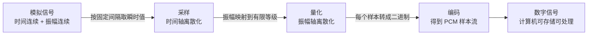

### 量化：把振幅轴离散化

采样确定了时间轴上的位置，但每个采样点的振幅仍然是连续值，需要进一步映射到有限个等级，这个过程叫量化（quantization）。

位深（bit depth，也叫 sample size）决定量化等级数：用 N 位二进制表示一个采样值，就有 2^N 个等级。

- 16-bit：65536 个等级，有符号范围 -32768 到 32767，是最通用的格式。
- 24-bit：16777216 个等级，常见于录音和后期制作。
- 32-bit float：浮点表示，动态范围极大，常用于音频处理中间环节，最终输出前再转回定点格式。

量化必然引入误差。真实振幅和它被映射到的量化等级之间总有差值，这个差值在听感上等效于叠加了一层噪声，叫量化噪声。量化噪声是 A/D 转换的固有代价，无法消除，只能通过增加位深来压低。

- **量化信噪比**：SNR ≈ 6.02 × N + 1.76（dB）
  - 16-bit 约 98dB，24-bit 约 146dB。
- **动态范围（dynamic range）**：能表示的最大信号与最小信号之比，用 dB 衡量。16-bit 的理论动态范围约 98dB，对消费级回放基本够用；专业录音用 24-bit，主要目的是在录音环节留足动态余量，避免大动态素材在早期就引入量化噪声。

| 位深 | 量化等级 | 理论 SNR |
|------|---------|---------|
| 16-bit | 65536 | ≈98dB |
| 24-bit | 16777216 | ≈146dB |
| 32-bit float | 浮点 | 远高于定点 |

用一个 16-bit 的例子来感受量化等级：一个采样值可以取 -32768 到 32767 之间的任意整数，代表该时刻声压相对满幅的比例。静音是 0，满幅正峰值是 32767，满幅负峰值是 -32768。

```c
// 一段 48k/16bit/mono 的 PCM：每秒 48000 个样本，每个样本一个 int16_t
int16_t pcm[48000];   // 一秒钟的音频数据
pcm[0] = 32767;       // 满幅正峰值
pcm[1] = 0;           // 静音
pcm[2] = -32768;      // 满幅负峰值
```

### 编码与 PCM

把量化后的每个采样值转换成二进制，再按时间顺序连起来，就得到了数字信号。这一步叫编码。

这里说的编码，和「音频编码（AAC/MP3/Opus）」这类有损压缩是两个层面：

- 这里是把单个样本变成二进制，是 A/D 转换的自然结果，不涉及压缩。
- 音频编码是对整段样本流做数据压缩，是有损或无损的编码算法。

- **PCM（Pulse Code Modulation，脉冲编码调制）**：采样 + 量化 + 编码 得到的原始数字音频格式。PCM 直接保存每一个样本的量化值，不做任何压缩，因此是无损的。
- PCM 的特征：还原度最高、数据量最大、格式最简单。它是所有后续处理（重采样、混音、增益、编码压缩）的输入基础，几乎所有音频框架内部都以 PCM 作为交换格式。
- WAV 就是一种把 PCM 包起来、在前面加一个文件头的容器格式。

示意一下完整的数字化链路，这里用文字描述先后顺序：

1. 连续波形：时间、振幅都连续。
2. 采样：按固定间隔取瞬时值，得到离散时间点上的振幅值。
3. 量化：把振幅值映射到有限个等级，得到整数。
4. 编码：把整数转成二进制，按时间顺序连接成 PCM 样本串。

### 采样率、位深、声道与码率

描述一段数字音频有四个基本参数：

- 采样率 sample rate：每秒样本数，决定能还原的最高频率。
- 位深 bit depth：每个样本用多少位表示，决定动态范围和量化噪声。
- 声道数 channel count：一路声音是一个声道（mono），左右两路是立体声（stereo），还有 5.1、7.1 等多声道配置。
- 码率 bitrate：每秒传输或存储的比特数。

码率计算公式：

```text
bitrate(bps) = sampleRate × bitDepth × channelCount
每秒字节数(byte/s) = bitrate / 8
```

常见组合的数据量：

| 采样率 | 位深 | 声道 | 码率 | 每秒数据量 |
|--------|------|------|------|-----------|
| 8000 | 16-bit | 1 | 128 kbps | 16 KB/s |
| 16000 | 16-bit | 1 | 256 kbps | 32 KB/s |
| 44100 | 16-bit | 2 | 1411 kbps | 176.4 KB/s |
| 48000 | 16-bit | 1 | 768 kbps | 96 KB/s |
| 48000 | 16-bit | 2 | 1536 kbps | 192 KB/s |

其中 48k/16bit/mono 是 96KB/s，它是云手机音频上行链路的典型数据量，也是判断「音频数据能不能用 socket 这类方式跨进程传输」的重要依据。

任意时长的数据量：

```text
总字节数 = sampleRate × (bitDepth / 8) × channelCount × 时长(秒)
```

码率越高，声音还原度的理论上限越高，但存储和带宽成本也越高。实际系统总是根据场景在两者之间取舍：电话用 8k 就够，音乐追求保真用 44.1k/48k 高码率，需要压缩体积或对抗弱网时则走编码压缩。

## PCM 与音频数据格式

### sample 与 frame

PCM 是一串按时间顺序排列的二进制样本。真正处理 PCM 数据时，先要分清两个概念：sample 和 frame。

- sample（采样值）：一个声道的一个采样点。16-bit 时，一个 sample 就是一个 int16_t。
- frame（帧）：同一时刻所有声道的 sample 拼在一起，构成一个 frame。帧是音频处理中最小的、有意义的时间单位。
  - mono（单声道）：一个 frame 就是一个 sample。
  - stereo（立体声）：一个 frame 是两个 sample，左右声道各一个。

| 声道配置 | 一个 frame 包含 |
|---------|----------------|
| mono | 1 个 sample |
| stereo | 2 个 sample（L、R）|
| 5.1 | 6 个 sample（L/R/C/LFE/SL/SR）|

frame 的意义在于，对音频的任何读写、重采样、混音，都以 frame 为基本单位。知道帧数就能换算成时间：48kHz 下，一帧持续 1/48000 秒，约 20.8 微秒。

PCM 在内存和文件里有两种排布方式：

- 交错（interleaved）：声道交叉存放，一个 frame 内所有声道连续，排布是 L R L R L R …。WAV 文件用的是这种。
- 非交错（planar）：每个声道的样本各自连续存放，排布是 L L L … R R R …。常见于音频处理中间格式和部分框架内部。

判断一个 PCM 流的帧结构，看三个数字：frameSize（一帧的字节数）、采样率、声道数。

```text
frameSize = 每样本字节数 × 声道数
例：16-bit 立体声，frameSize = 2 × 2 = 4 字节
```

```c
// 交错排布：L R L R ...，一帧内声道连续
// 48k/16bit/stereo，以 [帧][声道] 组织
int16_t frames[2][2];        // 两帧立体声
frames[0][0] = 100;          // 第 0 帧左声道
frames[0][1] = -100;         // 第 0 帧右声道
frames[1][0] = 200;          // 第 1 帧左声道
frames[1][1] = -200;         // 第 1 帧右声道
// 内存里就是 100, -100, 200, -200（L0 R0 L1 R1）
```

### 字节序

一个 16-bit 的 sample 占两个字节，这两个字节在内存里的先后顺序就是字节序（endian）。

- 小端（little-endian，LE）：低字节在前。x86/ARM 主流平台、Android 内部、绝大多数 PCM 流都用小端。
- 大端（big-endian，BE）：高字节在前。网络协议传统上多用大端，但裸 PCM 流基本固定小端。

举例：值 0x1234，小端存成 34 12，大端存成 12 34。

字节序搞反的后果是每个 sample 高低字节颠倒、符号位错位，声音会变成刺耳噪声，而不是音量变化。所以 PCM 流在跨系统传输时，必须在帧头或约定里明确字节序。

```c
// 小端存储示例：值 0x1234
uint8_t bytes[2] = { 0x34, 0x12 };   // 低字节在前
```

### 常见位深与排布

PCM 按位深和表示方式有几种常见形态：

- s16le：16-bit 有符号小端，范围 -32768 到 32767，最通用的消费级格式。
- s24le：24-bit 有符号小端，范围 -8388608 到 8388607，录音制作常用。
- s32le：32-bit 有符号，范围更大，也常用来把 24-bit 样本装进 32-bit 容器。
- float32：32-bit 浮点，满幅约定为 ±1.0，音频处理内部常用。

| 格式 | 位宽 | 取值范围 | 常见用途 |
|------|------|---------|---------|
| s16 | 16 | -32768 ~ 32767 | 回放、文件、传输 |
| s24 | 24 | -8388608 ~ 8388607 | 录音制作 |
| s32 | 32 | -2147483648 ~ 2147483647 | 高动态、24bit 容器 |
| float32 | 32 | ±1.0（满幅约定）| 音频处理内部 |

有符号整数用补码表示负数，-1 在 s16 里是 0xFFFF。幅度换算关系：0.5 幅度的信号，在 s16 里峰值约 16384，在 s24 里约 4194304，在 float32 里是 0.5。

```c
// 同一个 0.5 幅度在不同位深里的表示
int16_t s16 = 16384;      // 0.5 × 32768
int32_t s24 = 4194304;    // 0.5 × 8388608
float   f32 = 0.5f;       // 0.5 × 满幅
```

### WAV 容器

WAV 是最常见的 PCM 文件容器。它用 RIFF 格式把 PCM 包起来，前面加一个文件头。标准 PCM、无扩展块时，头部是 44 字节，由三段组成：

- RIFF 头（12 字节）："RIFF" 标识、文件总长减 8、格式标识 "WAVE"。
- fmt 块（24 字节）："fmt " 标识、块大小 16、音频格式（1 表示 PCM）、声道数、采样率、字节率 byteRate、块对齐 blockAlign、位深。
- data 块（8 字节 + 数据）："data" 标识、PCM 数据长度，后面跟着样本数据。

```text
偏移   长度   内容
0      4      "RIFF"
4      4      文件总长 - 8
8      4      "WAVE"
12     4      "fmt "
16     4      fmt 块大小(16)
20     2      音频格式(1 = PCM)
22     2      声道数
24     4      采样率
28     4      字节率 byteRate
32     2      块对齐 blockAlign
34     2      位深 bitsPerSample
36     4      "data"
40     4      PCM 数据长度
44     N      PCM 样本数据
```

byteRate 和 blockAlign 是解析 WAV 的关键：

```text
blockAlign = 声道数 × 位深 / 8     // 一帧字节数
byteRate   = 采样率 × blockAlign   // 每秒字节数
```

播放器读 WAV 时，先读头部拿到采样率、位深、声道和数据起点，再按 byteRate 匀速把数据喂给音频设备。WAV 头部自描述了全部参数，适合做 PCM 的存档和测试格式。

### 二进制音频帧头设计

裸 PCM 流有一个问题：它只是一长串字节，自身不携带任何参数。接收方拿到一段数据，不知道采样率是多少、位深多少、几个声道、这一包在哪里结束。本地文件播放没问题，因为参数写在文件头里；但把 PCM 通过流式通道（例如跨进程的 socket）传输时，必须自己定义包格式。

实用的做法是给每一包数据加一个帧头，帧头后面跟着 PCM 负载。帧头通常包含下面这些字段，每一样都有明确用途：

| 字段 | 作用 |
|------|------|
| 魔数 magic | 固定字节序列，识别包类型，防止串进别的数据流 |
| 版本 version | 协议演进时区分新旧格式 |
| 序列号 seq | 检测乱序、丢包，丢弃重复包 |
| 时间戳 timestamp | 播放调度、音视频对齐、时钟漂移检测 |
| 采样率/声道/位深 | 负载自描述，任何一包都能独立解释 |
| 负载长度 payloadLen | 拆包边界 |
| 头部长度 headerLen | 便于扩展新字段 |

帧头用固定字节序（统一小端），字段按固定偏移排列，接收端逐字段读出即可，不需要序列化库。

```c
// 一种通用的二进制音频帧头（示意字段设计，具体协议按需调整）
#pragma pack(push, 1)
struct PcmPacketHeader {
    uint32_t magic;          // 魔数：识别包类型，防串流
    uint32_t seq;            // 序列号：乱序/丢包/去重
    uint32_t timestamp_ms;   // 采样时刻(毫秒)：播放调度与对齐
    uint16_t sample_rate;    // 采样率
    uint8_t  channels;       // 声道数
    uint8_t  bits_per_sample;// 位深，如 16
    uint32_t payload_len;    // 负载长度：拆包边界
    uint16_t header_len;     // 头部长度：扩展
};
#pragma pack(pop)
// payload：PCM 样本，长度应为 frameSize 的整数倍
```

序列号和时间戳是流式音频传输区别于本地回放的关键。本地回放按顺序匀速读取即可；流式传输会面对乱序、丢包和时钟不一致，这两个字段正是解决这些问题的数据基础。

负载长度最好按帧对齐：一包包含整数帧，长度应是 frameSize 的整数倍。否则出现半帧，接收端按 frame 消费时会在包边界卡住。

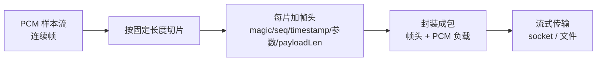

## 音频编码与容器

### 有损与无损压缩

PCM 数据量很大。CD 立体声是 1411kbps，一小时的音乐约 635MB，直接存储和传输都不划算。编码压缩就是为了解决这个问题。

按还原程度，压缩分两类：

- 无损压缩：压缩后可逆，解压得到的 PCM 与原始数据完全一致。做法是用统计冗余（霍夫曼编码、线性预测）去掉数据里的重复模式。音乐无损压缩一般能压到原体积的一半左右。典型格式：FLAC、ALAC。
- 有损压缩：去掉人耳不敏感的信息，解压后与原始 PCM 不一致，但听感差异很小。靠的是心理声学模型。

有损压缩的依据是掩蔽效应（masking）：某个声音的存在，会降低人耳对同时刻、相邻频段其它声音的敏感度，被掩蔽的部分即使被丢掉，人也听不出来。

- 频域掩蔽：一个强音会让它邻近频率的弱音听不见。
- 时域掩蔽：强音出现前后一小段内的弱音也会被掩盖。

有损编码把能量主要放在人耳敏感的频段上，对掩蔽区内的成分直接舍弃或降低精度，从而大幅降低码率。一首 CD 立体声音乐，无损约 800~900kbps，有损压到 128~192kbps 听感就很接近原曲，压缩率大约 1/8 到 1/10。

| 维度 | 无损 | 有损 |
|------|------|------|
| 还原 | 与原始 PCM 逐字节一致 | 不一致，靠心理声学隐藏差异 |
| 压缩率 | 约 1/2 | 约 1/8 ~ 1/12 |
| 典型格式 | FLAC、ALAC | AAC、MP3、Opus、Vorbis |
| 适用 | 存档、编辑、监听 | 传输、存储、流媒体 |

### 常见编码器对比

实际工程里常用这几个编码器，关键差异在采样率支持、延迟和场景定位：

- AAC（Advanced Audio Coding）：现代最通用的音频编码，也是 MP4 的标准音频编码。支持 8k 到 96k 采样率，48k 下质量好，码率弹性大。适合音乐、视频伴音、录制。
- AMR-NB（Adaptive Multi-Rate Narrowband）：窄带语音编码，固定 8kHz 采样，码率 4.75~12.2kbps，专为电话级语音设计。只认 8k，喂给它的音频如果不是 8k，必须先降采样。
- Opus：开源免专利的现代编码，支持 8k 到 48k 采样，算法延迟很低（几十毫秒内），同时适合语音和音乐，是 WebRTC 实时通信的默认选择。
- MP3：经典有损格式，支持 32/44.1/48k，44.1k 时代的标准，至今存量巨大。
- Vorbis：开源有损编码，Ogg 容器使用，质量和 MP3 相当或略优。

| 编码器 | 采样率支持 | 典型码率 | 算法延迟 | 场景 | 专利 |
|--------|-----------|---------|---------|------|------|
| AAC | 8k ~ 96k | 96~256kbps | 中 | 音乐、视频、录制 | 需授权（MP4 常见使用已覆盖）|
| AMR-NB | 8k（固定）| 4.75~12.2kbps | 低 | 电话语音 | 需授权 |
| Opus | 8k ~ 48k | 6~510kbps | 很低 | 实时通信（WebRTC）| 免专利 |
| MP3 | 32/44.1/48k | 128~320kbps | 中 | 存量音乐 | 专利已过期 |
| Vorbis | 8k ~ 48k | 48~350kbps | 中 | 开源生态 | 免专利 |

采样率支持是选型时最容易踩的坑。输入音频是 48k 时，AAC 和 Opus 可以直接编码；AMR-NB 不行，必须先把 48k 降采样到 8k。降采样意味着丢掉全部 8k 以上的信息，质量上限锁死在电话级。反过来，如果输入本来就是 8k 语音，AMR-NB 和 Opus 都很合适，AAC 在低码率下反而不占优。

编码器要区分于容器：编码器把 PCM 变成编码帧（AAC 帧、AMR 帧），容器负责把编码帧组织成文件。一个文件里可以同时有音频编码帧和视频编码帧，这就是容器存在的意义。

### 编码帧与容器

编码器的输出不是 PCM frame，而是编码帧（encoded frame，也叫 access unit）。每个编码帧覆盖固定时长的音频，但长度和 PCM 的 frame 完全不同：

- AAC（LC）一帧 1024 个样本，48k 下约 21.3ms。
- AMR-NB 一帧 20ms（对应 160 个 8k 样本）。
- Opus 一帧 2.5ms 到 60ms，可配置。

编码帧的时长和采样率相关，所以封装时要靠时间戳对齐，不能靠"帧数 × 固定字节数"来还原时间。

容器（container，也叫 muxer）负责把多条轨组织进一个文件：记录每条轨的编码格式、采样率、时长，以及每一帧的时间戳和位置。常见的容器：

- MP4 / 3GP：基于 ISO BMFF，应用最广。
- Ogg：搭配 Vorbis/Opus 的开源容器。
- WebM / Matroska（MKV）：以视频为主的开源容器。

容器和编码器不强制绑定，但有约定俗成的搭配：MP4 配 AAC，3GP 配 AMR-NB，Ogg 配 Vorbis/Opus，WebM 配 Opus/VP9。乱搭通常也能封装，但兼容性差，很多播放器解不开。

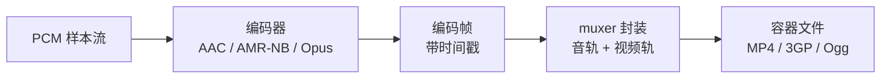

### MP4 与 3GP

MP4 和 3GP 是同源的，都基于 ISO BMFF（MPEG-4 Part 12），文件结构都是 box（也叫 atom）的集合。区别在定位：

- MP4：面向通用的音视频，音频标准是 AAC，视频常见 H.264/H.265，适用范围最广。
- 3GP：诞生于 3G 手机时代，面向低带宽低分辨率，音频常见 AMR-NB，视频 H.263。可以看作 MP4 的窄带简化变体。

MP4 的核心结构是三个 box：

- ftyp：文件类型标识。
- moov：元数据，记录每条轨（track）的编码、采样率、声道、时长，以及帧的时间戳表。
- mdat：实际的媒体数据（编码帧）。

播放器打开 MP4，先读 moov，按 track 元数据知道音频采样率和时长，再按 mdat 里的帧数据和时间戳播放。

时长计算依赖 track 元数据里的采样率。这里有一个关键点：容器按"帧数 / 采样率"换算时长，如果写入的采样率与实际音频不符，算出来的时长就是错的。

### 采样率兼容与默认编码

窄带编码器遇到宽频音频，是封装错误最常见的来源。

AMR-NB 只支持 8k。如果输入是 48k 的宽频 PCM，有两种处理方式：先降采样到 8k 再编码（信息损失，质量锁死电话级），或者直接用支持 48k 的编码器（AAC/Opus）。如果哪一步漏了降采样，把 48k 数据当成 8k 编码，容器按 8k 元数据算时长，结果会严重偏长或偏短，播放器分离音轨也会出问题。

另一个容易踩的坑是"默认编码"：很多录制框架在调用方没显式指定编码器时，会用一个历史默认值。老一些的录制路径默认落在窄带语音编码上，即使容器是面向宽频的 MP4。这个组合本身合法（容器不强制编码），但和 48k 输入一配就出采样率不匹配。

稳妥的工程做法是：面向宽频容器（MP4）时显式指定 AAC，让 48k 输入可以直接封装；只有明确做电话级语音时才用 AMR-NB，并保证输入先降采样到 8k。采样率、编码器、容器三者对齐，是封装环节少出问题的基本要求。

## 重采样

### 为什么要重采样

音频数据在链路里各环节的采样率往往不一致：采集设备输出 48k，应用却请求 16k；本地文件是 44.1k，播放设备却按 48k 工作；语音会话统一 16k。两个模块要对接，采样率不同，就必须把其中一边转换到另一边，这个转换就是重采样（resampling，也叫采样率转换，sample rate conversion）。

重采样是音频链路里最常见的格式转换之一，几乎所有系统级音频框架都内置它。

常见触发场景：

- 设备固定输出 48k，应用要 16k 的语音。
- 播放 44.1k 的音乐，但输出设备只支持 48k。
- 通话、录制把各路输入统一到一个采样率。

### 重采样的原理

重采样就是改变离散信号的采样密度。把采样率从 fs1 变到 fs2，靠的是插值和滤波两步。

上采样（fs2 大于 fs1，比如 16k 变 48k）需要"造"出更多样本，最朴素的做法是插值：

- 最近邻（零阶保持）：直接用最近的样本值填充。实现最简单，但每个样本点都有跳变，频域引入大量高频噪声，听感明显发毛。
- 线性插值（一阶）：相邻两点连线取中间值，质量好一些，仍不理想。
- 高阶插值 / sinc 插值：用更长的滤波核逼近理想重构，质量高，计算量也大。

只插值还不够。上采样后的信号在频域会出现镜像频谱（image）；下采样时，高于新采样率一半（新的奈奎斯特频率）的成分会折叠回低频造成混叠。所以标准的重采样必须配套低通滤波：

- 下采样（fs2 小于 fs1）：先低通，把高于 fs2/2 的频率滤掉，再抽稀。
- 上采样（fs2 大于 fs1）：先插值，再低通滤掉镜像，得到平滑的结果。

低通截止频率按源、目标采样率中较小者的奈奎斯特频率来定。

专业重采样器（包括 Android 的 AudioResampler）用的是多相滤波（polyphase）：把滤波器系数按采样时刻分解成多组，插值时刻不同就用对应的一组系数，质量和效率兼顾。这是工业界的标准做法。

### 重采样的代价：音质、CPU、时长

- 音质：任何重采样都会引入滤波误差和量化误差。高质量重采样（长滤波核）损失很小，听感几乎无差别；差的重采样（最近邻、短核）会明显劣化，高频发虚、有杂音。
- CPU：重采样是计算密集操作，尤其是高质量多相滤波。在实时音频线程里，质量档位和帧大小直接影响 CPU 占用。
- 时长（最隐蔽的坑）：重采样改变的是采样密度，不改变音频本身的时间长度。1 秒音频从 48k 变 24k，样本数减半，但时长还是 1 秒。

时长出错的根源不在重采样，而在"按错误的采样率解释数据"。样本数是固定的，时长等于样本数除以采样率：

- 一段 48k 的 1 秒音频有 48000 个样本，如果被误当成 8k，会被认为有 6 秒。
- 播放时如果把 48k 数据按 16k 的时钟喂给设备，声音会变慢，时长拉长 3 倍。

很多"倍速""时长异常"的问题，根因都是链路某处采样率标错，而不是数据本身变了。排查这类问题通常先核对采样率。

### 重采样器的正确使用

标准流程：

1. 确认源采样率和目标采样率，计算变换比例。
2. 按较小者的奈奎斯特频率确定低通截止。
3. 做插值或抽取与滤波，得到目标采样率的样本。
4. 输出帧数与源帧数按比例换算（近似）。

```text
变换比例 ratio = 目标采样率 / 源采样率
目标帧数 ≈ 源帧数 × ratio
```

```c
// 概念示意：16k 上采样到 48k（×3），样本数变三倍
// 48k 下采样到 16k（÷3），先低通滤掉 8k 以上再抽稀
```

工程上有几个要点：

- 整数倍转换（16k 变 48k，×3）质量容易做好；非整数倍（44.1k 变 48k，比值 160/147）对滤波器质量要求更高。
- 重采样不是逐帧独立的操作，滤波器有延迟和残余样本，流式处理时要跨帧缓存残余，否则帧边界会出毛刺。
- 别在同一段数据上反复重采样，每过一次都会累积失真。要么一次到位，要么统一到中间采样率后再转一次。

### Android 的重采样实现

AOSP 里封装了一个系统级重采样器 AudioResampler，提供多种质量档位，AudioFlinger 的录音和播放线程在需要采样率转换时调用它。

录音链路里还有一层格式转换器 RecordBufferConverter，负责采样率、声道、位深三者的联合转换。构造时指定源和目标的声道、格式、采样率，convert() 一次完成。它的采样率转换部分复用的正是 AudioResampler。

这样设计的好处是：链路里无论在哪一步需要重采样（输入归一化、出口适配客户端采样率），都用同一套系统实现，质量和行为一致，避免出现自研的低质量重采样器。


另一个常见做法是把内部统一到一个标准采样率，比如 48k：它与常见视频帧率能整数对齐，几乎所有宽频编码器都支持。统一之后再按各消费方的需求分别转换，避免每个环节各自为政。

## 音量、增益与响度

### 分贝：音频的倍数语言

音频里衡量"大了多少、小了多少"，很少用倍数，几乎都用分贝（dB）。原因有两个：人耳对响度的感知接近对数关系（振幅翻倍，感觉并不是"两倍响"）；信号动态范围跨度极大，从极小到极大跨越好几个数量级，用倍数不好表达。

分贝是比值，不是绝对值：

- 振幅比：dB = 20 × log10(A2 / A1)
- 功率比：dB = 10 × log10(P2 / P1)

常见对照：

| 幅度变化 | dB |
|---------|----|
| × 2 | +6.02 dB |
| × 0.5 | -6.02 dB |
| × 10 | +20 dB |
| × 0.1 | -20 dB |
| 不变 | 0 dB |

数字音频以满幅为基准，用 dBFS（dB Full Scale）表示：0 dBFS 是最大可表示幅度（s16 的 32767），实际信号都是负的 dBFS，-6 dBFS 表示幅度是满幅的一半。

### 增益与定点

增益（gain）就是对每个样本乘一个系数：

```text
out = in × g
```

g 大于 1 是放大，小于 1 是衰减。增益用 dB 表示时，与线性系数的换算是 gain_db = 20 × log10(g)。

音频处理内部常用定点数表示增益，而不是浮点。原因有两个：很多嵌入式、硬件平台没有浮点单元，定点运算快且行为确定；定点运算可复现，便于调试和定位一致性问题。

Q15 和 Q16 是两种常见的定点格式：

- Q15：用 16 位有符号整数表示 [-1, 1) 的值，把 1.0 映射到 32768，0.5 就是 16384。
- Q16：用 32 位整数表示，高 16 位是整数部分、低 16 位是小数部分，范围更大。

两个 Q15 定点数相乘，结果的定点位数是两者之和，用完要右移回去：

```c
// Q15 定点增益：0.5 倍 = 0.5 × 32768 = 16384
const int16_t gainQ15 = 16384;
int16_t in = 10000;
// 定点乘法：(in × gainQ15) >> 15
int16_t out = (int16_t)(((int32_t)in * gainQ15) >> 15); // 5000
```

增益的风险在于放大会顶到上限。输入接近满幅时再放大，样本会被钳到最大可表示值，波形顶端被削平，产生失真。所以增益设计通常要留余量（headroom），把目标幅度压在满幅之下。

### 峰值、RMS 与响度

衡量一段音频的"大小"，有三个层次：

- 峰值（peak）：帧内样本绝对值的最大值。反映瞬时最大振幅，决定会不会削波。
- RMS（均方根）：对样本平方取均值再开方，近似反映信号功率（能量），比峰值更贴近"平均音量"。
- 响度（loudness）：人耳实际感知的大小。人耳对低频不敏感（等响曲线），同样振幅的低频和高频听起来响度差很多，所以峰值和 RMS 都无法直接当响度用。

峰值与 RMS 的比值叫波峰因子（crest factor）：

```text
crest factor = peak / RMS
```

语音的波峰因子通常比持续音乐高，波形起伏大。单纯按峰值调音量，会忽略能量层面的差异。

### LUFS 与响度标准

为了统一"响度"这个主观量，业界定义了 LUFS（Loudness Units relative to Full Scale）。它和 dB 数值上很接近，但做了两件事：按人耳等响特性对频率加权（K-weighting），并按时间窗积分。

以 LUFS 为单位，出现了一批响度标准：

- EBU R128：欧洲广播标准，建议节目的目标响度是 -23 LUFS。
- 流媒体平台：YouTube、Spotify 等常见目标为 -14 LUFS，播客常用 -16 LUFS。

| 场景 | 常见目标响度 |
|------|-------------|
| 欧洲广播（EBU R128）| -23 LUFS |
| 流媒体（YouTube/Spotify）| -14 LUFS |
| 播客 | -16 LUFS |

为什么按响度而不是按峰值调增益：同样峰值下，音乐和语音的感知响度可能差很多；统一到目标响度后，切换节目不会忽大忽小。响度测量和响度归一化也因此成为音频工程的常见需求。

### AGC 自动增益控制

AGC（Automatic Gain Control，自动增益控制）解决音量忽大忽小的问题：输入电平不稳定（录音距离变化、远端说话声音大小不一），系统根据输入能量动态调整增益，让输出尽量稳定。

基本流程：

1. 计算当前帧的峰值或 RMS。
2. 按目标幅度算期望增益：gain = target / peak。
3. 把增益限制在合理范围（例如 0.5 倍到 4 倍之间），防止过度放大或衰减。
4. 噪声门：帧能量低于阈值时视为底噪，把增益上限收窄，避免把噪声一起放大。
5. 平滑：增益不能突变，用 attack/release 两个速率做平滑。
6. 把平滑后的增益应用到样本。

attack 和 release 的方向不同：

- attack（增益下降）：输入突然变大时，增益要快速压下来，否则一瞬间就爆音。所以 attack 要快。
- release（增益回升）：输入变小时，增益缓慢回升，避免音量来回抖动、忽大忽小。所以 release 要慢。

"attack 快、release 慢"是 AGC 的经典设计，几乎所有实现都遵循。

噪声门的意义：没有它，安静段落里的底噪会被 AGC 放大，说话停顿时反而听到明显的"沙沙声"。把低于阈值的帧当作噪声压制，只对真实信号做增益。

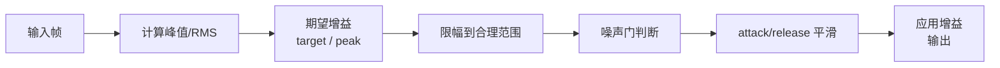

```c
// AGC 流程示意（伪代码，便于理解；实际常转成 Q16 定点实现）
float peak = framePeak(samples);         // 帧内峰值
float gain = target / peak;              // 峰值归一化
gain = clamp(gain, minGain, maxGain);    // 限制范围
if (peak < noiseFloor) gain = min(gain, floorGain);  // 噪声门
gain = smoothGain(gain, attack, release);// 快降慢升
applyGain(samples, gain);                // 应用到样本
```

定点实现时，这些系数和中间值都用 Q16 整数参与运算，目标幅度一般设在满幅之下留 headroom，增益 clamp 在最小最大值之间，平滑系数体现"快降慢升"。

## 削波与限幅

### 什么是削波

数字音频有硬性的满幅上限：s16 格式里，正满幅 32767，负满幅 -32768。任何处理如果让样本超过这个范围，结果只能被钳到上限，波形的顶端被"削平"，这就是削波（clipping）。

削波什么时候发生：

- 增益放大后信号超过满幅。
- 多路声音混音叠加后超过满幅。
- 编码、重采样、滤波等处理后出现超幅。

削波是硬失真。被削掉的部分在数据里已经不存在，无法恢复。听感上，顶端被削平的波形接近方波，产生大量刺耳的高频成分，就是我们常说的"爆音"。

### 硬限幅与谐波失真

最直接的防削波办法是硬限幅（hard clip / hard limiter）：超上限就取上限，低于下限就取下限。

```c
// 硬限幅：超上限取上限，超下限取下限
int16_t v = sample;
if (v > MAX) v = MAX;
else if (v < MIN) v = MIN;
```

硬限幅的问题在于波形被"一刀切"。被切平的部分在频域里等价于叠加了一个失真信号：正弦波被削顶后，会出现大量奇次谐波（3 倍、5 倍、7 倍基频的分量）。削得越狠，谐波越多，声音越硬、越刺耳。这个现象用总谐波失真（THD）来量化。

硬限幅并非一无是处：它实现零开销、行为确定，适合作为"最后一道防线"，保证任何情况下样本都不会溢出整数范围。真正的问题在于把它当成主要的防削波手段，音量一大就粗暴切断。

### 软削波 soft-knee

软削波（soft clip）的思路是不一刀切，而是用一条压缩曲线把超过阈值的部分渐进地压低，越接近上限压得越狠，让波形顶端平滑过渡，而不是被切成平顶。

一种常见的形式是双曲线软削波。设阈值 start、硬上限 limit，超出部分 over = absV - start，headroom = limit - start：

```text
absV > start 时：
  over      = absV - start
  headroom  = limit - start
  absV      = start + over × headroom / (over + headroom)
```

这条曲线的特性：

- over 很小时，结果几乎等于原值，几乎不压。
- over 很大时，结果趋向 start + headroom，即趋近硬上限，但永远是渐进逼近，不会突变。
- 曲线连续且导数连续，顶端圆滑，不产生硬切的那种方波边缘，谐波少、听感平滑。

```c
// 软削波（soft-knee）实现示意，参数为示例值
const int32_t kSoftStart = 30000;   // 软削波阈值（示例，满幅的约 90%）
const int32_t kHardLimit = 32767;   // 最终硬上限
int32_t absV = vv < 0 ? -vv : vv;
if (absV > kSoftStart) {
    int32_t over     = absV - kSoftStart;
    int32_t headroom = kHardLimit - kSoftStart;
    absV = kSoftStart + (over * headroom) / (over + headroom);
    vv = vv < 0 ? -absV : absV;
}
```

另一种常见的软削波是 tanh（双曲正切）：tanh(x) 天然饱和在 ±1，曲线光滑，也常用于限幅和饱和效果器。

| 维度 | 硬限幅 | 软削波 |
|------|--------|--------|
| 处理方式 | 一刀切到上限 | 渐进压缩，顶端圆滑 |
| 谐波 | 大量（方波边缘）| 少（平滑过渡）|
| 听感 | 硬、刺耳 | 平滑、暖 |
| 实现成本 | 极低 | 略高 |
| 定位 | 最后兜底 | 主要防削波手段 |

### 前置增益与三层链路

软削波再平滑，也是"发生削波之后"的补救。更好的做法是从源头留出余量，让峰值不容易顶到上限，这就要靠前置增益（pre-gain）。

前置增益在进入削波环节之前，先把整体电平压低一档（比如 0.5 倍，约 -6dB）。这样：

- 正常音量下信号整体降低，峰值离上限更远。
- 即便后面混音、AGC 把音量推高，也还有一段缓冲。

一个成熟的防削波链路通常分三层，各管一件事：

1. 前置增益：压低整体电平，留 headroom。
2. 软削波：对仍然超阈值的瞬间做渐进压缩，保证听感平滑。
3. 硬限幅：最后兜底，保证样本绝不超出整数范围。


```c
// 三层防削波链路示意
int32_t v = sample;
v = (v * preGainQ15) >> 15;   // 1) 前置增益：约 -6dB，留余量
v = softClip(v);              // 2) 软削波：超阈值部分渐进压缩
v = hardClamp(v);             // 3) 硬限幅：保证不溢出
```

单靠硬限幅会爆音，单靠软削波无法保证绝对不溢出，只有三层配合才能在"音质"和"绝对安全"之间取得平衡。这也是录音和音频上行链路里常见的做法。

## 抖动、延迟与时钟

### 抖动的来源

本地播放音频是按顺序匀速读文件，不存在时序问题。但流式传输不一样：音频被切成一包一包，通过网络或跨进程通道传过来，包到达的时间并不均匀，甚至顺序还会变。

- 乱序：后发的包先到。
- 重复：同一个包被传了两遍。
- 丢失：某个包根本没到。
- 抖动（jitter）：包到达间隔忽长忽短。

如果收到的包立刻按到达顺序播放，乱序、重复会变成杂音，到达间隔不均匀会让声音一顿一顿。流式音频的第一道工序，就是先把时序还原。

### 抖动缓冲

抖动缓冲（jitter buffer）的思路：接收端先缓存一段时间的数据，按正确顺序排出，把到达时间的不均匀"抹平"。

- 排序：按包携带的序列号或时间戳重排。
- 去重：序列号重复的包丢弃。
- 过期：时间戳太旧的包丢弃，不参与排序。
- 上限：缓冲不能无限增长，设一个深度上限，超限时强制排空或丢帧，否则延迟会无限累积。

缓冲深度是"延迟"和"抗抖"的权衡：

- 缓冲越深，越能吸收大的抖动，但引入的固定延迟越大。
- 缓冲越浅，延迟越小，但一遇到抖动就卡。

所以深度上限的取值是个工程决策，通常根据链路质量设定，例如等乱序包等几十毫秒、积压超过某个包数就强制排空追进度。

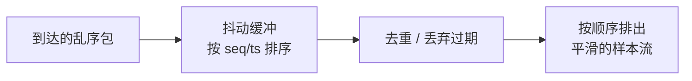

### 偏移与漂移

两端时钟的偏差，要分清两个概念：

- 偏移（offset）：固定差值。音频比视频慢 100ms，一直慢 100ms，不随时间变化。这是可以一次性校准的常量。
- 漂移（drift）：差值随时间累积变大。音频越来越滞后，或越来越超前。

漂移的根因是时钟频率的微小误差。发送端用晶振 A 产生采样时钟，接收端用晶振 B 播放，两个晶振的频率不可能完全一致（常见误差在 ppm 级，也就是百万分之几）。假设发送端每秒真的产生 48000.0 个样本，接收端按 47999.5 个样本/秒的节奏消费，那每秒就慢 0.5 个样本，累积几分钟就能听出延迟在增长。

偏移可以校准一次就对齐，漂移必须持续补偿，否则偏差会无限累积。

### 时钟漂移补偿

对抗抖动和漂移，常用几层手段组合：

- EWMA 平滑估计：对包到达间隔做指数加权移动平均，平滑瞬时抖动，得到稳定的抖动估计。形如 ema = (7 × ema + 新值) / 8，新值权重低，受瞬时毛刺影响小。
- 漂移检测：比较"本地时钟增量"和"发送端时间戳增量"，如果两者差值累积超过阈值，就判定存在漂移。
- 削尾（trim）：检测到漂移后，把积压的缓冲裁剪掉一部分，追回累积的延迟。削尾通常只保留最近几帧。
- 播放调度：每个包按时间戳算出"应播时刻"，到点才播，过晚直接丢弃。
- 自适应延迟：根据 underrun/overrun 的统计，动态调整目标缓冲深度，抖动大就加深，稳定就变浅。

每层解决链路里不同段的问题：平滑估计管"到达节奏"，削尾管"长期漂移"，播放调度管"单包时序"，自适应延迟管"整体稳定性"。

### 播放调度

播放调度（playout scheduling）是把"网络到达的乱序时间"还原成"均匀的播放时间"。

做法是建立一条时间映射：用第一个包的到达时刻加目标延迟，作为它的应播时刻；后续包的应播时刻按发送端时间戳线性外推：

```text
首包应播时刻 = 首包到达时刻 + 目标延迟
某包应播时刻 = 首包应播时刻 + (该包时间戳 - 首包时间戳)
```

播放时：

- 未到应播时刻：等待。
- 已到或超过应播时刻：立即播放。
- 迟到太多（超过容忍上限）：丢弃，避免塞进播放造成时序混乱。

```c
// 播放调度示意（伪代码）
int64_t dueNs = baseDueNs + (packet.tsMs - baseTsMs) * 1000000LL;
if (nowNs + 1000000 < dueNs) { /* 还早，等待 */ }
else if (nowNs > dueNs + lateLimitNs) { /* 过晚，丢弃 */ }
else { /* 到点，写入播放 */ }
```

调度之外，还有自适应延迟控制器：统计 underrun 和 overrun 的次数，underrun 偏多就把目标延迟调大（多缓存一点），overrun 偏多就把目标延迟调小（少缓存一点），并让计数器衰减，避免反应过头。这样缓冲深度会自己适应链路状态。

### 丢包补偿 PLC

丢包会让音频出现空洞，听感是"咔哒"一声。丢包补偿（Packet Loss Concealment，PLC）就是在丢包时用估计的数据把洞填上。

从简单到复杂的几种做法：

- 补静音帧：洞填全零。实现最简单，但有声突然跳静音，边界会产生爆音。
- 短窗淡出：用上一个样本或上一帧的结尾做线性衰减（比如 10ms 内从最后值渐降到 0），比直接跳静音平滑，避免边界爆音。
- 时间拉伸/预测：用 WSOLA 之类的时间拉伸，或基于 LPC 的语音模型预测丢掉的波形，质量最好，复杂度也最高。专业实时通信（如 WebRTC 的 NetEQ）就用这类方案。

PLC 的边界条件很重要：补偿不能无限持续。推流停止后如果还一直补静音，会把缓冲区灌满、掩盖"流已经断了"的事实。所以一般设一个静默阈值，超过多久没数据就停止补偿，而不是一直填。

对语音而言，简单插值预测未必比静音补偿更稳，静音或淡出是稳定的兜底；真正的丢包隐藏更多是发送端配合前向纠错、接收端做预测共同完成。

### 端到端延迟与 overrun/underrun

一段流式音频从采集到听到，延迟由每级累加：


每一级缓冲都贡献延迟。抖动缓冲是最大头的可调项：它就是用延迟换稳定性。

缓冲两侧速度不匹配，会产生两个方向的问题：

| 问题 | 含义 | 后果 |
|------|------|------|
| overrun（溢出）| 生产快于消费，缓冲写满 | 丢数据，音频出现缺口 |
| underrun（欠载）| 消费快于生产，缓冲读空 | 无数据可播，出现停顿 |

- overrun 常见于网络突发把大量数据瞬间塞进来，或消费端处理变慢。
- underrun 常见于抖动缓冲太浅、或消费端偶尔被抢占。

抖动缓冲存在的意义就是吸收这种不匹配，把 overrun/underrun 降到可接受范围。设计时记住一条：缓冲深度同时决定延迟上限和抗抖能力，调大延迟变高但更稳，调小延迟低但更容易卡，取舍看场景。

# 模块二 · Android Framework 音频开发知识点

## Android 分层架构

### 整体分层

Android 是一个完整的操作系统，自底向上分五层：

- Linux 内核 kernel
- 硬件抽象层 HAL
- 系统运行时与 Native 库（native libs + ART 虚拟机）
- Framework 层（Java API 框架）
- 应用层 app

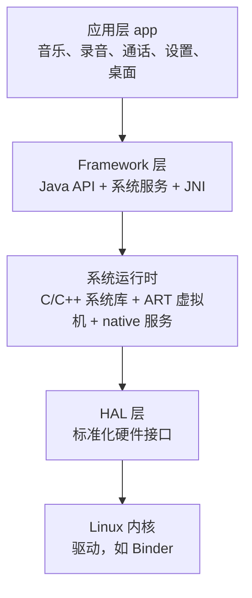

### 各层职责

应用层（app）：直接和用户交互，调用下层 API 实现业务功能。典型如音乐播放器、录音应用、通话、设置、桌面 Launcher。

Framework 层：封装系统能力，对上层提供 API 和服务，分为几个部分：

- Java API：组件（Activity/Service 等）、View、资源管理、通知等，是应用开发者直接接触的接口。
- 系统服务：核心服务运行在独立的 system_server 进程里，典型如 Activity 管理服务 AMS、窗口管理服务 WMS、包管理服务 PMS，通过 Binder IPC 暴露给上层调用。
- Native C++：一部分系统能力用 C++ 实现，通过 JNI 和 Java 层衔接。

系统运行时（runtime）：

- C/C++ 系统库：libc、媒体框架、音频框架的 native 部分等。
- ART 虚拟机：执行 Java 字节码。
- native 服务：独立进程的守护服务，如 servicemanager、audioserver 等。

HAL（硬件抽象层）：把千差万别的底层硬件统一成上层一致的访问方式，上层只面向标准接口，不需要关心具体芯片。音频 HAL 就属于这一层。

Linux 内核（kernel）：提供进程、内存、文件系统、驱动等基础能力。Android 特有的驱动里最典型的是 Binder IPC 驱动。

### 进程与服务的启动

Android 开机后，内核启动的第一个用户态进程是 init。它解析 init.rc 配置文件，拉起各个守护进程和系统服务。

- servicemanager：系统的服务登记中心，所有 Binder 服务在它这里注册，客户端通过名字找到服务。
- 各种 native 服务：按启动配置拉起，比如负责图形合成的 SurfaceFlinger、负责音频的 audioserver。
- Zygote：init 拉起的一个特殊进程，预加载框架类和资源。所有应用进程都由 Zygote fork 出来，所以 Zygote 是所有 App 进程的父进程。
- system_server：承载 AMS、WMS、PMS 这些核心 Java 系统服务的大进程。

### audioserver 与两大音频服务

音频的核心逻辑集中在一个进程里：audioserver，里面住着两个最重要的服务：

- AudioFlinger：音频引擎。负责与音频 HAL 交互，实现 PCM 数据的混音、输入输出、音量调节、采样率适配。所有音频数据的"搬运和混合"都是它干的。
- AudioPolicyService：音频策略。负责设备的切换策略、输入输出路由选择，决定"当前这段声音该走哪个设备"。它通过 AudioFlinger 的接口来实际执行设备切换。

早期这两个服务在 mediaserver 进程里，Android 8.0 起独立成 audioserver 进程。

上层应用通过 Binder 与它们通信，客户端拿到的是 IAudioFlinger、IAudioPolicyService 这样的 Binder 接口。AudioFlinger 和音频 HAL 在同一个进程内，通过 C++ 接口直接调用，不跨进程。这一点和相机等其它模块不同，也是理解整个音频链路的关键。

### 音频链路总览


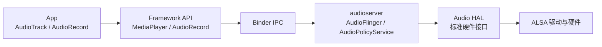

- 播放：App 用 AudioTrack 写 PCM，经 Binder 到 AudioFlinger，AudioFlinger 混音后经 HAL 输出到声卡。
- 录音：App 用 AudioRecord 读 PCM，AudioFlinger 从 HAL 读入，经录音线程送给客户端。

## 音频 I/O 接口

### 四个接口概览

应用层拿音频，主要面对四个接口：

- AudioTrack：播放 PCM。应用把 PCM 数据写进去，系统负责混音和输出。
- AudioRecord：录制 PCM。应用从里面读数据，系统负责从输入设备采集。
- MediaPlayer：播放封装好的媒体文件（内部解码加 AudioTrack）。
- MediaRecorder：录制并编码成文件（内部 AudioRecord 加编码器）。

| 接口 | 方向 | 处理 | 典型用途 |
|------|------|------|---------|
| AudioTrack | 输出 | 直接写 PCM | 低层播放 |
| AudioRecord | 输入 | 直接读 PCM | 低层录音 |
| MediaPlayer | 输出 | 解码 + 播放 | 音乐、视频伴音 |
| MediaRecorder | 输入 | 采集 + 编码 | 录像、录音 |

MediaPlayer/MediaRecorder 对开发者更友好，内部最终还是落到 AudioTrack/AudioRecord。

### AudioTrack

AudioTrack 是播放链路的起点：应用往里写 PCM，AudioFlinger 负责后续。

创建 AudioTrack 要指定一组参数：

- 采样率：写入数据的采样率。
- 格式（位深）：PCM 16-bit 等。
- 声道掩码：单声道、立体声等。
- 缓冲大小：系统建议值可以用 getMinBufferSize() 获取。
- 使用模式：static 还是 stream。
- 播放属性：内容类型、用途，决定后续的路由和策略。

创建后应用通过 write() 写数据。写满缓冲区时会阻塞，等系统消费后继续写，形成生产者消费者关系。

AudioTrack 的 native 侧通过 Binder 与 AudioFlinger 通信，在 AudioFlinger 里对应一个 Track 对象，由专门的播放线程消费。

### AudioRecord

AudioRecord 是录音链路的起点：应用从里面读 PCM。

创建参数和 AudioTrack 类似，多一个"音频源"：

- 采样率、格式、声道掩码、缓冲大小。
- 音频源（AudioSource）：指明采集场景，决定路由和信号处理。

应用通过 read() 读数据。读不到足够数据时会阻塞等待，直到系统采到新的 PCM。

AudioRecord 通过 Binder 与 AudioFlinger 通信，在 AudioFlinger 里对应一个 RecordTrack，由录音线程从输入设备读取数据后填充。

### AudioManager / AudioService / AudioSystem

音量、静音、模式这些"和音频设备状态相关"的操作，不直接调用 AudioFlinger，而是走一套 Java 侧的管理体系：

- AudioManager：应用看到的 Java API，提供音量调节、铃声模式、音频焦点等方法。
- AudioService：system_server 里的系统服务，实现 AudioManager 的各个操作，管理设备状态和策略协调。
- AudioSystem：Java 层到 native 的桥。AudioManager/AudioService 的请求经它通过 JNI 转到 native 侧，再和 AudioFlinger、AudioPolicyService 通信。


分工是：AudioManager 给应用用，AudioService 实现逻辑，AudioSystem 负责把请求送进 native 世界。

### 音频焦点 Audio Focus

音乐 App、导航播报、游戏音效可能同时都想播放，都要出声，但同一时间什么声音该响、什么声音该让位，需要一个协调机制，这就是音频焦点（Audio Focus）。

焦点是一个"请求 + 授予"的协商模型：应用播放前先向系统请求焦点，系统裁定是否授予；获焦的应用正常出声，其它应用收到焦点变化通知，自己决定暂停、停止还是降低音量。

#### 请求与释放

- requestAudioFocus()：申请焦点，携带 AudioAttributes 和焦点类型。
- abandonAudioFocus()：用完释放，让出焦点。

AudioAttributes 描述这段声音的用途（usage）和内容类型（contentType），比如音乐、导航、语音助手、铃音。usage 是系统判断"这个应用该不该抢焦点"的依据之一。

#### 焦点类型 durationHint

请求时用一个 durationHint 说明"这个焦点想持有多久、什么性质"：

| durationHint | 含义 |
|--------------|------|
| AUDIOFOCUS_GAIN | 长时间播放，独占焦点（音乐）|
| AUDIOFOCUS_GAIN_TRANSIENT | 短暂播放，临时持有（提示音、导航播报）|
| AUDIOFOCUS_GAIN_TRANSIENT_MAY_DUCK | 临时持有，但允许其他应用闪避而非暂停 |
| AUDIOFOCUS_GAIN_TRANSIENT_EXCLUSIVE | 临时且独占（语音助手、电话类）|

#### 请求结果与焦点变化

请求结果有三种：

| 结果 | 含义 |
|------|------|
| AUDIOFOCUS_REQUEST_GRANTED | 焦点授予 |
| AUDIOFOCUS_REQUEST_FAILED | 焦点授予失败 |
| AUDIOFOCUS_REQUEST_DELAYED | 焦点延迟授予（可能稍后授予）|

获焦后，系统会通过监听回调通知其它应用焦点变化：

| 变化 | 含义 | 应用应做 |
|------|------|---------|
| AUDIOFOCUS_LOSS | 永久失去焦点 | 停止播放并释放 |
| AUDIOFOCUS_LOSS_TRANSIENT | 暂时失去 | 暂停，恢复后继续 |
| AUDIOFOCUS_LOSS_TRANSIENT_CAN_DUCK | 可闪避 | 降低音量继续播放 |

#### 焦点栈

AudioService 内部维护一个焦点栈：新的焦点请求压栈，先持有焦点的应用被压下去、收到 LOSS。同一应用可以有多个播放器、多个焦点，栈按请求顺序组织。焦点栈的存在让"后到优先"的抢占规则得以实现。

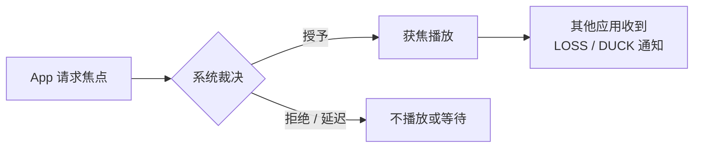

#### Ducking 闪避

闪避是"不打断对方、只把对方音量压低"的处理方式。获 GAIN_TRANSIENT_MAY_DUCK 的应用可以触发其它应用闪避，对方收到 CAN_DUCK 后把音量降到约定值继续播，播完再恢复。闪避最终作用在输出链路的音量（增益）上。

#### 焦点与路由

焦点和路由是两个独立又配合的机制：焦点决定"谁能出声"，策略路由决定"声音走哪个设备"。一个应用可能拿到了焦点、但当前路由让它走扬声器而不是耳机。排查"没有声音"时要分开看：是没拿到焦点，还是路由没选对设备。

#### 实现注意事项

- 请求和释放要成对，忘释放会让焦点一直被占。
- 收到 AUDIOFOCUS_LOSS 后要真正停止并释放，系统靠应用自觉和策略约束，不会强制掐掉声音。
- 恢复播放前重新请求焦点，而不是无条件恢复。

### 音频源 AudioSource

录音时，AudioRecord 要指定音频源（AudioSource），说明"这段声音是什么场景"，系统据此决定路由到哪个输入设备、做哪些信号处理。

| 音频源 | 用途与差异 |
|--------|-----------|
| DEFAULT | 默认，通常等同 MIC |
| MIC | 主麦克风，通用录音 |
| CAMCORDER | 相机录像，优先靠近相机的麦克风 |
| VOICE_RECOGNITION | 语音识别，处理链与普通麦克风不同 |
| VOICE_COMMUNICATION | 通话，启用回声消除、降噪等 |
| UNPROCESSED | 未经处理的原始采集 |
| REMOTE_SUBMIX | 采集系统混音输出，用于远程投递 |

同一个输入设备，不同音频源可能走不同处理：VOICE_COMMUNICATION 会开回声消除，UNPROCESSED 什么都不加。音频源是理解"录音走哪个设备、处理成什么样"的第一把钥匙。

### static 与 stream 模式

AudioTrack（AudioRecord 类似）的使用模式分两种，区别在数据怎么给：

- static 模式：一次性把全部 PCM 数据交给系统。适合按键音这类很短、可预知的音效，缓冲小、启动快、延迟低。
- stream 模式：数据持续写入或读出。适合音乐、语音这类长音频，数据量大，必须流式。

| 维度 | static | stream |
|------|--------|--------|
| 数据给法 | 一次性全部 | 持续写入/读取 |
| 适用 | 短音效 | 长音频 |
| 缓冲 | 小 | 大 |
| 延迟 | 低 | 常规 |

长音频几乎都用 stream 模式；static 只用于需要极低启动延迟的短音效场景。

## 设备、声卡与轨道

### 设备、输出流、线程与轨道

音频框架里从硬件到客户端有四个层级，方向从下往上：

- device（设备）：物理或逻辑的输入输出设备，比如麦克风、耳机、扬声器。
- output（输出流）：一组参数相同的设备集合，对应一个输出流。注意这里的 output 是"流"的概念，不是物理接口。
- thread（线程）：一个 output 对应一个播放线程或录音线程，负责这个流的数据搬运。
- track（轨道）：一个线程里挂着多个 track，每个 track 对应一个 AudioTrack（录音侧对应 RecordTrack）客户端。

关系是：一个 output 由多个 device 组成，一个线程服务一个 output，一个线程承载多个 track。

| 层级 | 说明 | 一对多关系 |
|------|------|-----------|
| device | 物理/逻辑输入输出设备 | 多个 device 组成一个 output |
| output | 一组相同参数的设备（流）| 一个 output 对应一个 thread |
| thread | 播放/录音线程 | 一个线程挂多个 track |
| track | 对应一个客户端 | 一个 track 服务一个 AudioTrack |

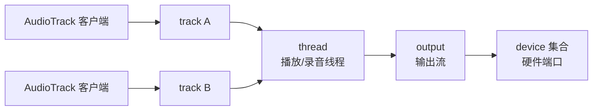

### module 与 profile

- module：硬件操作库，通过 hardware module 访问硬件（声卡）。系统里可以有多个 module，比如 primary（主音频）、r_submix（远程混合）等，每个 module 对应一套硬件接口。
- profile：描述一个输出或输入流的能力，比如支持哪些设备、采样率、声道、格式。AudioPolicy 用 profile 判断某个设备能不能满足某个请求。

这两个概念在策略配置文件（audio_policy_configuration.xml）里体现为 module、mixPort、devicePort 等元素。

### streamtype、strategy 与 policy

- streamtype（声音类型）：描述"这是哪类声音"，定义在 AudioSystem.java。常见的有 STREAM_VOICE_CALL（通话）、STREAM_SYSTEM（系统提示）、STREAM_RING（铃声）、STREAM_MUSIC（音乐）、STREAM_ALARM（闹钟）、STREAM_NOTIFICATION（通知）、STREAM_DTMF（按键音）等。
- strategy（路由策略）：把相似的 streamtype 归成一组，统一决定走哪个设备、音量怎么算。比如闹钟和电话各自有独立的策略，避免互相干扰。
- policy（策略规则）：描述 stream 之间的影响关系和设备选择规则，比如"来电话时压低音乐""闹钟音量独立于媒体音量"。

| 概念 | 作用 | 例子 |
|------|------|------|
| streamtype | 声音分类 | MUSIC / RING / ALARM / NOTIFICATION |
| strategy | 按场景分组路由 | 媒体策略、闹钟策略、电话策略 |
| policy | 流间影响与设备规则 | 电话打断音乐、闹钟最高优先 |

streamtype 定义声音类型，strategy 决定这类声音怎么路由，policy 规定流之间的优先级和相互影响。

### 四种逻辑输出流设备

输出侧按使用场景分了几种逻辑输出流，各自带一个输出标志（flag），硬件支持哪一种，系统启动时才会创建对应的线程：

- primary out：主输出流，用于铃声等基本输出，对应 AUDIO_OUTPUT_FLAG_PRIMARY。硬件必须支持，系统启动时就会创建对应的 MixerThread。
- low latency：低延迟输出流，用于按键音、游戏音这类对时延要求高的声音，对应 AUDIO_OUTPUT_FLAG_FAST。走 MixerThread（或更快的快速混音路径），缓冲浅、延迟低。
- deep buffer：深缓冲输出流，用于音乐这类对时延不敏感、但对功耗敏感的声音，对应 AUDIO_OUTPUT_FLAG_DEEP_BUFFER。缓冲深、省电。
- compress offload：硬解输出流，用于把压缩数据直接喂给硬件解码（DSP），对应 AUDIO_OUTPUT_FLAG_COMPRESS_OFFLOAD。走 OffloadThread，应用把 AAC/MP3 等编码数据直接交给硬件解码，绕开 PCM 混音。

| 输出流 | 标志 | 线程 | 用途 | 特点 |
|--------|------|------|------|------|
| primary | AUDIO_OUTPUT_FLAG_PRIMARY | MixerThread | 铃声、基础输出 | 必须支持，开机创建 |
| low latency | AUDIO_OUTPUT_FLAG_FAST | MixerThread/FastMixer | 按键音、游戏音 | 浅缓冲低延迟 |
| deep buffer | AUDIO_OUTPUT_FLAG_DEEP_BUFFER | MixerThread | 音乐 | 深缓冲省电 |
| compress offload | AUDIO_OUTPUT_FLAG_COMPRESS_OFFLOAD | OffloadThread | 硬解输出 | 直接喂压缩数据给 DSP |

理解这个分类，就理解了"同一台设备上不同声音走不同路径"的根源：系统按声音类型选择合适的输出流，在延迟和功耗之间取平衡。

## AudioFlinger

### AudioFlinger 的职责

AudioFlinger 是 Android 音频框架的引擎，运行在 audioserver 进程里。它的核心职责可以概括成一句话：管理所有音频数据的搬运、混合和格式转换。

具体包括：

- 管理音频模块和设备，与音频 HAL 交互，执行打开/关闭输入输出流。
- 管理播放线程和录音线程，每个输出流、输入流对应一个线程。
- 对多个 track 做混音（把多路 PCM 叠加成一路）。
- 应用音量、做采样率适配、格式和声道转换。
- 对外通过 IAudioFlinger 这个 Binder 接口提供能力。

上层所有 AudioTrack/AudioRecord 的请求，最终都汇到 AudioFlinger 这里。它的实现集中在 frameworks/av/services/audioflinger/ 下，入口类 AudioFlinger.cpp 按 Binder 接口逐方法实现，核心数据结构和线程在 Threads.h/Threads.cpp。

### 线程模型

AudioFlinger 里每种流都对应一个线程，按职责分两类：

播放侧：

- MixerThread：标准混音线程。多个播放 track 的 PCM 在这里混音后写入 HAL。primary、low latency、deep buffer 这些输出流都用它。
- DuplicatingThread：把一份音频复制到多个输出，典型场景是扬声器和蓝牙同时发声。
- OffloadThread：压缩 offload 输出流专用，把压缩数据直接交给硬件解码。
- FastMixer：低延迟路径的加速混音线程，周期更短、优先级更高。

录音侧：

- RecordThread：录音线程。周期性地从 HAL 输入流读 PCM，再分发给挂在它下面的多个 RecordTrack。
- FastCapture：录音侧的低延迟路径，对应播放侧的 FastMixer。

这些类在 android-14 的 Threads.h 里的继承关系是：MixerThread、DuplicatingThread 都继承 PlaybackThread，OffloadThread 又继承 DirectOutputThread，RecordThread 继承 ThreadBase；FastMixer 和 FastCapture 各自继承 FastThread。

```cpp
// frameworks/av/services/audioflinger/Threads.h（类声明节选）
class MixerThread : public PlaybackThread { ... };
class DirectOutputThread : public PlaybackThread { ... };
class OffloadThread : public DirectOutputThread { ... };
class DuplicatingThread : public MixerThread { ... };
class RecordThread : public ThreadBase { ... };
// frameworks/av/services/audioflinger/FastMixer.h / FastCapture.h
class FastMixer : public FastThread { ... };
class FastCapture : public FastThread { ... };
```

这些线程按需创建：硬件支持哪种输出流，AudioFlinger 启动或设备变化时就创建对应的线程。线程都以实时（RT）调度运行，保证音频数据不被普通进程抢占。

| 线程 | 方向 | 职责 |
|------|------|------|
| MixerThread | 播放 | 多 track 混音后写 HAL |
| DuplicatingThread | 播放 | 一份音频复制到多个输出 |
| OffloadThread | 播放 | 压缩数据直接交硬件解码 |
| FastMixer | 播放 | 低延迟加速混音 |
| RecordThread | 录音 | 读 HAL 输入流并分发 |
| FastCapture | 录音 | 低延迟录音路径 |

每个线程的运行主体是一个循环，叫 threadLoop。以 MixerThread 为例，循环里大致分三段：锁定状态下处理配置变更和收集可用的 track，然后混音，最后把混音结果写给 HAL。混音这一步的代码很精简，核心就是调用 AudioMixer：

```cpp
// frameworks/av/services/audioflinger/Threads.cpp —— MixerThread::threadLoop_mix()
void AudioFlinger::MixerThread::threadLoop_mix()
{
    // mix buffers...
    mAudioMixer->process();            // 让 AudioMixer 把当前所有 enabled track 混成一路
    mCurrentWriteLength = mSinkBufferSize;  // 一帧混音输出的大小
    mSleepTimeUs = 0;                  // 有数据可写，不睡
    mStandbyTimeNs = systemTime() + mStandbyDelayNs;  // 推迟 standby
}
```

"混音 + 写 HAL + 按节奏调度"就是播放线程的核心循环，混音本身的实现全在 AudioMixer 里。

### Track 与共享内存

客户端要播放，先创建 AudioTrack，经 Binder 让 AudioFlinger 在某个线程里创建一个 Track 对象。播放侧的轨道叫 Track，录音侧叫 RecordTrack。

关键设计是数据怎么从客户端进程搬到 AudioFlinger 进程。如果用 Binder 一包一包搬，会有复制和序列化开销。AudioFlinger 的做法是共享内存：

- 客户端创建 AudioTrack 时，通过 Binder 传一个共享内存文件描述符（fd），双方映射同一块内存。
- 这块内存做成环形缓冲。客户端 write() 把 PCM 写进共享内存，AudioFlinger 的 MixerThread 从同一块内存读。
- Binder 只负责传递控制信息和共享内存的描述，实际音频数据全程不复制。

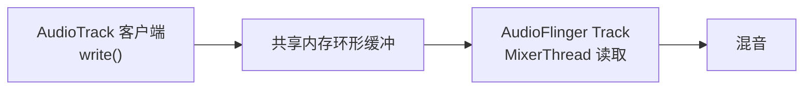

这就是"控制走 Binder、数据走共享内存"的跨进程模型：Binder 传指令和句柄，音频数据本身在共享内存里直接读写，避免每帧数据都做一次跨进程复制。Track/RecordTrack 就是各自共享内存缓冲在 AudioFlinger 侧的读写方。

从源码看，创建 Track 的入口是 AudioFlinger::createTrack（AudioFlinger.cpp）。它做了三件关键的事：校验调用方身份、通过 AudioSystem 找到该声音该走的输出流、在目标线程里创建 Track：

```cpp
// frameworks/av/services/audioflinger/AudioFlinger.cpp —— AudioFlinger::createTrack()（节选）
status_t AudioFlinger::createTrack(const media::CreateTrackRequest& _input,
                                   media::CreateTrackResponse& _output)
{
    sp<PlaybackThread::Track> track;
    ...
    // 1) 身份校验：拿调用方 uid/pid，防止应用冒充别的身份（权限边界在这里）
    const uid_t callingUid = IPCThreadState::self()->getCallingUid();
    ...
    // 2) 找输出流：按声音属性（attr/streamType）经策略路由拿到输出流句柄
    lStatus = AudioSystem::getOutputForAttr(&localAttr, &output.outputId, sessionId,
                                            &streamType, adjAttributionSource, &input.config,
                                            input.flags, &output.selectedDeviceId, &portId,
                                            &secondaryOutputs, &isSpatialized, &isBitPerfect);
    if (lStatus != NO_ERROR || output.outputId == AUDIO_IO_HANDLE_NONE) { ... }
    ...
    // 3) 在目标线程里创建 Track（内部上锁），返回 Binder 句柄 trackHandle
    track = thread->createTrack_l(client, streamType, localAttr, &output.sampleRate, ...);
    ...
    trackHandle = new TrackHandle(track);   // TrackHandle 是 IAudioTrack 的 Binder 实现
    ...
}
```

第 2 步的 getOutputForAttr 把"这段声音应该走哪个输出流"的决策交给了 AudioPolicy（路由），createTrack 只负责执行。第 3 步里 createTrack_l 真正 new 出 Track 对象，并把客户端传来的共享内存 fd 映射成 AudioFlinger 侧的读写缓冲，MixerThread 循环每次从这块缓冲 getNextBuffer() 取数据、recycleBuffer() 归还，完成生产者消费者对接。

### AudioMixer 混音

多个应用同时播放时，AudioFlinger 要把它们的 PCM 合成一路输出，这就是混音。混音在 AudioMixer 里完成。

每个 track 在混音前要经过一串处理，AudioMixer 把它们串成流水线：

- 音量：给每个 track 应用各自的增益。
- 采样率转换：track 的采样率和输出流不一致时重采样。
- 声道转换：单声道变立体声、立体声变 5.1 等。
- 格式转换：不同位深之间的转换。

处理完的每个 track 数据累加到一起，得到一路混音输出，再写入 HAL。

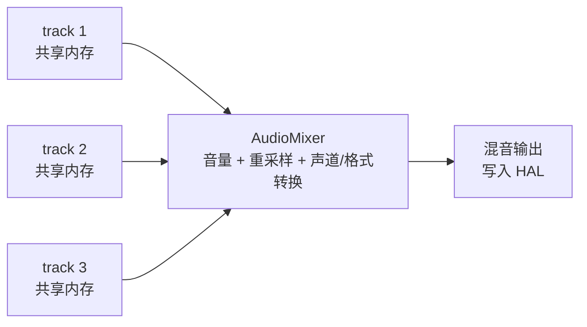

AudioMixer 在 android-14 里位于 frameworks/av/media/libaudioprocessing/（AudioMixer.cpp + AudioMixerBase.cpp）。它把"每个 track 该做什么处理"编译成一组处理钩子（hook），混音时按钩子批量执行，避免每帧都做条件判断。钩子选择在 AudioMixerBase::process__validate() 里：

```cpp
// frameworks/av/media/libaudioprocessing/AudioMixerBase.cpp —— 选择处理钩子（节选）
    // select the processing hooks
    mHook = &AudioMixerBase::process__nop;
    if (mEnabled.size() > 0) {
        if (resampling) {
            ...
            mHook = &AudioMixerBase::process__genericResampling;   // 有 track 需要重采样
        } else {
            mHook = &AudioMixerBase::process__genericNoResampling; // 都不需要重采样
            if (all16BitsStereoNoResample && !volumeRamp) {
                if (mEnabled.size() == 1) {
                    ...
                    // 只有一路 16bit 立体声、无音量渐变：走最省的单轨快速路径
                    mHook = getProcessHook(PROCESSTYPE_NORESAMPLEONETRACK, ...);
                }
            }
        }
    }
```

这里能看到 AudioMixer 的性能设计：处理路径不是"所有 track 一律走同一个复杂流程"，而是根据"要不要重采样、是不是 16bit 立体声、有没有音量渐变、有几步 track"挑选最合适的钩子。需求简单走最省的单轨快速路径，需要重采样才走通用重采样路径。这正是混音能同时满足低延迟和高吞吐的原因之一。

混音有一个天然问题：多路信号叠加后峰值会超过满幅。AudioFlinger 通过 headroom 设计（混音内部留增益余量）和控制音量来降低削波风险，必要时配合限幅保证不溢出。混音是全系统唯一把多路 PCM 相加的地方，它的数值精度和削波处理直接影响最终听感。

### 录音线程 RecordThread

录音侧的分发逻辑在 RecordThread：

- RecordThread 周期性地从 HAL 输入流 read() 一段 PCM。
- 数据先进入线程内部的环形缓冲。
- 再把数据复制到每个活跃的 RecordTrack 的共享内存，供客户端 read() 读取。

同一时刻可能有多个录音客户端（比如一个应用录麦克风、另一个录通话），它们共享同一个输入流，RecordThread 把同一份数据分发给多个 RecordTrack。

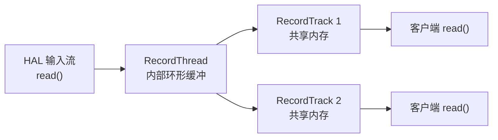

RecordThread 的循环主体在 Threads.cpp 的 RecordThread::threadLoop()。它先处理配置变更，再检查有没有活跃 track、需不需要休眠，然后从 HAL 读数据并分发：

```cpp
// frameworks/av/services/audioflinger/Threads.cpp —— RecordThread::threadLoop()（节选）
    for (int64_t loopCount = 0;; ++loopCount) {
        Vector< sp<RecordTrack> > activeTracks;
        {   // scope for mLock
            Mutex::Autolock _l(mLock);
            processConfigEvents_l();          // 处理配置变更（如开新输入流）
            if (exitPending()) break;         // 请求退出
            if (sleepUs > 0) {
                mWaitWorkCV.waitRelative(mLock, microseconds((nsecs_t)sleepUs)); // 无数据休眠
                sleepUs = 0;
                continue;
            }
            size_t size = mActiveTracks.size();
            if (size == 0) {                  // 没有活跃录音客户端
                standbyIfNotAlreadyInStandby();
                ...
            }
            // ... 收集 activeTracks、从 HAL 读一段、写入各 RecordTrack 的缓冲
        }
    }
```

每个 RecordTrack 可能请求不同的采样率、声道和格式。分发给 track 之前，RecordThread 按各 track 的请求做转换，这个格式转换工作由录音链路的格式转换器完成，把 HAL 输出统一处理成每个客户端要的样子。多路分发是录音和播放最明显的差别：播放是一对多混音，录音是一对多分发。

### FastMixer 与 FastCapture

普通 MixerThread 的混音周期由硬件缓冲大小决定，常见在十几毫秒量级，对低延迟场景（游戏音效、演奏类应用）偏大。

Fast 路径是低延迟的解决方案：

- FastMixer（播放侧）用独立的线程、更短的周期（可到几毫秒）、更高的调度优先级，把缓冲和排队延迟压到最低。
- FastCapture（录音侧）是录音的对应实现，同样走小缓冲、高优先级。
- 客户端要请求 AUDIO_OUTPUT_FLAG_FAST（或 AAudio 的低延迟模式），且硬件支持，才走 Fast 路径。

Fast 路径的代价是吞吐受限、能挂的 track 少，所以它只服务低延迟需求，普通播放仍然走 MixerThread。理解"普通路径与 Fast 路径并存"就理解了 AudioFlinger 在延迟和吞吐之间的取舍。

## Audio HAL

### HAL 的职责与位置

HAL（Hardware Abstraction Layer）是框架与硬件之间的标准接口层。音频 HAL 负责：

- 打开、关闭输入输出流。
- 读写 PCM 数据（播放写入、录音读取）。
- 设置和查询参数（采样率、声道、格式、增益）。
- 上报设备能力和设备枚举。

AudioFlinger 不直接碰驱动，所有硬件操作都通过 HAL 接口完成。音频 HAL 有一个重要特征：它和 AudioFlinger 在同一个进程（audioserver）里，通过 C++ 接口直接调用。这和相机等"独立进程 HAL"不同。

### 接口演进：legacy、HIDL、AIDL

音频 HAL 的接口形式经历了三代：

- legacy HAL：基于 libhardware，通过 hw_get_module 加载硬件模块 .so，用 audio_hw_device_t 这类 C 结构体定义接口。Android 8 之前的主流形式。
- HIDL HAL：Android 8 引入 Treble 架构，把硬件相关代码隔离到 vendor 分区，用 HIDL 描述接口，支持进程内（passthrough）和独立进程两种形态。音频 HAL 在 Android 8 到 12 主要用 HIDL。
- AIDL HAL：Android 13 引入 AIDL 音频 HAL（android.hardware.audio.core 等），14 起主推 AIDL 接口，HIDL 与 legacy 逐步退场。

| 代际 | 接口形式 | 载体 | 时代 |
|------|---------|------|------|
| legacy | C 结构体 | libhardware .so | Android 8 之前 |
| HIDL | HIDL 定义 | vendor 分区 | Android 8–12 |
| AIDL | AIDL 定义 | 系统服务 | Android 13 引入，14 主推 |

演进的主线是：把"直接内联的 .so"逐步改造成"接口边界明确、可独立更新、ABI 稳定"的模块化形态。对上层来说，AudioFlinger 看到的接口语义一直没变：打开流、读写数据、设参数。

### 核心接口：Device、StreamOut、StreamIn

音频 HAL 的接口分三个层次：

- Device（设备级）：代表整块硬件，负责打开输入输出流、设置全局参数、查询能力。
- StreamOut（输出流）：播放侧，负责 write() 写 PCM、pause 暂停、setVolume 调音量、getLatency 查延迟。
- StreamIn（输入流）：录音侧，负责 read() 读 PCM、设置输入增益、查询格式。

| 接口 | 方向 | 主要方法 |
|------|------|---------|
| Device | 管理 | openInputStream / openOutputStream、setParameters、getSupportedDevices |
| StreamOut | 播放 | write、pause、flush、setVolume、getLatency |
| StreamIn | 录音 | read、setGain、getInputFramesLost |

legacy 时代的 audio_hw_device_t、audio_stream_out_t、audio_stream_in_t 三个结构体，到 HIDL/AIDL 时代对应 IDevice、IStreamOut、IStreamIn 三个接口，职责一一对应，只是载体从结构体变成了接口。

在 android-14 的 AudioFlinger 侧，这三层接口被包装成 C++ 类。每个已加载的模块对应一个 AudioHwDevice 对象，它内部持有一个 DeviceHalInterface（HIDL/AIDL/legacy 的统一 C++ 抽象），打开输出流时返回 AudioStreamOut 包装：

```cpp
// frameworks/av/services/audioflinger/AudioHwDevice.h（节选）
class AudioHwDevice {
    ...
    // 一个音频模块对应一个 AudioHwDevice，内部封装 HAL 的 Device 级接口
    AudioHwDevice(audio_module_handle_t handle,
                  const char *moduleName,
                  const sp<DeviceHalInterface>& hwDevice,
                  Flags flags);
    ...
    sp<DeviceHalInterface> hwDevice() const { return mHwDevice; }

    // 打开一条输出流：返回包装好 StreamOutHalInterface 的 AudioStreamOut*
    status_t openOutputStream(
            AudioStreamOut **ppStreamOut,
            audio_io_handle_t handle,
            audio_devices_t deviceType,
            audio_output_flags_t flags,
            struct audio_config *config,
            const char *address);
    ...
private:
    ...
    sp<DeviceHalInterface>      mHwDevice;   // 指向 Device 级 HAL 接口
    ...
};
```

AudioStreamOut 是输出流的包装，它内部再持有一个 StreamOutHalInterface，客户端（MixerThread 写数据）调用的是 AudioStreamOut 的方法，方法内部转发给 HAL 接口：

```cpp
// frameworks/av/services/audioflinger/AudioStreamOut.h（节选）
class AudioStreamOut {
    ...
    sp<StreamOutHalInterface> stream;   // 指向 StreamOut 级 HAL 接口
    ...
    virtual ssize_t write(const void *buffer, size_t bytes);   // 播放写 PCM
    virtual status_t flush();                                   // 丢弃缓冲
    ...
};
```

录音侧的输入流用同样的模式，通过 Device 接口的 openInputStream 打开，返回的输入流对象内部持有 StreamInHalInterface。这一层包装的意义在于：不管底层 HAL 是 legacy、HIDL 还是 AIDL，AudioFlinger 内部统一通过 DeviceHalInterface、StreamOutHalInterface、StreamInHalInterface 这三个 C++ 接口操作，上层代码不感知具体载体。

### 进程内 HAL 与 vendor 跨进程 HAL

音频 HAL 有两种部署形态：

- 进程内 HAL：HAL 库加载进 audioserver 进程，AudioFlinger 直接函数调用。优点是延迟低、实现简单、能直接操作共享内存；代价是 HAL 崩溃会拖垮 audioserver。
- 独立进程 HAL（vendor 服务）：HAL 作为独立服务跑在 vendor 分区进程里，通过 hwbinder/binder 跨进程调用。隔离性好，但有额外 IPC 延迟。

音频默认走进程内 HAL，很多实现把两者结合：进程内做数据通路，vendor 侧做 DSP 之类的重活。

- DSP（Digital Signal Processor，数字信号处理器）是专门做数字信号处理的芯片。它和通用 CPU 的区别在于：CPU 擅长跑各种不同类型的任务，DSP 则针对"同一类运算反复执行"的场景优化，用并行的乘加单元、流水线结构把回声消除、降噪、均衡、音效、编解码这类计算密集且实时性要求高的运算跑得又快又省电。音频链路里的"重活"（回声消除、降噪、音效渲染、压缩码流硬解）通常交给 DSP，CPU 只做轻量的数据调度。对上层而言 DSP 的处理是透明的：应用读写 PCM，DSP 在内部完成加工，拿到手的就已经是处理过的声音。

云手机这类场景有一种特殊形态的"软件设备"：硬件侧不是真实声卡，而是进程内实现的一个虚拟输入流设备，数据源由上层软件提供（比如通过跨进程通道送进来的 PCM）。对 AudioFlinger 来说它看起来就是一块普通声卡，路由、音量、录音全部照常工作，只是数据的来源和去向由软件接管。这种"进程内软件设备"是让虚拟化音频对上层完全透明的关键手段。

从实现角度看，进程内软件设备就是直接实现上面三层 C++ 接口中的一类：一个类继承 DeviceHalInterface 提供设备级能力，再为输入流实现 StreamInHalInterface 的 read、standby、start、stop 等方法，把"读数据"的动作接到软件数据源上。AudioFlinger 通过 openInputStream 打开它时，拿到的就是一个行为正常的输入流，后续路由、分发的处理路径和真实硬件没有区别。区别只在数据的物理来源：真实声卡来自麦克风，软件设备来自上层注入的 PCM。

### loadHwModule 与策略配置文件

模块的加载由 AudioPolicy 发起：通过 loadHwModule 加载一个音频模块（legacy 走 hw_get_module 按名字找 .so，AIDL 走服务发现），加载成功后模块提供一组输出/输入流能力。

系统里有哪些模块、每个模块支持什么设备，都声明在策略配置文件 audio_policy_configuration.xml 里。文件的核心元素：

- module：一个音频模块，声明名字和 HAL 接口版本。
- mixPort：模块支持的输出/输入流，描述采样率、声道、格式等能力。
- devicePort：物理或逻辑设备（麦克风、耳机、扬声器，以及各种自定义设备）。
- route：把 devicePort 和 mixPort 连起来，声明哪些设备能接到哪些流上。
- attach：把能力 profile 挂到 devicePort 上。

```xml
<!-- 策略配置文件的结构示意（简化）：一个录音输入流的声明 -->
<audioPolicyConfiguration>
  <modules>
    <module name="primary" halVersion="2.0">
      <mixPorts>
        <!-- 录音输入流：数据从设备汇入 mixPort，所以 role 是 sink -->
        <mixPort name="primary input" role="sink">
          <!-- 采样率、声道、格式能力 -->
        </mixPort>
      </mixPorts>
      <devicePorts>
        <!-- 麦克风是数据来源，所以 role 是 source -->
        <devicePort type="AUDIO_DEVICE_IN_MIC" role="source" name="mic"/>
      </devicePorts>
      <routes>
        <route type="mix" sink="primary input" sources="mic"/>
      </routes>
    </module>
  </modules>
</audioPolicyConfiguration>
```

role 的语义是"数据往哪流"：录音输入流的 mixPort 接收设备数据，role 为 sink；设备提供数据，role 为 source。播放输出流则反过来，mixPort 是 source、设备是 sink。role 写反会导致策略解析时方向判断错误。

配置声明了"拓扑"，HAL 负责实现对应的行为，两者必须一致：配置文件里声明了某个输入设备，HAL 就要能在打开输入流时把它打开。

### 新增音频设备的一般流程

给系统加一个新的音频设备（尤其是软件设备），通常要动三处：

1. HAL 层：实现对应设备的能力，能在打开输入/输出流时返回真实的流对象。
2. 配置文件：在 audio_policy_configuration.xml 里声明设备、它的能力 profile，以及它和 mixPort 的连接。
3. 策略层：让策略能看到并路由这个设备，之后上层就能像用普通设备一样使用它。

三处缺一不可：只有 HAL 没有配置，策略不知道有这个设备；只有配置没有 HAL，打开流时会失败。这就是"声明 + 实现"的配对关系。音频设备对上层是透明的，注册好的软件设备和物理设备用起来没有区别。

## AudioPolicy

### AudioPolicy 的职责

AudioPolicy 由两部分组成：AudioPolicyService（策略服务，住在 audioserver 进程）和 AudioPolicyManager（策略实现）。

它回答的是"这段声音该走哪"的问题：

- 当前播放走哪个输出设备（扬声器、耳机、蓝牙）。
- 录音从哪个输入流采集（主麦克风，还是某个特定输入设备）。
- 不同声音类型之间的优先级和打断关系怎么处理。
- 音量策略怎么算。

和 AudioFlinger 的分工：策略决定"走哪"，引擎负责"怎么搬"。AudioFlinger 打开流、搬数据、混音；AudioPolicy 决定打开哪条流、往哪个设备走。

实现上，AudioPolicyManager 在 frameworks/av/services/audiopolicy/ 下：managerdefault 目录是默认策略实现（AudioPolicyManager.cpp），engine 目录是路由决策引擎（EngineInterface.h 定义接口，enginedefault 是默认实现）。策略层通过它们和 AudioFlinger 交互。

### 设备注册与探测

策略要能路由，首先得"知道"系统里有哪些设备。设备的来源有三条：

- 配置文件声明：audio_policy_configuration.xml 里声明的 devicePort 和它的能力 profile。
- HAL 能力探测：HAL 通过 get_supported_devices 这类接口上报自己支持的设备。
- 运行时状态：耳机插入、蓝牙连接、麦克风拔插等事件，会触发设备可用状态更新。

AudioPolicy 把这三类信息汇总，维护一张系统设备表。这张表是路由决策的输入：只有注册进表的设备，才可能被选为路由目标。

其中 HAL 探测这一步，在初始化时调用 HAL 的 getSupportedDevices 拿到设备类型集合，再映射成 DeviceDescriptor 填进设备表。探测到的设备集合决定了"这块硬件理论上能用哪些设备"，配置文件决定"系统打算声明哪些设备"，两者都要存在且一致。

### 设备枚举的三层注册

一个设备要被系统完整使用，要过三层：

| 层 | 做什么 | 缺了会怎样 |
|----|--------|-----------|
| 配置文件 | 声明设备与能力 profile | 策略不知道有这个设备 |
| HAL | 实现设备，能打开输入/输出流 | 打开流时失败 |
| AudioPolicy | 把设备注册进设备表 | 设备不可被路由 |

三层缺一不可，而且各自独立：

- 只声明、没实现：策略里能看到设备，但真去打开流会失败。
- 实现了、没声明：HAL 能力存在，但策略根本不知道，永远不会被路由。
- 声明了、实现了、没注册：设备在，但路由时选不到。

"声明不等于实现，实现不等于可用"，这是排查音频设备问题时的第一判断。

### 注册与路由

注册（registration）和路由（routing）是两个不同阶段，经常被混在一起：

- 注册：把设备加进系统设备表，让系统"知道有这个设备"。注册只决定"有没有"。
- 路由：在已注册的设备里，选择当前实际使用的那个。路由决定"用哪个"。

两者独立：

- 设备可以注册但当前不被路由。比如插着耳机，但当前播放策略决定走扬声器。
- 路由只能在已注册的设备里选，没注册的设备再合适也选不到。

实际排查时，"设备明明在列表里，但没有声音、没有录上"，往往不是设备没注册，而是路由没选到它，或者打开了但数据没走对。

### Engine 路由决策

路由的具体决策由 AudioPolicy 的 Engine（AudioPolicyEngine）完成：

- 输入：请求的声音类型/策略、当前可用设备、系统状态（来电、闹钟、屏幕状态）。
- 过程：按策略优先级评估候选设备，应用打断、压低等规则，选出最终设备。
- 输出：把决策结果交给 AudioPolicyManager 执行，通过 AudioFlinger 打开对应输出/输入流。

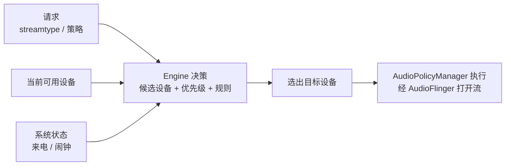

Engine 的接口在 frameworks/av/services/audiopolicy/engine/interface/EngineInterface.h 里定义，主要是几组按请求找设备的查询方法。路由时 AudioPolicyManager 调用这些方法，Engine 返回候选设备列表：

```cpp
// frameworks/av/services/audiopolicy/engine/interface/EngineInterface.h（节选）
class EngineInterface {
    ...
    // 按音频属性找输出设备（新式接口，属性匹配）
    virtual DeviceVector getOutputDevicesForAttributes(
            const android::audio_attributes_t &attr,
            const android::sp<android::AudioOutputDescriptor> &outputDesc,
            bool fromCache) = 0;
    // 按流类型找输出设备（旧式接口，stream type 匹配）
    virtual DeviceVector getOutputDevicesForStream(audio_stream_type_t stream,
            const android::sp<android::AudioOutputDescriptor> &outputDesc,
            bool fromCache) = 0;
    // 按录音属性找输入设备
    virtual sp<DeviceDescriptor> getInputDeviceForAttributes(
            const audio_attributes_t &attr,
            const android::AudioProductStrategy &productStrategy,
            const android::sp<android::AudioInputDescriptor> &inputDesc,
            bool fromCache) = 0;
    // 设备连接状态变化时通知 Engine（耳机插入、蓝牙连接等）
    virtual status_t setDeviceConnectionState(
            const android::sp<android::DeviceDescriptor> devDesc,
            audio_policy_dev_state_t state) = 0;
    ...
};
```

不同声音类型有不同的优先级：闹钟可以打断媒体，来电可以压低音乐。这些规则在 Engine 里落地，路由结果也会随设备插拔、模式切换动态改变。

### 采样率协商

客户端请求某个采样率，但实际设备支持的可能是另一个，两者怎么对齐，就是采样率协商。

协商涉及两个概念：

- config：请求配置，客户端或策略期望的采样率、声道、格式。
- halconfig：HAL 实际能力，设备真正支持并运行时采用的采样率等。

协商规则：打开流时，先按请求的 config 尝试；HAL 不支持时，AudioPolicy 在 HAL 支持的能力里挑一个最接近的（比如设备固定 48k，就按 48k 打开流），然后由 AudioFlinger 在链路里做采样率转换，把数据对齐成客户端要的格式。

从源码看，打开输入流的入口是 AudioPolicyManager::getInputForDevice（AudioPolicyManager.cpp）。它把请求的配置和 HAL 的实际能力一起带进协商，最终返回一个可用的输入流句柄和实际协商出的 config：

```cpp
// frameworks/av/services/audiopolicy/managerdefault/AudioPolicyManager.cpp（节选）
audio_io_handle_t AudioPolicyManager::getInputForDevice(
        const sp<DeviceDescriptor> &device,
        audio_session_t session,
        const audio_attributes_t &attributes,
        audio_config_base_t *config,          // 进：请求配置；出：协商后的实际配置
        audio_input_flags_t flags,
        const sp<AudioPolicyMix> &policyMix)
{
    audio_io_handle_t input = AUDIO_IO_HANDLE_NONE;
    ...
}
```

```text
打开输入流的协商过程：
  1. 按客户端请求的 config（如 16k）尝试打开。
  2. HAL 不支持，改按 HAL 能力 halconfig（如 48k）打开。
  3. AudioFlinger 在链路里重采样，把 48k 对齐成客户端要的 16k。
```

这条机制解释了为什么客户端请求的采样率可以不等于设备实际运行的采样率：中间由重采样补齐。云手机这类场景，输入设备常常固定 48k，客户端要 16k、44.1k 都行，HAL 层保持 48k，转换交给 AudioFlinger。协商发生在打开流的那一刻，改错层（只改客户端请求、或只改 HAL 能力）对不齐，就会出现录制失真、时长异常或无声。

## AudioRecord 录制链路

### 全链路总览

一条完整的录音链路，从应用读到数据，到硬件采到声音，中间要过好几个环节。以"虚拟输入设备"这类场景为例，整条链是：

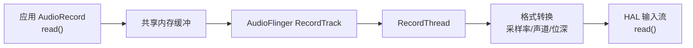

数据方向是从下往上：HAL 采到的 PCM，经 RecordThread 和格式转换，放进共享内存，最后被应用的 read() 取走。这里每一段的"采样率"含义都不同，正是本章要讲清楚的重点。

### 第一段：客户端到 RecordTrack

应用的 AudioRecord 只是入口。它背后的 native 侧通过 Binder 与 AudioFlinger 通信，在 AudioFlinger 里创建一个 RecordTrack。

- 控制走 Binder：创建、start、stop、设置参数。
- 数据走共享内存：RecordTrack 对应一块共享内存缓冲，RecordThread 往里写，客户端 read() 从里面读。

客户端 read() 读不到数据时会阻塞等待。这段是生产者消费者关系：系统采到数据写进共享内存，客户端消费走。

### 第二段：RecordThread 到 HAL

数据源在 HAL 输入流。RecordThread 周期性地调用 HAL 的 read()，拿到一段 PCM：

- 数据先进 RecordThread 内部的环形缓冲。
- 再按各 RecordTrack 的需求分发：同一份数据可以分给多个录音客户端，每个客户端拿到自己那份。
- 分发之前按每个 RecordTrack 请求的格式做转换，这一步的采样率转换由录音链路的格式转换器完成。

关键点：HAL read() 返回的数据，用的是 HAL 实际运行时的格式（协商出的 halconfig），不一定等于客户端请求的格式。两者之间的差异，就是分发转换要补的。

分发这一段在源码里是 RecordThread::threadLoop() 的循环体（Threads.cpp）。它对每个活跃的 RecordTrack 单独处理：先按重采样比例限制本次输出的帧数，再决定走直通还是走格式转换：

```cpp
// frameworks/av/services/audioflinger/Threads.cpp —— RecordThread::threadLoop() 分发段（节选）
// 限制 framesOut：不能超过按重采样比例从 framesIn 能得到的最大帧数，
// 避免 RecordBufferConverter 内部缓冲频繁伸缩
framesOut = min(framesOut,
        destinationFramesPossible(
                framesIn, mSampleRate, activeTrack->mSampleRate));

if (activeTrack->isDirect()) {
    // 直通流：不使用 RecordBufferConverter，直接从 RecordThread 缓冲拷到 RecordTrack 缓冲
    AudioBufferProvider::Buffer buffer;
    buffer.frameCount = framesOut;
    const status_t getNextBufferStatus =
            activeTrack->mResamplerBufferProvider->getNextBuffer(&buffer);
    ...
    memcpy(activeTrack->mSink.raw, buffer.raw, buffer.frameCount * mFrameSize);
    activeTrack->mResamplerBufferProvider->releaseBuffer(&buffer);
    ...
} else {
    // 常规流：用 RecordBufferConverter 把 HAL 格式转成该 track 请求的格式
    framesOut = activeTrack->mRecordBufferConverter->convert(
            activeTrack->mSink.raw,
            activeTrack->mResamplerBufferProvider,
            framesOut);
}
```

这段代码里能看到两个设计：一是"直通优先"，请求格式恰好等于 HAL 格式（或直通流）时不做无谓转换，直接拷贝；二是"每个 track 一个转换器"，同一份 HAL 数据按各 RecordTrack 的需求各自转换，互不干扰。mResamplerBufferProvider 在这里是"从 RecordThread 读源数据"的角色，convert 的源数据就来自它。

### 采样率转换与归一化

"输入固定一个采样率，出口按客户端适配"是录音链路的常见设计。虚拟输入设备这类场景，数据不是真实麦克风采的，而是由软件注入，注入的原始数据采样率可能五花八门。为了不让 HAL 层跟着变，常见做法是归一化：

- 注入侧归一化：外部送进来的音频（可能是 16k、44.1k），先统一转成设备固定的采样率（比如 48k），保证 HAL 输入流里的数据是稳定一致的。
- 出口侧适配：分发时，用格式转换器把 48k 转成每个客户端请求的采样率、声道、位深。

```text
注入侧：外部音频（16k / 44.1k）先归一化到 48k，作为 HAL 输入流的数据
出口侧：HAL 输入流的 48k 数据，再分发适配成客户端请求的采样率（如 16k）
```

两处重采样都复用系统重采样器（AudioResampler），质量和行为一致。归一化只在注入数据不是 48k 时才发生；如果本来就是 48k，直接透传，避免不必要的损耗。

这个"格式转换器"在 android-14 源码里就是 RecordBufferConverter（frameworks/av/media/libaudioprocessing/RecordBufferConverter.cpp）。它的构造参数明确写了"从什么格式转到什么格式"，内部按需创建重采样器（AudioResampler）和声道/位深转换器，convert() 一次完成全部转换：

```c
// frameworks/av/media/libaudioprocessing/RecordBufferConverter.cpp（节选）
// 构造：6 个参数 = 源(声道, 格式, 采样率) + 目标(声道, 格式, 采样率)
RecordBufferConverter(audio_channel_mask_t srcChannelMask,
        audio_format_t srcFormat, uint32_t srcSampleRate,
        audio_channel_mask_t dstChannelMask,
        audio_format_t dstFormat, uint32_t dstSampleRate);
...
// 采样率转换部分复用 AudioResampler
#include <media/AudioResampler.h>
...
mResampler->resample((int32_t*)mBuf, frames, provider);
```

注入侧归一化和出口侧适配都走这个转换器，只是参数不同。转换器内部复用系统重采样器 AudioResampler 这套实现：源采样率和目标采样率相等时，直接透传，不触发重采样，避免无谓损耗。

```c
// 出口侧格式转换器使用示意（伪代码）
// 目标：把 HAL 的 48k 单声道转成客户端请求的 16k 单声道
RecordBufferConverter conv(
        /*src*/ mono, AUDIO_FORMAT_PCM_16_BIT, 48000,
        /*dst*/ mono, AUDIO_FORMAT_PCM_16_BIT, 16000);
conv.convert(dstBuffer, srcBuffer, frameCount);
```

### 采样率协商全链路

把协商和转换串起来，一条完整的采样率链路是这样的：

1. 客户端创建 AudioRecord，请求某个采样率（比如 16k）。
2. AudioPolicy 打开输入流时协商：HAL 能力不支持 16k，改按 48k 打开输入流（halconfig）。
3. RecordThread 从 HAL 按 48k 读数据。
4. 分发时用格式转换器把 48k 转成客户端请求的 16k，放进共享内存。
5. 客户端 read() 拿到的是转换后的 16k 数据。

这条链路上有三个不同的"采样率"：

| 采样率 | 含义 | 谁在用 |
|--------|------|--------|
| 请求采样率 | 客户端期望的采样率 | 应用侧 |
| 采集采样率 | HAL 实际运行的采样率（halconfig）| HAL / RecordThread |
| 交付采样率 | 交给客户端的采样率 | 客户端 |

对客户端而言，它永远只关心请求采样率：看到的数据是按请求采样率交付的，节奏和时间都正确。采集侧跑什么采样率，是系统内部的事，由协商和转换共同保证两边对齐。

### 问题排查

录音出问题（失真、时长错、无声、音调不对）时，最常见的原因是采样率链路某一段对不齐

典型误区：

- 只改客户端请求采样率：如果 HAL 能力不支持，协商兜底又拉回 48k，客户端请求形同虚设，问题依旧。
- 只改 HAL 能力/采集采样率：客户端请求没变，分发转换也没跟着变，客户端按旧参数解释新数据，时长和音调全错。
- 改了采集采样率、没改分发转换：两处采样率失配，转换器按错误比例重采样，数据整体失真。

正确做法是先把三层采样率各自确认一遍：

1. 确认 HAL 输入流实际运行采样率（halconfig）。
2. 确认协商结果：客户端请求与最终采集采样率的关系。
3. 确认分发转换参数：转换目标是否等于客户端请求。
4. 对照客户端请求，找出是"协商没对上"还是"转换没对上"。

"采样率只改一层、其它层没跟上"是所有采样率类问题的共同根因。改的时候要三层一起看，而不是只动眼前那一层。

## MediaRecorder 录制链

### 从 MediaRecorder 到 MediaCodecSource

MediaRecorder 是应用层录制的入口，它背后是一条"采集 + 编码 + 封装"的链。

- MediaRecorder（Java）经 JNI 到 native 的 MediaRecorder，再落到 StagefrightRecorder。
- StagefrightRecorder 负责把应用设置的参数（音频源、编码器、输出格式、输出路径）解析成实际的采集和编码配置。
- 采集用 AudioSource（内部封装 AudioRecord 读 PCM）。
- 编码用 MediaCodecSource（驱动 MediaCodec 硬编或软编）。
- 封装用 MPEG4Writer（把编码帧写成 MP4/3GP 文件）。

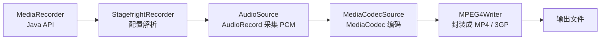

### 三件套：AudioSource / MediaCodecSource / MPEG4Writer

- AudioSource：从 AudioRecord 读 PCM，把原始音频流送给编码器。它负责按采集节奏提供数据，并给每段数据标上采集时间。
- MediaCodecSource：驱动 MediaCodec 执行编码，管理编码后的 buffer 和时间戳。应用设置的编码器（AAC、AMR-NB 等）、采样率、码率在这里生效。
- MPEG4Writer：把编码帧封装成容器文件。负责写 track 元数据（编码格式、采样率、声道、时长）、按时间戳排布音视频帧、在文件结尾写索引。

关系是：AudioSource 供数据，MediaCodecSource 出编码帧，MPEG4Writer 成文件。编码器输出的是编码帧（如 AAC 帧），不是 PCM，MPEG4Writer 拿到的是带时间戳的编码 buffer。

这三个类的实现都在 frameworks/av/media/ 下：AudioSource 在 media/libstagefright/AudioSource.cpp，StagefrightRecorder 在 media/libmediaplayerservice/StagefrightRecorder.cpp，MPEG4Writer 在 media/libstagefright/MPEG4Writer.cpp。整条录制链的起点是 StagefrightRecorder，它把应用参数解析成对这三个类的装配。

### 时间戳与音画同步

视频文件要音画同步，基础是每个编码 buffer 都带时间戳（PTS，Presentation Time Stamp）。

- 音轨的 PTS 来自采集时刻：AudioSource 按 AudioRecord 的帧计数或系统时钟标出"这段声音是什么时候采的"。
- 视频轨的 PTS 来自相机/编码器自己的时间轴。
- MPEG4Writer 按 PTS 把两轨的帧排到同一个时间轴，播放器按 PTS 决定什么时候播哪一帧。

音画同步出问题，多数是 PTS 基准不统一：音轨的起点和视频轨的起点不在同一个"0"，两轨各自从自己的原点开始，封出来后整体偏移。处理方法是把某一轨的 PTS 整体平移，对齐到同一个时间基准，这个平移量就是 timebase offset。

timebase offset 在 android-14 的 AudioSource 里是源码里真实存在的机制（AudioSource.cpp）。第一个 buffer 到达时，AudioSource 把请求的启动时刻对齐到 AudioRecord 实际的采集起点，mStartTimeUs 就从"请求起点"被改写成"真实起点"：

```cpp
// frameworks/av/media/libstagefright/AudioSource.cpp —— 第一个 buffer 对齐时间基准（节选）
if (mNumFramesReceived == 0 && mPrevSampleTimeUs == 0) {
    mInitialReadTimeUs = timeUs;
    // 时间基准平移：把 mStartTimeUs 从"请求的起点"改成"实际开始采到的时刻"
    if (mStartTimeUs > 0) {
        mStartTimeUs = timeUs - mStartTimeUs;
    }
    mPrevSampleTimeUs = mStartTimeUs;
}
...
// 之后每个 buffer 的 PTS 按"已采集帧数 / 采样率"推进，
// 用真实采集帧数算，而不是用系统时钟，保证和实际声音严格同步
const int64_t timestampUs =
            mStartTimeUs +
                ((1000000LL * mNumFramesReceived) +
                    (mSampleRate >> 1)) / mSampleRate;
```

这个机制说明两点：音频轨的 PTS 是从 AudioSource 拿到数据那一刻按帧数算出来的，基准是 mStartTimeUs；它天然以采集帧为时钟，帧数和采样率决定了 PTS 的推进速度。视频轨则来自相机/编码器自己的时间轴，两轨基准如果不一致，就要在封装侧用同样的平移思想做对齐。

```text
音频轨 PTS 从 300ms 起，视频轨从 0 起
处理：把音轨 PTS 整体减 300ms，两轨基准对齐
```

### 编码默认值与采样率兼容

录制时如果调用方没显式指定音频编码器（传 AUDIO_ENCODER_DEFAULT），录制框架会把音频编码默认设为 AMR-NB（窄带语音编码，固定 8k）。在 android-14 的 StagefrightRecorder 里，这个默认值并不区分容器，MP4 和 3GP 落到同一套默认逻辑上。

这段逻辑在 StagefrightRecorder::setAudioEncoder（StagefrightRecorder.cpp）里：

```cpp
// frameworks/av/media/libmediaplayerservice/StagefrightRecorder.cpp —— setAudioEncoder()（节选）
if (ae < AUDIO_ENCODER_DEFAULT || ae >= AUDIO_ENCODER_LIST_END) {
    ALOGE("Invalid audio encoder: %d", ae);
    return BAD_VALUE;
}

if (ae == AUDIO_ENCODER_DEFAULT) {
    mAudioEncoder = AUDIO_ENCODER_AMR_NB;   // 默认 AMR-NB，不区分容器
} else {
    mAudioEncoder = ae;
}
return OK;
```

AMR-NB 配 3GP 容器是历史组合，还算合理；但配 MP4 容器就有问题：AMR-NB 只支持 8k，遇到 48k 的宽频输入就出现采样率不匹配：

- 编码前必须把 48k 降采样到 8k，或者编码器/容器按 8k 元数据解释 48k 数据，时长和音轨分离都会出错。
- 结果常见为：文件时长错、播放器分离不出音轨、无声。

所以面向 MP4 时不能依赖默认值，要显式指定 AAC（支持宽频，48k 直接可用）。只有明确做电话级语音时才用 AMR-NB，并保证输入先降到 8k。编码器、采样率、容器三者对齐，录制环节才不容易出问题。

### PTS 保护

MPEG4Writer 写文件时，对 PTS 的要求很严格。PTS 乱、为负、跳变、倒退，都会写出时长错误或音画错位的文件。

常见问题：

- 音轨 PTS 起点不为 0，或与视频轨基准不统一。
- 采集线程和编码线程各自计时，编码后 buffer 的 PTS 和真实采集时刻有偏移。
- 采样率标错，PTS 推进速度跟着错，表现为文件时长和实际录制时长不符。

保护手段：

- 统一 PTS 基准：所有轨都从 0 或同一个起点开始，需要时用 timebase offset 平移。
- 用真实采集时刻（音频按采集帧时间）作为 PTS，而不是编码器或写入侧自己的时钟。
- 对 PTS 做单调性检查：发现倒退或跳变时修正，避免把脏时间戳写进文件。

排查"播放器显示时长不对、音画不同步、seek 错位"，优先查 PTS 链路：起点是否统一、推进是否按真实采集节奏、是否被哪一层改过。

### 完整录制链小结

把整条链合起来：

1. 应用设置输出格式、音频源、编码器，调用 start。
2. AudioSource 从 AudioRecord 读 PCM，按采集节奏标时间戳。
3. MediaCodecSource 把 PCM 编成编码帧，带上 PTS。
4. MPEG4Writer 按 PTS 封装成 MP4/3GP 文件。

和纯 AudioRecord 录音链的区别在于多了"编码 + 封装"两层：纯 AudioRecord 只拿 PCM，MediaRecorder 还要把 PCM 变成文件。录制的时序基准是采集时刻，文件里音画的先后关系由 PTS 决定，和"什么时候写文件"无关。

## IPC 与跨进程

### 为什么需要跨进程

Android 里进程是隔离的：每个应用、每个系统服务都在独立进程里，各自有独立的内存空间，不能直接访问对方的内存。但音频链路天然跨进程：应用进程要和 audioserver 通信，虚拟设备的数据源和音频框架也不在一个进程。跨进程通信（IPC）因此是音频框架绕不开的话题。

常见的 IPC 方式有几种：Binder、Unix domain socket、共享内存、管道、信号。音频链路里真正常用的是前三者。

### Binder

Binder 是 Android 特有的 IPC，内核里有专门的 Binder 驱动。它的特点：

- 一次复制：通过 mmap 把接收方内存映射进内核，数据从发送方到接收方只复制一次。
- 对象引用：可以跨进程传递 Binder 对象句柄，像本地对象一样调用。
- 鉴权：能拿到调用方的 uid/pid，做权限校验。
- 服务注册与发现：servicemanager 统一管理服务，客户端按名字找到服务。

Binder 适合"控制类"通信：创建、启动、停止、设置参数这类方法调用，消息小、频率中、语义清晰。音频框架里，应用和 AudioFlinger/AudioPolicyService 之间的控制全部走 Binder。

鉴权不是抽象概念，音频框架里是真实落地在每次调用上的。AudioFlinger 的 Binder 入口（比如创建播放 track 的 createTrack）会取调用方的 uid/pid 做校验，防止应用冒充别的身份：

```cpp
// frameworks/av/services/audioflinger/AudioFlinger.cpp —— Binder 鉴权（节选）
#include <binder/IPCThreadState.h>
...
// createTrack() 创建播放 track 时，取调用方 uid/pid 做身份校验
const uid_t callingUid = IPCThreadState::self()->getCallingUid();
const pid_t callingPid = IPCThreadState::self()->getCallingPid();
```

每次 Binder 调用，内核都会在事务里带上调用方进程的 uid/pid，服务端用 IPCThreadState::self()->getCallingUid()/getCallingPid() 取出来做校验。这是 Android IPC 的固有机制，音频框架直接受益：任何应用想通过 Binder 操作音频服务，先过身份这一关。

Binder 不太适合大数据流：虽然本身一次复制，但每次调用都有事务开销，逐帧搬数据不划算。

### Unix domain socket

Unix domain socket（Android 里叫 LocalSocket）是本机进程间的 socket，走内核 socket 机制，不经过网络协议栈。

特点：

- 字节流语义，实现简单，读写像文件一样。
- 可以传文件描述符（SCM_RIGHTS），把一块共享内存或另一个 socket 递给对方。
- 有内置缓冲区，生产快消费慢时会阻塞或丢数据，天然带流控。

音频场景里，虚拟设备的数据源和音频框架之间传 PCM，常用 Unix domain socket：数据量不大、流式、字节流语义刚好合适。

### 共享内存

共享内存是把同一块物理内存映射到多个进程，双方直接读写，零复制、延迟最低、吞吐最大。Android 里常见的两种：

- ashmem（Android Shared Memory）：Android 自带的匿名共享内存，AudioTrack/AudioRecord 客户端和 AudioFlinger 之间的数据缓冲就是用它。
- /dev/shm（POSIX 共享内存）：标准 POSIX shm，Linux 通用。

共享内存的代价是要自己管理同步：谁写谁读、什么时候写、写多少，都要靠环形缓冲、锁或序列号来协调，复杂度比 socket 高。

音频的共享内存不只有数据，还带一个控制块。在 android-14 的 TrackBase 里，轨道同时持有两块共享内存：一块是数据缓冲，一块是控制块（audio_track_cblk_t），读写位置、可用帧数、状态都放在控制块里：

```cpp
// frameworks/av/services/audioflinger/TrackBase.h —— 轨道共享内存结构（节选）
class TrackBase : public ExtendedAudioBufferProvider, public RefBase {
    ...
    sp<IMemory> getCblk() const { return mCblkMemory; }     // 控制块 audio_track_cblk_t
    audio_track_cblk_t* cblk() const { return mCblk; }
    sp<IMemory> getBuffers() const { return mBufferMemory; } // 数据缓冲
    ...
    // 从共享内存数据缓冲取一帧数据（AudioBufferProvider 接口）
    virtual status_t getNextBuffer(AudioBufferProvider::Buffer* buffer) = 0;
    virtual void releaseBuffer(AudioBufferProvider::Buffer* buffer);
    ...
};
```

控制块和数据缓冲都在共享内存里，所以客户端写、服务端读之间不用每次同步都走 Binder：写多少、写到哪、读到哪，双方直接读写这块结构体，靠原子操作协调。这就是音频跨进程"数据零复制 + 同步不走 Binder"的具体形态。创建录音轨道时，AudioFlinger 把控制块的引用回传给客户端（createRecordTrack 返回里带 cblk），客户端就通过它和服务端共享读写状态；播放轨道的控制块同理，也由双方共享。

### 选型规律：小流量 vs 大流量

跨进程传数据，先看数据量级，再选工具：

- 音频小流量：48k/16bit/mono 约 96KB/s。量不大，用 Unix domain socket 就够，简单、可靠、自带流控。
- 视频/大数据流量：MB/s 级以上。socket 的逐包复制和内核往返开销变大，必须用共享内存，零拷贝、高吞吐。

| 方式 | 特点 | 适合 |
|------|------|------|
| Binder | 一次复制、带鉴权、方法调用语义 | 控制消息、小数据 |
| Unix domain socket | 字节流、可传 fd、自带流控 | 中等数据流（音频 PCM）|
| 共享内存 | 零拷贝、低延迟高吞吐、需自管同步 | 大数据流（视频、高频缓冲）|

实际系统常是混合使用：

- 控制走 Binder：创建、启停、参数。
- 数据走共享内存：AudioTrack/AudioRecord 与 AudioFlinger 之间的缓冲。
- 中等数据走 socket：虚拟设备与数据源之间的 PCM 流。

选型判据是三个：数据量、频率、延迟要求。量小选 socket，量大选共享内存，控制消息走 Binder。

### 跨进程传输音频的要点

用 socket 或共享内存传 PCM，有几个约定必须提前定好，否则数据对不齐：

- 包格式：字节序统一、每一包要能自描述（采样率、声道、位深、负载长度），最好带帧头。裸 PCM 自身不带参数，接收方无法判断这一包该怎么解释。
- 流控：socket 缓冲满、共享内存环形缓冲写满时，要阻塞或丢包策略，接收端要及时消费，否则积压会变成延迟。
- 时序：网络或跨进程传输会引入乱序、抖动和时钟差异，接收端要做排序、抖动缓冲和时钟补偿。

这三条贯穿了音频从基础到框架再到传输的全过程：先懂声音怎么变成 PCM，再懂 PCM 怎么在框架里搬运混合，最后懂 PCM 怎么跨进程传输。整条链路串起来，就是从"声音数字化"到"音频框架开发"的完整认知。
