# 写在前面

这篇文章写给没接触过 CI/CD 、在 GitHub Pages 的自动部署和平常的代码编写中踩过不少坑的自己，为了理清 CI/CD 的来龙去脉：你大概写过代码、用过 Git，但还没认真想过"代码写完以后是怎么跑到线上的"这个问题。读完这篇文章，你会知道 CI/CD 是什么、解决什么问题、业界积累了什么经验，以及 GitHub Actions 这套工具具体怎么用。

文章前半部分是概念和原则，后半部分是 GitHub Actions 的具体语法、运行机制和完整案例。案例部分会拆解本站（Hexo 博客）实际在用的发布流水线

# 阅读路线

- CI/CD 是什么：从软件交付的原始形态讲起，把构建、测试、版本控制、部署这四个前置概念逐个讲清楚，再给出持续集成和持续交付/部署的定义。完全没基础的人从这里开始。
- CI/CD 最佳实践：提交与分支、管道设计、构建与测试、部署、安全，最后是反模式清单。有 CI/CD 概念基础、想了解业界通用做法的人可以直接跳到这一部分。
- GitHub Actions 基础：Workflow、Job、Step、Action、Runner、Event 六个核心概念，workflow 文件怎么写，触发器、矩阵、上下文、权限。
- GitHub Actions 的运行机制：一个 workflow 从触发到完成的完整生命周期，托管 runner 和自建 runner 的区别，依赖关系、服务容器、缓存。
- 真实案例：拆解本站的 pages.yml，再给出测试、发布、自建 runner 三个完整 workflow 示例，最后讲调试和优化。

后半部分依赖前半部分的概念，建议按顺序读。前置概念章节之间没有强依赖，哪一块不熟悉可以先看哪一块。


# CI/CD 基础概念

## 软件交付的原始形态：手动构建、手动测试、手动部署的痛点

讲 CI/CD 之前，先看没有 CI/CD 的时候软件是怎么交付的。

### 一次典型的手动发布

假设你是一个小团队的成员，团队用一个内部系统，代码放在 Git 仓库里。一次发版大概是这样：

1. 功能开发完，合并到主干分支。合并之前，负责合并的人要自己把代码拉下来，在本地跑一遍，确认能编译、主要功能正常。
2. 发布当天（很多团队有固定的"发布日" deadline），负责发布的人从主干拉最新代码，在自己机器上执行构建命令，生成产物。
3. 构建产物拷贝到服务器。早期没有配置管理工具，这一步常见做法是用压缩包打包，然后手动上传，或者干脆通过共享目录拷贝。
4. 停掉线上服务，替换文件，再启动服务。如果构建和线上环境不一致，可能启动就报错。
5. 人工验证。登录服务器看日志，或者打开页面点一遍核心流程。
6. 出问题了就回滚。回滚通常意味着把旧版本文件再拷贝回去，重启服务。

这个过程有几个特点。每一步都需要人操作，而且操作的人往往是同一个人，既是开发者又是发布者。步骤之间是串行的，发布日当天大家都在等。整个过程没有自动化记录，出了问题只能靠人回忆"刚才我做了什么"。

这套流程在团队小、发布频率低（一个月一次甚至更久）的时候勉强能转。一旦发布频率上来，问题就集中爆发。

### 手动流程慢在哪里

慢的来源主要有三处。

第一是等待。构建在个人机器上跑，跑的时候机器被占用，开发者没法干别的活；构建结果要等测试的人确认，确认要等人有空；发布日要等所有功能合并完才能开始，任何一个功能延期，整个发布跟着延期。这些等待叠加起来，一次发布的周期往往以天计算，而实际的工作量可能只有几小时。

第二是交接。开发、测试、发布是三个环节，每个环节之间都有一层信息传递：改了哪些东西、依赖怎么装、配置文件怎么改、数据库有没有变更。这些信息通常存在人脑子里或者聊天记录里，交接一次，丢失和走样的概率就增加一次。

第三是返工。手动步骤多，每步都可能出错，出错就得重来。编译失败重编译，拷贝漏文件重新拷贝，配置写错重新配。每一步返工都要重新消耗一次等待时间。

### 手动流程错在哪里

比慢更严重的是错。手动操作是人做的，人就会犯错，而且有些错误在发布当下根本发现不了。

环境不一致是最常见的一类。开发者在自己机器上构建，机器上装了什么依赖、什么版本，和服务器上并不一样。常见的现象是"我本地好好的，一上线就崩"，最后查到是本地和服务器上的某个依赖版本不同。构建环境不同，产物就不同，这是手动流程的结构性缺陷，不是细心就能解决的。

另一类是操作遗漏或顺序错误。发布步骤多，漏一步、多一步、顺序反了，都可能造成线上故障。更隐蔽的是"部分更新"：多台服务器组成的集群，只更新了其中一部分，新旧代码混跑。这种故障最难排查，因为每台机器单独看都是正常的。

还有一类是没法追溯。手动操作没有日志，出了事故之后复盘，往往只能靠当事人回忆。谁改的、什么时候改的、改了什么，都说不清。代码有版本管理，发布这个环节本身却没有。

### 一个真实事故：Knight Capital 的 45 分钟

手动部署的后果，金融行业有个经常被引用的案例。Knight Capital 是美国一家做市商（market maker），2012 年 8 月 1 日，它的一次软件部署出了问题，45 分钟内损失约 4.4 亿美元，公司随后破产被收购。

事故的过程大致是这样：新版本代码部署到 8 台服务器，但其中 1 台运行的是旧代码。新旧代码混跑，导致这台机器对交易指令的解释与其他机器不一致，触发了一连串错误交易。这个案例的细节有很多分析文章，这里只说和本文相关的两点：
  - 部署是手动执行的，没有机制保证 8 台服务器得到一致的更新；
  - 旧代码没有清理，被新代码意外激活。这两点都是手动流程的典型隐患。

引用这个案例不是为了渲染恐惧。当发布这个环节完全依赖人，而人的操作无法保证一致性和完整性时，事故只是概率问题。

### 历史背景：CI 概念是怎么来的

手动发布的问题不是新问题。早在 1990 年代，软件团队就深受其苦。当时的典型场景是：多个开发者各自在分支上开发，隔很久才把分支合并回主干。合并时发现大家改的东西冲突严重，代码合不到一起，构建失败，这个阶段被称为"集成地狱"（integration hell）。有的项目集成一次要花几个月。

Martin Fowler 在 2000 年发表了 [Continuous Integration](https://martinfowler.com/articles/continuousIntegration.html) 一文，系统提出"持续集成"的做法：频繁地把代码合并到主干，每次合并都自动构建和测试，让集成问题尽早暴露。这篇文章后来成为 CI 领域最常被引用的文献之一，2006 年更新过一版，2023 年又重写了一次，现在还能在 martinfowler.com 上读到原文。

时间线本身值得注意：CI 概念提出于 2000 年，那时还没有 GitHub Actions，甚至没有 GitHub。工具不断更替，问题本身没变。手动交付的问题今天依然存在，只是有了更好的工具来解决。

## 前置概念一：构建（build）——源码到产物的过程

"构建"这个词在 CI/CD 语境里出现频率很高。构建就是把源代码变成可以运行的产物的过程。

### 一次最简单的构建

拿 C 语言举例。你写了一个文件 hello.c：

```c
#include <stdio.h>

int main(void) {
    printf("hello\n");
    return 0;
}
```

在装了 GCC 的机器上，一条命令就能把它变成可执行文件：

```
gcc hello.c -o hello
```

运行 `./hello`，程序打印 hello。这个过程就是构建。它看起来只是一条命令，背后其实是两步：编译和链接。

编译把每个源文件单独翻译成机器码，产出目标文件（object file）。上面的例子只有一个文件，编译后得到 hello.o。链接把这些目标文件组合起来，解析它们之间的引用，产出最终的可执行文件。多文件项目里，每个 .c 文件各自编译成 .o，最后统一链接。

目标文件不是终点，中间还会出现两类库文件：

- 静态库（Linux 上是 .a 文件）：把一组目标文件打包，链接时整份拷进可执行文件。程序不依赖外部文件就能跑，但可执行文件体积大，库更新要重新链接。
- 动态库（Linux 上是 .so 文件）：链接时只记录引用关系，运行的时候才由系统加载。多个程序可以共享同一份库文件，库更新不用重新编译程序，但目标机器上必须有对应版本的库。

Java、Go、Rust 这些语言也遵循同样的逻辑，只是工具链和产物形态不同。Java 编译出 .class 字节码，打成 .jar 包；Go 直接编出单个静态可执行文件。概念是相通的：源码经过工具链处理，变成某种可以在目标环境运行的形态。

### 构建为什么需要工具

文件少的时候，一条命令搞定。项目一大，问题就来了。

第一是依赖关系。一个项目几十上百个源文件，它们之间互相引用，编译有先后顺序：b.c 用了 a.c 里定义的函数，a.c 就得先编译。手工记这个顺序，文件一多就记不住，还容易漏。漏一个文件，链接阶段报一堆 undefined reference，得回头查是哪个文件没编。

第二是重复劳动。改了一个文件，理论上只需要重新编译这一个文件再链接，但手工操作时往往图省事全量重编。全量重编一次几分钟到几十分钟，时间都浪费在重复上。

第三是步骤多。编译、打包、拷贝、清理中间文件，每步都要敲命令，敲错一个参数，整条链白跑。

这三类问题指向同一个需求：把构建步骤写成机器能执行的脚本，让机器根据依赖关系决定做什么、按需做、可重复做。这就是构建工具（build tool）存在的理由。

### 三类构建工具

构建工具按生态大致分三类，解决同一类问题的不同做法。

**Make** 是最老也最基础的构建工具。Stuart Feldman 1976 年在贝尔实验室写了它，起因是同事抱怨当时的工具不好用，他因此获得 2003 年 ACM 软件系统奖。它的核心是一个声明式文件 Makefile，里面写规则：目标文件依赖哪些文件，以及怎么从依赖生成目标。make 会检查文件时间戳，哪个源文件比目标文件新，就重新编译哪个，天然支持增量构建。

```makefile
hello: hello.o
	gcc hello.o -o hello

hello.o: hello.c
	gcc -c hello.c -o hello.o
```

Make 的问题也是年代带来的：语法简略、缩进敏感、跨平台差，Windows 上基本是另一套玩法。但它奠定了构建工具的基本模型：声明依赖，让工具决定执行顺序。后来的工具都能看到它的影子。

**Gradle** 是 JVM 生态的代表。它比 Make 晚生三十多年，解决的问题也更深：除了编译，还要管依赖下载、测试、打包发布，一整套工程流程。Gradle 用任务（task）组织构建，任务之间有依赖关系，支持增量构建和并行执行，配置用 Groovy 或 Kotlin 脚本。Java 生态里另一个常见工具是 Maven，用 XML 配置、强调约定优于配置，两者解决的问题重叠，写法不同。

**npm** 是 JavaScript 生态的包管理器和构建工具。它和 Make、Gradle 有个重要区别：npm 本身不编译（JavaScript 不需要编译成机器码），它的构建工作是跑脚本。package.json 里定义 scripts，npm run build 就是执行里面写的命令。真正的构建逻辑由背后的工具完成，比如 webpack、Vite，npm 负责编排。

```json
{
  "scripts": {
    "build": "vite build",
    "test": "vitest run"
  }
}
```

三类工具的差异不在"谁更好"，而在生态和历史。C/C++ 生态用 Make 或 CMake，JVM 生态用 Gradle 或 Maven，JavaScript 生态用 npm（或 pnpm、yarn）配打包器。概念框架是一样的：声明步骤和依赖，工具负责执行和调度。

### 依赖管理：构建之外的另一半

现代项目几乎没有零依赖的。一个前端项目装几百个 npm 包是常态，Java 项目也离不开第三方库。依赖从哪来、装哪个版本，是构建的前置问题。

依赖来自仓库（registry）。npm 的默认仓库是 npmjs.com，Maven 的是 Maven Central。package.json 里声明依赖，`npm install` 从仓库下载对应版本到本地 node_modules。这里出现第一个问题：package.json 里写的是版本范围，比如 `^18.2.0`，意思是 18.2.0 到 19.0.0 之前的任何版本都能装。`npm install` 在不同时间执行，可能装到不同的具体版本。

范围写法本身没问题，但发布和构建需要确定性：今天构建和三个月后构建，产物应该一致，否则"昨天还好好的"会反复上演。lockfile 就是为此存在的。

`npm install` 生成 package-lock.json，把依赖树的具体版本全部固定下来，包括传递依赖（依赖的依赖）。之后任何人执行 `npm ci`，会严格按照 lockfile 安装，版本不一致直接报错。npm 官方文档对 lockfile 的定位写得很清楚：让安装过程可重复、可确定。CI 里装依赖一律用 `npm ci` 而不是 `npm install`，就是因为前者吃 lockfile、结果确定，后者会重新解析范围、可能装出新版本。

Java 生态里 Gradle 提供 dependency locking 机制，Python 生态里常见做法是 requirements.txt 里写死精确版本，或使用 poetry.lock。名字不同，机制相同：把依赖解析结果固化下来，让不同时间、不同机器上的构建输入一致。

## 前置概念二：测试（test）——自动化测试为什么重要

测试是 CI/CD 的核心环节之一。手动测试是点界面、跑用例，自动化测试是让程序自己验证程序。这一节讲自动化测试的基本结构：测试分几层、各层管什么、测试替身是什么、覆盖率怎么看待。

### 测试金字塔

自动化测试可以按范围分三层，业界常用"测试金字塔"来描述它们的数量关系。这个概念由 Mike Cohn 在 2009 年提出，他在《Succeeding with Agile》一书里做了系统阐述。

金字塔从下到上是三层：

- 单元测试（unit test）：测一个函数、一个类、一个模块，不涉及外部系统。它是最小粒度的测试，数量最多。
- 集成测试（integration test）：测多个模块拼在一起是否正常协作，比如一个服务连上数据库、两个服务互相调用。数量中等。
- 端到端测试（end-to-end test）：从用户视角走完整条链路，比如浏览器里点按钮，看数据是否从界面流到数据库再回来。数量最少。

金字塔的形状表达了一个比例关系：底层多、顶层少。一个常见的经验比例是 70% 单元测试、20% 集成测试、10% 端到端测试。这个数字不是标准，它表达的是方向：能放进底层测的，就不要往上放。

为什么这样排？三个原因。第一是速度，单元测试毫秒级，端到端测试要起浏览器、起服务，秒级到分钟级。第二是稳定性，层数越深，环节越多，越容易因为环境问题偶然失败（数据库没起、网络抖动、第三方服务变更），这种跟代码无关的失败会消耗开发者的注意力。第三是定位，单元测试失败，问题基本就在被测函数里；端到端测试失败，要先排查半天问题出在链路哪一环。

三层各有职责，不是谁替代谁。单元测试保证每个零件本身是对的，集成测试保证零件之间接得上，端到端测试保证整个产品对用户是可用的。只写单元测试，可能出现"每个函数都正确但产品整体不可用"；只写端到端测试，会得到一个跑得慢、容易碎、定位难的测试套件。

三种测试的对比：

| 维度 | 单元测试 | 集成测试 | 端到端测试 |
|------|----------|----------|------------|
| 粒度 | 单个函数/类 | 多个模块协作 | 完整用户链路 |
| 速度 | 毫秒级 | 秒级 | 秒到分钟级 |
| 运行成本 | 低 | 中 | 高（起服务/浏览器） |
| 失败定位 | 精确到函数 | 模块间接口 | 需要逐环排查 |
| 典型工具 | JUnit / pytest / Vitest | 测试框架 + 真实依赖 | Playwright / Cypress |

### 测试替身：mock、stub、fake

写单元测试时，被测函数往往依赖外部东西：数据库、网络接口、文件系统。单元测试想测的是函数本身的逻辑，不是这些依赖的行为。解决办法是造一个假的依赖顶上，这类东西统称测试替身（test double）。

Martin Fowler 在 2007 年的文章《Mocks Aren't Stubs》里对几种替身做了区分，这篇文章至今仍是讨论测试替身时最常引用的参考。

- fake：一个轻量实现，有真实逻辑，但比真实现简单。比如用内存里的哈希表实现一个数据库接口，读写行为和真数据库一致，只是没有持久化和并发。fake 适合用来顶替逻辑复杂、但接口清晰的依赖。
- stub：没有逻辑，只返回预设的值。被测函数调它时，它固定吐出写死的响应。stub 用来隔离被测代码，它自己不含任何判断。
- mock：stub 之上还多了"验证行为"的能力。mock 不仅提供预设返回值，还能记录自己是否被调用、被调用了几次、传了什么参数，测试结束时断言这些调用符合预期。

三者关键的差别在验证方式。stub 用状态验证：测完检查被测函数返回的结果对不对。mock 用行为验证：测完检查 mock 对象有没有按预期被调用。Fowler 原文的核心区分就在这里。

什么时候用哪种？没有放之四海皆准的答案。一个常见倾向是：能用 fake 就用 fake，它最接近真实行为；stub 用于简单的隔离；mock 用于确实需要验证"调用关系"的场景，比如某个回调必须被触发、某个外部服务必须收到请求。过度 mock 是测试领域常见的反面教材：把每个依赖都 mock 掉，测试就不再测真实协作，只验证了"代码按照 mock 的剧本被调用"，这种测试对重构非常脆弱，实现一改就得跟着改。

### 覆盖率：手段，不是目标

覆盖率（coverage）衡量测试对代码的覆盖程度。最常见的两种口径：

- 行覆盖（line coverage）：被测代码里有百分之多少的行被执行过。
- 分支覆盖（branch coverage）：代码里的判断（if、switch、三元表达式）的每个分支是否都走通过。

行覆盖好理解：跑了哪些行。分支覆盖更严格：一行 `if (a && b)` 有四个分支组合，行覆盖只要这行执行过一次就计 1，分支覆盖要四种组合都走遍才算全。分支覆盖能暴露"某个条件永远没测到"的情况，但它需要的用例数量也更多。

覆盖率的正确用法是当雷达用：跑完测试看覆盖率报告，哪块代码一行都没被执行，说明那里要么是死代码，要么缺测试，值得去看一眼。它不能当成目标：为了把覆盖率数字追高几个百分点，测试员会写一堆只为了执行代码而执行的用例，断言一个空壳，覆盖率上去了，测试质量并没有跟着上去。

### 当前主流的测试工具

测试金字塔讲的是结构，具体落到每个语言生态，工具选择相对固定。下面按语言和测试类型过一遍主流选择

#### 单元测试框架：按语言选

单元测试框架按语言划分，每个生态基本有一个主导者：

- JavaScript / TypeScript：Jest 和 Vitest。Jest 历史最久、存量最大，插件和文档都全；Vitest 是后起之秀，构建在 Vite 之上，原生支持 ES 模块，跑得快，API 与 Jest 兼容，迁移成本低，2025 年的新项目里采用率已经超过 Jest。给 React 或 Vue 项目写测试，两者都可以，选 Vitest 的理由是速度和与 Vite 工具链的一致性，选 Jest 的理由是生态成熟。
- Python：pytest。Python 标准库自带 unittest，但实际项目里 pytest 是事实标准，fixture、参数化、断言内省这些能力比 unittest 顺手得多，插件生态也丰富。新项目默认 pytest。
- Java：JUnit 5。Java 生态的测试框架围绕 JUnit 展开，JUnit 5 是当前主版本，Spring Boot 等项目开箱即用。Mockito 通常配合它做 mock。
- C++：GoogleTest。C++ 没有官方测试框架，GoogleTest 是使用最广的选择，和 GoogleMock 配合可以写 mock。
- Go：标准库 testing 包。Go 把测试做进了语言本身，go test 直接跑，不需要第三方框架，testify 提供断言和 mock 的补充。

选型逻辑不是"哪个好"，而是跟着语言生态走。一个语言生态里通常有一个主导框架，直接用主导的，团队协作成本最低。

#### 端到端测试：Playwright、Cypress、Selenium

端到端测试工具面向浏览器自动化，主流有三个。

Selenium 是最老的，2004 年出现，支持的语言最多（Java、Python、C#、Ruby、JS 都有绑定），对老浏览器和遗留系统的兼容性最好，企业遗留项目里还在大量使用。缺点是 API 偏底层，写起来繁琐，并行能力弱。

Cypress 2015 年出现，主打开发体验，测试直接跑在浏览器里，调试方便，上手快，社区活跃。它的限制在于只能在浏览器环境内运行，跨浏览器和多标签页场景支持有限。

Playwright 2019 年由微软推出，后来居上：支持 Chromium、Firefox、WebKit 三个内核，可以模拟多标签页、移动端、网络条件，并行执行能力强，2024 年 6 月的周下载量首次超过 Cypress，此后一直领先。新项目做 E2E 测试，Playwright 是当前的主流选择。

三者不是非此即彼。遗留项目维护用 Selenium 不动，前端团队快速上手用 Cypress，新项目做跨浏览器自动化用 Playwright。

#### 契约测试：Pact

契约测试（contract testing）解决的是微服务之间接口漂移的问题。两个服务通过 API 通信，提供方改了一个字段的类型，消费方还按旧格式解析，线上就会出问题。集成测试能抓住这类问题，但需要把两个服务都跑起来，成本高。

契约测试的思路是：消费方把自己对接口的期待写成契约（我调用这个接口，传这些参数，期待这种响应），提供方在 CI 里跑一个验证步骤，确认自己的实现满足契约。两边各自独立测试，不需要把服务都部署起来。消费者驱动契约测试（CDC）是这个思路的主流实现，Pact 是事实标准工具，起源于 Ruby，现在有多个语言版本。契约文件通常由消费方的测试自动生成，提交到共享位置，提供方 CI 拉取并验证，任何一方破坏约定，各自 CI 立刻失败。

### 测试在开发流程中的位置

工具之外，测试和开发流程怎么配合，业界沉淀了几种实践。

#### TDD：先写测试再写实现

测试驱动开发（TDD）把写测试放在写实现前面，循环是红-绿-重构：先写一个会失败的测试（红），写最少的代码让它通过（绿），然后重构代码同时保持测试通过。这个循环的好处是测试天然覆盖了需求，代码每一步都有验证，重构有安全网。

TDD 不是强制要求，2025 年的讨论里主流观点是：TDD 在算法逻辑、复杂业务规则这类场景收益明显，在 UI 胶水代码、探索性开发场景收益有限，团队按实际情况混用。它和测试金字塔不冲突，TDD 决定测试怎么写，金字塔决定测试怎么分层。

#### BDD：用业务语言描述行为

行为驱动开发（BDD）把测试描述从"代码视角"换成"业务视角"，用 Given-When-Then 三段式写用例：给定什么前置条件，当发生什么动作，那么期望什么结果。工具层面常见的是 Cucumber（Gherkin 语法）和 JBehave。BDD 的价值在沟通：产品、开发、测试读同一份用自然语言写的验收标准，减少"我理解的需求和你理解的需求不一样"。代价是维护 Gherkin 文件和步骤定义有额外成本，小团队未必划算。

#### 测试在 CI 管道里的分层位置

测试金字塔不仅决定测试数量，也决定它们跑在管道的哪个阶段。单元测试最快最稳，每次提交都跑，放在管道最前面，提交几分钟内给出反馈。集成测试要起服务或数据库，放在单元测试之后。端到端测试最慢最脆，放在部署之前跑，通常只在准备发布时才执行。顺序是成本递增、频率递减：单元测试每次提交都跑，集成测试按需跑，端到端测试发布前跑。CI 管道里看到的就是这个分层：fail fast 的单元测试在最前面兜底，慢测试靠后减少等待。

#### AI 辅助测试的现状

AI 辅助测试是 2024 年以后的热点，2025 年已经有产品落地。现状大致分两类。

一类是 AI 辅助生成（AI-assisted）：在 IDE 或测试平台里用 Copilot 之类的工具，从源代码或需求描述生成测试用例骨架，开发者审阅、修改、确认后使用。这类工具的定位是提效，替代的是写样板测试的手工劳动，生成结果需要人把关。

另一类是 agentic QA：AI 自主执行完整测试流程，生成测试、运行、观察结果、失败时修复选择器、产出证据报告，人只需要定义目标和审批结果。

两类共同的边界：AI 生成的测试质量取决于上下文质量，涉及业务规则、边界条件、数据状态的部分仍然需要人确认，覆盖率报告和测试断言也不能完全交给模型判断。

工具层面，单元测试按语言各有主导者：Jest/Vitest、pytest、JUnit 5 各领一域，E2E 是 Playwright 后来居上，微服务接口验证用契约测试 Pact。流程层面，TDD 的红-绿-重构循环决定测试怎么写，BDD 用业务语言对齐需求，测试按成本在 CI 管道中分层放置，AI 辅助测试在生成环节提效、仍需人工把关。

## 前置概念三：版本控制（version control）——Git 是什么

CI/CD 里跑的都是代码，代码得有地方存、有版本可查，这就是版本控制的作用。这一节讲 Git 的核心机制和协作方式。Git 是当前事实标准的版本控制工具。它的诞生背景是 2005 年 Linux 内核开发用的商业版本控制工具 BitKeeper 收回了免费授权，Linus Torvalds 于是自己写了一个替代品，2005 年 4 月 7 日提交了第一个 commit。

### Git 的对象模型：blob、tree、commit、ref

Git 和其他版本控制工具的根本区别在存储方式。早期工具（如 CVS、SVN）记录的是"文件的变化"（这个文件这版改了哪几行），Git 记录的是"快照"（这个时刻整个仓库长什么样）。

Git 存储的基本单元是四种对象：

- blob：文件内容。一个文件的内容存成一个 blob，文件名不在这里，只在内容。
- tree：目录结构。一个 tree 是一份"目录清单"，记录目录下有哪些文件和子目录，每个条目指向一个 blob 或另一个 tree，同时记录文件名和权限。
- commit：一次提交的快照。一个 commit 指向一个 tree（这次提交后整个仓库的根目录长什么样），还记录作者、提交时间、提交信息，以及父提交的引用（上一次提交是谁）。
- ref：引用，一个名字指向某个 commit。分支（branch）本质就是一个 ref，它指向某个 commit，指向可以移动。tag 也是一种 ref，指向后不移动。

提交的链条是这样组织的：每个 commit 指向它的父 commit，一串 commit 连成一条历史线，分支名（ref）指在这条线的末端。git commit 就是创建一个新 commit，把当前分支的 ref 从旧 commit 移到新 commit 上。

这套设计的两个直接好处。第一，内容寻址：每个对象的内容经过哈希计算得到 ID，内容相同则 ID 相同，Git 天然去重，同一份文件不管出现在哪个 commit 里只存一份。第二，完整性：对象的 ID 由内容算出，内容被篡改 ID 就对不上，Git 能发现仓库是否被改动过。

日常用的 git add、git commit 背后就是在组装这些对象：git add 把文件内容写成 blob 并更新暂存区（index），git commit 把暂存区的内容写成 tree、创建 commit 对象、移动分支 ref。

四类对象的关系可以用一张图概括：

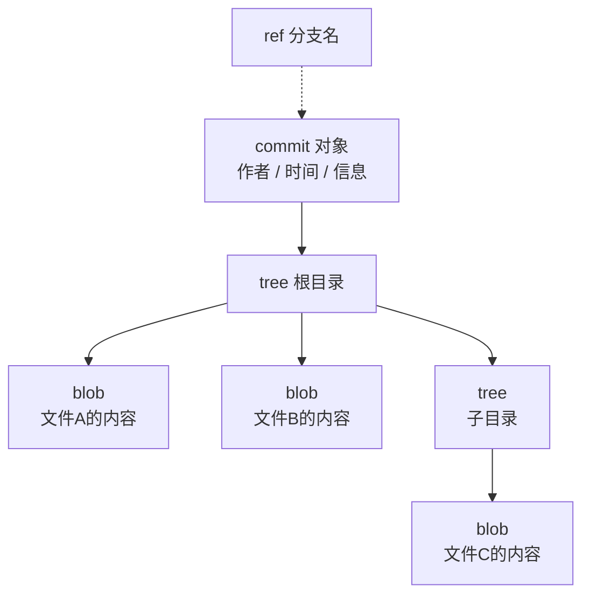


### 分支与合并

分支是 Git 协作的核心机制。分支就是一个可移动的 ref，创建分支就是新建一个 ref 指向当前 commit，之后在这个分支上提交，ref 往前走，其他分支不受影响。

下面这张图用一个典型场景展示分支和合并的完整过程：主分支上有一个功能分支，功能完成后合并回来。

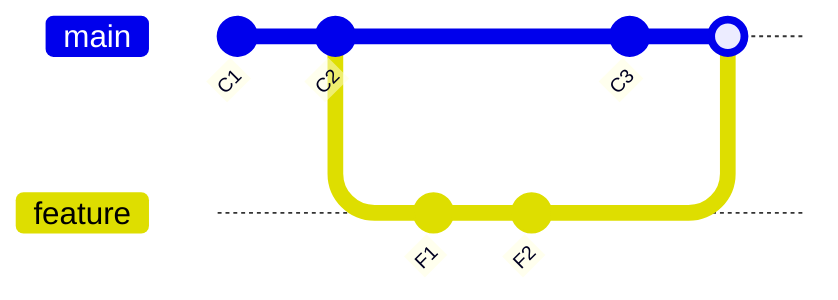


合并（merge）把两个分支的历史重新汇合。Git 找两个分支的最近共同祖先，把双方各自的变化都应用到祖先之上，产生一个新的合并提交。没有冲突时这个过程是自动的；两个分支改了同一处代码，Git 无法自行决定，产生冲突（conflict），需要人手动解决后提交。

分支让多个开发者、多个功能并行开发成为可能。每个人在独立分支上干活，互不干扰，做完再合并回去。冲突只发生在真正改到同一处的时候，而不是所有人挤在同一条线上等。

### 两种主流分支模型：Git Flow 与 GitHub Flow

分支怎么组织，业界有两种代表性方案。

Git Flow 是 Vincent Driessen 2010 年 1 月发表的文章《A successful Git branching model》里提出的模型。它定义了五种分支：master（长期保持可发布状态）、develop（日常开发主线）、feature（功能开发）、release（发布准备）、hotfix（紧急修复）。feature 从 develop 拉出，完成后合并回 develop；要发版时从 develop 拉 release 分支，只修 bug 不添功能，稳定后合并到 master 和 develop；线上出紧急问题从 master 拉 hotfix，修完合并回 master 和 develop。这个模型适合有固定发布节奏、需要同时维护多个版本的产品，代价是分支多、规则复杂。

五种分支的流向：

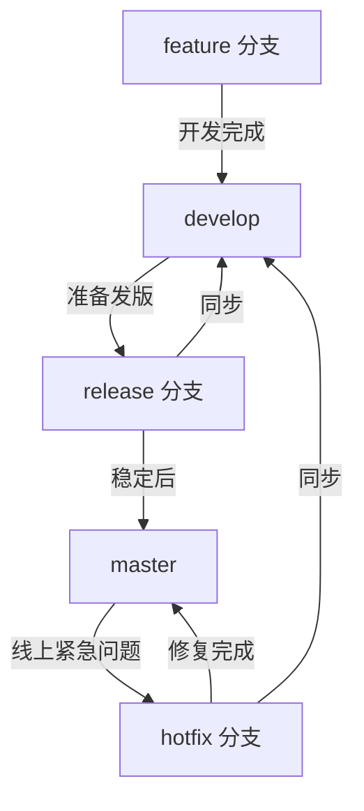


GitHub Flow 是 GitHub 官方倡导的简化模型，规则只有几条：master（或 main）永远是可用状态；新功能从 master 拉分支；开发完提交 pull request；审查通过后合并回 master；合并即部署。没有 develop、release、hotfix 这些长期分支，发布节奏靠"每次合并都可能上线"来保证。它适合持续部署的团队，GitHub 官方文档里描述了这个流程。

流程画出来是一条直线：


选择哪个模型取决于发布方式。固定版本、低频发布的软件（比如需要应用商店审核的移动应用）适合 Git Flow；持续集成、合并即部署的团队（比如 Web 服务）适合 GitHub Flow。两者没有优劣，是发布节奏决定的。

### 远程协作：push、pull、pull request

Git 是分布式的，每个开发者本地都有一个完整仓库，远程仓库（remote）只是约定的同步点，最常用的是 GitHub、GitLab 这类托管平台。

协作的基本操作是 push 和 pull。push 把本地分支的提交推送到远程，pull 把远程的更新拉回本地（实际是 fetch + merge）。团队共用远程仓库时，push 前通常先 pull，把别人推上去的提交先合并下来，避免自己的推送被拒。

本地与远程仓库之间的交互：

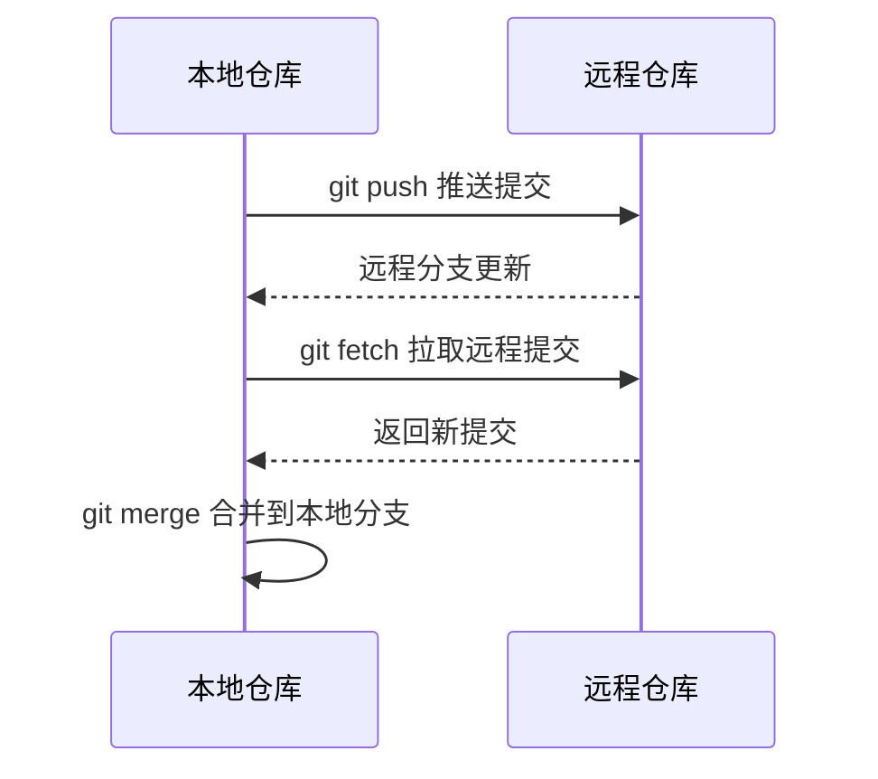


pull request（PR）是协作的核心机制，GitHub 上的叫法。它不是一个 Git 命令，而是托管平台提供的工作流：开发者把功能分支推送到远程，然后在平台上发起请求，请人把这个分支合并进主干。PR 的页面承载了代码审查：审查者逐行看改动、留评论、要求修改，全部通过后由有权限的人合并。

PR 之所以重要，是因为它把"合并代码"从个人动作变成了可审查的流程。改动是什么、谁改的、为什么改，都在 PR 里留下记录；审查者可以在合并前发现问题，而不是等代码上线出问题再回溯。现代 CI/CD 和 PR 深度绑定：PR 一发起，CI 自动跑测试，测试不过不允许合并，这个机制常被称为"PR 门禁"。

## 前置概念四：部署（deploy）——产物放进运行环境

构建把源码变成产物，部署把产物放进运行环境。这一节讲部署的形态演变、环境分级和配置管理。CI/CD 的最终目的就是让部署这个动作变得频繁而可靠。

### 部署形态的演进

软件运行的载体，经历了从物理机到虚拟化再到容器的过程，每一步都是解决上一阶段的问题。

最早是物理机部署。一台服务器装一个应用，应用直接跑在操作系统上。问题在于利用率低：一台机器只跑一个应用，其他时间都在闲置；扩容慢：流量上来了，要买新机器、装系统、部署应用，以周为单位计算；隔离差：多个应用硬塞同一台机器，一个应用出问题可能拖垮整台机器。

虚拟化（VM）解决了利用率和隔离问题。虚拟机管理程序（hypervisor）在一台物理机上模拟出多台虚拟机，每台虚拟机有自己的操作系统，应用之间相互隔离。一台物理机可以跑多个应用，利用率上来了。代价是每台虚拟机都带一个完整操作系统，资源开销大，启动要分钟级。

容器（container）是更轻的隔离方案。容器共享宿主机的操作系统内核，只隔离应用及其依赖的运行环境。和虚拟机比，容器没有自己的操作系统，镜像小、启动快（秒级）、资源开销低。Docker 2013 年开源后把容器技术带进了主流，镜像（image）机制让"构建一次、到处运行"成为可能：开发机、测试机、生产机跑同一个镜像，环境不一致的问题从根上被消除。

容器数量一多，管理就成了问题：几百个容器怎么分配机器、怎么互相发现、挂了怎么重启。容器编排（orchestration）工具解决这个，代表是 Kubernetes（简称 K8s），Google 2014 年开源，源自它内部运行多年的 Borg 系统。K8s 负责容器的调度、扩缩容、自愈和服务发现，是当前容器编排的事实标准。

这个演进不是替代关系。今天的生产环境里，物理机、虚拟机、容器、K8s 经常同时存在：容器跑在虚拟机上，虚拟机跑在物理机上，K8s 管理容器。演进改变的是部署的粒度：从"部署一个应用"变成"部署一个容器"再到"声明一批容器的期望状态，由系统保证达到"。

### 环境分级：从 dev 到 prod

部署到哪，比怎么部署更先要回答。生产环境（production，简称 prod）是用户实际使用的环境，改动它风险最高。不能每次改动都直接上 prod，业界通行的做法是把运行环境分成几级，逐级验证。

常见的环境谱系大致如下，团队按规模取用，不必全建：

| 环境 | 用途 | 说明 |
|------|------|------|
| dev（开发） | 开发时快速验证 | 开发者本地或共享环境，代码随便改，坏了随时重来 |
| test / QA | 专职测试人员跑用例 | 比 dev 稳定，介于 dev 和 staging 之间，验证功能完整性 |
| preview（预览） | 审查者看效果 | 每次 PR 自动部署的临时环境，用完即删 |
| staging（预发布） | 上线前预演 | 尽量模拟生产配置（同样的数据库、同样的依赖、同样的部署方式），不对真实用户开放，跑集成测试和配置检查 |
| UAT（验收） | 业务用户确认需求 | 验证软件满足业务需求，可独立部署，也常直接复用 staging |
| pre-prod | 生产前最后一道 | 常与 staging 同义，或作为 staging 之后的一层，跑上线前的完整检查 |
| sandbox（沙箱） | 实验和演练 | 允许乱搞的环境，常用于对接外部 API 的测试 |
| prod（生产） | 真实用户使用 | 改动需要经过前面环境的验证，通常还要走发布审批 |

其中 dev、staging、prod 三级是骨架，多数团队至少保留这三个。test/QA 和 preview 按团队是否有人专职测试、是否重视 PR 可视化决定是否要建。UAT 的定位要单独说清楚：它验证的是"软件是否满足业务需求"，使用者是业务方或客户，而不是开发或运维。staging 验证的是"能不能发布"（部署方式、集成、配置），UAT 验证的是"该不该发布"（业务流程、验收标准）。实际运作中 UAT 有两种形态：独立部署一套 UAT 环境（常见于有外部客户、需要客户登录验收的项目），或者直接复用 staging，在 staging 上约业务方验收。两种都是通行做法。

分级的核心思想是把风险分摊到不同阶段。dev 里改坏无所谓，staging 里发现的 bug 成本是"上线前修复"，prod 里发现的 bug 成本是"线上事故 + 紧急修复"。逐级推进让问题在最便宜的阶段被发现。

preview 环境值得单独提一句：每次 PR 自动部署一个临时环境，审查者可以直接点开看效果，用完即删。它是 PR 门禁的延伸，CI 负责跑测试，preview 负责给人看。

### 配置管理：环境变量与 12-factor

同一个代码库要部署到多个环境，不同环境的差异必须从代码里分离出来。dev 的数据库地址和 prod 不一样，dev 的 API key 和 prod 不一样，这些不能写死在代码里，否则换环境就要改代码、重新构建。这个问题的标准答案是配置外置（externalize configuration）。

具体做法是环境变量（environment variable）：配置项以键值对的形式放在运行环境里，代码从环境读取。同样的代码，dev 环境给 dev 的配置，prod 环境给 prod 的配置，代码本身零改动。秘密信息（密码、API key、token）也走这条路，不进入代码库，不进入镜像。

这套做法被系统总结为 12-factor 原则。它由 Adam Wiggins（Heroku 联合创始人）2011 年提出，Heroku 随后开源了这份定义，是云原生应用开发的经典参考。12 条原则覆盖应用开发的各个方面，与部署直接相关的有：

- 配置（III）：配置存储在环境中，与代码分离。
- 依赖（II）：显式声明依赖，不依赖系统隐含的包。
- 进程（VIII）：进程无状态，状态存到后端服务（数据库、缓存）。
- 并发（IX）：通过进程模型扩展，而不是在单进程内搞线程魔法。
- 环境等价（X）：dev、staging、prod 尽可能一致，减少"我本地能跑"。

12-factor 不是规范，是经验总结。它解决的核心问题是可移植性：遵守这些原则的应用，换一个环境、换一个平台，不需要改代码，这也是 CI/CD 能顺畅运转的前提。CI/CD 自动化部署的假设是"构建一次、到处部署"，如果每个环境的部署方式都不一样、配置都写死在代码里，自动化就无从谈起。

## CI 持续集成：定义、解决什么问题、核心循环

前置概念讲完了，从这一节开始进入 CI/CD 本身。先讲 CI（持续集成，Continuous Integration）。

### CI 的定义

持续集成是一种软件开发实践：开发者频繁地把代码变更合并到共享仓库，每次合并都自动触发构建和测试，验证新代码和已有代码能在一起工作。如果发现问题，CI 系统阻止合并并通知团队。

这个定义有三个关键词。频繁：不是攒一周再合并，而是每天多次。自动：每次变更都触发构建和测试，不需要人提醒。验证：构建和测试的结果决定变更能不能进主干。

CI 概念最早由 Martin Fowler 在 2000 年系统提出，他在文章里给出的定义后来成为经典：团队成员频繁集成他们的工作，通常每人每天至少集成一次，每次集成都由自动化构建（包括测试）验证，尽可能快地发现集成错误。这一定义在今天依然成立，只是工具从自建的构建脚本变成了 GitHub Actions 这类托管服务。

### CI 解决什么问题

CI 针对的是手动流程里的集成问题。没有 CI 时，开发者各自在分支上开发，合并前不验证，合并时才发现冲突和错误，这就是"集成地狱"：问题堆积到合并那一刻集中爆发，定位困难，修复成本高。

CI 把验证提前到每次合并。变更一提交，构建和测试立刻跑，几分钟内出结果。改坏了马上知道，而不是两周后合并时才知道。这改变了错误的发现时机：从"合并时发现"变成"提交时发现"。

CI 的第二个作用是建立质量门禁。合并进主干的代码必须通过构建和测试，主干始终处于可用状态。这为后面的 CD（持续交付/部署）打了基础：只有主干一直可构建、可测试，才有可能做到随时发布。

### 核心循环

CI 的运行是一个循环：提交代码、自动构建、自动测试、反馈结果。这一循环在每次合并时重复执行。

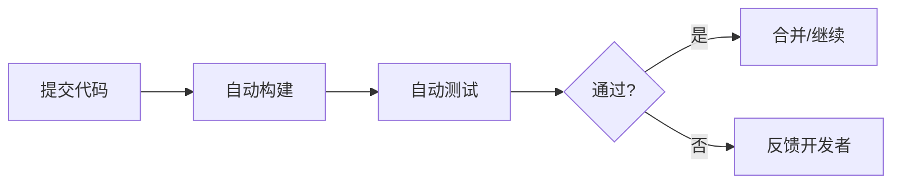

循环的关键是反馈速度。构建和测试越快，开发者越愿意频繁提交；提交越频繁，集成问题越早暴露。反过来，构建要跑半小时，开发者就会攒着提交，CI 就退化成"每日构建"，集成地狱又会回来。所以 CI 的实践原则里，"保持构建快速"排在很靠前的位置。

### 失败的流程长什么样

说清楚 CI 正常运转的样子，也要说清楚失败时发生了什么。一个开发者提交了代码，CI 跑出构建失败或测试失败，这时候：

1. 合并被阻止：变更不能进主干，问题在源头被拦住。
2. 通知发出：CI 系统把失败信息发给提交者，通常通过 CI 的状态检查（status check）在 PR 页面显示红色叉号。
3. 提交者修复：拿到失败信息后，修代码、再提交，CI 重跑，直到通过。

这里的关键是"修复是提交者的责任"，而不是"把失败的变更留在主干上让别人处理"。CI 的惯例是主干保持绿色（可构建、可测试），一旦出现红色（失败），优先修复而不是继续堆新提交。这个惯例保证了主干随时可用，是后续自动化的前提。
## CD 持续交付 / 持续部署：两种 CD 的区别

CD 有两个意思，持续交付（Continuous Delivery）和持续部署（Continuous Deployment），缩写都是 CD。这一节把两者讲清楚，这是 CI/CD 概念里最容易混淆的一对。

### 从 CI 到 CD

CI 保证主干随时可构建、可测试，这是基础。但"可构建"不等于"能上线"。代码通过了测试，还要经过打包、环境部署、上线验证等一系列步骤，才能到用户手里。CD 处理的就是 CI 之后的这些阶段。

Fowler 对两者的关系有个简明的说法：持续集成处理开发环境内的集成、构建和测试，持续交付建立在它之上，处理生产部署所需的最后阶段。也就是说，CI 是 CD 的前置，CD 是 CI 的延伸。

### 持续交付：随时可以发布

持续交付（Continuous Delivery）是一种软件工程实践：保证软件的任何变更在任何时刻都可以发布到生产环境。注意这里的措辞是"可以"——交付保证的是能力，不是行为。

实现持续交付的团队，代码每次合并后自动完成构建、测试、打包，产物随时处于可发布状态。发布本身（把产物部署到生产、对用户生效）由人来触发，通常是点一个按钮，或者执行一条命令。整个过程高度自动化，但最后一步保留人工决策。

这个人工环节是持续交付和持续部署的分界线。Atlassian 对两者的区分说得很直白：交付在最终发布前有一个人工审批步骤，部署没有。

为什么保留人工环节？因为发布是一个商业决策，不只是技术动作。产品是否要在这个时间点上线、要不要等某个功能一起发、是不是避开节假日，这些判断不适合交给自动化流程。自动化保证"随时能发"，人决定"什么时候发"。

### 持续部署：合并即上线

持续部署（Continuous Deployment）是持续交付的进一步延伸：所有通过自动化测试的变更自动部署到生产环境，没有任何人工干预。代码合并、测试通过，就直接上线。

和持续交付的区别只有一处：最终发布这一步是自动的还是有人的。交付有按钮，部署没有按钮。

持续部署对自动化的要求更高。测试的覆盖面和质量必须足够可信，否则坏代码会直接上线；还需要配套的监控和快速回滚机制，因为一旦出错，没有人工环节来拦。它适合对发布频率要求极高的团队，比如每次合并都希望用户马上用上新功能的 SaaS 产品。

- SaaS（Software as a Service，软件即服务）：软件由服务商托管在云端，用户通过浏览器或客户端按订阅使用，不需要自己部署和维护。Gmail、Notion、Figma 都是典型例子。
- 这类产品天然适合持续部署：新功能上线后，服务商能立刻控制全量用户的版本，不需要用户手动更新。

### 两种 CD 的对比

| 维度 | 持续交付 | 持续部署 |
|------|----------|----------|
| 发布触发 | 人工（点按钮/执行命令） | 自动（测试通过即发布） |
| 人工环节 | 保留最终审批 | 完全没有 |
| 自动化程度 | 高，最后一步人工 | 全自动 |
| 对测试的依赖 | 高 | 极高（无人工兜底） |
| 回滚要求 | 常规 | 必须快速可靠 |
| 适用场景 | 发布时机是商业决策的团队 | 发布频率极高、信任自动化测试的团队 |

### 部署流水线

实现 CD 的工具形态叫部署流水线（deployment pipeline）。这个概念由 Jez Humble 和 Dave Farley 在 2010 年出版的《Continuous Delivery》一书中系统提出，这本书是 CD 领域的奠基之作。

流水线把从提交到发布的整个过程拆成一系列阶段（stage），每个阶段做一类验证，产物逐级传递：提交触发构建和单元测试，通过的产物进入下一阶段跑更广的测试，逐级往后，越往后验证越全面，也就越接近生产。流水线的价值在于把"发布"这个整体动作拆成了可观察、可控制、可定位的步骤：卡在哪个阶段，问题就在哪个阶段。

部署流水线就是 GitHub Actions workflow 的抽象模型：CI/CD 工具用 workflow 实现流水线，每个 job 对应一个阶段。

## 术语体系：Pipeline / Stage / Job / Step / Artifact / Trigger

CI/CD 工具有各自的术语，但底层概念高度一致。这一节把这套通用术语讲清楚。GitHub Actions 的文档里，同一套概念有它自己的叫法。

### 六个术语

- Pipeline（流水线）：一次完整交付流程的总称，从代码提交到部署完成的整条链路。一个 pipeline 包含若干 stage。
- Stage（阶段）：pipeline 里的一级分类，代表一类验证或操作，比如构建阶段、测试阶段、部署阶段。同一 pipeline 的 stage 有先后顺序，前一个通过才进入下一个。
- Job（作业）：stage 里的一个具体任务。一个 stage 可以包含多个 job，同一 stage 的多个 job 可以并行执行。比如测试阶段有"跑单元测试"和"跑 lint"两个 job，可以同时跑。
- Step（步骤）：job 内部的最小执行单元，一条命令或一个动作。一个 job 是一串 step 按顺序执行。
- Artifact（产物）：流水线阶段之间传递的文件。构建 job 产生的编译结果、打包文件，通过 artifact 传给后续的测试或部署 job。没有 artifact 机制，每个 job 就要重新构建，浪费且不一致。
- Trigger（触发器）：启动流水线的事件。代码推送到分支、PR 被创建、定时计划、手动点击，都是 trigger。trigger 决定 pipeline 什么时候跑。

### 层级关系

这六个术语的关系是嵌套的：trigger 触发 pipeline，pipeline 由若干 stage 串成，每个 stage 有若干 job，每个 job 是若干 step 的序列，artifact 在 job 之间传递产物。

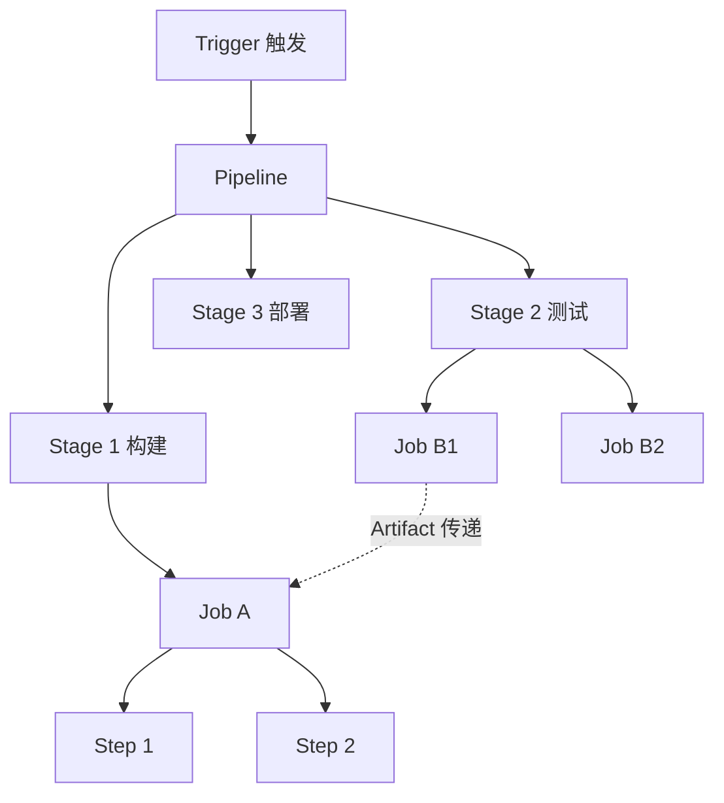

### 各工具的术语映射

同一套概念，不同工具的叫法略有差异：

| 通用术语 | GitLab CI | GitHub Actions | Azure Pipelines |
|----------|-----------|----------------|-----------------|
| Pipeline | pipeline | workflow | pipeline |
| Stage | stage | job 的分组（无独立概念，靠 needs 表达顺序） | stage |
| Job | job | job | job |
| Step | script 内的命令 | step | step |
| Artifact | artifact | artifact | artifact |
| Trigger | rules / only / trigger | on | trigger |

映射表说明一个事实：概念是通用的，语法是工具的。理解了 pipeline / stage / job / step 的嵌套关系，换工具时只需要学新工具的语法，不用重学概念。这也是前面花篇幅讲通用概念的原因。

### 一个 pipeline 的整体形状

用一个典型的前端项目举例。代码推送到仓库，触发 pipeline，它长这样：

1. Stage 1 构建：装依赖（npm install）、打包（npm run build）。产物：dist 目录的静态文件。
2. Stage 2 测试：跑单元测试、跑 lint。如果失败，pipeline 停在这里，代码不能进下一步。
3. Stage 3 部署：把构建产物部署到服务器。这一步通常还分环境（staging 先部署验证，prod 最后上线）。

这个形状就是部署流水线的实例化：阶段逐级推进，每级验证范围更广，越往后越接近生产。

## 自动化交付的价值：速度、一致性、可追溯、反馈

花力气搭 CI/CD，换来的是什么。答案可以归结为四个价值维度，它们不是并列的口号，而是环环相扣的因果链。

### 速度

最直接的价值是交付速度。手动流程里，一次发布从准备到上线以天计算；自动化之后，从提交到部署的周期缩短到分钟级或小时级。速度的价值不只是"快"，而是改变了团队的运作方式：发布越便宜，就越敢频繁发布；越频繁发布，每次包含的变更就越小；变更越小，出问题时的排查范围就越小。

速度还体现在反馈上。手动流程里，代码合并后可能几天后才发现集成问题；CI 里，提交后几分钟内就知道构建和测试结果。反馈越快，修复成本越低，因为错误发生时的上下文还热乎着。

### 一致性

自动化流程每次执行的结果是一致的。同样的输入，同样的步骤，得到同样的产物和同样的验证结果。这看起来平淡，实际上是手动流程最难做到的事：人执行同样的步骤也会疲劳、遗忘、出错，机器不会。

一致性还延伸到环境。构建在固定环境（CI runner）里执行，依赖版本由 lockfile 固定，产物在受控环境里生成。"我本地好好的，一上线就崩"这类问题，根因是环境不一致，自动化把构建环境统一后，这类问题从机制上消失。

### 可追溯

自动化流程留下了完整的执行记录：谁提交了什么、哪个 commit 触发了哪次构建、构建结果如何、产物去了哪里、部署到哪个环境。这些记录是自动产生的，不需要人补记，也不依赖人的记忆。

可追溯的价值在出问题时体现。线上出事故，第一件事是定位"这次上线改了什么"。手动流程里要靠人回忆；自动化流程里，从部署记录可以直接找到对应的 commit 和代码 diff，问题定位从"猜"变成"查"。

### 反馈

前面三个价值（快、一致、可查）汇总成一个：反馈。自动化让团队持续获得关于代码质量的反馈，知道当前主干是否健康、测试是否通过、性能是否退化。反馈是改进的基础，没有反馈，团队不知道自己处于什么状态。

### 用什么衡量：DORA 四指标

四个价值听起来抽象，业界有具体的衡量方法。Google 的 DORA（DevOps Research and Assessment）团队从 2014 年起每年发布《Accelerate State of DevOps》报告，用四个指标衡量软件交付表现，并据此把团队分为精英（elite）、高（high）、中（medium）、低（low）四档：

- 部署频率（deployment frequency）：代码成功部署到生产的频率。高频部署说明发布流程顺畅、变更粒度小。
- 变更前置时间（lead time for changes）：从代码提交到成功运行在生产环境的时间。衡量交付链路整体耗时。
- 变更失败率（change failure rate）：导致生产故障的部署占总部署的比例。衡量发布质量。
- 恢复服务时间（time to restore service）：从生产故障发生到恢复的时间。衡量故障处理能力。

前两个指标衡量速度，后两个衡量稳定性。DORA 的研究发现，精英团队往往是四项全面领先，而不是用稳定性换速度：发布更频繁，同时失败率更低、恢复更快。这打破了一种直觉，即"快"和"稳"不可兼得。自动化是两者兼得的前提，因为只有自动化，才能做到既频繁发布又不引入人为错误。

DORA 指标适合用来评估团队的交付表现，但要注意它衡量的是流程，不是代码质量。一个流水线跑得飞快的团队，如果产品方向错了，DORA 数字也救不了。指标回答"交付得怎么样"，不回答"做的东西对不对"。


# CI/CD 最佳实践

## 提交与分支：小步提交、主干开发、PR 门禁、分支保护

这一部分讲让 CI/CD 真正运转的实践。这些实践是从大量团队的经验和教训里沉淀出来的，不遵守它们，CI/CD 工具搭得再漂亮也跑不起来。

### 小步提交

提交（commit）是版本控制的原子操作，也是 CI 的输入。一次提交应该尽量小：只包含一个逻辑变更，能独立通过构建和测试。

小步提交的好处是定位容易。一次提交对应一个改动，测试挂了，git bisect（二分定位）能在几次操作内找到引入问题的提交。如果一次提交塞了几十个文件的改动，问题就埋在一堆变更里，定位靠猜。

小步提交还让代码审查可行。审查者面对一个 50 行的提交，可以认真看；面对一个 2000 行的提交，只能扫一眼放行。提交大小直接影响审查质量，而审查是质量门禁的一部分。

小步提交的敌人是"顺手改"。开发时顺手格式化了一个文件、顺手改了个无关的配置，这些都会混进提交里。做法是提交前自查：这个提交只包含一件事吗？不相关的改动拆到单独的提交。

### 主干开发

主干开发（trunk-based development）是一种分支策略：所有开发者直接向主干（main/master）提交，或使用生命周期极短的功能分支（一两天内合并回主干），不在长期分支上并行开发。

为什么强调主干开发？因为 CI 的前提是"频繁集成"。长期分支（比如一个功能分支开发两周）意味着集成被推迟，分支越长，合并时冲突越多，越接近集成地狱。主干开发把集成频率推到极致：所有人每天多次合并到主干，冲突在发生的当天就被解决，而不是在合并日集中爆发。

主干开发和 Git Flow 并不矛盾。Git Flow 的 feature 分支如果生命周期短（一两天），配合频繁合并，也接近主干开发的实践。问题出在"长期分支"：一个 feature 分支开一个月，期间主干上别人合了几百个提交，合并时就是一场灾难。Git Flow 的分支模型本身没错，错的是让分支活得太久。Atlassian 的文档里把主干开发称为 CI/CD 的必要实践（required practice），原因就在这里：没有频繁集成，CI 就退化成"每日构建"，失去意义。

### PR 门禁

PR（pull request）门禁是指：合并代码到主干必须经过 PR，且 PR 必须满足预设条件才能合并。条件是团队自己定义的，常见的有：

- CI 状态检查通过（构建、测试、lint 全绿）
- 至少一位审查者 approve
- 代码与最新主干保持同步（防止用过期代码测试）

PR 门禁把"合并"从个人动作变成流程动作。之前是"我觉得没问题就合并"，现在是"机器和人共同确认没问题才能合并"。CI 负责机器部分（自动化验证），审查者负责人部分（代码质量、设计合理性），两者互补。

PR 门禁的意义不是增加流程负担，而是把错误拦截在合并之前。CI 失败、审查发现问题，代价是改代码重新提交；合并后发现，代价是线上事故和回滚。前者的成本远低于后者。

### 分支保护

分支保护（branch protection）是 GitHub 提供的机制，把 PR 门禁强制化。在仓库设置里对主干分支启用保护规则后，规则变成硬性约束：

- 禁止直接推送：不能绕过 PR 直接 push 到主干，所有变更必须走 PR。
- 要求状态检查通过：CI 的状态检查必须全部通过才能合并。
- 要求 PR 审查：需要指定数量的人 approve 才能合并。
- 要求分支最新：合并前必须同步最新主干代码。

这些规则是 GitHub 官方文档里的标准选项，多数团队至少启用前两项。分支保护的要点是"强制"：它不依赖开发者的自觉，而是让不合规的合并物理上不可能发生。PR 门禁是约定，分支保护是执行。

## 管道设计：快速反馈优先、并行化、幂等可重入、fail fast

流水线（pipeline）是 CI/CD 的执行骨架，设计得好不好直接决定开发者的日常体验。这一节讲管道设计的四条核心原则。

### 快速反馈优先

管道设计的第一原则：让开发者尽快拿到结果。反馈越快，迭代越快；反馈越慢，开发者越不愿意频繁触发管道，CI 的价值就流失。

落实方式是 stage 排序：先跑快的、后跑慢的。一次提交后，理想顺序是：静态检查（秒级）、单元测试（秒到分钟级）、集成测试（分钟级）、端到端测试（分钟到小时级）、部署，逐级递进。这个顺序不是随意的，它对应"发现问题的概率"和"运行成本"的平衡：低成本、高概率的检查放前面，先把大部分问题拦下来；高成本、低概率的验证放后面，避免为每个提交都付全量验证的代价。

另一个落实方式是把长任务切分。一次提交只跑与本次变更相关的测试子集，全量回归留给定时任务或发布前。Harness 的实践指南里明确建议：单元测试和关键集成测试每次提交都跑，全量回归留给定时或发布前运行。

### 并行化

同一 stage 内的多个 job 互不依赖时，并行执行。管道里常见的并行点：多个测试任务（单元测试按模块拆成多个 job）、多个平台的构建（Linux/Windows/macOS）、多版本矩阵（Node 18/20/22 各跑一遍）。

并行直接缩短反馈时间：3 个测试 job 串行要 30 分钟，并行只要 10 分钟。代价是 runner 资源占用增加，所以并行的粒度要平衡：任务多到资源排队，并行反而变慢。GitLab 和 GitHub 都支持 stage 内 job 默认并行，靠配置控制。

并行的前提是 job 之间无依赖。有依赖的任务不能并行，只能靠 stage 顺序或显式依赖声明（GitHub Actions 的 needs）表达。

### 幂等可重入

管道要能安全地重复执行。同一个 commit 触发两次管道，两次结果应该一致；管道中途失败后重跑，应该从失败点继续而不是产生脏状态。

幂等（idempotent）的含义：执行一次和执行多次结果相同。落到管道实践上是几条要求：

- 构建产物不依赖执行环境的残留状态：每次构建从干净状态开始，或至少保证上次的残留不影响本次。
- 部署步骤可重复：重复执行部署脚本不会重复执行副作用（比如建表脚本执行两次不报错）。
- 缓存使用要谨慎：缓存是幂等的大敌，缓存内容过期或损坏会让同样的输入产出不同结果。缓存必须带正确的 key，失效策略清晰。

可重入（reentrant）和幂等是近义词，强调"管道执行到一半被打断后，可以安全地重新执行"。CI 平台大多支持重试失败 job，如果管道设计得不幂等，重试就会产生奇怪的结果，比如重复发通知、重复建资源。设计原则是：让管道步骤尽量是纯函数式的，输入决定输出，不依赖外部状态。

### fail fast

fail fast（快速失败）：管道一旦发现错误，立即停止后续步骤，而不是跑完整个流程再汇报。

原因很简单：错误信息越早暴露，浪费越少。构建阶段失败，继续跑测试和部署毫无意义，只会浪费时间和资源。fail fast 让开发者看到的第一条错误就是真正的根因，而不是一串被后续步骤掩盖的噪声。

落实方式：stage 之间默认串行且失败即停（前一个 stage 失败，后续 stage 不执行）；job 内部命令失败即退出（shell 默认行为，或用 set -e 强制）。GitHub Actions 里，job 的 if 条件和失败传播机制负责实现这一点。

fail fast 和快速反馈是一体两面：快速反馈是目标，fail fast 是实现手段之一。管道越早停，开发者越早拿到有效反馈。

## 构建与测试实践：lockfile、可复现构建、缓存、flaky 测试处理

构建和测试是管道里执行最频繁的部分，也是问题最多的地方。这一节讲四个高频问题的标准解法：依赖怎么锁、构建怎么可复现、缓存怎么用、测试偶尔失败怎么办。

### lockfile：把依赖树固定下来

lockfile 的概念在依赖管理部分提过，这里展开它在 CI 里的关键作用。lockfile（如 npm 的 package-lock.json、Python 的 poetry.lock）记录的是整个依赖树的精确版本，包括直接依赖和传递依赖（依赖的依赖）。

为什么传递依赖也要固定？因为大多数库声明依赖时用的是版本范围，比如"^1.2.0"，意思是 1.2.0 到 2.0.0 之前的任何版本。直接依赖被 lockfile 固定了，但库 A 依赖的库 B 如果没被固定，B 一更新，构建结果就变了。只有把整棵依赖树都固定，才能保证"今天构建"和"三个月后构建"输入一致。

CI 里使用 lockfile 的要点：

- lockfile 提交进代码库，不加入 .gitignore。
- 安装依赖用 CI 专用命令（npm ci、pip install 的 lock 模式），它们严格按 lockfile 安装，忽略版本范围的浮动。
- lockfile 与清单文件（package.json）不一致时，CI 直接失败，提示重新生成，而不是自动升级依赖。

这样 CI 里每次构建都基于相同的依赖集，可复现性有了保证。

### 可复现构建：同样的输入，同样的输出

可复现构建（reproducible build）指：相同源码、相同依赖、相同构建环境，产出相同的构建结果。它比"构建成功"更进一步，要求的是"构建结果可预期"。

可复现构建的价值在调试和信任。线上出了 bug，开发者需要能重建出线上运行的产物来复现；如果构建不可复现，两个环境构建出不同产物，那"线上跑的到底是什么"就说不清了。可复现构建让"代码即真相"成立：只要代码和依赖没变，构建出的东西就是同一个。

实现可复现构建的手段：

- 固定依赖版本（lockfile）。
- 固定构建环境：CI 用固定的镜像/运行时版本（如 Node 20 的指定镜像），不用"最新版"。
- 避免构建依赖机器状态：不依赖本机全局安装的包、不读取环境里未声明的变量。
- 记录构建信息：产物里记录源码 commit 和依赖版本，线上出问题时能反查。

这些手段在前面的章节里零散出现过（lockfile、环境一致性），这里把它们归到"可复现"这一个目标下。可复现性是 CI/CD 信任的基础：自动化流程的前提是结果可预期，不可复现的构建让自动化失去意义。

### 缓存：加速构建的正确姿势

缓存（cache）是加速 CI 的主要手段。每次构建都要重新下载依赖、重新编译，缓存让这些重复工作只做一次。

缓存的典型场景：

- 依赖缓存：npm/pip 等包管理器有自己的缓存目录，CI 工具把它缓存下来，下次构建跳过下载。
- 构建缓存：编译型语言的中间产物缓存（如 Go build cache、Rust target 目录），增量编译。
- 静态资源缓存：下载的二进制、字体等不常变的资源。

缓存的使用有几个必须注意的点：

- 缓存 key 要包含版本信息：依赖清单文件（package.json、lockfile）的内容作为 key 的一部分，依赖一变更，缓存自动失效。用固定 key 会导致依赖更新后还在用旧缓存。
- 缓存是优化不是正确性：管道逻辑不能依赖缓存存在，缓存丢失（CI 平台清理、key 变更）时管道必须能完整重建。缓存应该只是"快一点"，而不是"能跑"的前提。
- 缓存与可复现的冲突：缓存内容损坏会引入不确定性，所以缓存不能覆盖 lockfile 的权威地位，缓存只是加速，依赖版本始终以 lockfile 为准。

CI 平台（GitHub Actions、GitLab CI）内置缓存机制，具体配置方式随平台不同。

### flaky 测试：偶尔失败的测试怎么办

flaky 测试指"同一份代码，这次跑通过、下次跑失败"的测试。它的危害不只是偶尔的红色，而是腐蚀信任：开发者看到失败的第一反应变成"是不是又 flaky 了"，而不是去查问题，CI 的质量信号就失效了。

flaky 的常见原因：

- 时间依赖：测试里用了固定等待时间，机器慢时超时。
- 顺序依赖：测试之间共享状态，运行顺序不同结果不同。
- 外部依赖：测试访问真实网络、真实服务，服务抖动导致失败。
- 并发问题：测试代码里的竞态条件。

处理 flaky 测试的推荐流程：

1. 复现确认：多次运行失败测试，确认是稳定失败还是偶发。
2. 隔离（quarantine）：把确认 flaky 的测试从主 CI 里移出，单独分组运行，不再阻塞 PR 合并。隔离的测试继续跑，收集数据，但不 gate 合并。
3. 修复：修好根因（去掉时间依赖、隔离共享状态、mock 外部服务）后，移回主 CI。
4. 防复发：跟踪 flaky 测试的统计，持续监控。

这个流程的关键是"隔离但不删除"：flaky 测试暴露的可能是真实问题，直接删掉会丢掉信号。隔离让团队保持 CI 全绿（不阻塞开发），同时保留测试继续运行（不丢失信息）。自动重跑（rerun）是另一类常见做法，但要注意：重跑通过只是掩盖问题，不能替代隔离和修复，适合作为临时的缓解手段。

## 部署实践：不可变发布、回滚策略、蓝绿/金丝雀、数据库迁移难题

部署是 CI/CD 链路的终点，也是风险最集中的环节。这一节讲部署侧的实践：怎么发布更安全、出问题怎么回滚、数据库迁移为什么是特殊的难题。

### 不可变发布

不可变发布（immutable deployment）的原则：运行环境一旦创建就不再修改，发布新版本就创建新的环境，而不是在旧环境上打补丁。

对比可变的方式：传统做法是登录服务器，停服务、替换文件、改配置、重启，服务器被原地修改。不可变的方式：新版本打包成新的镜像或实例，整体替换旧实例，旧实例要么删掉要么保留待回滚。

不可变发布的好处：

- 环境一致性：生产跑的实例和测试验证过的实例是同一个，不存在"线上被手动改过所以和测试不一样"的问题。
- 回滚简单：回滚就是切换回旧版本实例，不需要逆向操作一堆补丁。
- 状态可预期：实例生命周期短，配置漂移（手动改服务器导致的环境偏差）没有积累的机会。

AWS Well-Architected 框架把不可变基础设施列为部署的推荐实践，理由是它把"部署"从"修改"变成了"替换"，替换天然可验证、可回滚。容器和镜像技术让不可变发布变得容易，这也是容器成为主流部署方式的原因之一。

### 回滚策略

部署迟早会出问题，回滚能力比完美的部署更重要。回滚策略的要点：回滚必须是预先设计好的动作，而不是事故现场临时想。

按发布方式，回滚有几种形态：

- 切换式回滚（蓝绿/红黑）：新旧版本同时存在，流量指向新版本，出问题把流量切回旧版本，瞬间完成。
- 增量式回滚：金丝雀发布到一半发现问题，停止继续放量，未放量的用户留在旧版本。
- 重建式回滚：不可变发布的回滚，直接重新部署上一个版本的镜像。

回滚的快慢和发布方式强相关。选择发布方式时，"怎么回滚"应该和"怎么发布"一起考虑，而不是发完再想。

### 蓝绿部署

蓝绿部署（blue/green）维护两套完整的环境：蓝（当前生产）和绿（新版本）。新版本部署到绿环境，验证通过后，把流量从蓝整体切到绿。回滚就是把流量切回蓝。

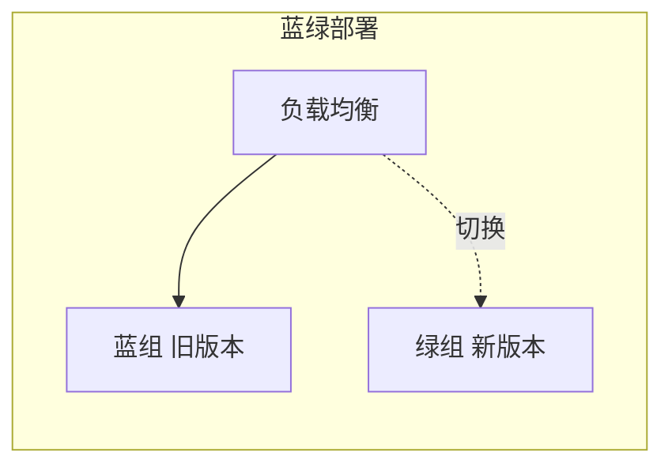

蓝绿部署的特点：

- 切换是瞬时的：流量切换是路由器/负载均衡层面的操作，秒级完成。
- 回滚是瞬时的：切回旧环境即可，不需要重新部署。
- 成本高：需要同时维护两套完整环境，资源翻倍。

适合场景：需要快速发布和快速回滚的后端服务。不适合：资源紧张的环境（两套环境太贵）、有状态服务（数据库等不能简单切换）。

蓝绿部署在真实团队里的效果可以参考 Burst SMS 的案例（Harness 博客公开的访谈）：这个团队一次更新把整个服务搞挂了，SRE 负责人就在 CEO 旁边，靠蓝绿部署几分钟内把流量切回旧版本，服务恢复；同样的故障在改用蓝绿之前要停机约两小时。案例的细节是厂商访谈，不一定有普适性，但它说明了蓝绿部署的核心价值：回滚不是重新部署，而是切换流量，速度以分钟甚至秒计。

### 金丝雀部署

金丝雀部署（canary）先把新版本放给一小部分用户，验证没问题后逐步扩大比例，直到全量。名字来自煤矿里的金丝雀：先放进去试毒，死了说明环境危险。

典型放量节奏：2%、25%、75%、100% 逐级扩大，每个阶段停留一段时间观察监控指标（错误率、延迟、业务指标）。

金丝雀的特点：

- 风险低：问题只影响一小部分用户，且能在全量前发现。
- 回滚是"停止放量"：发现问题时，已放量的流量切回旧版本，未放量的不动，不需要整体切换。
- 依赖流量路由和监控能力：需要按比例路由流量的基础设施，以及能及时发现问题指标的监控。

和蓝绿的区别：蓝绿是"两套环境、整体切换"，金丝雀是"一套环境、增量放量"。蓝绿回滚最快（切换即回滚），金丝雀风险最低（影响面小）。选择取决于团队的基础设施能力：有完整的两套环境用蓝绿，有精细流量控制用金丝雀。

金丝雀部署最广为人知的例子是 Windows 的 Insider 计划。微软 2023 年 3 月向公众开放了 Canary 频道，它是 Insider 计划里最早、最不稳定的频道：新构建先发给一小部分自愿注册的用户，这些用户接受频繁的预览版和潜在故障，充当新版本的试毒者。构建在 Canary 频道验证后，逐步推向更稳定的频道（Dev、Beta、Release Preview），最后才向全体用户推送。这个多频道结构就是金丝雀部署的放量阶梯：先给一小部分人，验证没问题再扩大范围。Canary 这个频道名本身就是从金丝雀部署的典故来的，微软用这个名字致敬煤矿里探毒的金丝雀。

### 数据库迁移：部署里最难的环节

应用代码的部署是替换，数据库的变更不能替换，只能原地演进。数据库是共享的有状态资源，新旧代码可能同时运行（蓝绿切换前后、金丝雀放量期间），数据库必须同时兼容新旧两个版本的代码。这就是数据库迁移难的本质：代码可以瞬间切换，数据库只能渐进演化。

数据库迁移的经典问题是破坏性变更：删列、改类型、重命名。旧代码还在读旧结构，新代码写新结构，直接改会崩。零停机迁移的标准解法是 expand-contract（先扩展后收缩）模式：

1. Expand（扩展）：新增字段/表，不删旧结构。新旧结构并存。
2. Migrate（迁移）：双写，应用同时写旧和新结构，历史数据分批回填。
3. Contract（收缩）：确认所有流量都迁移完成、旧代码不再使用旧结构后，才删除旧结构。

三阶段各自独立部署、独立可回滚，每一步都不破坏运行中的系统。这个模式在 Harness、Prisma 的数据库迁移指南里都是推荐做法，也是"数据库迁移为什么难"的标准答案：它不是一次发布，而是一系列精心排序的发布。

数据库迁移在 CI/CD 里的实践要点：迁移脚本纳入版本控制，和代码一起走流水线；迁移有幂等性（重复执行安全）；上线前在 staging 跑完整迁移验证。
## 安全实践：secrets 管理、最小权限、依赖漏洞扫描、供应链

CI/CD 系统握着代码库、凭据和部署权限，是攻击者眼中的高价值目标。这一节讲管道安全的基本盘：秘密怎么存、权限怎么给、依赖怎么查、供应链怎么守。

### secrets 管理：秘密不落日志

secrets（秘密）指不该公开的敏感信息：API key、数据库密码、云服务凭据、部署 token。CI/CD 管道要访问这些资源，就必然接触这些秘密，管理不当就泄露。

三条基本规则：

- 秘密不进代码库。硬编码在源码里、写在配置文件里提交到仓库，等于把钥匙贴在门上。这是最基础也最常违反的一条。
- 秘密不落日志。管道日志会被团队成员查看、被 CI 平台存储、被转发到日志系统，秘密出现在日志里就是泄露。工具侧的做法是日志脱敏（masking），GitHub Actions 会把标记为秘密的值在日志里自动打码。
- 秘密定期轮换。泄露不可避免，轮换是把泄露的影响限制在时间窗内的手段。短期有效的 token（如临时凭据）优于长期静态密钥。

秘密的存放位置：使用 CI 平台提供的 secrets 机制（GitHub Actions 的 Repository secrets / Environment secrets），由平台加密存储，在运行时注入环境变量。更严格的做法是用专门的安全服务（如云厂商的 Secrets Manager）管理，管道运行时按需获取，不在任何地方静态存放。

GitHub 官方文档和多个安全团队的实践指南里还有一条共同建议：给秘密配置最小权限，即使泄露，影响面也可控。

### 最小权限：给多少权限，用多少

最小权限原则（least privilege）：任何实体只获得完成任务所需的最小权限，不多给。落到 CI/CD 有几个层面。

第一是凭据的权限范围。部署用的云凭据只需要"部署到生产"的权限，就不该给"管理整个账号"的权限；Slack 通知用的 token 只需要"发消息"的权限，就不该有"管理频道"的权限。权限范围越小，泄露后果越轻。

第二是运行时的权限边界。GitHub Actions 里，workflow 默认使用的 GITHUB_TOKEN 权限可以被显式声明收紧（permissions 字段），默认拒绝、按需放开。第三方 action 有权限问题时，GitHub 的权限审计（permission audit）能发现。

第三是人的访问控制。谁有权看秘密、谁有权批准发布，用环境级的保护规则（environment protection rules）和代码审查（CODEOWNERS）约束，与角色对应。

GitHub 官方博客专门写过最少权限在 GitHub Actions 里的实践：scoped secrets（作用域受限的秘密）配合环境保护、CODEOWNERS、分支保护一起用，才能保证秘密只被该用的人、在预期的场景里使用。

### 依赖漏洞扫描：不引入已知漏洞

现代项目大量使用第三方依赖，依赖里的已知漏洞是供应链攻击的入口。扫描依赖漏洞（SCA，software composition analysis）是 CI 的标准安全步骤。

主流的做法是依赖扫描工具对比依赖清单（lockfile）与漏洞数据库（如 GitHub Advisory Database、NVD），发现已知漏洞就告警或阻断合并。GitHub 生态里 Dependabot 是内置方案：它基于依赖图和漏洞数据库扫描仓库，发现新漏洞发 alert，还能自动提交升级依赖的 PR。

扫描的落地方式：

- 提交时扫描：PR 里新增的依赖立即扫描，新引入的漏洞在合并前暴露。
- 定时扫描：全量扫描定期运行（如每周），捕捉新公布的漏洞。
- 阻断策略：高危漏洞可以配置为阻断合并（fail the build），低危告警人工评估。

扫描不能解决所有问题，已知漏洞只是供应链风险的一部分，但它把"用了有公开漏洞的依赖"这类最直接的问题挡在门外，成本低、收益直接。

### 供应链安全：从依赖到产物全链路

供应链安全（supply chain security）比依赖扫描更广，覆盖软件从源码到产物的整条链路。近年几次高影响攻击（如依赖混淆、恶意 npm 包、被攻破的构建工具）让这个领域成为安全重点。

供应链安全的核心实践：

- 锁定依赖来源：固定依赖版本（lockfile）、校验依赖完整性（锁文件的哈希）、从可信源拉取。
- 生成 SBOM：软件物料清单（Software Bill of Materials），记录产物里包含的所有组件及版本，出问题时能快速定位受影响范围。CycloneDX 是常见的 SBOM 格式。
- 验证构建来源：确保构建产物确实来自预期源码和预期流程（如可复现构建、签名验证）。
- 审查第三方 action/插件：CI 流水线本身用的第三方组件（GitHub Actions 的第三方 action）也是供应链的一部分，需要评估其来源和维护状态，必要时 pin 到具体版本而不是跟随最新。

供应链安全没有一劳永逸的答案，它是一组持续的实践。对个人和小团队，优先级可以这样排：先把 lockfile 和依赖扫描做起来，再逐步补 SBOM 和签名验证。

## 反模式清单

正面的实践讲完了，这一节列出常见的反面做法。反模式（anti-pattern）是"看起来合理、实际有害"的做法，识别它们比记住正面清单更有用，因为多数团队出问题都不是不知道正确做法，而是踩进了看似省事的坑。

### 巨型流水线

把所有事情塞进一条流水线：编译、单元测试、集成测试、端到端测试、安全扫描、部署，全在一个 job 里串行执行。这是最常见的结构性问题。

危害：一次失败阻塞整条流水线，所有人都在等；反馈时间被拉长到无法忍受，开发者开始攒提交；一个环节的小改动牵动整条链。结果是把 CI/CD 从加速器变成了瓶颈。

对应的正确实践是：按 stage 分层、并行化、快速反馈优先。巨型流水线的反面是"小而多"：多个职责单一的 workflow，各管一段，互不阻塞。

### 手工步骤混入

管道里夹着"手动测试一下""手动确认部署""手动改一下环境配置"这类步骤，人肉充当流水线的一环。

危害：速度回到手动时代，自动化只省了一半；手工步骤没有记录，出问题无法追溯；人做的步骤天然不一致，同一操作不同人做出来不一样。更隐蔽的问题是，手工步骤的存在说明团队不信任自动化，这种不信任会导致更多手工步骤的加入，恶性循环。

手工步骤不是绝对禁止。持续交付和持续部署的区别就在于最后一个发布环节有没有人，关键判断是：这个人工环节是"决策"（要不要发布）还是"执行"（怎么发布）。前者应该保留，后者必须自动化。

### 环境漂移

dev、staging、prod 的配置、数据、依赖悄悄分叉：dev 用 SQLite，prod 用 MySQL；staging 的依赖版本旧了几个月；有人手动改过生产服务器上的配置，没记录。

危害：环境漂移让"测试通过"失去意义。代码在 staging 全绿，上线后因为环境差异出问题，"我本地好好的"换了个马甲继续上演。环境越漂移，测试结果越不可信，团队越不敢发布。

对应的正确实践是：环境分级（staging 尽量镜像生产）、不可变基础设施（环境创建后不手动修改）、配置管理（环境差异通过配置而非改代码表达）。

### 测试与生产不一致

"测试环境的数据是假的、规模是小的、配置是特殊的，所以测试结果仅供参考"。这个反模式和环境漂移相关，但更具体地指向测试本身。

典型表现：集成测试连的是 mock 服务而不是真实依赖、性能测试在生产 1/100 的机器上跑、测试数据是精心构造的完美数据（真实数据里才有的边界情况根本没覆盖）。

危害：测试通过率与实际质量脱钩。管道全绿，但绿的是"在特殊环境里测出的结果"，不是真实环境的表现。这类问题最危险的地方在于它有迷惑性：数字都好看，问题藏在"测试环境特殊"这个前提里。

缓解方向：测试环境尽量贴近生产（同款数据库、同量级数据样本、同配置）、关键路径用真实依赖测试、staging 承担最接近生产的验证。

### 依赖不锁定

"package.json 写个 ^ 范围就行，反正装出来差不多"。lockfile 的重要性在前面已经讲过，这里作为反模式再点一次名。

危害：今天构建和明天构建装到不同版本，可复现性消失；新版本引入的兼容问题变成"玄学 bug"，时好时坏；出问题时无法重建线上产物。依赖不锁定是很多"昨天还好好的"的根源。

### secrets 硬编码

把 API key、密码、token 写进代码、写进配置文件提交到仓库。这是后果最直接的反模式：泄露即事故，而且不可逆。

危害：凭据一旦进了公开仓库，就可能被爬虫抓走、被扫描工具发现、被滥用。换 key 只能止损，泄露本身已经发生。GitHub 的 secret scanning 能发现一部分，但发现是事后补救，正确做法是从源头不犯。

对应的正确实践是：secrets 走平台机制、不落日志、定期轮换、最小权限。


# GitHub Actions 基础

## 核心概念：Workflow / Job / Step / Action / Runner / Event

这一部分进入 GitHub Actions。它是 GitHub 的 CI/CD 服务，2019 年 8 月宣布支持 CI/CD 并开放 beta，同年 11 月正式发布（GA），与 GitHub 仓库深度集成：workflow 文件放在仓库里，代码推送、PR 等仓库事件就能触发构建和部署，不需要单独的 CI 服务器。它的六个核心概念（workflow、job、step、action、runner、event）与通用术语存在对应关系，这一节先逐个讲清楚。

### 六个概念

- Event（事件）：触发 workflow 的仓库活动。push（代码推送）、pull_request（PR 被创建或更新）、schedule（定时）、workflow_dispatch（手动触发）都是 event。事件是 workflow 的启动条件。
- Workflow（工作流）：一次自动化流程的完整定义，对应通用术语的 pipeline。一个 workflow 是一个 YAML 文件，放在仓库的 .github/workflows/ 目录下，定义触发条件、要执行的 job、以及相关配置。
- Job（作业）：workflow 里的一组步骤，对应通用术语的 job。一个 workflow 可以包含多个 job，job 之间可以并行（默认）或串行（用 needs 声明依赖）。
- Step（步骤）：job 内的最小执行单元，一条命令或一个 action 调用。step 按顺序执行，前一个成功才执行后一个。
- Action（动作）：可复用的步骤单元，把一段常用操作封装成可以调用的模块。checkout（拉取代码）、setup-node（安装 Node）都是官方提供的 action。action 可以从 GitHub Marketplace 或任意仓库引用，也可以自己写。
- Runner（运行器）：执行 job 的机器。GitHub-hosted runner 是 GitHub 托管的虚拟机，self-hosted runner 是自己维护的机器。每个 job 在独立的 runner 上运行。

### 概念的层级关系

六个概念的关系：event 触发 workflow，workflow 包含多个 job，job 在 runner 上执行，job 由 step 组成，step 调用 action 或运行命令。

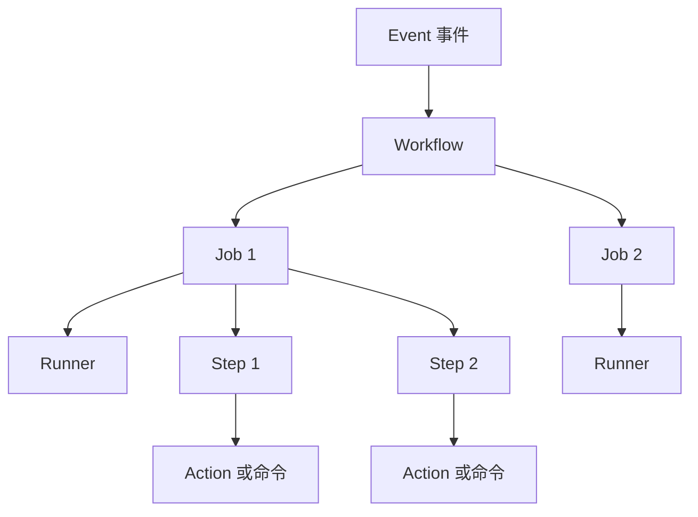

这张图和术语体系的层级图结构相同，只是把 pipeline 换成了 workflow。GitHub Actions 的概念不是新东西，它是通用 CI/CD 概念在 GitHub 生态里的具体实现。

### 和通用术语的对照

| 通用术语 | GitHub Actions 的叫法 | 说明 |
|----------|----------------------|------|
| Pipeline | Workflow | 完整流程定义 |
| Stage | （无独立概念） | 用 job 的 needs 依赖表达先后顺序 |
| Job | Job | 一组步骤 |
| Step | Step | 最小执行单元 |
| Artifact | Artifact | job 间传递产物 |
| Trigger | on | workflow 的触发事件 |

GitHub Actions 没有独立的 stage 概念，靠 needs 表达顺序，对照表里已经标出这一点。理解通用概念后，学 GitHub Actions 只需要记住：pipeline 叫 workflow、trigger 叫 on、stage 用 needs 模拟。

### 最小的 workflow 长什么样

一个最小的 workflow 文件（.github/workflows/hello.yml）：

```yaml
name: Hello World          # workflow 的名字，显示在 Actions 页
on: [push]                 # 触发条件：任何 push 事件
jobs:                      # job 定义开始
  say-hello:               # job 的名字
    runs-on: ubuntu-latest # 运行在 GitHub 托管的 Ubuntu 虚拟机
    steps:                 # 步骤列表
      - run: echo "hello"  # 执行一条 shell 命令
```

这段配置足够说明概念如何落到语法：on 是 event、jobs 下是 job、runs-on 指定 runner、steps 是 step 列表、run 执行命令。后面的章节会逐项展开这些语法。

## workflow 文件与 YAML 骨架

workflow 用 YAML 编写，先讲 YAML 的必要语法，再给一个完整的 workflow 骨架逐行拆解。

### YAML 速览：只需要会这些

YAML 是一种人类可读的数据格式，GitHub Actions 用它描述流程。对写 workflow 来说，只需要掌握三种结构：

- 键值对：`name: hello`。冒号后跟空格，再跟值。
- 嵌套：靠缩进表达层级。子级比父级多缩进，GitHub Actions 习惯用两个空格。
- 列表：`- 开头` 的项，表示一组元素。`steps:` 下面每一项就是一个 step。

```yaml
# 键值对
name: my-workflow
# 嵌套：jobs 下面有 job1，job1 下面有 runs-on 和 steps
jobs:
  job1:
    runs-on: ubuntu-latest
    steps:
      - run: echo "one"
      - run: echo "two"
```

两个易错点。第一，缩进只能用空格不能用 Tab，否则解析报错。第二，缩进层级必须一致，同层内容缩进不同会被当成不同层级。报错信息里出现 "mapping values are not allowed in this context" 这类提示，多半是冒号后忘了空格或缩进错了。

### 完整骨架：一个真实的最小 workflow

一个典型的 workflow 文件包含四个部分：名字、触发条件、job 定义、job 里的步骤。下面是完整骨架，注意里面的注释：

```yaml
name: CI                        # workflow 显示名，出现在仓库 Actions 页

on:                             # 触发条件（event）
  push:                         # push 事件触发
    branches: [main]            # 只监听 main 分支的 push
  pull_request:                 # PR 事件触发
    branches: [main]

jobs:                           # 所有 job 的定义
  build:                        # 第一个 job，名字叫 build
    runs-on: ubuntu-latest      # 运行环境：GitHub 托管的 Ubuntu 虚拟机
    steps:                      # 该 job 的步骤列表，按顺序执行
      - name: Checkout code     # 步骤 1：拉取仓库代码
        uses: actions/checkout@v4
      - name: Setup Node        # 步骤 2：安装 Node.js 20
        uses: actions/setup-node@v4
        with:
          node-version: 20
      - name: Install deps      # 步骤 3：安装依赖
        run: npm ci
      - name: Run tests         # 步骤 4：跑测试
        run: npm test
```

逐部分看：

- `name`：可选但建议写，Actions 页面用它显示 workflow 名称。
- `on`：触发条件，可以监听多个事件。push 和 pull_request 是最常用的两个，后面章节专门讲 on 的写法。
- `jobs`：job 集合。每个 job 是一个映射，key 是 job 名（本例是 build），值是这个 job 的配置。
- `runs-on`：job 的运行环境，最常用 ubuntu-latest，还有 windows-latest、macos-latest 等。
- `steps`：步骤数组。每个 step 有 `name`（步骤名）、`uses`（调用 action，格式是 所有者/仓库名@版本，actions/checkout@v4 表示调用 GitHub 官方仓库 actions/checkout 的 v4 版本）、`run`（直接执行 shell 命令）、`with`（传给 action 的参数，如 node-version: 20）。

`uses` 和 `run` 是 step 的两种形式：`uses` 调用封装好的 action（拉代码、装 Node 这类高频操作），`run` 直接执行命令（npm ci、npm test 这类项目特有操作）。一个 step 可以只用其中一种。

### 文件放哪、怎么写

workflow 文件放在仓库的 `.github/workflows/` 目录下，文件名任意（建议语义化，如 ci.yml、deploy.yml），一个仓库可以有多个 workflow 文件，各自独立触发。

文件推送到默认分支（main）后，GitHub 自动识别并注册 workflow。推送代码或打开 PR 触发对应事件时，workflow 开始执行，执行过程可以在仓库的 Actions 标签页实时查看：绿色对勾表示通过、红色叉表示失败，点进去能看到每个 job、每个 step 的输出日志。

写 workflow 没有本地调试工具时的建议流程：先在仓库创建一个测试分支，推送 workflow 文件，用 Actions 页观察执行结果，改好后再合并到 main。后面章节会讲更系统的调试方法（act 本地运行、workflow_dispatch 手动触发）。

## 触发器 on：push / pull_request / schedule / workflow_dispatch

`on` 是 workflow 的触发条件，定义什么事件会启动它。这一节讲四个最常用的事件类型，以及事件过滤的写法。

### push：代码推送

push 事件在代码推送到仓库时触发，是最基本的触发器。不加过滤时，任何分支的推送都会触发 workflow：

```yaml
on: push
```

更常见的写法是加过滤，只监听特定分支：

```yaml
on:
  push:
    branches:
      - main
```

这样只有推送到 main 分支才触发。除了 branches，还有 paths 过滤（只在特定文件变更时触发）和 tags 过滤（只在推送 tag 时触发），语法相同。paths 的典型用途：monorepo 里只改了 docs 目录就不触发测试。

### pull_request：PR 相关事件

pull_request 事件在 PR 的生命周期里触发，默认监听 PR 打开和更新（代码推送到 PR 分支）时：

```yaml
on:
  pull_request:
    branches:
      - main
```

上面写法表示"目标是 main 的 PR"触发。PR 事件有多种 activity type，可以用 types 指定监听哪些：

```yaml
on:
  pull_request:
    types: [opened, synchronize, reopened]
```

- opened：PR 刚创建
- synchronize：PR 分支有新的推送（PR 更新）
- reopened：被关闭的 PR 重新打开

CI 在 PR 上的典型用法：PR 创建和更新时跑测试，作为合并门禁。对应分支保护里的"要求状态检查通过"，状态检查就是 CI workflow 在 PR 上跑出的结果。

### schedule：定时触发

schedule 用 cron 表达式定时触发，适合周期性任务（夜间构建、定时扫描、定期备份）：

```yaml
on:
  schedule:
    - cron: '0 2 * * *'   # 每天 UTC 2:00
```

cron 是五个字段：分钟、小时、日、月、星期几。GitHub Actions 的 cron 有几个注意点：

- 时区是 UTC，不是本地时间。'0 2 * * *' 是 UTC 2 点，北京时间是上午 10 点。
- 最小间隔约 5 分钟，更频繁的调度不会生效。
- 实际执行时间可能有延迟：GitHub 官方文档说明，schedule 事件在负载高时可能延后执行，适合对时间不敏感的任务。定时任务如果对执行时间很敏感，需要考虑这一点。

### workflow_dispatch：手动触发

workflow_dispatch 允许在 Actions 页面手动触发 workflow，适合需要人工介入的场景：

```yaml
on:
  workflow_dispatch:
    inputs:
      environment:
        description: '部署到哪个环境'
        required: true
        type: choice
        options:
          - staging
          - prod
```

带 inputs 时，手动触发页面会显示表单，让操作者输入参数（本例是一个下拉选择，选 staging 或 prod）。这些输入通过 github.event.inputs 上下文在 workflow 里读取，在表达式语法里可以用它引用手动输入的参数。

手动触发的典型用途：需要人工决策的部署、定时任务的手动补跑、带参数的调试运行。

### 事件过滤小结

四个触发器的取舍：

| 事件 | 触发时机 | 典型用途 |
|------|----------|----------|
| push | 代码推送到分支 | 主干构建、部署 |
| pull_request | PR 打开/更新 | PR 门禁测试 |
| schedule | cron 定时 | 夜间构建、定时扫描 |
| workflow_dispatch | 手动点击 | 人工部署、调试 |

push 和 pull_request 是 CI 的主干，schedule 负责周期任务，workflow_dispatch 留给人。一个 workflow 可以同时监听多个事件（on 下并列），最典型的组合是 push + pull_request 共用一套测试流程。

## jobs 与 runs-on、env、矩阵

workflow 的骨架是 jobs。这一节讲 job 的三种常用配置：运行环境（runs-on）、环境变量（env）、矩阵展开（strategy.matrix）。

### runs-on：job 跑在哪台机器

runs-on 指定 job 的执行环境，最常用的三个标签：

- ubuntu-latest：GitHub 托管的 Ubuntu 虚拟机，最常用，包最全、启动快。
- windows-latest：Windows Server 虚拟机，构建 Windows 产物或测试跨平台兼容性用。
- macos-latest：macOS 虚拟机，构建 iOS/macOS 产物用。

这些是 GitHub-hosted runner 的标签，对应 GitHub 托管的虚拟机，机器维护和升级由 GitHub 负责。runner 上预装了常用工具（Git、Node、Python、Docker 等），大多数项目开箱即用。除了这三个，还有带 CPU 规格的变体（如 ubuntu-latest-4-cores）和自建 runner 的自定义标签，前者按规格计费，后者需要自己维护机器，两种 runner 的规格和成本差异会在运行机制部分对比。

job 之间默认并行：一个 workflow 里的多个 job 同时在各台 runner 上运行。需要顺序时用 needs 声明依赖，needs 的完整用法在 jobs 依赖部分展开。

### env：环境变量

env 定义环境变量，作用域有三个层级，从大到小：

- workflow 级：写在 workflow 顶层，所有 job 可见。
- job 级：写在 job 内，该 job 的所有 step 可见。
- step 级：写在 step 内，只对该 step 可见。

```yaml
env:                              # workflow 级
  LOG_LEVEL: info
jobs:
  build:
    env:                          # job 级
      NODE_ENV: production
    steps:
      - run: echo "$LOG_LEVEL"    # 读 workflow 级变量
      - run: echo "$NODE_ENV"     # 读 job 级变量
      - name: 局部变量
        env:                      # step 级
          DEBUG: "true"
        run: echo "$DEBUG"
```

同名变量时，小作用域覆盖大作用域。层级设计的意义：全局配置放 workflow 级（如日志级别），job 特有配置放 job 级（如 NODE_ENV），单步临时配置放 step 级（如调试开关），作用域越精确越好，避免变量泄漏到不该用的地方。

### strategy.matrix：一次定义，多次执行

矩阵（matrix）让一个 job 定义按多组参数展开，每组参数跑一次。典型场景是"同一套测试跑多个 Node 版本"或"同一套构建跑多个平台"：

```yaml
jobs:
  test:
    runs-on: ubuntu-latest
    strategy:
      matrix:
        node-version: [18, 20, 22]   # 三组参数
    steps:
      - uses: actions/setup-node@v4
        with:
          node-version: ${{ matrix.node-version }}
      - run: npm ci
      - run: npm test
```

上面的 job 会展开成三个 job：Node 18、20、22 各跑一遍完整步骤。matrix 里可以有多个维度，GitHub 会生成所有组合（笛卡尔积）：

```yaml
strategy:
  matrix:
    os: [ubuntu-latest, windows-latest]
    node-version: [18, 20]
```

这会生成 2x2=4 个 job，每个组合跑一次。多维度矩阵的典型用途是跨平台兼容性测试：Linux 和 Windows 上各跑两个 Node 版本。

matrix 还支持 exclude（排除特定组合）和 include（追加组合）：

```yaml
strategy:
  matrix:
    os: [ubuntu-latest, windows-latest]
    node-version: [18, 20]
    exclude:
      - os: windows-latest       # 排除 Windows + Node 18 这个组合
        node-version: 18
```

矩阵的代价是并行 job 数量翻倍，消耗 runner 资源和配额，维度组合要克制，不是越多越好。矩阵里每个 job 里可以用 ${{ matrix.xxx }} 引用当前组合的参数值，这是矩阵展开的用法核心。

## 常用内置 Action：checkout / setup-node / cache / upload-artifact

写 workflow 时用到的 action 大多是现成的，最常用的四个来自 GitHub 官方：checkout、setup-node、cache、upload-artifact。这一节逐个讲用法。Action 的引用格式是 `所有者/仓库名@版本`，`actions/checkout@v4` 表示 GitHub 官方仓库 actions/checkout 的 v4 版本。

### checkout：拉取代码

几乎每个 workflow 的第一步都是它。runner 是全新虚拟机，没有你的代码，checkout 把仓库代码拉下来：

```yaml
- uses: actions/checkout@v4
```

默认行为：拉取触发 workflow 的 ref（分支或 tag）上的代码。常用的参数：

```yaml
- uses: actions/checkout@v4
  with:
    ref: main          # 拉取指定分支（默认是触发事件的 ref）
    fetch-depth: 0     # 拉取完整历史（默认只拉最近一次提交，加速）
    path: my-repo      # 放到子目录（默认放工作目录根）
```

fetch-depth 值得留意：默认只拉最新一次提交，跑测试和构建足够了，速度最快；需要完整历史时（如 git describe 打版本号）用 fetch-depth: 0。

### setup-node：安装 Node.js

Node 项目在 runner 上跑之前，先装 Node：

```yaml
- uses: actions/setup-node@v4
  with:
    node-version: 20
    cache: npm
```

node-version 指定版本，可以写具体版本（20）、主版本（20.x）或文件（.nvmrc）。cache: npm 让 setup-node 自动处理 npm 依赖缓存，内部就是调用 cache action，省去手写缓存步骤。类似的还有 setup-python、setup-java、setup-go，用法结构相同。

### cache：缓存依赖和构建产物

缓存加速的原理：重复步骤（下载依赖、编译）的结果存起来，下次命中直接复用。npm 缓存示例：

```yaml
- name: Cache npm
  uses: actions/cache@v4
  with:
    path: ~/.npm          # 缓存哪个目录
    key: ${{ runner.os }}-npm-${{ hashFiles('package-lock.json') }}
    restore-keys: |
      ${{ runner.os }}-npm-
```

两个参数是核心：

- path：要缓存的路径（npm 的缓存目录 ~/.npm）。
- key：缓存的唯一标识。命中规则是 key 完全匹配。上面的例子用 hashFiles('package-lock.json') 计算 lockfile 的哈希拼进 key，lockfile 一变，key 就变，缓存自动失效。这是缓存 key 的标准做法：依赖变化时缓存必须跟着失效，否则会用到旧缓存。
- restore-keys：key 未命中时的回退匹配。上面例子中，如果精确 key 没命中，会按前缀 ${{ runner.os }}-npm- 找最近的旧缓存，让"只改了一个依赖"的场景也能部分复用旧缓存。

缓存实践部分说的"key 要包含版本信息"，这里就是具体实现。缓存命中规则和期限在缓存机制部分展开。

### upload-artifact / download-artifact：job 之间传产物

job 在各自的 runner 上运行，互相隔离。构建 job 产生的产物要传给部署 job，靠 artifact：

```yaml
# 构建 job
- name: Upload build
  uses: actions/upload-artifact@v4
  with:
    name: dist          # 产物名，下载时用
    path: dist/         # 上传哪个目录

# 部署 job（另一个 job 里）
- name: Download build
  uses: actions/download-artifact@v4
  with:
    name: dist          # 对应上传时的名字
```

上传 job 结束后，产物存在 GitHub 的服务器上，下载 job（通常用 needs 声明依赖）把它拉下来。artifact 可以指定保留天数（retention-days，默认 90 天），对大型产物可以调小。artifact 也可以从 Actions 页面的 run 详情里手动下载，方便查看构建结果。

### 四个 action 的组合：一个典型的 Node CI

把四个 action 串起来，就是一个完整的前端项目 CI：

```yaml
name: CI
on:
  push:
    branches: [main]
  pull_request:
jobs:
  build:
    runs-on: ubuntu-latest
    steps:
      - uses: actions/checkout@v4        # 1. 拉代码
      - uses: actions/setup-node@v4      # 2. 装 Node 20，自动配 npm 缓存
        with:
          node-version: 20
          cache: npm
      - run: npm ci                      # 3. 按 lockfile 装依赖（命中缓存则秒装）
      - run: npm run build               # 4. 构建
      - run: npm test                    # 5. 测试
      - uses: actions/upload-artifact@v4 # 6. 上传构建产物
        with:
          name: dist
          path: dist/
```

这个 workflow 是后面案例章节的简化版：checkout 拉代码、setup-node 装环境、npm ci 装依赖（lockfile 保证可复现）、build 和 test 干活、upload-artifact 把产物留给后续 job。

## 表达式与上下文：github / secrets / env / needs / if

workflow 不是静态配置，它需要读取运行时信息（这次触发是什么事件、哪个分支）、读取敏感配置（密钥）、在不同条件下做不同的事。这些靠表达式（expression）和上下文（context）实现。

### 表达式语法

表达式写在 `${{ }}` 里，workflow 会在运行时求值。前面已经见过多次：`${{ matrix.node-version }}`、`${{ hashFiles('package-lock.json') }}` 都是表达式。

```yaml
- name: 只在 main 分支执行
  if: ${{ github.ref == 'refs/heads/main' }}
  run: echo "main branch"
```

表达式里可以用的元素：

- 上下文引用：`github.ref`、`secrets.TOKEN` 等，取上下文的值。
- 字面量：字符串（单引号）、数字、布尔值（true/false）、null。
- 运算符：`==`、`!=`、`&&`、`||`、`!`，以及字符串比较函数。
- 函数：`contains()`、`startsWith()`、`endsWith()`、`format()`、`join()`、`hashFiles()` 等。

常用字符串函数示例：

```yaml
if: ${{ contains(github.event.pull_request.labels.*.name, 'skip-ci') }}
if: ${{ startsWith(github.ref, 'refs/tags/') }}
```

一个容易踩的 YAML 坑：表达式以 `!` 开头时必须包在引号或 `${{ }}` 里，否则 YAML 会把 `!` 当特殊语法解析。写法 `if: ${{ !startsWith(...) }}` 而不是裸写 `if: !startsWith(...)`。

### 常用上下文

上下文是一组运行时信息的集合，用 `上下文名.属性` 访问。最常用的几个：

| 上下文 | 内容 | 典型用法 |
|--------|------|----------|
| github | 触发工作流的仓库和事件信息 | github.ref（分支/tag）、github.event（事件完整数据）、github.repository（仓库名） |
| secrets | 仓库/环境的密钥 | secrets.DEPLOY_TOKEN，密钥值被 GitHub 打码保护 |
| env | workflow/job/step 级环境变量 | env.NODE_ENV |
| needs | 前置 job 的执行结果和输出 | needs.build.outputs.version、needs.build.result |
| strategy / matrix | 矩阵展开的当前组合 | matrix.node-version |
| runner | 当前 runner 的信息 | runner.os（操作系统） |
| steps | 各 step 的输出 | steps.setup.outputs.node-version |

```yaml
steps:
  - name: 判断事件类型
    run: echo "事件是 ${{ github.event_name }}"
  - name: 读取密钥
    run: curl -H "Authorization: token ${{ secrets.GH_TOKEN }}" ...
```

secrets 上下文有两个安全行为值得记住：密钥值在日志里自动打码（防止泄露）；secrets 不能直接用在 if 条件里（官方文档明确说明），需要先赋值给环境变量再判断。

### needs：读取前置 job 的结果

needs 有两个作用：声明 job 依赖（顺序），读取依赖 job 的输出。配合 if 可以做条件执行：

```yaml
jobs:
  build:
    runs-on: ubuntu-latest
    outputs:
      version: 1.2.3        # 声明 job 输出
  deploy:
    needs: build            # deploy 等 build 完成
    if: ${{ needs.build.result == 'success' }}   # 且 build 成功
    runs-on: ubuntu-latest
    steps:
      - run: echo "部署版本 ${{ needs.build.outputs.version }}"
```

needs.build.result 可取 success、failure、cancelled、skipped，配合 if 可以精确控制后续 job 的行为。

### 状态函数：控制"什么时候跑"

if 条件里除了比较表达式，还有四个状态函数，判断 workflow 的全局状态：

- success()：所有前置步骤都成功（默认行为，不写 if 时就是这个）。
- failure()：有步骤失败了。
- always()：总是执行，即使被取消。
- cancelled()：workflow 被取消。

```yaml
steps:
  - name: 上传测试报告（即使失败也执行）
    if: ${{ always() }}
    uses: actions/upload-artifact@v4
    with:
      name: test-report
      path: report/
```

典型用法：测试失败时也要上传测试报告（always()）、发送失败通知（failure()）、清理资源（always()）。

### 一个综合示例

把上下文和 if 组合起来，看一个接近真实的场景：PR 合并到 main 后自动部署，手动触发时可选环境：

```yaml
on:
  push:
    branches: [main]
  workflow_dispatch:
    inputs:
      env:
        type: choice
        options: [staging, prod]

jobs:
  deploy:
    runs-on: ubuntu-latest
    steps:
      - name: 手动触发时用输入的环境，否则用 staging
        run: echo "目标环境 ${{ github.event.inputs.env || 'staging' }}"
      - name: 只在 main 推送时部署生产
        if: ${{ github.event_name == 'push' }}
        run: echo "部署到 prod"
```

`||` 在这里是"取默认值"的惯用写法：左侧为空（手动触发没传 env 时）就用右侧的 staging。

## 权限模型：GITHUB_TOKEN 与 permissions 最小化

workflow 运行时需要访问仓库资源（提交代码、创建 release、管理 PR），靠的是一个自动生成的令牌：GITHUB_TOKEN。它怎么工作、权限怎么控制，是 GitHub Actions 安全的核心。

### GITHUB_TOKEN 是什么

每次 workflow 运行，GitHub 自动生成一个 GITHUB_TOKEN，注入到运行环境中。它代表当前工作流对仓库的访问权限，可以用来调用 GitHub API、git push 等操作，用法是在步骤里通过 `${{ secrets.GITHUB_TOKEN }}` 引用（它也是 secrets 上下文的一员）。

GITHUB_TOKEN 有自动过期机制：每次运行重新生成，运行结束即失效，不长期存在。相比手动的 Personal Access Token（个人令牌），它更安全，因为不用在仓库里存静态密钥。

token 的默认权限不是固定的，取决于触发场景：普通分支推送触发的 workflow，token 有较多写权限（可以改 PR、创建 release 等）；来自 fork 的 PR 触发的 workflow，token 被限制为只读，防止恶意 PR 利用权限搞破坏。fork PR 只读是 GitHub 的安全设计：任何人都能 fork 你的仓库发 PR，不能让 PR 里的代码拥有仓库的写权限。

### permissions：显式声明权限

2021 年 4 月，GitHub 给 GITHUB_TOKEN 增加了 permissions 字段，允许 workflow 显式声明 token 的权限范围。作用域包括 contents（仓库内容）、pull-requests（PR）、issues、packages（包）、deployments（部署）、actions 等，每个取值 read、write 或 none。

```yaml
permissions:            # workflow 级：所有 job 生效
  contents: read
  pull-requests: write
  issues: none
```

规则：permissions 里没列出的作用域，一律是 none（默认拒绝）。所以写法是"只声明需要的，其余自动关闭"：

```yaml
jobs:
  release:
    permissions:
      contents: write    # 这个 job 只需要写 contents
      pull-requests: read
    runs-on: ubuntu-latest
```

permissions 可以写在 workflow 级（所有 job 生效）或 job 级（只对该 job 生效），job 级覆盖 workflow 级。

### 最小权限的写法

安全实践部分讲过最小权限原则，这里看它在 workflow 里的具体落实。

第一，显式声明而不是依赖默认。不写 permissions 时 token 用默认权限，普通推送场景默认权限偏宽，等于把没用的写权限也给了 workflow。显式声明后，没列出的作用域全是 none。

第二，按需给到 job 粒度。同一个 workflow 里，构建 job 只需要读代码，发布 job 才需要写 release。把写权限只放在发布 job 上，构建 job 即使被攻击（比如恶意第三方 action），也拿不到写权限。

```yaml
jobs:
  build:
    runs-on: ubuntu-latest
    permissions:
      contents: read        # 构建只需要读
    steps:
      - uses: actions/checkout@v4
      - run: npm ci && npm test

  release:
    needs: build
    permissions:
      contents: write       # 发布才需要写
    runs-on: ubuntu-latest
    steps:
      - run: gh release create ...
```

第三，对第三方 action 保持警惕。workflow 里引用的第三方 action 拥有当前 job 的 token 权限，一个被攻破的第三方 action 等于让攻击者拿到了 job 的权限。对策是把权限压到最低、action 固定版本（不跟 latest）、只从可信来源引用。

### 一个判断框架

写 workflow 时可以按这个顺序过一遍：

1. 这个 workflow 需要访问仓库的哪些资源？（读代码、写 release、管 PR……）
2. 哪些 job 需要这些权限？权限尽可能下沉到具体 job。
3. 不写 permissions 行不行？行，但意味着接受默认权限，默认权限通常比需要的大。
4. 第三方 action 有这些权限会不会有风险？有风险就把权限再收紧。

这个框架和 secrets 管理、分支保护一起，构成 GitHub Actions 的权限安全基础。


# GitHub Actions 流程（运行机制）

## 完整生命周期：从事件触发到执行完成

一个 workflow 从触发到结束，经历几个阶段。理解生命周期有助于排障：job 卡在某个状态时，能判断问题出在哪一环。

### 生命周期全景

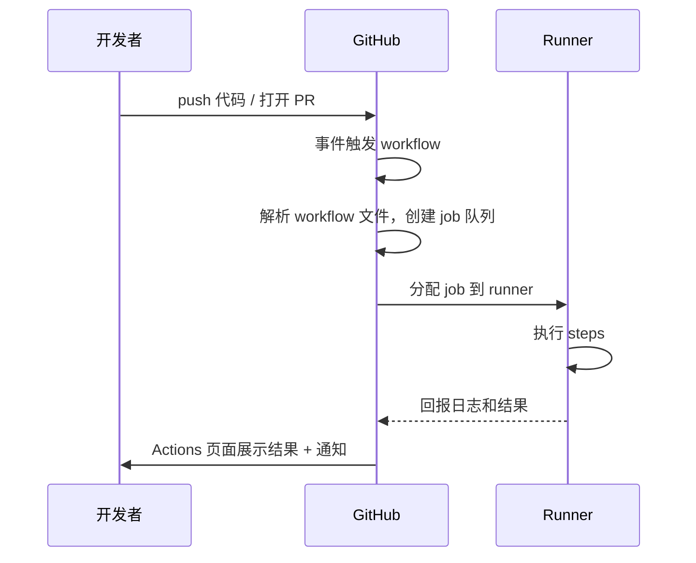

### 各阶段的动作

**触发与入队。** 仓库事件（push、PR 等）发生后，GitHub 检查 workflow 的 on 条件是否匹配（分支、路径、类型过滤），匹配则创建 workflow run。此时 run 进入 queued（排队）状态：job 在队列里等待 runner。

**runner 分配。** GitHub 根据 runs-on 的标签找一个可用的 runner。GitHub-hosted runner 是常备的，通常几秒内就能分配到；资源高峰期可能排队。分配成功后 job 状态变为 in_progress。

**执行。** runner 拉取 job 定义，按顺序执行 steps。每个 step 的输出实时回传 GitHub，Actions 页面能看到日志流。job 内所有 steps 成功则 job 成功，任一 step 失败则 job 失败。

**完成与通知。** 所有 job 结束后，run 进入 completed 状态，整体结论由各 job 汇总：全部成功为 success，任一失败为 failure，被取消为 cancelled。结果同步到 Actions 页面、状态检查（PR 页面的红绿）、以及配置的通知（邮箱、第三方应用）。

### 状态与排障

run 或 job 的几个关键状态：

- queued：排队中，等 runner。长时间 queued 通常意味着 runner 资源不足（自建 runner 都被占用，或 GitHub-hosted 高峰期）。
- in_progress：执行中。卡在这里一般是 step 在等什么（网络、外部服务、无限等待的命令）。
- completed + success/failure/cancelled：结束。看失败的是哪个 job、哪个 step，日志是排障入口。

排障的基本路径：从 Actions 页面点进失败的 run，找到失败的 job，展开失败的 step 看日志，根据报错定位。日志里的每行都有时间戳和输出来源，可以分辨是编译错误、测试失败还是环境问题。

### 触发限制

两个常见的触发限制。第一，workflow 默认不递归触发：workflow 里通过 GITHUB_TOKEN 推送代码，不会再次触发同一个仓库的 workflow（GITHUB_TOKEN 提交被排除），这是防止无限循环的设计；用 PAT 提交则不受此限制，可能造成循环，要注意。第二，同一仓库同一分支的并发 run：可以用 concurrency 配置控制（排队或取消旧的），避免同一分支多个 run 同时跑互相干扰。

## GitHub-hosted vs self-hosted runner：规格、配额、计费

runner 是执行 job 的机器，分两种：GitHub 托管的（GitHub-hosted）和自己维护的（self-hosted）。选择哪种，取决于对规格、网络、成本的要求。

### GitHub-hosted runner

GitHub 提供的虚拟机，机器维护、升级、安全补丁都由 GitHub 负责。标准 runner 的规格（官方文档，截至 2025 年）：

- Linux（ubuntu-latest）：2 vCPU / 8 GB 内存 / 14 GB SSD
- Windows（windows-latest）：2 vCPU / 8 GB 内存 / 14 GB SSD
- macOS（macos-latest）：3 vCPU / 14 GB 内存 / 14 GB SSD

特点：预装了常用工具链（Git、Node、Python、Java、Docker 等）；每个 job 都是全新虚拟机，环境干净，跑完即销毁，不存在环境漂移；缺点是每次启动都要重新下载依赖（冷启动开销，靠缓存缓解），而且无法访问你的私有网络（公司内网服务、自建数据库）。

需要更强算力时可以用 larger runners（如 4/8/16 核的规格），按规格计费。

### self-hosted runner

自己维护的机器，安装 GitHub 的 runner 应用后注册到仓库（或组织）。特点：

- 自定义硬件：可以配大内存、大磁盘、GPU，跑大型构建和测试。
- 私有网络可达：能访问公司内网资源，这是托管 runner 做不到的。
- 省钱：没有按分钟计费（只花自己的机器成本）。
- 代价：维护责任在自己，操作系统、软件环境、安全补丁都要自己管；环境容易漂移（这正是 CI 想消除的问题）；机器在线状态需要监控。

### 配额与计费

官方计费规则（docs.github.com 的 billing 页面）：

- 公共仓库：使用 GitHub-hosted 标准 runner 完全免费（分钟数不消耗配额）。
- 私有仓库：每个账号每月有免费分钟配额（个人账号 2000 分钟/月，团队和组织账号按套餐不同），超过后按分钟计费，标准 Linux runner 约 0.008 美元/分钟（不同规格和系统价格不同，Windows/macOS 更贵）。
- self-hosted runner：不计分钟费，无论仓库公私都免费（机器成本自负）。

2026 年 1 月起 GitHub 下调了托管 runner 的价格（最多 39%，取决于系统与规格），免费配额不变。价格是动态的，写 workflow 前查官方 billing 文档为准。

### 选择建议

- 默认用 GitHub-hosted：零维护、环境干净，绝大多数开源和个人项目够用。
- 需要私有网络、特殊硬件（GPU）、或构建量大到分钟费不划算时，用 self-hosted。
- 混用也常见：常规构建走托管 runner，需要内网资源或大机器的特殊 job 走自建 runner（用 runs-on 的自定义标签路由）。

## jobs 依赖 DAG（needs）与矩阵并发

多个 job 之间的关系和并发行为，是 workflow 结构设计的核心。

### needs：构建依赖图

job 默认并行执行。需要顺序时用 needs 声明"依赖哪些 job"，GitHub 据此构建一个有向无环图（DAG）：只有被依赖的 job 全部成功后，依赖它的 job 才启动。

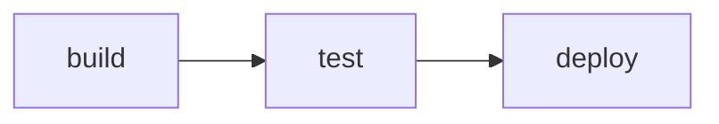

```yaml
jobs:
  build:
    runs-on: ubuntu-latest
    steps:
      - run: npm ci && npm run build
  test:
    needs: build          # test 等 build 完成
    runs-on: ubuntu-latest
    steps:
      - run: npm test
  deploy:
    needs: test           # deploy 等 test 完成
    runs-on: ubuntu-latest
    steps:
      - run: echo "deploy"
```

needs 可以声明多个依赖（数组），此时所有依赖 job 都成功后当前 job 才启动；也可以声明多个 job 依赖同一个 job（扇出），形成并行分支。DAG 的意义：GitHub 自动计算执行顺序和并行度，开发者只需声明依赖关系，不用手工排序。

needs 不只是顺序控制，还能读取依赖 job 的输出（needs.build.outputs.xxx 这种写法在表达式部分出现过）和结果（needs.build.result）。构建 job 生成的版本号、产物信息，可以通过 outputs 传给下游。

### 矩阵的并发行为

矩阵（strategy.matrix）把 job 展开成多个实例，每个实例是独立 job，彼此并行：

- 默认并行度：GitHub 尽量同时运行所有矩阵实例，直到资源上限。
- 上限：单个 workflow run 的矩阵 job 数上限是 256 个。
- fail-fast：默认 true，任一矩阵实例失败，GitHub 取消其余还在运行的实例，节省资源；设为 false 则所有实例跑完（适合想拿到全部结果的场景）。
- max-parallel：限制同时运行的实例数。用 self-hosted runner 时有用（机器数量有限），可以控制并发压力。

```yaml
strategy:
  matrix:
    os: [ubuntu-latest, windows-latest]
    node: [18, 20, 22]
  fail-fast: false
  max-parallel: 4
```

矩阵并发和 needs 一起用时，依赖关系作用于矩阵整体：test 矩阵所有实例都成功后，deploy 才启动。矩阵实例的结果以整体计（任一失败则 job 失败），分支保护里要求的状态检查看的也是整体结果。

### 并发控制：concurrency

除了 needs 和矩阵，还有一个全局并发控制 concurrency。它限制同一组键（通常是分支或 workflow 名）下同时运行的 run 数量：

```yaml
concurrency:
  group: ${{ github.workflow }}-${{ github.ref }}
  cancel-in-progress: true
```

典型用途：同一分支的连续 push 触发的多次 run，只保留最新的，取消在跑的旧的。这在 CI 频繁触发时能省大量资源，也避免旧 run 的结果覆盖新 run 的状态检查。

## 服务容器 services 与数据库

测试往往需要数据库、缓存、消息队列这些依赖。runner 是干净的虚拟机，没有这些服务。services 让 job 在跑测试前自动启动所需的容器服务，测完销毁。

### services 是什么

services 定义在 job 级别，job 启动时先拉取并运行指定的 Docker 镜像，steps 执行期间服务保持运行，job 结束后容器自动清理。典型用途：给集成测试提供 PostgreSQL、Redis、MySQL 等真实依赖，而不是用 mock。

```yaml
jobs:
  test:
    runs-on: ubuntu-latest
    services:
      postgres:
        image: postgres:15
        env:
          POSTGRES_USER: app
          POSTGRES_PASSWORD: secret
          POSTGRES_DB: appdb
        ports:
          - 5432:5432
        options: >-
          --health-cmd "pg_isready"
          --health-interval 10s
          --health-timeout 5s
          --health-retries 5
      redis:
        image: redis:7-alpine
        ports:
          - 6379:6379
    steps:
      - uses: actions/checkout@v4
      - run: npm ci
      - run: npm test
```

上面的配置：postgres:15 和 redis:7-alpine 两个服务在测试前启动，测试代码通过 localhost:5432（PostgreSQL）和 localhost:6379（Redis）连接它们。

### 关键细节

- 端口映射：services 的端口映射到 runner 的 localhost，steps 里直接用 localhost:端口 访问，不是容器名。
- 健康检查：options 里的 health-cmd 让 GitHub 等服务"就绪"才继续，避免测试连上一个还没启动完成的数据库。不配健康检查，可能出现连接被拒的偶发失败。
- 平台要求：services 依赖 Docker，只能用在 Linux runner（windows/macos 的 GitHub-hosted runner 不支持 services）。jobs.<job_id>.container（把 job 本身跑在容器里）和 services 都要求 Linux runner。
- 依赖声明：services 和 job 是同时启动的，不存在"等 services 先跑完"的问题，靠健康检查保证就绪。

### 和本地跑测试的差异

本地开发时数据库通常是常驻的，CI 里每次都是全新服务。这个差异带来一个好处：测试必须自己准备数据、自己清理，天然逼着测试写得更独立。代价是每次 job 都要拉镜像、等服务启动，增加几分钟开销，这部分也可以用缓存缓解（镜像层缓存）。

## 缓存机制与成本控制

缓存是 CI 提速和降费的主要手段。这一节把缓存机制讲透，再讲成本控制的基本盘。

### actions/cache 的工作原理

actions/cache 的流程：job 里配置 cache step 时，action 用 key 在 GitHub 的缓存存储里查找；命中则把缓存恢复到指定路径，未命中则跳过（等后续 save 步骤写入）。

```yaml
- uses: actions/cache@v4
  with:
    path: ~/.npm
    key: ${{ runner.os }}-npm-${{ hashFiles('package-lock.json') }}
    restore-keys: |
      ${{ runner.os }}-npm-
```

命中规则（官方文档）：

- key 精确匹配：命中，直接用。
- key 未命中，restore-keys 前缀匹配：按顺序找以该前缀开头的最近缓存，找到则恢复（部分命中）。
- 都不命中：无缓存，本次正常执行，结束后可保存新缓存。

### 缓存的生命周期与限制

- 保留期：缓存条目超过 7 天未被访问就会被清除。
- 总大小：每个仓库默认缓存上限 10 GB，超过后按最旧的先删（eviction）。2025 年 11 月起仓库可以自定义上限。
- 存储位置：缓存在仓库级共享，同一仓库的所有分支和 PR 共用同一份缓存池（key 区分条目）。

### 缓存的关键注意点

- key 必须反映依赖版本：lockfile 变了 key 就要变，否则会恢复旧依赖的缓存，构建结果错乱。hashFiles 是标准做法。
- 缓存只在"未命中后写入"：默认只在 key 未命中时保存新缓存，命中时不重复写，避免每个 job 都写一份。
- 缓存不是正确性依赖：缓存丢失（过期、超限被删）时 workflow 必须能完整重跑，缓存只是加速，不是"能跑"的前提。
- 分支间共享的坑：PR 分支可以命中 main 分支写的缓存（key 相同），这是特性；但也意味着 main 的缓存可能被 PR 的依赖版本污染，靠 key 里带 hash 缓解。

### 成本控制

GitHub Actions 的成本主要是三块：runner 分钟数（私有仓库）、artifact 存储、缓存存储。控制手段：

- 缓存命中率：依赖缓存命中率高，分钟数就少。检查 Actions 页面的缓存命中报告，restore-keys 设置合理能显著提升部分命中。
- 触发过滤：on 里用 paths 过滤，只改 docs 不触发测试；concurrency 取消冗余 run。
- artifact 保留期：upload-artifact 默认保留 90 天，大产物调小（如 7 天），减少存储费用。
- 矩阵克制：矩阵实例越多分钟数越多，能用 2 个版本覆盖的就别开 4 个。
- self-hosted：构建量大时自建 runner 没有分钟费，长期成本可能更低（但要算维护成本）。

免费配额内（公共仓库全免、私有仓库每月 2000 分钟）正常开发通常够用，成本控制主要防止的是"不知不觉超了"：定时检查 Billing 页面的用量报表，是最简单的防线。


# GitHub Actions 实践（案例）

## 案例一（CD）：本站 pages.yml 逐行拆解

前面几章讲的都是语法和机制，这一节看一个真实运行的示例：本站（Hexo 博客）的发布流水线。

```yaml
name: Pages

on:
  push:
    branches:
      - main # default branch

jobs:
  build:
    runs-on: ubuntu-latest
    steps:
      - uses: actions/checkout@v4
        with:
          token: ${{ secrets.GITHUB_TOKEN }}
          # If your repository depends on submodule, please see: https://github.com/actions/checkout
          submodules: recursive
      - name: Use Node.js 22
        uses: actions/setup-node@v4
        with:
          node-version: "22"
      - name: Cache NPM dependencies
        uses: actions/cache@v4
        with:
          path: node_modules
          key: ${{ runner.OS }}-npm-cache
          restore-keys: |
            ${{ runner.OS }}-npm-cache
      - name: Install Dependencies
        run: npm install
      - name: Build
        run: npm run build
      - name: Upload Pages artifact
        uses: actions/upload-pages-artifact@v3
        with:
          path: ./public
  deploy:
    needs: build
    permissions:
      pages: write
      id-token: write
    environment:
      name: github-pages
      url: ${{ steps.deployment.outputs.page_url }}
    runs-on: ubuntu-latest
    steps:
      - name: Deploy to GitHub Pages
        id: deployment
        uses: actions/deploy-pages@v4
```

逐部分拆解：

**name 和 on。** name: Pages 是 workflow 显示名。on 只监听 main 分支的 push，即只有推送到 main 才触发发布。这是 GitHub Pages 部署的标准模式：main 是发布分支，合并到 main 就等于发布。

**build job。** 构建阶段，五个步骤：

1. checkout@v4：拉取源码。with 里两个参数：token 用默认的 GITHUB_TOKEN；submodules: recursive 是拉取子模块（博客主题如果以 submodule 方式引用，需要这个参数，否则主题目录是空的）。
2. setup-node@v4：安装 Node 22（Hexo 是 Node 项目）。node-version: "22" 用引号包起来，避免 YAML 把 22 解析成数字。
3. cache@v4：缓存 node_modules。key 是 `${{ runner.OS }}-npm-cache`。注意这里没有用 hashFiles 锁 package.json，缓存 key 是固定的，这意味着依赖更新后可能命中旧缓存。这是本站文件里可以改进的地方，后面"优化"一节会再提到。
4. Install Dependencies：npm install 装依赖。注意本站用的不是 npm ci（没有用 lockfile 严格模式），日常维护的博客依赖少，问题不大。
5. Build：npm run build，Hexo 生成静态站点到 public/ 目录。
6. upload-pages-artifact@v3：把 public/ 目录上传为 Pages artifact。这是 Pages 部署专用的 artifact 上传，产物传给 deploy job。

**deploy job。** 部署阶段，依赖 build（needs: build），等构建完成才执行：

- permissions：pages: write（允许写入 Pages）、id-token: write（用于 OIDC 身份认证，Pages 部署需要）。这是最小权限的写法：deploy job 只声明了它需要的两个权限。
- environment: github-pages：部署目标是 GitHub Pages 环境，url 显示部署结果地址。
- deploy-pages@v4：执行部署，把 build 上传的 artifact 发布到 Pages。

**这个文件的整体逻辑。** 推送到 main，然后构建（拉码、装 Node、装依赖、生成静态站），上传产物，最后部署到 Pages。一次 push 触发，约一分钟后线上更新。这个文件对应开头讲过的发布痛点：手动发布被自动化替代后，发布动作就是一次 git push，且每次发布流程完全一致。

流程总结：

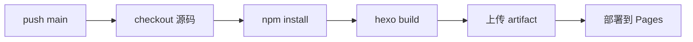

## 案例二（CI）：PR 触发 Node 项目测试 + lint + 覆盖率

第二个案例是典型的 PR 门禁 CI：每次 PR 自动跑测试、lint、覆盖率，作为合并的门槛。这类 workflow 是 GitHub 上最常见的 CI 形态。

```yaml
name: CI

on:
  pull_request:
    branches: [main]
  push:
    branches: [main]

jobs:
  lint:
    runs-on: ubuntu-latest
    steps:
      - uses: actions/checkout@v4
      - uses: actions/setup-node@v4
        with:
          node-version: 20
          cache: npm
      - run: npm ci
      - run: npm run lint

  test:
    runs-on: ubuntu-latest
    strategy:
      matrix:
        node-version: [18, 20, 22]
    steps:
      - uses: actions/checkout@v4
      - uses: actions/setup-node@v4
        with:
          node-version: ${{ matrix.node-version }}
          cache: npm
      - run: npm ci
      - run: npm test
      - name: Upload coverage
        uses: actions/upload-artifact@v4
        with:
          name: coverage-${{ matrix.node-version }}
          path: coverage/

  coverage-check:
    needs: test
    runs-on: ubuntu-latest
    steps:
      - uses: actions/download-artifact@v4
        with:
          path: all-coverage
      - name: 合并覆盖率报告
        run: npx nyc report --reporter=text-summary
```

拆解要点：

**触发。** pull_request（目标是 main）+ push（main 自身），PR 和主干提交都跑 CI。PR 场景下，workflow 跑的是 PR 分支的代码，配合分支保护"要求状态检查通过"，测试不过不能合并。

**两个 job 并行。** lint 和 test 互不依赖，默认并行执行，互不阻塞。

**矩阵测试。** test job 用矩阵跑 Node 18/20/22 三个版本，捕获版本兼容性问题。每个矩阵实例独立上传覆盖率产物（文件名带版本区分，否则互相覆盖）。

**覆盖率。** coverage-check 依赖 test 矩阵全部完成，下载所有实例的覆盖率产物，合并输出总结报告。这个 job 用 npx 直接跑工具，不需要额外 action。覆盖率上报的另一种常见方式是用 Codecov 等服务的 action（codecov/codecov-action），会把报告传到平台展示历史趋势，私有仓库要配置 token。

**和分支保护配合。** 在仓库设置里把这个 workflow 的状态检查设为 required，PR 的 lint、test、coverage-check 全绿才能合并。CI 门禁的完整形态：workflow 负责跑，分支保护负责强制。

## 案例三（发布）：tag 触发 release + changelog

第三个案例：打 tag 自动发布。开发者 push 一个 v1.2.0 的 tag，workflow 自动构建产物、生成 changelog、创建 GitHub Release。

```yaml
name: Release

on:
  push:
    tags:
      - 'v*'              # 匹配 v1.0.0、v2.1.3 这类 tag

permissions:
  contents: write         # 创建 release 需要写 contents

jobs:
  release:
    runs-on: ubuntu-latest
    steps:
      - uses: actions/checkout@v4
        with:
          fetch-depth: 0   # 拉完整历史，changelog 需要对比 commit
      - uses: actions/setup-node@v4
        with:
          node-version: 20
      - name: Build
        run: npm ci && npm run build
      - name: Generate changelog
        id: changelog
        uses: mikepenz/release-changelog-builder-action@v5
        env:
          GITHUB_TOKEN: ${{ secrets.GITHUB_TOKEN }}
      - name: Create Release
        uses: softprops/action-gh-release@v2
        with:
          body: ${{ steps.changelog.outputs.changelog }}
          files: dist/*
```

拆解要点：

**tag 触发。** on.push.tags 匹配 'v*'，只有推送 v 开头的 tag 才触发。发布流程和普通 push 分开，tag 是发布的信号。

**权限。** 整个 workflow 声明 permissions: contents: write，因为创建 release 需要这个权限。注意这里写在 workflow 级，而案例一里只写在 deploy job 级，两种写法都有效，粒度不同（按 job 更小）。

**changelog 生成。** release-changelog-builder-action 是一个第三方 action（mikepenz 出品），对比上一次 release 以来的 commit，自动生成 changelog。第三方 action 的 GITHUB_TOKEN 通过 env 传入。fetch-depth: 0 是它的前提：changelog 需要对比历史 commit，默认只拉最近一次提交不够。

**创建 release。** softprops/action-gh-release 用 changelog 作为 release body，把 dist/* 的构建产物作为附件上传。产物文件是 build 步骤生成的。

**发布流程的自动化边界。** 自动化的部分是：构建、changelog、release 创建。人工的部分是：决定打不打 tag、打什么版本号。这个分工符合"发布是商业决策"的原则：人决定版本和时机，机器执行发布动作。

## 案例四（self-hosted）：self-hosted runner 部署

第四个案例：部署 self-hosted runner。适用场景是托管 runner 满足不了需求时（需要访问内网、特殊硬件、或控制成本），自己维护执行机器。

### 注册流程

self-hosted runner 的注册流程（GitHub 官方文档）：

1. 打开仓库 Settings，进入 Actions 下的 Runners 页面，点 New self-hosted runner，GitHub 生成一个注册 token 和注册命令。
2. 在目标机器上下载 runner 应用（GitHub 提供的 runner 二进制包），解压。
3. 运行注册命令：`./config.sh --url <仓库地址> --token <注册token>`，按提示配置。
4. 运行 `./run.sh` 启动 runner，机器开始监听 job。

注册后 runner 出现在仓库的 Runners 列表里，状态 online。一个机器可以注册多个 runner（多开目录）。

### 标签与路由

注册时可以给 runner 打标签（label），workflow 用 runs-on 按标签路由 job：

```yaml
jobs:
  heavy-build:
    runs-on: [self-hosted, gpu]    # 只派发给带 gpu 标签的自建 runner
    steps:
      - run: echo "在 GPU 机器上构建"
```

标签路由的用途：同一仓库有多台不同配置的自建 runner（一台带 GPU、一台大内存），job 按标签选择合适的那台。runs-on 写 [self-hosted, gpu] 表示"必须是 self-hosted 且带 gpu 标签"的机器。

### 权限与隔离

self-hosted runner 的安全模型和托管 runner 不同，需要注意：

- 托管 runner 是每次全新的虚拟机，job 之间完全隔离；self-hosted 是常驻机器，job 之间共享机器环境，恶意 job 可能影响其他 job。
- 官方建议：自建 runner 只用于可信代码。仓库公开或允许 fork PR 时，fork 的 PR 也会尝试在 self-hosted runner 上跑（虽然 token 只读，但代码在机器上执行），有安全风险。
- 隔离手段：一台机器只服务一个仓库/组织（不跨仓库共享）、用容器隔离 job 执行环境、监控 runner 状态。

### 与 GitHub-hosted 的差异实践

- 冷启动：self-hosted 常驻，没有启动开销，依赖已装好时 job 更快。
- 环境漂移风险：机器环境可能被手动改过，和托管 runner 的"每次全新"相比，可复现性差。缓解：用容器镜像固定环境。
- 计费：self-hosted 不消耗分钟配额（前面 runner 对比讲过）。
- 维护：系统更新、runner 应用更新（GitHub 会提示版本过期）、磁盘清理，都要自己管。

self-hosted runner 适合"托管 runner 明确不够用"的场景，不应作为默认选择，默认还是 GitHub-hosted 更省心。

## 调试：act 本地运行、workflow_dispatch、日志排障

workflow 写错了，最快的方式是本地先跑，而不是一次次 push 到 GitHub 等结果。

### act：本地运行 GitHub Actions

act（nektos/act）是开源工具，用 Docker 在本地模拟 GitHub Actions 环境，读取 .github/workflows/ 下的文件并执行。它把 workflow 里的每个 step 跑在对应的 Docker 容器里，尽量还原 GitHub 的行为。

```bash
# 安装（macOS）
brew install act
# 运行所有 workflow
act
# 只跑某个 workflow
act -W .github/workflows/ci.yml
# 模拟 push 事件
act push
# 列出所有 job
act -l
```

act 的使用要点：

- 依赖 Docker：act 通过 Docker 跑容器，机器上要装 Docker。
- 模拟事件：默认模拟 push，可以指定其他事件（pull_request、workflow_dispatch）。
- 局限：GitHub 特有的服务（如 pages 部署、secrets 注入的完整行为）无法完全模拟，act 适合验证"语法对不对、步骤能不能跑通"，不适合验证"部署到 Pages 成功"。
- secrets：本地跑时 secrets 为空，可以用 .secrets 文件或环境变量传入测试值（注意不要提交真实的 secrets）。

act 的价值是把反馈循环从"push 等 1 分钟"缩短到"本地几秒钟"，特别适合调试 workflow 语法错误和 step 逻辑。

### workflow_dispatch：手动触发调试

不装 act 的话，workflow_dispatch 是最快的远程调试方式：手动触发 workflow 跑一次，观察结果。

做法：临时给 workflow 加 `on: workflow_dispatch`，推送到分支，然后在 Actions 页面点 Run workflow，选分支手动触发。适合调试"只在特定分支或特定条件下才触发"的 workflow，不用为了触发它去做一次真正的 push。

调试时可以在 workflow 里临时加 step 打印信息：

```yaml
- name: Debug context
  run: |
    echo "ref: ${{ github.ref }}"
    echo "event: ${{ github.event_name }}"
    echo "workspace: ${{ github.workspace }}"
```

### 日志排障

workflow 已经跑失败时，排障路径：

1. Actions 页面点进失败的 run，看哪个 job 红了。
2. 展开失败的 step，看日志。日志按 step 分组，每个 step 的完整输出都在。
3. 常见错误归类：
   - 语法错误：YAML 解析失败（缩进、Tab、冒号后空格），run 在队列阶段就失败，Actions 页面直接提示 workflow 文件有问题。
   - 依赖错误：npm ci 报 lockfile 不一致、包不存在。
   - 权限错误：job 需要写权限但 permissions 没声明，报 403 或 Resource not accessible。
   - 环境错误：runner 上没有某个工具、命令不存在。
4. 修复后重跑：GitHub 支持对失败的 run 直接 Re-run，不用重新 push。

一个实用的排障技巧：失败日志里搜 "Error:" 或 "error:"，通常直接指向根因；上下文看 step 的 name 和前后输出，能判断错误发生在哪一步。

## 优化：缓存、矩阵并行、时间对比

workflow 能跑通之后，下一步是让它跑得更快、更省。优化围绕三个方向：缓存、并行、减少无效触发。

### 缓存优化

缓存是收益最直接的优化。对照案例一的 pages.yml，它有一个可以改进的点：缓存 key 用的是固定值 `${{ runner.OS }}-npm-cache`，没有关联依赖清单。这意味着 package.json 更新后，缓存依然命中，可能装到旧依赖。

改进方式是用 hashFiles 把 lockfile 纳入 key：

```yaml
- name: Cache NPM dependencies
  uses: actions/cache@v4
  with:
    path: node_modules
    key: ${{ runner.OS }}-npm-cache-${{ hashFiles('package-lock.json') }}
    restore-keys: |
      ${{ runner.OS }}-npm-cache-
```

效果：package-lock.json 没变时命中精确缓存，秒装依赖；变了就 miss，重新安装并写入新缓存。restore-keys 的前缀匹配让"小改动"也能复用大部分旧缓存。

另一个缓存优化：确认缓存命中率。Actions 页面能看到每个 cache step 的命中状态（hit/miss），长期 miss 的缓存（比如 key 每次都变）等于没有缓存，反而增加存储开销。

### 矩阵并行优化

矩阵并行的优化点：

- 确认矩阵实例真的在并行跑：job 数少于 runner 池容量时并行，量大时部分排队。Actions 页面能看到每个实例的开始时间，如果时间接近，说明并行正常。
- 平衡粒度：矩阵维度太少浪费并行能力，太多消耗配额。用 2-3 个关键版本覆盖（当前 LTS + 上一代）通常够用，不必全版本。
- max-parallel 与自建 runner：自建 runner 机器有限时设置 max-parallel 防止任务堆积。

### 减少无效触发

- paths 过滤：只改 docs/ 时不跑测试 workflow：

```yaml
on:
  push:
    paths:
      - 'src/**'
      - 'package.json'
```

- concurrency：同一分支连续 push 只保留最新 run：

```yaml
concurrency:
  group: ${{ github.workflow }}-${{ github.ref }}
  cancel-in-progress: true
```

- 条件跳过：矩阵里不需要的组合用 exclude 排除。

### 时间对比与度量

优化要有依据，先度量再动手。记录 workflow 各部分耗时：Actions 页面每个 step 都有时长，能看出瓶颈在哪一步（下载依赖？测试？构建？）。常见的优化收益排序：

1. 依赖缓存命中（耗时从几分钟降到几秒）
2. 并行化独立 job（总时长除以并行度）
3. 减少触发（少跑就是最快的）
4. 大产物 artifact 精简

优化的原则和管道设计一致：先看数据，再优化；优化以不牺牲正确性为前提，缓存失效逻辑、测试覆盖不能因为提速而打折。

