# DeepSeek Harness 简析

- 平时用 Claude Code、Cursor 这类编码工具，也在用 dsh，一直好奇"模型外面那一层"到底做了什么：同一个模型，怎么进了工具里就能读文件、跑命令、循环干活。这篇把 DeepSeek Harness（dsh）从概念到架构拆开讲一遍，由浅入深，最后落到动手用
- 文章内容以官方仓库 deepseek-ai/deepseek-harness 的文档和源码为准，凡是讲到的机制都有官方依据，引用处带链接
- 先给一个时效提醒：dsh 目前是 developer preview，官方 README 明说在快速迭代、会有破坏性兼容变更。本文基于 2026 年 9 月初的官方 master 版本，若干细节日后可能对不上，以官方最新文档为准

## 概念与定位

### 前置概念：Agent

- Agent（智能体）在这里指的不是聊天框。聊天框是"你问一句，模型答一句"，答完就结束；Agent 是让模型进入一个"能干活"的循环，直到把任务做完
- 一次 Agent 工作的最小形态：
  - 观察：接收任务，看看当前环境（读文件、看目录、查状态）
  - 决策：根据观察决定下一步做什么，可能是直接回答，也可能是调用某个工具
  - 行动：执行决策，写文件、跑命令、请求接口
  - 反馈：看到行动结果，回到决策，继续循环
- 这个循环叫 Agent Loop（智能体循环）。模型本身只会"预测下一个词"，是 harness 把这个循环搭起来，模型才从"能对话"变成"能干活"

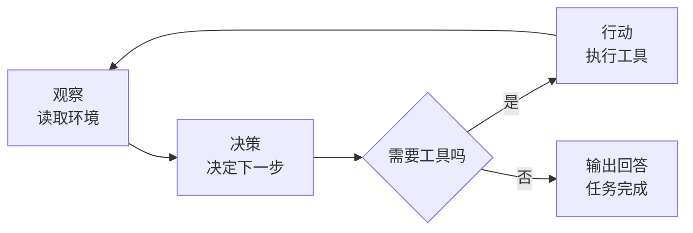

- 有两个容易混的点：
  - Agent 可以指"这套会干活的程序"，也可以指"模型本身"。平时说的"Agent 能力"，一般指前者，也就是模型加上外面那层循环和工具之后的能力
  - 没有循环的裸模型调用不叫 Agent。你调一次 API 问个问题，那是问答；Agent 是模型自己决定下一步做什么，反复做直到完成
- 参考文章《AI-LLM 的基础概念和通用素养》把 harness 拆成检索、记忆、上下文、工具、循环、反馈几块来讲，都是 Agent 能干活的原因，本文默认这些概念成立，直接讲 dsh 是怎么实现的

### 前置概念：Harness

- harness 直译是"马具、挽具"，在 AI 领域指"模型外面的工程"。模型是内核，harness 是外壳；模型决定上限，harness 决定实际用得好不好
- 发动机与整车的类比：模型是发动机，提供动力；harness 是整车，变速箱、底盘、方向盘、仪表盘都在 harness 里。光有发动机开不了车，光有模型干不了活
- 裸 API 调用和有 harness 的调用，差别很大：

| 维度 | 裸 API 调用 | 有 harness 的调用 |
| --- | --- | --- |
| 会话 | 一次问答，无上下文积累 | 持续会话，记忆上下文 |
| 工具 | 无，只能生成文本 | 可调工具、读写文件 |
| 循环 | 一次生成完事 | agent 循环，反复做事直到完成 |
| 环境 | 无感知 | 能读文件、看系统、操作 |
| 编排 | 用户手动编排每一步 | harness 自动编排 |

- harness 组装的东西，大致有这么几块：
  - 上下文：把该给模型看的信息组织成每一轮的输入
  - 检索：模型知识有限、过时、私有，harness 负责找资料喂给模型
  - 记忆：跨会话保存可复用的信息
  - 工具：把读文件、跑命令、请求接口暴露给模型
  - 循环：让"决策、行动、看结果、再决策"转起来
  - 反馈：工具结果、用户确认、错误处理回传给模型
  - 运行环境与沙箱：限制模型能碰到的资源，权限边界落在执行环境里
- 参考文章《AI-LLM 的基础概念和通用素养》的 harness 章也是按这个思路讲的，它讲通用概念，本文接着讲 dsh 这个具体实现

### dsh 是什么

- DeepSeek Harness，简称 dsh，是 DeepSeek AI 开发的开源 agent harness。官方 README 第一句：an open-source agent harness developed by DeepSeek AI
- 官方主页（[deepseek.com/harness](https://www.deepseek.com/harness/en/)）挂着一个公式：Agent = Model + Harness。模型负责"会思考"，harness 负责让模型真的能干活：理解环境、用工具、在真实环境里持续工作
- 官网还点出两条设计主线：
  - Everything is a plugin：每个能力都是插件，可替换、可重组（模型、工具、技能、会话、沙箱、存储、循环、调度、UI）
  - Every run is traceable：每次运行都可追溯，模型看到的一切都记录在 append-only 会话日志里，resume、fork、搜索、replay 都基于同一份事件流
- dsh 有双重身份：
  - 它是一个能直接用的 agent 产品：装好后 `dsh web` 打开界面就能用，像 Claude Code、Cursor 一样当编码工具
  - 它是一个插件化的 harness 平台（agent runtime）：所有能力都做成插件，通过配置组合，开发者可以按需求替换模型、工具、界面，甚至 Agent Loop 本身
- 支撑这双重身份的核心思想是 everything-is-a-plugin（一切皆为插件），底层由 Cordis 这个插件运行框架驱动。Cordis 负责把插件组织成一套可运行的系统，dsh 的每项能力都是挂在它上面的插件
- 版本与时效，再强调一次：
  - dsh 是 developer preview，官方 README 原文：THERE WILL BE COMPATIBILITY-BREAKING CHANGES（会有破坏性兼容变更）
  - 本文基于 2026 年 9 月初的官方 master 版本，如果你读到文章时版本已更新，细节可能对不上，以官方最新文档为准
- 官方来源：
  - 官方仓库：[deepseek-ai/deepseek-harness](https://github.com/deepseek-ai/deepseek-harness)
  - 官方文档站：[DeepSeek Harness 文档](https://deepseek-harness.github.io/deepseek-harness/)
  - npm 包：[@deepseek-ai/dsh](https://www.npmjs.com/package/@deepseek-ai/dsh)

### dsh 与 Claude Code / Codex / Hermes Agent 的定位对比

- 把 dsh 和 Claude Code、OpenAI Codex、Hermes Agent 放在一起比，不是比谁强，而是比定位和开放程度，方便看出 dsh 处在什么位置
- 四者的官方定位：
  - Claude Code 是 Anthropic 的 agentic coding tool，在终端和 IDE 里用，官方定位是"理解你的代码库、编辑文件、运行命令，帮你更快交付"
  - Codex 是 OpenAI 的 coding agent，在 IDE 里与代码并列使用，也可以把更大任务委托到云端执行
  - Hermes Agent 是 Nous Research 的自我改进 AI agent，内置学习循环，能从使用经验里创建和打磨 skills，还能在 Telegram、Discord 这类消息平台上常驻运行
  - dsh 是 DeepSeek 的开源 agent harness，CLI 加 Web UI，核心设计是一切皆插件

| 维度 | dsh | Claude Code | Codex | Hermes Agent |
| --- | --- | --- | --- | --- |
| 开发者 | DeepSeek AI | Anthropic | OpenAI | Nous Research |
| 开源 | 是（MIT） | 否 | 否 | 是（MIT） |
| 运行形态 | CLI + Web UI，另有 headless / SDK / ACP | 终端 CLI + IDE 扩展 | IDE 扩展 + 云端委托 | CLI（完整 TUI）+ 消息网关 + Desktop |
| 插件机制 | 一切皆插件（Cordis），模型、工具、Loop、UI 都可替换 | 插件目录，含 skills、agents、hooks、MCP 组件 | 角色化插件（role-specific plugins） | skills（agentskills 开放标准）+ MCP + 40+ 工具 |
| 模型 | 默认 DeepSeek 模型，适配器插件可换 | 官方以 Claude 为主，`/model` 可切，可经 `ANTHROPIC_BASE_URL` 接第三方 | 官方以 OpenAI 为主，`config.toml` 可配自定义 provider | 任意模型，`hermes model` 切换，无锁定 |
| 特色 | 插件化到内核，能力可重组 | 背靠 Anthropic | 背靠 OpenAI，云端委托 | 内置学习循环，自我改进，消息平台常驻 |

- 这张表里，dsh 的差异在"插件机制"这一行：可替换做到了系统级，连 Agent Loop 本身都是插件；Claude Code 和 Codex 的插件是在固定核心外面加东西；Hermes 的扩展靠 skills 和 MCP，同样不到系统级
- Hermes 的差异在别处：它是四者里唯一主打"自我改进"的，内置学习循环，会从使用经验里创建和打磨 skills，还能在消息平台上常驻干活，而不是只待在终端或 IDE 里
- 参考来源：
  - Claude Code 官方页：[claude.com/product/claude-code](https://claude.com/product/claude-code)
  - Claude Code 插件文档：[Plugins reference](https://code.claude.com/docs/en/plugins-reference)
  - Claude Code 模型配置：[Model configuration](https://code.claude.com/docs/en/model-config)
  - Codex IDE 扩展：[Codex IDE extension](https://learn.chatgpt.com/docs/codex/ide)
  - Codex 插件：[Codex for every role, tool, and workflow](https://openai.com/index/codex-for-every-role-tool-workflow/)
  - Codex 自定义模型 provider：[Advanced Configuration](https://learn.chatgpt.com/docs/config-file/config-advanced)
  - Hermes Agent 仓库：[nousresearch/hermes-agent](https://github.com/nousresearch/hermes-agent)
  - Hermes Agent 文档：[Hermes Agent 文档](https://hermes-agent.nousresearch.com/docs/)

### 实践：怎么判断一个 harness 适不适合自己

- 概念节讲了 harness 是什么，这一节讲怎么选。列几个判断维度：
  - 模型自由度：能不能换模型？dsh 的模型适配器是插件，改配置就能换；Hermes Agent 用 `hermes model` 也能随便切；Claude Code 和 Codex 官方以自家模型为主，但也留了口子：Claude Code 可经 `ANTHROPIC_BASE_URL` 或 LLM gateway 接第三方模型（社区工具 [cc-switch](https://github.com/farion1231/cc-switch) 就是这么做的），Codex 可在 `config.toml` 里配 `[model_providers]` 自定义 provider
  - 可扩展性：能不能加工具、改行为？dsh 一切皆插件，能改到 Loop 层；Hermes 靠 skills 和 MCP 扩展；别的产品多数在固定核心外面加插件
  - 现成资源：有没有可用的插件、技能、MCP server？Claude Code、Codex 背靠大厂社区，dsh 是开源社区加官方仓库
  - 稳定性：是不是成熟产品？dsh 还在 developer preview，破坏性变更多；Claude Code、Codex 相对稳定
  - 使用成本：安装配置的复杂度、日常运行的开销（token、额度）
- 没有绝对的对错，看你要什么：
  - 要"开箱即用、稳定"，大厂产品合适
  - 要"能改到内核、模型自由、参与开源"，dsh 这类插件化 harness 合适
  - 两个都要，可以拿 dsh 当研究对象，同时日常用顺手的产品

## 设计哲学

### 一切皆为插件

- dsh 最核心的设计思想是 everything-is-a-plugin（一切皆为插件）。这不是说"dsh 是一个固定核心，外面可以加插件"，而是组成 Agent 的主要能力、乃至传统意义上的核心部分，全部放进同一套插件体系
- 官方架构文档（architecture.md）有一句原话：
  - "Every part of the product is a plugin, including the model adapter, the tool registry, the session log, and the agent loop itself, so each is replaceable from configuration."
  - 翻译：产品的每一部分都是插件，包括模型适配器、工具注册表、会话日志、以及 Agent Loop 本身，所以每一块都能通过配置替换
- 这句话落到仓库里就是真实存在的包结构：
  - 模型适配器：`packages/llm/llm-deepseek`（DeepSeek 模型适配器）
  - Agent Loop：`packages/core/agent-loop`
  - 会话日志：`packages/session/session-log-deepseek`
  - 工具注册表：`packages/core/tools`
  - 它们都是和其他插件平级的 npm 包，没有谁天生是"内核"
- 官方架构文档还有一句更直接的话：
  - "There is no privileged core to patch: you extend dsh by mounting a plugin beside the others, and registrations are effects that unwind when their plugin unloads."
  - 翻译：不存在一个特权核心需要你去 patch。扩展 dsh 的方式，是在其他插件旁边再挂一个插件；所有注册都是可回卷的副作用，插件卸载时自动撤销
- 与"普通系统加插件"的区别，用一个表格说清：

| 对比点 | 普通系统加插件 | dsh 的一切皆为插件 |
| --- | --- | --- |
| 核心 | 固定核心，改不了 | 连 Agent Loop、模型适配器、会话日志都是插件 |
| 扩展方式 | 往核心外面挂载 | 在旁边挂载，可替换任意部分 |
| 替换粒度 | 换工具、换界面 | 换模型、换循环、换日志、换界面 |
| 卸载 | 通常要重启 | 插件可动态加载、卸载、热更新 |

- "一切"有边界：不是任意代码都能不受限制地塞进系统。dsh 会预先定义服务接口、Registry、事件、UI Slot 等扩展位置，插件必须遵守相应约定。强调的是"主要系统能力都采用统一的插件方式实现"，而不是"系统不存在任何结构"

### 什么是插件、哪些能当插件

- 在 Cordis 的世界里，插件就是"实现了一个功能入口的对象"。官方 primer 的定义：
  - "A plugin is a object that implements Service. It can be a function with optional inject and apply(ctx) fields, or a Service subclass whose lifecycle Cordis mounts into the current context."
  - 翻译：插件是一个实现了服务的对象，可以是一个带可选 inject 和 apply(ctx) 字段的函数，也可以是一个生命周期由 Cordis 挂载进当前上下文的服务子类
- 官方注册表文档（registry.md）把插件的形态写得更具体：

```ts
// vendor/cordis/src/registry.ts —— 插件入口形态
type Plugin<T = any> =
  | Plugin.Function<T>      // 函数插件：直接以 (ctx, config) 调用
  | Plugin.Constructor<T>   // 类插件：以 new (ctx, config) 构造
  | Plugin.Object<T>        // 对象插件：含 apply(ctx, config) 方法
```

- 插件还可以声明一些元数据，让 Cordis 知道怎么用它：
  - `name`：显示名，用于诊断和日志
  - `Config`：配置校验器，插件启动前校验配置
  - `inject`：这个插件需要哪些服务，服务齐了才会加载
  - `provide`：这个插件提供哪些服务
- 从 dsh 的整体结构看，插件大致覆盖六类能力：

| 能力类别 | 包含的插件 |
| --- | --- |
| 模型与推理 | 模型适配器（DeepSeek 或其他）、Agent Loop、上下文压缩 |
| 工具与执行 | 工具注册表、文件系统、文件编辑器、Shell、持久终端、LSP、Web Search、Web Fetch、MCP、Skill、子 Agent |
| 会话与状态 | Session Event Log、会话持久化（JSONL 或 SQLite）、查询、回放、标题、统计、Storage |
| 权限与运行环境 | 用户审批、权限预设、文件访问策略、进程 Sandbox、凭据管理 |
| 任务编排与后台 | Goal、Todo、Workflow、后台 Job、调度、各种 Subagent Provider |
| 交互入口与界面 | Web Server、Headless Runner、ACP、API、浏览器侧边栏、会话界面、工具结果视图 |

- 官网（[deepseek.com/harness](https://www.deepseek.com/harness/en/)）对插件能力的列举是九个词：models、tools、skills、sessions、sandboxes、storage、loops、scheduling、UI，和六类能力的划分是一回事，只是分类粒度不同

### 插件化程度对比

- 概念节讲了 dsh 的一切皆为插件，这一节把它和其他产品比一比插件化的程度。对比对象还是 Claude Code、Codex、Hermes Agent

| 维度 | dsh | Claude Code | Codex | Hermes Agent |
| --- | --- | --- | --- | --- |
| 扩展哲学 | 一切皆插件，核心也可换 | 固定核心 + 插件目录 | 固定核心 + 角色化插件 | 固定核心 + skills / MCP |
| 核心（Agent Loop）可替换 | 是 | 否 | 否 | 否 |
| 扩展单位 | Cordis 插件（函数/类/对象） | 插件目录（skills/agents/hooks/MCP） | 角色化插件 | skills + MCP server |
| 扩展深度 | 服务、事件、副作用、UI 都能动 | 在核心外挂载 | 在核心外挂载 | 在核心外挂载 |
| 模型可换 | 配置换 | `/model` 切换，可经 `ANTHROPIC_BASE_URL` 接第三方 | `config.toml` 可配自定义 provider | hermes model 换 |

- 结论很直接：dsh 把"可替换"做到了系统级，其余三家的插件都是在固定核心外面加东西。这不是说 dsh 更高级，而是它选择了"可组合性优先"这条路，代价是你要理解 Cordis 这套插件机制才能改到内核

### Web UI 也是插件

- 不只是 Agent 的"脑、手、记忆"可以替换，用户看到的界面同样是可组合模块
- dsh 的界面相关能力分布在这些包里：
  - `packages/web/web`：Web 能力本身
  - `packages/bundle/web-app`：浏览器应用，作为 `web` profile 的一层
  - `packages/bundle/headless`：无界面的单次运行器
  - `packages/bundle/acp-app`：自动化用的 ACP server
- 也就是说，Web Server、Headless Runner、ACP、API 都是插件，由 profile 组合出来。你甚至可以在不想要网页界面的部署里把 web-app 换成 headless，跑成纯命令行
- 官网在"一切皆插件"里明确列了 UI：每个能力都是插件，包括 UI。dsh 不是"先写好一个固定网页，再给你几个按钮"

### 实践：识别 dsh 里的插件

- 概念节讲了插件有哪些形态和类别，这一节讲怎么把"一切皆插件"落到实际操作
- 最直接的办法是让 dsh 把自己装了哪些插件打印出来。装好 dsh 之后，运行：
  - `dsh --profile web --dump-config`
  - 这个命令会打印本机 `web` profile 启动时的完整插件树，一行一个插件条目
  - 你在里面能看到模型适配器、工具、会话持久化、沙箱、UI 等一行行列出来，每行都有 id，任何一行都能被你的 patch 替换
- 识别思路：看到任何"能力"，就问它是不是一个插件
  - 换模型，是换 `llm-deepseek` 这个插件
  - 加一个自定义工具，是挂一个工具插件
  - 想改会话存储格式，是换 `session-persistence-jsonl` 这个插件
  - 想改权限规则，是调 `permission-presets` 或 `approval` 插件
- 插件化思维对使用者的影响：在 dsh 里，"改行为"通常不是改源码，而是"选插件、配配置、写 patch"。不理解这套机制时，改起来像黑盒；理解了，就变成拼积木
- 想自己写插件，从官方教程开始：[Cordis 教程](https://github.com/deepseek-ai/deepseek-harness/blob/master/docs/cordis-tutorial/index.md)
  - 教程 01 讲第一个插件怎么写
  - 教程 02 讲生命周期和 effect
  - 教程 06 讲组合与 HMR（热更新）

## 整体架构

### 架构总览

- 官方架构文档的第一句，就是看 dsh 运行时的总纲：
  - "A running dsh is a plugin tree composed at boot from ordered layers."
  - 翻译：一个运行中的 dsh，是启动时由有序层组合成的插件树
- 这句话有两个重点：
  - "插件树"：运行中的 dsh 不是一个大程序，而是很多插件挂在一起组成的结构
  - "启动时由有序层组合"：这棵树的组成是启动阶段就定好的，依据是配置（profile、bundle、patch），这部分在 Cordis 插件运行时详讲
- 从请求处理的角度看，dsh 有一条主线：
  1. 入口接收请求（Web 界面、ACP、SDK、命令行四种）
  2. 请求交给 ctx.agents（Agent 注册表），找到或创建对应的 Agent
  3. Agent 由 Agent Loop 驱动，在模型（LLM 适配器）和工具之间循环
  4. 循环的每一步都记录进 Session Event Log（会话事件日志）
  5. 输出适配器把结果送回入口
- 其中几个核心包的职责，官方架构文档有一张表：

| 包 | 职责 | ctx key |
| --- | --- | --- |
| core/session | append-only 会话事件日志与内存存储 | ctx.sessions |
| core/system-prompt | 提示段与工具 schema 组装 | ctx.systemPrompt |
| core/tools | 带作用域的工具注册表与守卫执行管线 | ctx.tools |
| core/agent | Agent 接口、活注册表、agent 事件 | ctx.agents |
| core/agent-loop | 默认的 Agent Loop 实现 | ctx.agentLoop |
| llm/llm | 消息与流式词汇、模型适配器 seam | ctx.llm |

- 一个关键认知：Cordis Runtime 是全局底座（控制平面），不是请求流里的某一步。请求确实会经过 Agent Loop，但 Cordis 是所有插件挂载、服务互相调用、事件广播的载体，它在你启动 dsh 的那一刻就在运行，负责把这棵插件树组织好

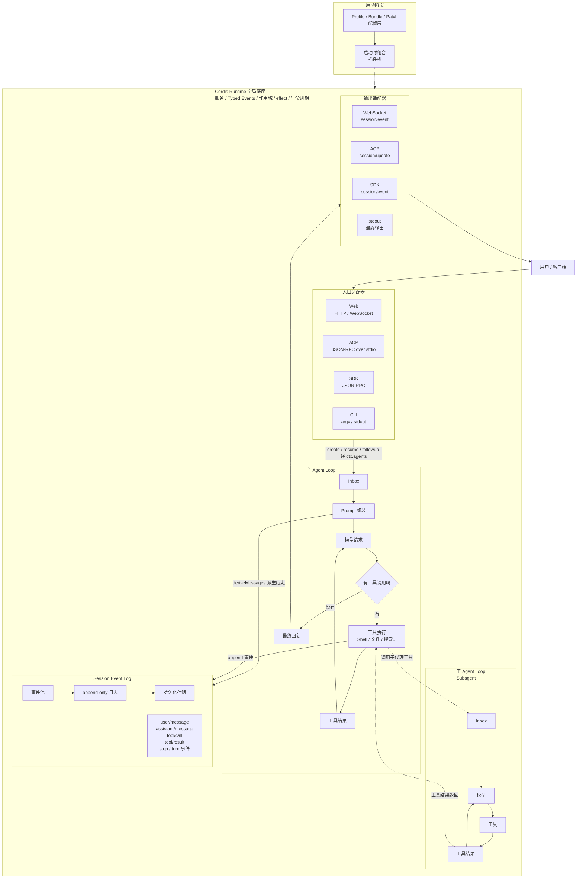

- 这张图是全文的总纲：启动阶段组合出插件树，之后整个运行时都活在 Cordis 底座里。底座内部是五块：入口适配器、主 Agent Loop、子 Agent Loop、Session Event Log、输出适配器。主循环里的工具可以再开子循环（Subagent），循环产生的每一步事件都进会话日志，历史从日志派生，结果从输出适配器送回

### 入口层：Web / ACP / SDK / CLI

- dsh 有四种面向用户的入口，对应官方预置的 profile（一种 profile 就是一套命名好的插件组合）

| 入口 | profile | 形态与协议 |
| --- | --- | --- |
| Web UI | web | HTTP + WebSocket，浏览器界面，支持热更新 |
| Headless | headless | 命令行参数加 stdout，一次性运行，无服务端 |
| SDK | sdk | JSON-RPC 协议，TypeScript / Python 的 client/server |
| ACP | acp | Agent Client Protocol（JSON-RPC over stdio），自动化专用 |

- 还有一个 sdk-minimal profile，是刻意维护的一个更小、独立的 SDK 组合，不套用 dsh-base
- 这些入口共享第一层 dsh-base（模型适配器、工具、持久化、沙箱与审批策略、设置、凭据、遥测），在此基础上每个入口再叠加自己的部分：
  - web 加浏览器应用
  - headless 加一个没有服务端的一次性运行器
  - sdk 加 SDK 的 JSON-RPC server
  - acp 加一个只做自动化的 ACP server
- 各入口的请求最终都汇到同一个地方：ctx.agents。Web 界面、SDK 客户端、ACP 客户端、命令行，它们驱动 Agent 的方式是一样的，只是协议不同
- 协议细节上有个差异值得注意：
  - web 是浏览器应用，走 HTTP 和 WebSocket，人直接对着界面操作
  - sdk 是程序化的 JSON-RPC，TypeScript 或 Python 代码里调用
  - acp 走标准的 Agent Client Protocol（[agentclientprotocol.com](https://agentclientprotocol.com)），设计给自动化用：外部子代理、测试运行器、脚本控制器。它只发标准 ACP 消息，不发 dsh 私有数据
- 驱动一个 Agent 有三种基本操作：
  - create：新建一个 session 和 Agent
  - resume：先加载持久化的 session，再继续
  - followup：在现有 Agent 上追加一条普通后续消息
- web profile 是"活"的（配置改了会热更新重载），headless、sdk、sdk-minimal、acp 是启动时一次性应用全部层，因为对一个一次性运行或 stdio 应用来说，任务开始后再换依赖会破坏生命周期

### 主循环：turn 与 step

- Agent Loop 是让模型"能干活"的那层循环，dsh 里它有两个基本单位：
  - step：一次模型请求，加上这次请求调用的所有工具
  - turn：零个或多个 step，从第一个输入被认领开始，到不再欠任何请求时结束
- turn 是"完成用户一次输入的全过程"，step 是其中的"模型想一次、干一次活"的单元。一个 turn 里模型可能来回思考并调用工具很多次，那就是多个 step
- 官方架构文档给了 turn 的完整事件流程，这里是它的简化版：

```text
turn/start 回合开始
  claim 认领输入（next-step 输入 + 一个排队消息）
  assemble 组装 prompt 段与工具 schema
  agent/pre-step 拦截点：可改写消息或整体拒绝
  step/start 一个 step 开始
    把进入的消息追加为 user/message
    从会话日志派生模型历史
    agent/request 拦截点 -> llm/stream 流式请求 -> assistant/chunk 流式输出 -> assistant/message 完整回复
    tool/call 工具调用 -> 工具执行管线 -> tool/result 工具结果
  step/end 一个 step 结束
  如果工具还欠着另一个请求，或又有新输入到达，就再 claim 开下一个 step
  agent/turn-stopping 拦截点
turn/end 回合结束
```

- 官方把事件分成两类：
  - durable session events（持久会话事件）：turn/start、turn/end、step/start、step/end、user/message、assistant/message、tool/call、tool/result，这些会写进会话日志，长期保存
  - live extension points（实时扩展点）：agent/pre-step、agent/request、llm/stream、tools/*，这些是运行中的拦截点，供插件观察或插手，不写日志
- 输入通过一个 inbox（收件箱）到达 Agent，inbox 内部是两个有序的待处理消息列表：
  - next-turn：排着下一个回合要处理的消息
  - next-step：当前回合内、下一步要处理的输入
  - Agent 认领（claim）时，把全部 next-step 输入取走，同时在回合边界再取一个 next-turn 消息

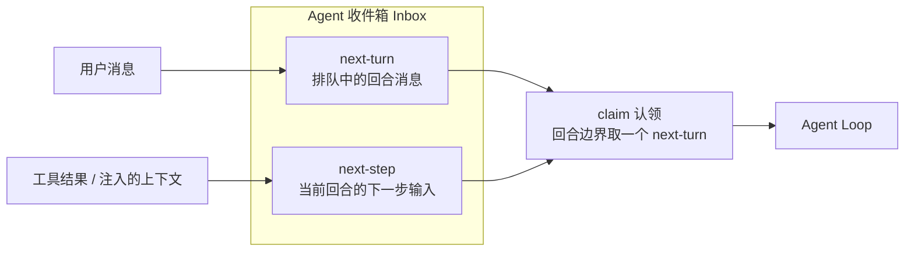
- 模型历史的来源值得提前点出：模型每次请求看到的上下文，不是聊天软件里那种把最近几条消息拼起来，而是从一条 append-only 的会话事件日志里派生出来的。这条日志就是模型的记忆本体，会话系统的各个机制都围绕它展开
- agent/pre-step 是决定"模型看到什么"的拦截点，它可能改写要进入的消息，也可能整体拒绝；如果第一个认领被拒绝，回合仍然会以"没有花费任何 step"的方式关闭，日志照样记录这次尝试
- 现在用 mermaid 把 turn 和 step 的关系画出来：

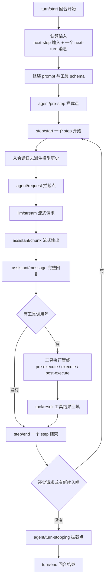

- 这张图里最容易被忽视的是那条从 step/end 回到 step/start 的边：模型调完一个工具，拿到结果，如果它还打算再调一个工具，循环不会结束，而是开新的 step 继续，直到它认为任务完成。这就是"模型自己决定下一步做什么"在 dsh 里的落地形态
- Agent Loop 不是唯一的实现：core/agent 定义 Agent 接口，core/agent-loop 是默认实现。接口上有统一的 send 方法，以及 followup、steer、inject 这些便捷别名，分别对应"追加普通回合""路由到下一步""注入上下文"

### 工具层：ctx.tools 与 guard 执行管线

- Agent Loop 决定"要不要调工具"，工具怎么被找到、怎么被允许、怎么执行、结果怎么回填，是工具层的事
- ctx.tools 是一个带作用域的工具注册表，外面还有一层守卫执行管线（guarded execution pipeline）。官方架构文档把工具层定位为"scoped tool registry and guarded execution pipeline"
- 工具的执行管线有完整的官方流程图（[tool-execution-pipeline.md](https://github.com/deepseek-ai/deepseek-harness/blob/master/docs/tool-execution-pipeline.md)），这里按顺序讲它的关键环节：

```text
tool/call 会话事件（执行前先记录）
UI 挂起卡片（模型端还在等）
tools/pre-execute 瀑布（hooks / 权限 / 沙箱在这里拦截）
注册的单调守卫（deny 拒绝或 abstain 弃权）
ctx.approval 审批弹窗（没有可答的审批者就拒绝）
tools/execute 瀑布（超时、重试、指标，包在派发外面）
工具本体 execute() 执行
fs/write-intent 或 fs/edit-intent（文件系统写入守卫，只对 tool-fs 生效）
工具自身产生的事件（todo/write、fs/observed、hook/invoked 等）
tools/post-execute 瀑布（接受 / 阻断 / 替换 / 附加上下文）
外层规范化（异常变成 isError）
ToolDefinition.finalizeContent（最后的内容不变量）
tools/result 同步通知（冻结的权威结果）
tool/result 会话事件（模型看到的唯一结果）
```

- 这条管线想解决几件事：
  - 拦截要发生在执行之前：pre-execute 瀑布里，权限、沙箱、审计插件都能拦下这个工具调用，拦住就不执行
  - 审批要有兜底：approval 是一次性询问，如果系统里没有能回答的审批者，默认拒绝，不会放行
  - 执行要能被包装：超时、重试、指标这类"围绕派发"的关心点放在 execute 瀑布里，不写进工具本体
  - 结果要唯一且权威：最终以 tool/result 事件为准，UI 展示、模型回填、统计都用它，避免各看各的
- 文件和子进程相关工具还有个特殊性：tool-fs 的写入会触发 fs/write-intent、fs/edit-intent 事件，读写前检查在 tool-fs 下层做，属于文件系统能力自己的守卫
- 工具注册的连带效果：一个工具注册进 ctx.tools，它的 schema 就会加入 prompt assembly，模型在下一轮就能看到并调用它。所以"给模型加一个能力"，落到操作上就是"注册一个工具插件"
- 下面这张图把整条管线串起来，重点看权限、审批、守卫是如何一层层裁决的：

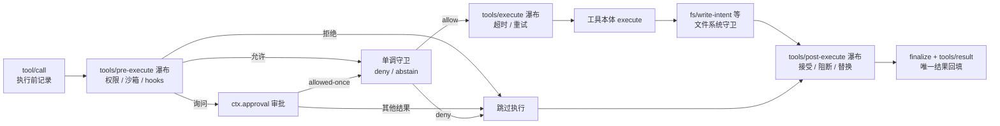

### Subagent 子代理机制

- 子代理（subagent）是 Agent 把一部分工作委托给另一个 Agent 的能力。dsh 的模型是 Main Agent 加 Subagent，不是 worker 加 orchestrator：主 Agent 调一个"子代理工具"，得到一个子 Agent，子 Agent 有自己的会话、自己的模型循环，最后把结果作为工具结果返回
- 它的架构要点：
  - ctx.subagents 是一个"命名 provider 注册表"，和 bash 那种"单一执行器"不一样，多个 provider 可以同时注册、按名字选用
  - 官方预置的 provider：spawn（同进程里新建子 agent）、fork（带着父会话历史新建）、acp、codex、claude-code、dsh-sdk
  - 模型侧的入口是 tool-subagent（按 provider 委托）和 tool-subagent-control（全局控制）
- 子代理有两种模式，差别很大：

| 维度 | one-shot（一次性） | continuable（可继续） |
| --- | --- | --- |
| 生命周期 | 一次 start，跑完就结束 | 持久子 session，可跨多轮 |
| 取结果 | SubagentRun.result 直接拿 | 通过 inbox FIFO 多轮交互 |
| 代表场景 | 委托一个独立小任务 | 后台常驻子代理，多次追问 |
| 控制 | 一次委托 | send_message / interrupt / list |

- 派发链路（one-shot 视角）：
  1. 主 Agent 决定委托，调用 tool-subagent
  2. SubagentRuntime 检查所选 provider 是否支持所需能力，不支持就抛类型化错误，绝不"接受了又不做"
  3. provider.start 创建子 Agent
  4. 子 Agent 用主 Agent 的 ctx 创建，有独立 session 和完整 Agent Loop
  5. 主 Agent 通过 SubagentRun.result 拿到 SubagentResult（output、可选 structured、stopReason）
- 可继续子代理（continuable）是另一套机制：
  - 它有一个持久子 session，同一时刻最多有一个进程内 Activation（"重建出来的子 Agent 在内存里的那段时期"）
  - 子 Agent 的收件箱是唯一的 FIFO 队列：父发消息、子回复、再发、再回，可以多轮
  - 父给子发消息用 send_message，只允许 direct parent 或 direct continuable child 之间
  - 子结束时，continuation manager 给它的 direct parent 发一个 settle notice，说明这一期怎么结束的，并带上最后的 assistant 内容
  - 控制工具有三个：send_message（发消息）、interrupt_agent（打断）、list_agents（列出）
- fork 是"带记忆的子代理"：fork provider 会读父会话日志里从 seq 0 开始的已完结 turn 前缀，作为子会话的种子。这样子代理一开始就"知道"前面发生了什么，不是从零开始
- 嵌套深度有约束：每个子代理持久化自己的 delegationDepth，provider 声明 maxDepth，超过就不允许再往下开，防止无限嵌套
- 子代理与主循环的关系：从主 Agent 的视角，调用子代理就是调用一个工具，走的就是工具执行管线；子 Agent 内部又跑一套自己的 Agent Loop。所以"子代理"是"工具"和"独立 Agent"两个概念的组合
- 下面这张图表示派发、执行、返回的链路：

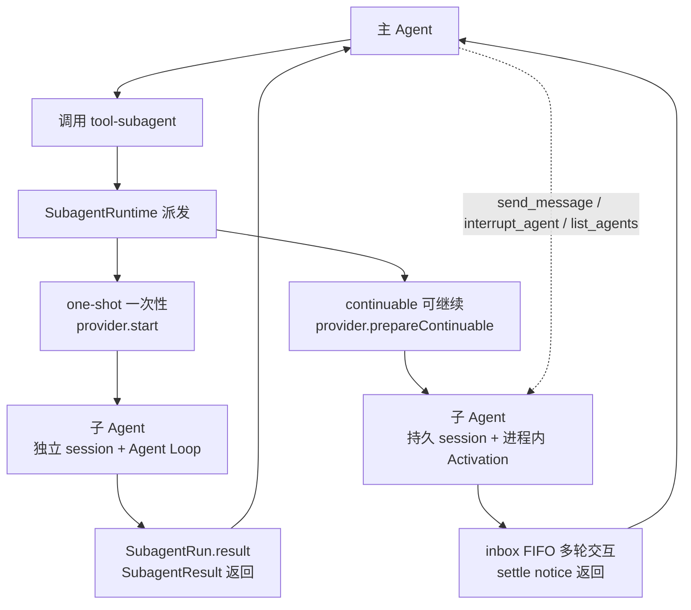

### 会话系统：Session Event Log

- 会话系统是 dsh 里"模型的记忆本体"。它不像聊天软件那样把对话历史存在一个单独数组里，而是维护一条 append-only 的会话事件日志（Session Event Log），模型上下文、UI 展示、恢复、分支、回放全都从这条日志派生
- 官方原则只有一句话：**Model-visible means logged**（模型能看到的，必然已记录）。任何进入模型请求的东西，都必须能从日志里重建出来，这是运行时强制的不变量。反过来，新加一个模型能看到的输入，就必须新增一种会话事件类型，然后从日志渲染
- 日志承载的核心事件类型，官方列在 [session.md](https://github.com/deepseek-ai/deepseek-harness/blob/master/docs/subsystems/session.md)，一共有 12 种：

| 事件类型 | 载荷要点 | 说明 |
| --- | --- | --- |
| turn/start | turn 编号 | 一个回合开始 |
| turn/end | turn 编号、结束原因 | 一个回合结束 |
| step/start | turn、step 编号 | 一个 step 开始 |
| step/end | turn、step 编号 | 一个 step 结束 |
| user/message | 用户消息 | 用户输入 |
| assistant/chunk | turn、step、流式块 | 模型流式输出的片段 |
| assistant/message | turn、step、完整回复 | 模型完整回复 |
| tool/call | turn、step、工具名、参数 | 工具调用开始 |
| tool/result | turn、step、结果 | 工具调用结果 |
| request/header | 请求信封 | 本轮请求的配置快照，非表面事件 |
| request/context | 路由上下文 | 请求走到的模型/上下文容量，非表面事件 |
| session/end-seed | 无 | fork 种子结束标记 |

- 前九种是"表面事件"（surface events），直接构成模型看到的对话；request/header 和 request/context 不产生模型消息，是给重建用的元数据
- 模型每次请求的历史，由 `deriveMessages()` 从日志投影出来：它把 user/message、assistant/message、tool/call、tool/result 这些表面事件转成模型的消息序列，再配上 request/header 里的系统提示和工具 schema，构成这次请求的完整上下文
- 原始 assistant/chunk 事件被保留，不是只存压缩后的消息：这样回放和 UI 能还原逐字输出
- 从这条日志派生的东西不止模型上下文：
  - resume：恢复一个会话，读日志重建状态
  - fork：在某个 turn 边界分支出新会话
  - replay：按日志重放一次交互
  - 标题生成、遥测、持久化：也都读这条日志
- 下面这张图是日志的核心循环：

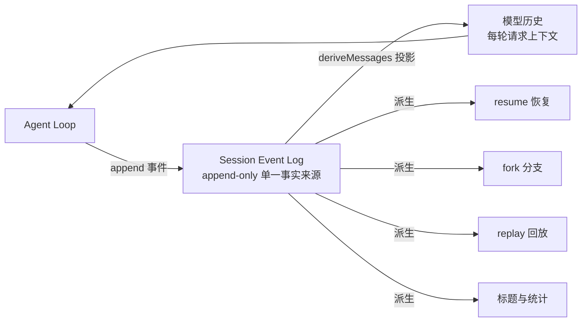

- 理解这条日志，就理解了 dsh 的会话：它不维护"一份模型历史 + 一份 UI 记录 + 一份持久化"，而是只维护一份日志，其余都是投影。这是"单一事实来源"在会话层的落地

### 会话记录的落盘：JSONL 与版本

- 内存里的日志要持久化，靠的是持久化 seam（SessionPersistence）。它定义 create/open/stat/list 四个操作，返回一个每会话的句柄（read/append/flush/close），句柄拿着日志的所有读写权和"单写者"所有权
- 官方默认的 provider 是 JSONL 后端：每个会话一个 append-only 的 JSONL 日志文件
- 磁盘布局是这样的：

```text
<root>/
  --<normalized-cwd>--/        # 可读的项目目录（无 cwd 时是 _no-cwd/）
    <session-id>/              # 会话 id 安全转义成路径段
      session.jsonl.zstd       # 默认：校验和 header 帧 + 追加帧
      session.jsonl            # 只有配置 compression: 'none' 时才出现
```

- 配置项：
  - root：根目录，唯一必填
  - compression：物理编码，'zstd'（默认，校验和 Zstandard 帧）或 'none'（纯文本行）
  - packChunks：是否把连续的 assistant/chunk 打包成一行
- 选 zstd 还是纯文本是存储内部细节：对 Agent Loop、模型、回放来说，逻辑事件流完全一样，换后端不改变任何行为
- 版本机制是开发者预览的"安全带"：
  - 每个日志文件头带一个 SESSION_FORMAT_VERSION，目前是 0
  - 打开一个版本号超前或落后的日志，后端直接拒绝（SessionFormatUnsupportedError），并且能区分"这是更新的 harness 写的，请升级"和"这个版本没有升级路径"
  - 日志里出现本版本不认识的必需事件类型，同样拒绝打开，不会默默跳过导致读错
- 崩溃恢复有一套明确的做法，官方文档讲得很清楚：
  - 一个日志在回合中途崩溃，会留下没有 turn/end 的 turn/start。持久化不去截断或修补它，因为长任务里一个 turn 可能巨大，那些事件在崩溃前已经安全落盘
  - 只有"撕裂的物理尾"（一次没落盘的 append 留下的残缺帧）会被丢弃，且在写入路径下一次 append 前截断
  - 恢复是读取方的职责：resume 时 Agent Loop 读日志，算出缺失的 closers（缺失的工具错误、打开的 step/end、合成的一条 turn/end，reason 标记为 interrupted），当作普通批次补写进去
  - 恢复语义上有两条保守规则：一条 assistant 请求没有配对的工具调用，记 TOOL_NOT_STARTED；一条工具调用没有结果，记 TOOL_OUTCOME_UNKNOWN，模型只能重试只读或幂等的工作
- 日志之外还有一圈只读投影，让"用会话记录"这件事变得可用：
  - session-query：把日志导入 SQLite 全文索引，支持搜索
  - session-title：给会话生成标题（LLM 生成或用户指定）
  - session-stats：会话统计
  - 这些投影都不改日志本身，日志始终是权威

### 上下文压缩 compact

- 长任务里，会话日志越积越长，模型的上下文窗口装不下。dsh 的答案是 compaction（上下文压缩），把"旧的一部分上下文压成摘要，替换掉原文"，让窗口腾出空间
- compact 在 dsh 里是一个能力 seam（capability seam），和 bash 一样拆成三份：
  - 服务定义：ctx.compaction（CompactionEngine）
  - 服务提供者：dsh-compaction-basic（默认后端）
  - 人类侧消费者：/compact 命令
- 它有一套自己的会话事件，构成"压缩锁"：
  - compaction/start 先记录（带回合号，null 表示手动独立一次）
  - 然后做摘要、记录 compaction/summary（含摘要、被遮罩的范围、预估 token 数等）
  - 最后 compaction/end 释放锁
  - 锁最后释放的意义：如果中途崩溃，日志里会留下一个没有配对的 compaction/start，能被识别成"孤儿锁"，而不是假装压缩成功了

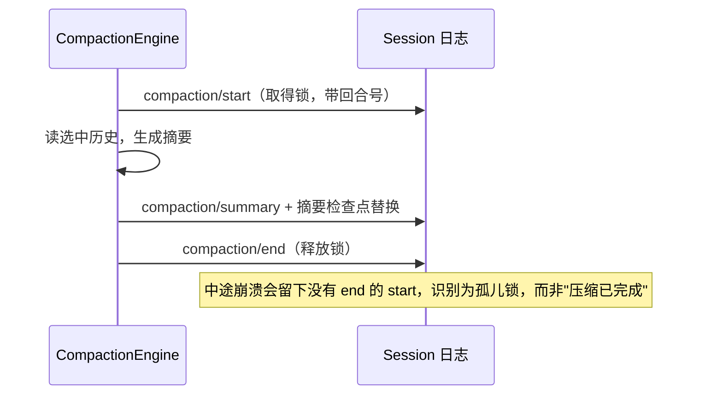
- CompactionEngine 暴露三种压缩入口：
  - compactIfNeeded(agent, trigger)：按触发条件自动压，条件是 pressure（压力）或 context-overflow（溢出）
  - compactNow(agent)：即使没到压力也压一次有用的，作为回合间的维护
  - compactRegion：对一段明确的范围做压缩
- 两个触发时机：
  - 压力压缩：在 agent/pre-step 瀑布里、请求派生之前跑。压力达标或溢出后，会先调用可选的 ctx.toolResultPruner 裁剪工具结果，再量测、选范围
  - 失败恢复：在 agent/request-error 里跑，前提是表面替换生成有推进
- ToolResultPruner 是可选的服务，负责把过长的工具结果裁掉：默认按 thresholdChars（阈值）、headChars（保留开头）、tailChars（保留结尾）三个参数，把工具结果改成"开头加结尾"，中间省略
- 回答一个最实际的问题：不配任何参数时，compact 到底保留什么、去掉什么。默认参数是：

| 参数 | 默认值 | 含义 |
| --- | --- | --- |
| thresholdRatio | 0.8 | 上下文用到路由模型窗口的 80% 时开始压缩 |
| retainRatio | 0.16 | 最近的 16% 对话逐字保留 |
| maxTokens | 8192 | 摘要请求的输出上限 |

- 按这个默认跑一次压缩，实际发生的事：
  1. 达到 80% 阈值后，如果挂了 ToolResultPruner，先把过大的工具结果裁掉（裁剪不发模型请求，可能就此低于阈值，连摘要都不需要做）
  2. 裁完仍超阈值，才做摘要：把最早的"平衡跨度"（一段开头和结尾都完整的对话区域）选出来
  3. 用一次额外的模型请求重放这段历史，写出一份结构化摘要（按固定模板分节：主要意图、关键技术点、文件与代码、错误与修复、未完成工作、当前工作、下一步、关键上下文）
  4. 用这条摘要替换掉被选中的老区域，最近的 16% 原文保持不动，对话从摘要继续
  5. 报告压掉了多少条历史项、释放了多少 token
- 有两条边界是压缩动不了的：
  - 它只压缩派生历史，系统提示、工具 schema、会话前缀不参与，压不了
  - 一个不可分割的单元（比如一次超大的工具调用）不能拆分。如果整段对话就是一个不可分割单元，压缩会什么都不做、什么都不写
- 摘要检查点用 <compacted-summary> 标签包起来写进日志，后面紧跟保留的最近单元。模型下一次请求看到的是"自动生成的检查点说明 + 摘要 + 保留的原文"
- 压缩的成本是一次额外的模型请求（读历史、写摘要）；只有摘要文本被保留，被压掉的原文字节不再进模型上下文，但仍在 append-only 日志里
- 一个容易误会的点：compact 不是模型可见的工具。模型没有"压缩自己"的工具可调，压缩由后端按条件自动触发，或者由人通过 /compact 命令发起

### 沙箱与权限控制

- 模型能跑命令、读写文件，就得有人回答"哪些能碰、哪些不能碰"。dsh 把这件事拆成两层：沙箱管文件系统效果，审批管"这个动作要不要问人"
- SandboxMode 只管文件系统效果，有三种模式：

| 模式 | 效果 |
| --- | --- |
| read-only | 拒绝写入（POSIX 运行器额外给 shell 一个 /dev/null 出口） |
| workspace-write | 允许在工作区根目录和后端承诺的临时区里写 |
| danger-full-access | 不设防，绕过限制 |

- 只有前两种能发给沙箱 provider；danger-full-access 的消费者直接以原始 argv 启动，不经过 ctx.sandbox
- 具体某个执行用哪个模式，由 ctx.sandboxPolicy 决定。它按优先级解析：
  - 显式批准的模式覆盖 > 会话里最后一条 sandbox/mode 事件 > 部署默认模式
  - 工作区根目录是 workspace-write 的写入边界，随会话 cwd 一起落到每个强制执行的环节
- "执行世界共享"是这个设计里很关键的一点：文件系统和子进程共享同一个执行世界，指向一个远程沙箱时，Bash、PTY、LSP 会一起跟着搬过去，不需要为每个工具单独配沙箱
- 权限预设（permission presets）把"沙箱模式 + 审批策略"捆成一个可选的组合，默认表有两项：
  - workspace-write：sandbox 用 workspace-write，审批用 ask
  - danger-full-access：sandbox 用 danger-full-access，审批用 never
- 审批（approval）回答"这个具体动作能不能继续"：
  - ApprovalPolicy 只有两个值：ask（默认，交给审批者链）和 never（直接拒绝，不打扰任何人）
  - 结果类型是封闭且 fail-closed 的：只有 allowed-once 放行，rejected、cancelled、unavailable 全部拒绝
  - 系统里没有能回答的审批者，结果就是 unavailable，等于拒绝，不会偷偷放行
- 权限判断落在工具执行管线的哪一步？在 tools/pre-execute 瀑布里：权限、沙箱、审计插件在这里拦，拦住就不执行；需要人确认的动作在这里触发审批弹窗
- 这样组合出来的完整控制链是：工具调用进入管线，在 pre-execute 里按沙箱策略和审批策略裁决；拒绝就跳过执行，允许才进 execute

### 输出返回：Output Adapters

- 前面讲了请求怎么进来、Agent 怎么循环、结果怎么记录，最后一步是结果怎么送回去
- 输出和入口一一对应，靠输出适配器（output adapter）完成：

| 入口 | 输出适配器 | 结果形态 |
| --- | --- | --- |
| Web UI | WebSocket 推送 | 浏览器渲染事件流 |
| ACP | ACP 协议消息 | 标准 ACP 事件、thought、工具生命周期 |
| SDK | JSON-RPC 响应 | 客户端可编程处理的事件 |
| Headless | stdout 文本 | 命令行直接读 |

- 共同点是：输出的不是"一段最终文本"，而是一路事件流。Web 界面从 session/event 渲染卡片、流式文字、工具执行状态；ACP 发标准 ACP 消息；SDK 客户端订阅事件
- 所以"输出"这个环节本身也是一个插件可以换的部分：你想接新的客户端形态，就实现对应的输出适配器，Agent 循环本身不用改

### 架构异同对比

- 到这里，dsh 的运行架构已经完整，把它和 Claude Code、Codex、Hermes Agent 的架构比一比，能看清各自的取舍。下表只列各产品公开文档能支撑的维度，不替它们下结论

| 维度 | dsh | Claude Code | Codex | Hermes Agent |
| --- | --- | --- | --- | --- |
| 循环 | 插件化的 agent-loop，可替换 | 固定闭源 CLI 循环 | IDE + 云端，固定 | 本地 CLI + 消息网关，固定 |
| 工具系统 | ctx.tools + guard 管线 + MCP | 内置工具 + MCP + 插件 | 内置工具 + MCP + 插件 | 40+ 工具 + MCP |
| 会话与记忆 | append-only 事件日志，JSONL 落盘，可搜索可回放 | 本地会话历史文件 | 本地 JSONL 会话，云端委托在云端 | FTS5 会话搜索 + 持久记忆 |
| 权限控制 | 沙箱模式 + 权限预设 + 审批 | permission modes（acceptEdits、plan 等） | sandbox_mode（默认 workspace-write） | approval + 容器隔离 |
| 插件化程度 | 一切皆插件，核心可换 | 插件目录，核心固定 | 角色化插件，核心固定 | skills + MCP，核心固定 |

- 差异的核心可以浓缩成一句话：dsh 把"可替换"做到了系统级，从循环到日志到输出都能换；其余三家在固定核心外面提供扩展，而它们各自的长处不在"可换"，在别的方向
- 参考来源：
  - Claude Code 权限模式：[Permission modes](https://code.claude.com/docs/en/permission-modes)
  - Codex 沙箱与配置：[Sandboxing](https://learn.chatgpt.com/docs/sandboxing)
  - Hermes Agent 仓库：[nousresearch/hermes-agent](https://github.com/nousresearch/hermes-agent)

### 实践：读一次会话的事件日志

- 概念节讲了会话日志是什么，这一节讲怎么把它读出来验证上面说的机制
- 最直观的做法是跑一个真实任务，然后看日志。dsh 的日志默认落在持久化根目录下，路径形如：

```text
<root>/--<normalized-cwd>--/<session-id>/session.jsonl.zstd
```

- 想看明文，可以把某个会话的持久化后端配置成 compression: 'none'，或者用 dsh 自带的会话查询（session-query）按关键字搜索
- 读的时候对照着找这些事件：
  - turn/start 到 turn/end：看一个回合从哪开始、在哪结束，结束原因是什么
  - step/start 到 step/end：数一个回合里模型来回了几次（开了几个 step）
  - tool/call 和 tool/result：看每次工具调用是不是成对出现、结果有没有被 ToolResultPruner 裁剪
  - user/message 和 assistant/message：对照模型实际看到的上下文
  - request/header：看这次请求的系统提示和工具 schema
- 一次任务跑完，你会在日志里看到"回合数、每回合 step 数、工具调用序列、最终回复"，正好对应主循环那节的流程图。读熟之后，"模型的记忆是什么"就从抽象概念变成一份看得见的文件
- 想更细，官方文档还有会话恢复（[session.md](https://github.com/deepseek-ai/deepseek-harness/blob/master/docs/subsystems/session.md)）和持久化（[persistence.md](https://github.com/deepseek-ai/deepseek-harness/blob/master/docs/subsystems/persistence.md)）的完整说明，里面有每条事件和恢复语义的权威定义

## Cordis 插件运行时

### Cordis 是什么

- Cordis 是 dsh 底层的插件运行框架。它不是 DeepSeek 为 dsh 发明的，而是一个通用的 TypeScript 插件框架，被 vendor 进 dsh 的代码库，dsh 和它各自独立演进
- 两者的关系一句话能说清：
  - Cordis 是"组织插件的运行时"：负责把插件加载起来、让它们互相找到服务、管理生命周期、清理资源、支持热更新
  - dsh 是"由 Cordis 组合的插件搭建的 agent 运行时"：模型适配器、Agent Loop、会话日志、Web UI 都是挂在 Cordis 上的插件
- 官方 primer 用五个想法概括 Cordis，记住这五条，后面所有机制都是它们的展开：
  1. 插件是一个实现了 Service 的对象，可以是带 inject 和 apply(ctx) 的函数，也可以是 Service 子类
  2. Context 是服务的仓库，一个服务认领一个 ctx.<key>（如 ctx.tools、ctx.llm），别的插件按 key 找服务，而不是 import 具体实现
  3. 用 inject 声明服务依赖，插件会等依赖的服务出现才加载，加载顺序由服务需求表达，而不是手动排启动顺序
  4. 服务之间用 Typed Events 通信，按 emit、waterfall、parallel、serial、bail 五种方式派发
  5. 所有注册都是可回卷的 effect，重载和卸载时按可预期的方式撤销
- 与传统"一个 main() 写死程序"的对比：传统程序把模块在代码里 import 死，谁依赖谁写死在源码里；Cordis 让插件在运行时按需加载、按服务需求互相衔接，换个实现不用改调用方
- 官方 primer：[cordis-primer.md](https://github.com/deepseek-ai/deepseek-harness/blob/master/docs/cordis-primer.md)，对应的上手教程在 [Cordis 教程](https://github.com/deepseek-ai/deepseek-harness/blob/master/docs/cordis-tutorial/index.md)
- 把这一章的地图先画出来，后面各节按这张图展开。它覆盖四件事：启动组装、Fiber 生命周期、Context/Registry、HMR：

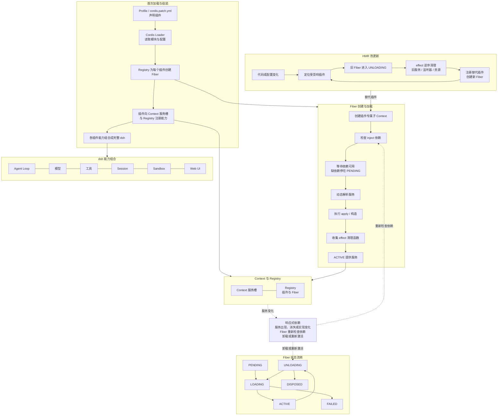

### 静态组装：从配置到插件树

- 运行中的 dsh 是"启动时由有序层组合成的插件树"。这棵树的组合发生在启动阶段，依据是三层概念：

| 概念 | 是什么 | 谁写的 |
| --- | --- | --- |
| profile | 一个命名的组合，列出堆哪些 bundle、装哪些插件、放用户的 patch | 预置模板或用户 |
| bundle | 一组 Cordis 配置行加它们挂载的代码，打包分发的单位 | 各 bundle 包 |
| patch | 覆盖配置，按 id 定位一行并整体替换，或插入新行 | 用户 |

- 每个 bundle 和 profile 在自己的 package.json 里用 dsh 字段声明自己：dsh.profile 列出 profile 的 bundles，dsh.bundle 指向 bundle 的补丁文件
- 层叠顺序是固定的：profile 里每个 bundle 按列出顺序一层层叠，然后是 profile 自己的 cordis.patch.yml，再是 home 级 patch，最后是命令行 --patch 覆盖。后面的层能改前面的层
- 这里有个重要区分：
  - cordis.yml 是"通用配置"：描述这个 bundle 默认挂哪些插件
  - cordis.patch.yml 是"用户覆盖"：给用户改别人的配置用，按行 id 定位、整行替换或插入新行
- Loader（加载器）是组装的实际执行者，它做的事：
  - 解析配置行
  - 读取插件模块
  - 处理配置里的 !!js 插值（比如按平台启用/禁用）
  - 按 id 对每一行做 diff（新行加、改行替换、删行移除）
- 想看你机器上实际启动的插件树，运行：
  - `dsh --profile web --dump-config`
  - 打印出的每一行插件，都对应一次实际挂载，任何一行都可以被你的 patch 替换
- 用 mermaid 表示组合过程：

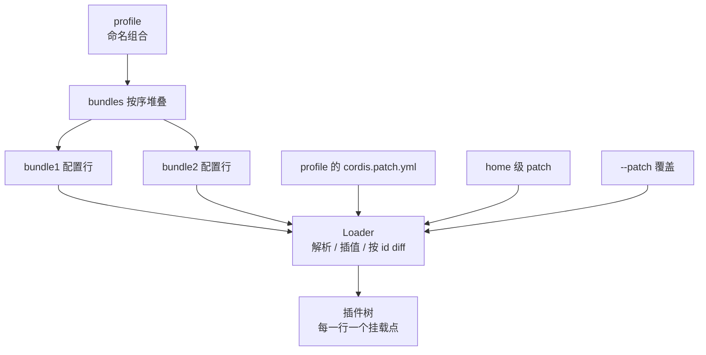

### agent preset：会话级组合（四种模式）

- 前面讲的 profile、bundle、patch 是"进程级组合"：决定整个 dsh 进程启动时挂哪些插件。dsh 还有第二层组合，"会话级组合"：每个 agent 会话从哪个 preset 组合出自己的工具集、提示段和 skills
- 一个 preset 就是一个目录，里面放一个 agent.cordis.yml，列出这个会话要跑的插件。会话指定 preset，就得到 preset 里的工具、提示段、skills；别的会话各自独立
- 官方内置了四种 preset（[agent-presets](https://github.com/deepseek-ai/deepseek-harness/blob/master/packages/preset/agent-presets/README.md)）：

| 模式 | preset 名 | 组成 | 定位 |
| --- | --- | --- | --- |
| 标准模式 | standard | 完整编码 agent：文件编辑、Shell、文件/网页检索、skills、计划、目标、子代理、工作流 | 日常全能 |
| PTC 模式 | ptc | 标准模式全部能力，但工具通过 PTC SDK 呈现，模型用一个 TypeScript 程序组合多步操作 | 编程式工具调用 |
| 极简模式 | minimal | 只有持久 bash 和 str_replace_editor 两个工具 | benchmark、最小环境 |
| 创造模式 | cordis | 标准模式全部能力，加自引用工具集（读写运行中的 runtime）和 preset 编写指导 | 造新 preset |

- 系统级组合和会话级组合的关系：进程启动时按 profile 挂好基础（注册表、沙箱、审批、持久化、模型路由），每个会话再从 preset 组合自己的那层。preset 里可以指定用什么 persona、装哪些工具、开哪些 skills
- 四种模式不是四个不同程序，是同一套插件机制下的四种不同插件组合，这正是"不同模式 = 不同插件配置"的体现
- PTC 模式值得单独说：PTC 全称 Programmatic Tool Calls（编程式工具调用），是 dsh 把工具呈现方式做成的一个开关。模型面对工具有两种呈现方式：
  - native：模型直接调用工具（传统 function calling）
  - ptc：模型写一段 TypeScript 程序，程序通过 PTC SDK 的绑定调用工具，把多步操作组合在一个程序里
  - 对应配置里的 tools.mode，可选 'native'、'ptc'、'both'
- 创造模式的自引用设计：它带一个 tool-cordis 工具，让 agent 能直接读当前运行中的 runtime、在内存里试验 Cordis 插件、把试验结果组合成新的 preset。也就是说"用 dsh 造新的 dsh 模式"是 dsh 的一个正式用例
- 会话也能在"还没产生任何输出"之前切换到别的 preset，一旦有产出就锁定了

### Registry 与 Fiber：插件与运行实例

- 这一节开始进入 Cordis 的机制层。先分清两个概念：
  - Plugin（插件定义）：一份可执行的入口（函数、类、或 apply 对象），它描述"这个插件是什么"
  - Fiber（运行实例）：同一个插件被 ctx.plugin() 加载一次，就产生一个 fiber，它是"这次加载的运行实例"
- 类比：Plugin 是程序，Fiber 是进程。同一个程序可以启动多个进程，同一个插件也可以被加载多次、产生多个 fiber，各自有自己的配置和状态
- 一个 fiber 的生命周期由状态机管理，官方源码里的枚举是（vendor/cordis/src/fiber.ts）：

```ts
// vendor/cordis/src/fiber.ts —— 一个插件 fiber 的生命周期状态
export const enum FiberState {
  PENDING,    // 等待所需的服务出现
  LOADING,    // 插件回调正在执行
  ACTIVE,     // 已加载、正在提供服务
  FAILED,     // 回调或配置抛了错
  DISPOSED,   // 已移除，无法重启
  UNLOADING,  // 正在回卷资源（跑 disposer）
}
```

- 官方对每个状态的注释：PENDING 是等所需服务；LOADING 是回调在跑；ACTIVE 是加载完、提供服务；FAILED 是回调或配置抛错；UNLOADING 是 disposer 在跑；DISPOSED 是已移除、不能重启
- fiber 的启动路径大致是：
  1. ctx.plugin(plugin, ...args) 创建 fiber，状态 PENDING
  2. 发布 internal/plugin 事件（加载器可能在这里补充依赖声明）
  3. 逐个检查 inject 声明的服务依赖，缺任何一个就停在 PENDING 等
  4. 依赖齐了，状态变 LOADING，执行插件回调（函数就直接调，类是 new 出来）
  5. 回调里注册的所有 effect 被收集起来，无错则状态变 ACTIVE
- 一个容易被忽略的点：依赖缺失不是报错，而是"等着"。fiber 停在 PENDING，等服务出现的那刻再继续。这就是"加载顺序由服务需求表达"的落地
- 失败也有一条明确的路：回调或配置抛错，状态变 FAILED，日志记录错误；之后如果依赖变化让它可以重来，它还能重新加载
- 用 mermaid 画状态机：

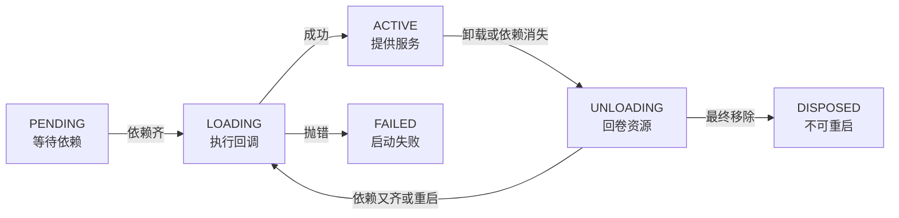

- DISPOSED 是终态：fiber 的 id 被清空，任何再往它上面注册 effect 的尝试都会抛 INACTIVE_EFFECT。这就是"卸载了就是卸载了"，不残留半死不活的实例

### Context 服务槽与专用 Registry

- fiber 跑起来之后，插件怎么互相发现？靠 Context。Context 是一个服务仓库，插件往里面"放服务"和"取服务"
- 两个核心操作：
  - provide：一个插件声明"我提供某服务"，注册进对应的服务槽
  - inject：一个插件声明"我需要某服务"，按 key 依赖
- 关键点是按 key 而不是按实现：依赖方写 ctx.tools、ctx.llm、ctx.sessions，不写"import 某个具体类"。这样换实现时，调用方一行都不用改
- 服务缺失时的行为前面提过：fiber 停在 PENDING 等。这是"响应式依赖"的入口，机制上由 fiber 的 _refresh 实现：它把每个依赖服务的实例 id 拼进自己的"纪元"（epoch），只要有一个依赖缺失，纪元就变成非活动值，fiber 退回到等待态

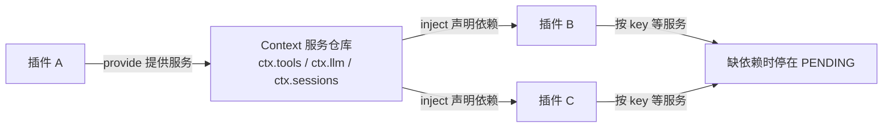
- 和专用 Registry 的分工要分清：

| 维度 | Context 服务槽 | 专用 Registry |
| --- | --- | --- |
| 管什么 | 全局的 ctx.<key> 服务仓库 | 特定领域的注册表，如 ctx.tools、ctx.sessions |
| 职责 | 服务存在、依赖解析、作用域隔离 | 该领域的注册、查询、守卫逻辑 |
| 例子 | ctx.llm、ctx.agents | ctx.tools 的工具执行管线、ctx.sessions 的日志管理 |

- Context 回答"这个服务在不在、谁提供"，专用 Registry 回答"这个领域里注册了什么、怎么用"。工具、会话这些领域有自己的专用注册表和丰富逻辑，Context 是它们下面那层通用的服务总线
- inject 还能带拦截配置（intercept），声明"我消费某服务的拦截配置"，这是给那些需要包一层语义的领域用的，一般的依赖用不到

### Effect：可回卷的副作用

- 插件在加载时要"做事"：注册服务、挂事件监听、起一个 server、开一个文件监视器。这些事在 Cordis 里统一叫 effect（副作用），它们有一个共同要求：随时能被撤销
- 用 ctx.effect 注册一个 effect，写法是：

```ts
ctx.effect(() => {
  // 立即执行：注册服务、监听事件、启动资源
  const server = startServer()
  // 返回一个 disposer（撤销函数）
  return () => {
    server.close()
  }
})
```

- 语义是两条：
  - 立即执行：effect 的函数体在注册时就跑，不等以后
  - 返回 disposer：函数返回一个撤销函数，用来撤掉刚才做的事
- 撤销的时机有两个，谁先到用谁：
  - 你手动调用返回的 disposer
  - fiber 卸载时，把收集到的所有 disposer 一起跑掉
- 关键的设计是"逆序回卷"：卸载时按注册的逆序运行 disposer。源码就在 fiber.ts 里：

```ts
// vendor/cordis/src/fiber.ts —— 卸载：清理 fiber 收集的所有 disposer
private async _unload() {
  await Promise.all(this._disposables.clear().map(async (dispose) => {
    await runDisposable(dispose)
  }))
  this.store = undefined
  // ...
}
```

- 每个 effect 产生的 disposer 被收集进 fiber 的 _disposables 列表；effect 返回的 disposer 内部也是这样逆序跑：

```ts
// vendor/cordis/src/fiber.ts —— 一个 effect 内部按注册逆序撤销
const dispose = () => {
  for (const disposable of disposables.splice(0).reverse()) {
    // 后注册的先撤销
  }
}
```

- 逆序的意义：资源有依赖关系。你先注册了 A，再注册 B，B 可能用到了 A 的东西；卸载时先撤 B、再撤 A，才不会出现"A 已经没了，B 撤销时找不到它"的问题
- 这就是 dsh 能"卸载干净"的根本原因：没有哪一行注册是漏网的，每个注册都必须配一个 disposer（官方实践规则明确要求：Every registration should have a disposer）
- 反过来也解释了一个前面提到的事实：为什么插件能热更新、为什么说"没有特权核心需要 patch"。因为一切注册都可回卷，卸载旧插件不会留下僵尸资源

### 事件系统：Typed Events

- 插件之间除了"按服务 key 找实现"，还需要"广播通知"和"拦截请求"。这靠事件系统，而且事件是强类型的
- 事件名通过 TypeScript 的声明合并（declaration merging）声明：各个包往同一个事件映射里加自己的事件类型，编译期就能检查事件名和载荷对不对，插件扩展的事件也能被类型系统覆盖
- 事件的派发方式有五种，官方 primer 有一张表：

| 模式 | 是否等待 | 派发顺序 | 有返回值吗 |
| --- | --- | --- | --- |
| emit | 否 | 监听者按注册顺序观察 | 无 |
| waterfall | 否 | 监听者按注册顺序观察 | 有 |
| parallel | 是 | 所有监听者并行 | 无 |
| serial | 是 | 监听者按注册顺序观察 | 有 |
| bail | 否 | 按注册顺序，直到一个触发 bail | 有 |

- 这五种对应五类语义：
  - emit：纯广播，谁听到了谁处理，互不干扰（比如会话事件广播给 UI）
  - waterfall：围绕中间件的链，一个监听者可以决定要不要传给下一个（比如工具执行的 pre-execute）
  - parallel：并行 fan-out，等全部完成（比如多个消费者都要处理的初始化）
  - serial：按顺序执行，前一个结果可以传给下一个
  - bail：按顺序，直到某个监听者给出决定性答案就停（比如"谁处理这个请求"）
- waterfall 是 dsh 里最常见的拦截方式，它的语义要单独讲清（官方 primer 原文）：
  - 监听者收到 (...args, next)，调用 next() 把（可能被包装过的）结果委托给下一个监听者
  - 不调用 next() 就短路：链条在这里停住
  - 值通过 next() 的返回值向后传播
- 举个例子：工具执行管线的 tools/pre-execute 就是 waterfall。一个权限插件监听它，决定"允许"就调用 next() 放行，决定"拒绝"就不调用 next() 短路，工具本体就不会执行

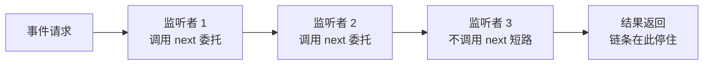
- 派发模式是事件的公开契约的一部分：官方要求新事件用 @mode 标注，生成目录会检查声明和派发处是否一致

### 响应式依赖与 HMR

- 现在把前面几节的机制串起来，看 Cordis 最亮眼的能力：服务一变化，依赖方自动跟着变
- 响应式依赖的机制在 fiber 的 _refresh 里：

```ts
// vendor/cordis/src/fiber.ts —— 依赖变化时重算"纪元"
_refresh() {
  let epoch = ''
  for (const name of Object.keys(this.inject)) {
    const impl = this._store[name]
    if (!impl) {
      epoch = INACTIVE            // 缺一个依赖，纪元变成非活动值
      break
    }
    epoch += ':' + impl.fiber.uid // 依赖实例的 id 拼进纪元
  }
  this._setEpoch(epoch)           // 纪元变了，就重新加载或卸载
}
```

- 一个 fiber 的"纪元"（epoch）由它所有依赖服务的实例 id 拼成。任何依赖服务的实例变了（出现、消失、换实现），依赖方的纪元就变，fiber 会重新加载或退回等待态。这个级联会沿着依赖链往下传：A 依赖 B，B 依赖 C，C 换实现，B 和 A 依次跟着重载

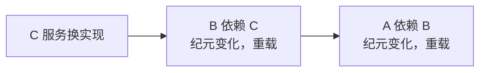
- 这是"服务缺失时停在 PENDING"的完整机制：纪元缺依赖就变成非活动值，fiber 卸载（_unload），等服务出现纪元变回活动值，fiber 再重新加载（_reload）
- HMR（热模块替换）就是站在响应式依赖上做的"主动版本"：
  - 修改一个插件的配置或代码，调用 fiber.update(config)
  - update 先跑 internal/update 瀑布，HMR 监听者在这里可以否决或替换这次更新
  - 默认行为是 restart：先 dispose（回卷旧 fiber 的所有 effect），再重新加载（新 fiber 从新配置/新代码开始）
- 源码里 restart 和 update 长这样：

```ts
// vendor/cordis/src/fiber.ts —— 重启与热更新
async restart() {
  this.assertActive()
  this._setEpoch(INACTIVE)  // 先置为不活动，触发卸载
  this._refresh()           // 重新检查依赖，触发重载
  await this.await()        // 等重载稳定
}

update(config, noSave = false) {
  this.assertActive()
  this._config = config
  // 先跑 internal/update 瀑布，HMR 可以在这里 veto 或替换
  return this.context.waterfall(this, 'internal/update', config, noSave, () => {
    this.config = config
    return this.restart()
  })
}
```

- 为什么 HMR 之后不残留旧资源？因为 dispose 走的是 _unload，它会清空旧 fiber 收集的全部 disposer（就是上节说的逆序回卷）。旧插件注册的服务、监听、server 全部撤销，新插件从干净状态重新注册
- 用 mermaid 画 HMR 的流程：

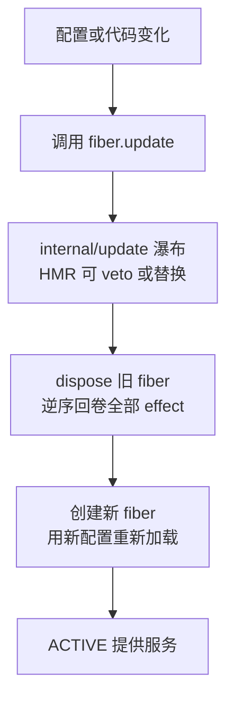

- 响应式依赖和 HMR 的分工：响应式依赖管"依赖变化时被动跟着变"，HMR 管"主动要求某插件重启"。两者共用同一套 fiber 生命周期，所以 dsh 的 web profile 配置改动后能热更新，headless 这类一次性 profile 刻意不开（任务开始后换依赖会破坏生命周期）

### 小结：Cordis 模型

- Cordis 的机制拆开讲完了，这里收拢成一张职责表：

| 部件 | 解决什么问题 |
| --- | --- |
| Loader | 从配置行组装出插件树 |
| Registry | 管理插件定义与 fiber 的关系 |
| Fiber | 一个插件的运行实例，管状态和生命周期 |
| Context | 服务仓库，按 key 提供/获取服务 |
| Effect | 可回卷的副作用，保证卸载干净 |
| Inject | 声明依赖，让加载顺序由需求决定 |
| Typed Events | 插件间广播与拦截，强类型 |
| HMR | 响应式依赖 + 主动重启，支持热更新 |

- Loader 按配置把插件装进来，每个插件变成一个 Fiber，Fiber 通过 Context 声明依赖（Inject）并贡献服务，服务之间用 Typed Events 通信，Fiber 里做的一切注册都是 Effect，随卸载逆序回卷；依赖一变，靠响应式依赖沿链级联，HMR 让改动即时生效
- 分层图：

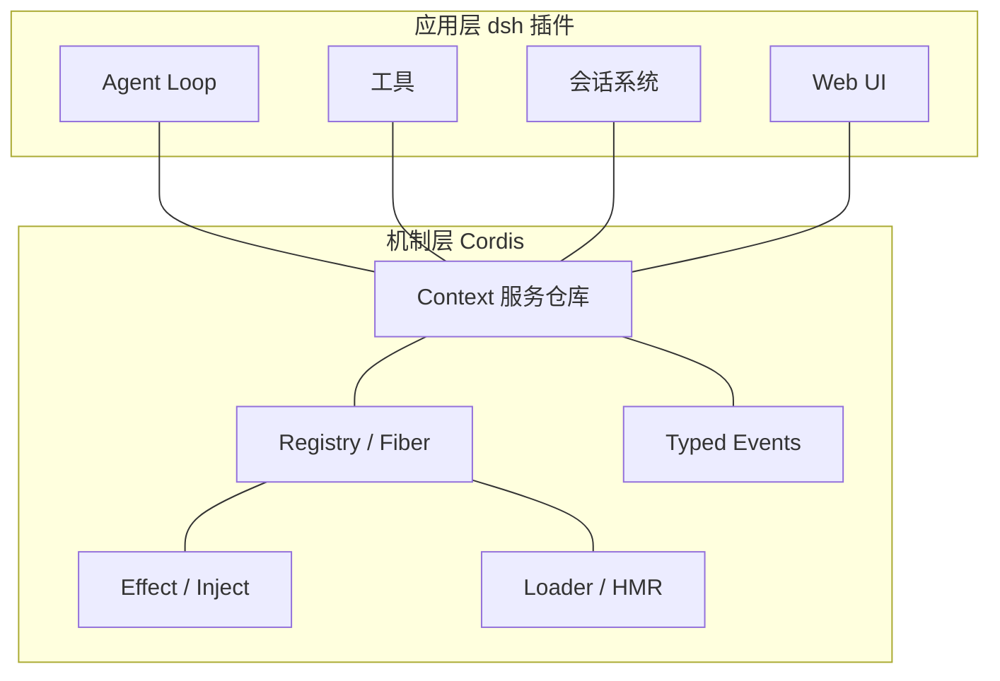

- 最后回答一个贯穿全文的问题：为什么 Agent Loop 本身也是插件、还能替换？因为 Agent Loop 在 Cordis 视角里就是一个"提供 ctx.agentLoop 服务的插件"。它依赖模型、会话、工具这些服务，通过 inject 声明；它要做的注册同样走 effect。别的插件提供一个实现了同样服务的插件，就能替换它，机制上没有任何特殊之处
- 这就是"一切皆为插件"在机制层的完整答案：不是宣传口号，而是 Cordis 这套生命周期、依赖、副作用模型把每个组件都变得可替换

### 实践：写第一个 Cordis 插件

- 概念节讲了 Cordis 的机制，这一节动手写一个最小插件，把 Fiber、Context、Effect、HMR 都过一遍
- 一个最简单的插件（官方教程 01 的形态）：

```ts
// my-plugin.ts —— 第一个 Cordis 插件
export const name = 'my-plugin'

export function apply(ctx) {
  // apply 是插件的入口，ctx 是这个插件的上下文
  ctx.effect(() => {
    console.log('插件已加载')
    return () => console.log('插件已卸载')
  })
}
```

- 把它接进配置，在 cordis.patch.yml 里加一行，指定 id 和插件模块：

```yaml
- id: my-plugin
  name: './my-plugin'
```

- 跑 `dsh --profile web` 或 `pnpm dsh --profile headless "随便一句话"`，你会看到：
  - 启动时打印"插件已加载"
  - 如果 profile 支持热更新（web），改一下插件代码保存，会看到先打印"插件已卸载"再打印"插件已加载"，这就是 HMR 的卸载旧 fiber、创建新 fiber
  - 退出时打印"插件已卸载"
- 进阶一步，加上依赖声明和提供服务：

```ts
// my-plugin.ts —— 声明依赖 + 提供服务
export const name = 'my-plugin'

export const inject = ['tools']  // 等 ctx.tools 出现才加载

export function apply(ctx) {
  ctx.effect(() => {
    // 往工具注册表里挂一个工具
    return () => { /* 卸载时撤销 */ }
  })
}
```

- 观察点：
  - 把 inject 改成 ['不存在的服务']，插件会一直停在 PENDING，不报错也不加载，等那个服务出现
  - 把 effect 里的注册写清楚 disposer，卸载时它一定被跑
- 官方教程一步步来：[Cordis 教程 01](https://github.com/deepseek-ai/deepseek-harness/blob/master/docs/cordis-tutorial/index.md)，02 讲生命周期和 effect，06 讲组合与 HMR
- 这一节做下来，你亲手看到了"加载、依赖等待、卸载回卷、热更新"四个动作在日志里的样子

## 实践与落地

### 安装与运行 dsh

- 动手用 dsh，第一步是装。前置条件是 Node.js，然后一行命令启动 Web UI：

```bash
npx @deepseek-ai/dsh web
```

- npx 会拉取并运行官方 npm 包（[@deepseek-ai/dsh](https://www.npmjs.com/package/@deepseek-ai/dsh)），然后打开浏览器界面，就是官方 Web UI（快速开始见[官方文档](https://deepseek-harness.github.io/deepseek-harness/en/guide/quickstart)）
- 想从源码跑，就 clone 官方仓库，装依赖后用 pnpm 起：

```bash
git clone https://github.com/deepseek-ai/deepseek-harness
cd deepseek-harness
pnpm install
pnpm dsh --profile web
```

- 五种 profile 的差别：
  - web：浏览器界面，默认，支持热更新
  - headless：无界面，命令行给一句话就跑完
  - sdk / sdk-minimal：给 SDK 客户端用的 JSON-RPC 服务
  - acp：自动化协议服务
- 日常试玩用 web 就好；写脚本批量跑任务用 headless

### 查看插件树

- 装好之后第一件值得做的事，是看自己的机器实际启动了哪些插件：

```bash
dsh --profile web --dump-config
```

- 这个命令打印的是你本机 `web` profile 启动时的完整插件树，一行一个插件，按层叠顺序排好
- 读这张表的三个姿势：
  - 数一数：模型适配器、工具、会话持久化、沙箱、审批、UI 各自在哪几行
  - 找对应：对照插件的六类能力，在表里找到每一类的实例
  - 记 id：每一行都有一个 id，它就是 patch 要定位的目标
- 一句话记住它：任何一行，都能被你的 patch 替换

### 用 cordis.patch.yml 自定义

- 自定义的入口是 patch 文件，位于 Harness home 的 cordis.patch.yml
- patch 的两种操作：
  - 按 id 定位一行，整体替换它的配置
  - 插入新行（新插件）
- 一个最小例子，把某个插件的配置改掉：

```yaml
# cordis.patch.yml —— 覆盖一个插件配置
- id: my-model
  name: '@deepseek-ai/dsh-llm-deepseek'
  config:
    model: 'deepseek-chat'
    baseUrl: 'https://api.deepseek.com'
```

- 替换模型适配器：把 id 指到另一个 LLM 适配器插件；加工具：插入一个工具插件行；调沙箱：改权限预设插件的配置。所有"改行为"都落到"改配置 + 重启（或等热更新）"
- 改动后如果用的是 web profile，保存 patch 通常热更新生效；headless 这类一次性 profile 需要重启

### 常见工作流与人类命令

- 人类命令（human commands）是绕过模型回合、直接在 harness 层响应的命令，走 ctx.commands。几个常用的：
  - /goal：管理同一会话的目标，agent 会围绕它继续
  - /plan：进入计划模式，先规划再执行
  - /compact：立即压缩上下文
- 除了命令，日常还会用到这几类能力：
  - 接 MCP：把外部 MCP server 挂进来当工具，官方文档有配置方式
  - 加载 skills：把技能目录挂进 preset 或 skill 根，agent 就能按技能工作
  - 配沙箱：按需求选 read-only、workspace-write 或 danger-full-access，配合审批策略
  - 用子代理：把大任务拆给子代理并行，或后台常驻一个
- 权限与凭据：敏感操作走审批；模型和服务的凭据按官方说明配置，别写进仓库
- 官方用户指南：[deepseek-harness.github.io](https://deepseek-harness.github.io/deepseek-harness/en/guide/quickstart)

## 收束

- 这篇把 DeepSeek Harness 从概念到实现拆完了。回看主线：
  - 概念层：模型是内核，harness 是外壳，Agent = Model + Harness
  - 哲学层：一切皆为插件，模型、工具、循环、日志、界面都是可替换的插件
  - 架构层：入口走 ctx.agents，Agent Loop 在模型和工具间循环，每一步记录进会话日志，日志派生模型上下文，落盘、压缩、沙箱、子代理各司其职
  - 机制层：Cordis 用 Loader、Fiber、Context、Effect、Inject、Typed Events、HMR 这套机制，让"一切皆插件"成为可运行的现实
- 再强调一次时效：dsh 是 developer preview，官方明说会有破坏性兼容变更，本文基于 2026 年 9 月初的官方 master 版本。读到这里时版本可能已经前进很多，具体细节以官方最新文档为准
- 想深挖的方向：
  - 想验证机制，跑 `--dump-config` 看自己的插件树，再写一个插件观察 HMR
  - 想读权威定义，官方文档站（[deepseek-harness.github.io](https://deepseek-harness.github.io/deepseek-harness/)）的子系统页和包 README 是唯一权威来源
  - 想参与，官方仓库（[deepseek-ai/deepseek-harness](https://github.com/deepseek-ai/deepseek-harness)）是开源的，一切皆插件意味着改它不用改核心
